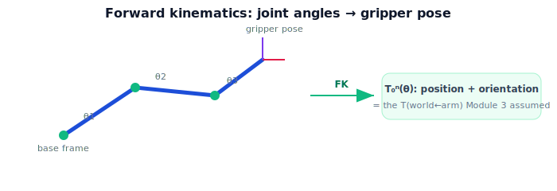

!!! abstract "You are here"
    **Module 4 — Forward Kinematics using Denavit–Hartenberg Parameters**  ·  **Unit 1 — Why Kinematics (Joints, Links, and Pose)**  ·  **Lesson 1.1 — The Arm Has to Move**

# Lesson 1.1 — The Arm Has to Move

## 1. Why This Matters

Module 3 ended with the fruit's position in the world — but a position is not a grasp. The robot still has to *move its arm* so the gripper arrives at that position. Before it can decide *how* to move, it must be able to answer a more basic question: for a given setting of its joints, **where is the gripper, and how is it oriented?** That is **forward kinematics**, and it is the foundation everything else in motion is built on. This module builds the tool that turns joint angles into a gripper pose.

## 2. Physical Intuition

Hold your shoulder still and bend your elbow: your hand sweeps an arc. Add wrist motion and your hand can reach a range of positions and orientations. A robot arm is the same — a few joints, each adding motion, with the gripper at the end. If you know exactly how much each joint is bent (the joint angles), you can in principle work out exactly where the fingertip ends up. Forward kinematics is the precise, repeatable version of that "work it out" — a function from joint angles to gripper pose. Crucially, this is the *forward* direction: angles in, pose out. (The reverse — "what angles put the hand *there*?" — is harder, and waits for Module 5.)

## 3. Mathematical Foundations

A serial arm has joints with variables $\boldsymbol{\theta} = (\theta_1, \theta_2, \dots, \theta_n)$ (angles for revolute joints, extensions for prismatic ones). Forward kinematics is a map

$$\boldsymbol{\theta} \;\longmapsto\; T_0^n(\boldsymbol{\theta}) \in SE(3),$$

from the configuration $\boldsymbol{\theta}$ to the end-effector's pose $T_0^n$ — a rigid transform (Module 2) giving the gripper's position **and** orientation in the base frame. The pose is exactly the kind of $SE(3)$ element Module 2 built: a rotation $R$ and a translation $\mathbf{t}$ packed in a $4\times4$ matrix. Module 4's job is to construct this map from the arm's geometry. Note the recurring theme: Module 3 *assumed* the arm's pose $T_{w\leftarrow a}$; forward kinematics is precisely what computes it, with $T_{w\leftarrow a} = T_0^n(\boldsymbol{\theta})$ when the base is the world frame.

## 4. Visual Explanation

<figure markdown>
  { width="680" }
</figure>

## 5. Engineering Example

The greenhouse robot has located a tomato at a world position (Module 3). To pick it, the controller will eventually search for joint angles that put the gripper there — but every step of that search asks "if I set the joints to *these* angles, where does the gripper land?" That question is forward kinematics, evaluated over and over. It's also how the robot knows where its own hand is right now, from its joint encoders, without any camera at all.

## 6. Worked Example

Consider the simplest arm: one revolute joint at the base, a rigid link of length $L=0.5$ m, gripper at the tip, motion in a plane. If the joint angle is $\theta = 0$, the gripper sits at $(0.5, 0)$. If $\theta = 90°$, it sits at $(0, 0.5)$. Same arm, different configuration, different gripper position — and we computed the position purely from the angle and the geometry. That is forward kinematics in miniature; the rest of the module makes it systematic for any arm.

## 7. Interactive Demonstration

<iframe src="../../demos/module04/lesson01_the_arm_has_to_move.html" title="The Arm Has to Move interactive demo" style="width:100%;height:520px;border:1px solid #e2e8f0;border-radius:12px"></iframe>

[Open this demo in a new tab ↗](../demos/module04/lesson01_the_arm_has_to_move.html)

**Guided prediction.** For the one-joint arm ($L=0.5$), predict the gripper position at $\theta = 0°$, $90°$, and $180°$. Predict whether changing $\theta$ changes the gripper's *orientation* as well as its position. Confirm: position moves along a circle of radius $L$; orientation rotates with $\theta$.

## 8. Coding Exercise

!!! tip "Run the hands-on notebook"
    `modules/module04/notebooks/M04_U01_L1_1_The_Arm_Has_To_Move.ipynb` — open in JupyterLab and run **Kernel → Restart & Run All**.

Write `tip_position(theta, L)` for the one-joint planar arm returning $(x,y)=(L\cos\theta, L\sin\theta)$; evaluate at several angles; confirm the worked-example values.

## 9. Knowledge Check

Formative — unlimited attempts, immediate feedback; does not affect your grade.

<iframe src="../../quizzes/module04/lesson01_quiz.html" title="The Arm Has to Move knowledge check" style="width:100%;height:720px;border:1px solid #e2e8f0;border-radius:12px"></iframe>

[Open this quiz in a new tab ↗](../quizzes/module04/lesson01_quiz.html)

A check that forward kinematics maps joint angles → gripper pose, that it gives both position and orientation, and that it's the forward (not inverse) direction.

## 10. Challenge Problem

Explain why "where is the gripper?" (forward) is straightforward to compute but "what angles put the gripper at this point?" (inverse) can have zero, one, or many answers. Give an intuitive example with the one-joint arm reaching a point.

## 11. Common Mistakes

- Confusing forward kinematics (angles → pose) with inverse kinematics (pose → angles).
- Thinking forward kinematics gives only position (it gives orientation too).
- Forgetting the result is a pose in a specific frame (the base/world frame).

## 12. Key Takeaways

- **Forward kinematics** maps joint angles $\boldsymbol{\theta}$ to the gripper's **pose** $T_0^n(\boldsymbol{\theta})\in SE(3)$.
- It gives both **position and orientation** in the base frame.
- It is the **forward** direction (angles in, pose out); the inverse is Module 5.
- $T_0^n$ is exactly the $T_{w\leftarrow a}$ that Module 3 assumed.

---

## AI Learning Companion

Copy any prompt below into ChatGPT, Claude, or another AI assistant.

**Tutor prompt** — explain it another way
```
Explain Lesson 1.1 (Module 4) — The Arm Has to Move — using bending your elbow. Make clear forward kinematics maps joint angles to the gripper's pose (position + orientation), is the forward direction, and supplies the T(world←arm) Module 3 assumed.
```

**Practice prompt** — generate more exercises
```
Give me 6 exercises on the one-joint planar arm: given the angle and link length, find the gripper position and orientation. Include answers.
```

**Explore prompt** — connect it to the real world
```
Show me how a robot uses forward kinematics from joint encoders to know where its own gripper is, and why every grasp search evaluates forward kinematics repeatedly.
```

## Global Learning Support

Need this lesson explained in another language? Copy one of the prompts below into an AI assistant. English remains the authoritative source.

**Supported languages (initial):** English · Español · 中文 (Simplified Chinese) · Türkçe

**Español**
```
I just completed Lesson 1.1 (Module 4) — The Arm Has to Move.
Explain this lesson in Spanish. Keep robotics and mathematical terminology in English when appropriate.
Then provide: a summary, three practice questions, and one challenge problem.
```

**中文 (Simplified Chinese)**
```
I just completed Lesson 1.1 (Module 4) — The Arm Has to Move.
Explain this lesson in Simplified Chinese. Keep mathematical notation unchanged.
Then provide: a summary, three practice questions, and one challenge problem.
```

**Türkçe**
```
I just completed Lesson 1.1 (Module 4) — The Arm Has to Move.
Explain this lesson in Turkish. Keep robotics terminology in English where commonly used.
Then provide: a summary, three practice questions, and one challenge problem.
```

---

*Next lesson: 1.2 — Links and Joints.*
