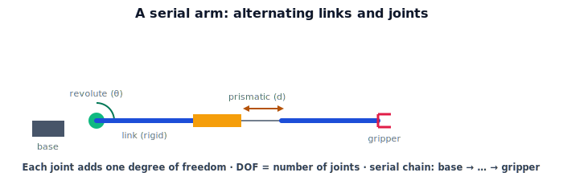

!!! abstract "You are here"
    **Module 4 — Forward Kinematics using Denavit–Hartenberg Parameters**  ·  **Unit 1 — Why Kinematics (Joints, Links, and Pose)**  ·  **Lesson 1.2 — Links and Joints**

# Lesson 1.2 — Links and Joints

## 1. Why This Matters

Forward kinematics is built from the arm's *structure*. Before computing poses, we need clean vocabulary for that structure: the rigid pieces (**links**), the movable connections (**joints**), and how much freedom each joint adds (**degrees of freedom**). Getting these concepts and their count right is what lets us later assign one transform per joint and multiply them in order. It's the anatomy lesson before the mechanics.

## 2. Physical Intuition

Think of the arm as a skeleton: rigid bones (links) joined at movable connections (joints). Two common joint types cover most robots. A **revolute** joint is a hinge — it *rotates* (your elbow, a knee, a door hinge). A **prismatic** joint is a slider — it *extends or retracts* in a straight line (a telescoping antenna, a drawer slide). Each joint, of either type, adds exactly **one** independent way to move: one angle for a revolute, one distance for a prismatic. Chain several together — link, joint, link, joint — and you get a **serial arm**: a single path from the fixed base out to the gripper, like a finger with several knuckles.

## 3. Mathematical Foundations

A **serial manipulator** is an alternating sequence: base → joint 1 → link 1 → joint 2 → link 2 → ⋯ → joint $n$ → link $n$ (end-effector). Each joint $i$ has a single **joint variable** $q_i$:

- **Revolute:** $q_i = \theta_i$, an angle; the link rotates about the joint axis.
- **Prismatic:** $q_i = d_i$, a displacement; the link slides along the joint axis.

The number of joints equals the number of **degrees of freedom (DOF)** for a serial arm — the dimension of the configuration space. A 6-DOF arm has six joints and a configuration $\boldsymbol{q}=(q_1,\dots,q_6)$. (Six is the magic number to freely position *and* orient a rigid gripper in 3D, since $SE(3)$ has six parameters — three for position, three for orientation.) Links are treated as perfectly **rigid**: their only role is the fixed geometric relationship they impose between one joint and the next, which we'll soon capture with parameters.

## 4. Visual Explanation

<figure markdown>
  { width="680" }
</figure>

## 5. Engineering Example

The greenhouse harvesting arm is typically a 4–6 DOF serial arm of revolute joints: a base that swivels, a shoulder and elbow that bend (reaching into the canopy), and a wrist that orients the gripper to approach the fruit from the right side. Each revolute joint contributes one angle the controller can command. Knowing it's a serial chain of revolute joints tells us immediately that the configuration is just a list of angles — and that forward kinematics will be one transform per angle, multiplied in order.

## 6. Worked Example

Count the DOF and list the configuration for three arms:
1. A pan-tilt camera mount: 2 revolute joints → 2 DOF, $\boldsymbol{q}=(\theta_1,\theta_2)$.
2. A planar elbow arm: 2 revolute joints → 2 DOF, $\boldsymbol{q}=(\theta_1,\theta_2)$.
3. A SCARA-like arm: 2 revolute + 1 prismatic → 3 DOF, $\boldsymbol{q}=(\theta_1,\theta_2,d_3)$.
In each case the number of joints = DOF, and the configuration is the ordered list of joint variables.

## 7. Interactive Demonstration

<iframe src="../../demos/module04/lesson02_links_and_joints.html" title="Links and Joints interactive demo" style="width:100%;height:520px;border:1px solid #e2e8f0;border-radius:12px"></iframe>

[Open this demo in a new tab ↗](../demos/module04/lesson02_links_and_joints.html)

**Guided prediction.** For a 3-revolute-joint arm, predict the number of DOF and the form of the configuration vector. Predict what changes if the middle joint is swapped for a prismatic one (DOF? variable type?). Confirm: DOF unchanged at 3; middle variable becomes a distance.

## 8. Coding Exercise

!!! tip "Run the hands-on notebook"
    `modules/module04/notebooks/M04_U01_L1_2_Links_And_Joints.ipynb` — open in JupyterLab and run **Kernel → Restart & Run All**.

Represent an arm as a list of joint descriptors `[("revolute", L1), ("revolute", L2), ...]`; write a function that returns the DOF and a labeled configuration template; verify the worked-example counts.

## 9. Knowledge Check

Formative — unlimited attempts, immediate feedback; does not affect your grade.

<iframe src="../../quizzes/module04/lesson02_quiz.html" title="Links and Joints knowledge check" style="width:100%;height:720px;border:1px solid #e2e8f0;border-radius:12px"></iframe>

[Open this quiz in a new tab ↗](../quizzes/module04/lesson02_quiz.html)

A check on links vs joints, revolute vs prismatic, and that a serial arm's DOF equals its joint count.

## 10. Challenge Problem

A robot designer wants the gripper to reach any position *and* any orientation in 3D space. Explain, using degrees of freedom, why at least 6 joints are needed, and what is lost with only 4 or 5.

## 11. Common Mistakes

- Confusing links (rigid) with joints (movable).
- Thinking a prismatic joint rotates or a revolute joint slides.
- Miscounting DOF (each joint of a serial arm is exactly one DOF).

## 12. Key Takeaways

- A **serial arm** alternates rigid **links** and movable **joints**, base to gripper.
- **Revolute** joints rotate (variable $\theta$); **prismatic** joints slide (variable $d$).
- Each joint adds **one DOF**; for a serial arm, DOF = number of joints.
- 6 DOF lets the gripper reach arbitrary position *and* orientation in 3D.

---

## AI Learning Companion

Copy any prompt below into ChatGPT, Claude, or another AI assistant.

**Tutor prompt** — explain it another way
```
Explain Lesson 1.2 (Module 4) — Links and Joints — using a skeleton metaphor. Define links, joints, revolute vs prismatic, and degrees of freedom (DOF = joint count for a serial arm).
```

**Practice prompt** — generate more exercises
```
Give me 6 exercises counting DOF and writing configuration vectors for various serial arms (revolute/prismatic mixes). Include answers.
```

**Explore prompt** — connect it to the real world
```
Show me the joint layout of a typical harvesting or industrial arm and why each joint is one commandable degree of freedom.
```

## Global Learning Support

Need this lesson explained in another language? Copy one of the prompts below into an AI assistant. English remains the authoritative source.

**Supported languages (initial):** English · Español · 中文 (Simplified Chinese) · Türkçe

**Español**
```
I just completed Lesson 1.2 (Module 4) — Links and Joints.
Explain this lesson in Spanish. Keep robotics and mathematical terminology in English when appropriate.
Then provide: a summary, three practice questions, and one challenge problem.
```

**中文 (Simplified Chinese)**
```
I just completed Lesson 1.2 (Module 4) — Links and Joints.
Explain this lesson in Simplified Chinese. Keep mathematical notation unchanged.
Then provide: a summary, three practice questions, and one challenge problem.
```

**Türkçe**
```
I just completed Lesson 1.2 (Module 4) — Links and Joints.
Explain this lesson in Turkish. Keep robotics terminology in English where commonly used.
Then provide: a summary, three practice questions, and one challenge problem.
```

---

*Next lesson: 1.3 — Configuration vs. Pose.*
