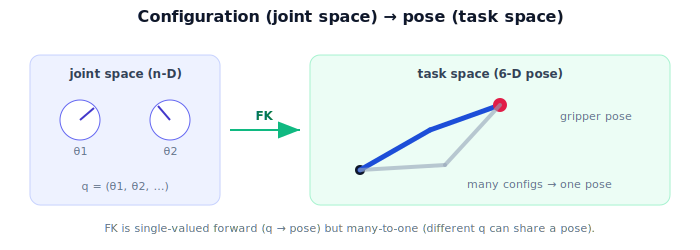

!!! abstract "You are here"
    **Module 4 — Forward Kinematics using Denavit–Hartenberg Parameters**  ·  **Unit 1 — Why Kinematics (Joints, Links, and Pose)**  ·  **Lesson 1.3 — Configuration vs. Pose**

# Lesson 1.3 — Configuration vs. Pose

## 1. Why This Matters

Two very different descriptions of "the state of the arm" run through all of robotics, and confusing them causes endless errors. **Configuration** is what the *joints* are doing (the angles). **Pose** is where the *gripper* is and how it's oriented. Forward kinematics is precisely the bridge from the first to the second. Naming these two spaces clearly now makes the rest of the module — and the inverse problem in Module 5 — far easier to reason about.

## 2. Physical Intuition

Two ways to describe your hand's situation: "my shoulder is rotated 30°, my elbow bent 90°" (that's the *configuration* — joint-by-joint), or "my hand is 40 cm forward, 20 cm up, palm facing down" (that's the *pose* — where the hand actually is). Both describe the same arm at the same instant, but in different languages. The joints live in **joint space**; the hand lives in **task space** (the physical workspace). Forward kinematics translates the joint-space description into the task-space one. The same physical reach, different coordinates — echoing the change-of-frame idea from Module 1.

## 3. Mathematical Foundations

- **Configuration (joint space):** the vector $\boldsymbol{q} = (q_1,\dots,q_n)$, one entry per joint. For a revolute arm, $\boldsymbol{q}=\boldsymbol{\theta}$. Joint space is $n$-dimensional.
- **Pose (task space):** the end-effector's rigid transform $T_0^n \in SE(3)$ — position $\mathbf{t}\in\mathbb{R}^3$ and orientation $R\in SO(3)$. Task space (full pose) is 6-dimensional.

Forward kinematics is the function

$$\text{FK}:\ \boldsymbol{q} \;\mapsto\; T_0^n(\boldsymbol{q}).$$

It is **well-defined and single-valued** in the forward direction: a configuration determines exactly one pose. It is generally **many-to-one**: different configurations can produce the *same* pose (e.g., "elbow-up" vs "elbow-down" both reaching the same point). That many-to-one nature is exactly what makes the *inverse* (pose → configuration, Module 5) have multiple or no solutions — but forward kinematics itself is always a clean, unambiguous computation.

## 4. Visual Explanation

<figure markdown>
  { width="680" }
</figure>

## 5. Engineering Example

The greenhouse robot's controller commands the arm in **joint space** (it sets motor angles), but it reasons about the fruit in **task space** (a world position). Forward kinematics is the constant translator: "if I command these angles, the gripper pose will be this." The robot's internal model of "where my hand is" is a forward-kinematics evaluation of its current joint encoder readings — pure joint space → task space, no camera needed.

## 6. Worked Example

One-joint planar arm, $L=0.5$. Configuration $\theta = 30°$ → pose: position $(0.5\cos30°, 0.5\sin30°) \approx (0.433, 0.25)$, orientation rotated $30°$. Configuration $\theta = 150°$ → position $(0.5\cos150°, 0.5\sin150°) \approx (-0.433, 0.25)$ — same height $y=0.25$, different point. Now a two-joint arm reaching the point $(0.4, 0.3)$: there can be an "elbow-up" configuration and an "elbow-down" configuration, two different $\boldsymbol{\theta}$ giving the *same* gripper position — the many-to-one map in action.

## 7. Interactive Demonstration

<iframe src="../../demos/module04/lesson03_configuration_vs_pose.html" title="Configuration vs. Pose interactive demo" style="width:100%;height:520px;border:1px solid #e2e8f0;border-radius:12px"></iframe>

[Open this demo in a new tab ↗](../demos/module04/lesson03_configuration_vs_pose.html)

**Guided prediction.** For the one-joint arm, predict the pose (position + orientation) at $\theta=30°$ and $\theta=150°$. Predict whether a two-joint arm can reach one point with two different configurations. Confirm: yes — FK is many-to-one.

## 8. Coding Exercise

!!! tip "Run the hands-on notebook"
    `modules/module04/notebooks/M04_U01_L1_3_Configuration_Vs_Pose.ipynb` — open in JupyterLab and run **Kernel → Restart & Run All**.

Implement `fk_one_joint(theta, L)` returning a pose dict `{pos, angle}`; show two configurations give two distinct poses; then (preview) note that a two-joint reach can have two configurations for one position.

## 9. Knowledge Check

Formative — unlimited attempts, immediate feedback; does not affect your grade.

<iframe src="../../quizzes/module04/lesson03_quiz.html" title="Configuration vs. Pose knowledge check" style="width:100%;height:720px;border:1px solid #e2e8f0;border-radius:12px"></iframe>

[Open this quiz in a new tab ↗](../quizzes/module04/lesson03_quiz.html)

A check distinguishing configuration (joint space) from pose (task space), FK as the map, and its many-to-one nature.

## 10. Challenge Problem

Explain why forward kinematics being many-to-one means inverse kinematics (Module 5) can have multiple solutions, and why this is useful (an arm can often reach a fruit in more than one way, avoiding obstacles).

## 11. Common Mistakes

- Conflating configuration (angles) with pose (gripper position/orientation).
- Thinking FK could be one-to-one (different configs can share a pose).
- Forgetting pose includes orientation, not just position.

## 12. Key Takeaways

- **Configuration** $\boldsymbol{q}$ lives in **joint space** ($n$-D); **pose** $T_0^n$ lives in **task space** (6-D).
- **Forward kinematics** maps configuration → pose, single-valued in the forward direction.
- The map is generally **many-to-one** (different configs, same pose).
- The controller commands joint space but reasons in task space; FK is the translator.

---

## AI Learning Companion

Copy any prompt below into ChatGPT, Claude, or another AI assistant.

**Tutor prompt** — explain it another way
```
Explain Lesson 1.3 (Module 4) — Configuration vs. Pose — using "shoulder 30°, elbow 90°" (joint space) vs "hand 40cm forward, palm down" (task space). Show FK maps configuration → pose and is many-to-one.
```

**Practice prompt** — generate more exercises
```
Give me 6 exercises distinguishing joint space from task space and identifying when two configurations reach one pose. Include answers.
```

**Explore prompt** — connect it to the real world
```
Show me how a robot controller commands joint space but reasons in task space, and how FK keeps an internal model of where the gripper is.
```

## Global Learning Support

Need this lesson explained in another language? Copy one of the prompts below into an AI assistant. English remains the authoritative source.

**Supported languages (initial):** English · Español · 中文 (Simplified Chinese) · Türkçe

**Español**
```
I just completed Lesson 1.3 (Module 4) — Configuration vs. Pose.
Explain this lesson in Spanish. Keep robotics and mathematical terminology in English when appropriate.
Then provide: a summary, three practice questions, and one challenge problem.
```

**中文 (Simplified Chinese)**
```
I just completed Lesson 1.3 (Module 4) — Configuration vs. Pose.
Explain this lesson in Simplified Chinese. Keep mathematical notation unchanged.
Then provide: a summary, three practice questions, and one challenge problem.
```

**Türkçe**
```
I just completed Lesson 1.3 (Module 4) — Configuration vs. Pose.
Explain this lesson in Turkish. Keep robotics terminology in English where commonly used.
Then provide: a summary, three practice questions, and one challenge problem.
```

---

*Next lesson: 1.4 — Why Kinematics (Unit 1 recap).*
