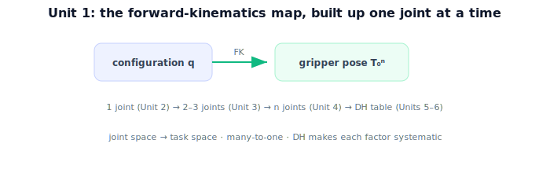

!!! abstract "You are here"
    **Module 4 — Forward Kinematics using Denavit–Hartenberg Parameters**  ·  **Unit 1 — Why Kinematics (Joints, Links, and Pose)**  ·  **Lesson 1.4 — Why Kinematics (Unit 1 Recap)**

# Lesson 1.4 — Why Kinematics (Unit 1 Recap)

*A short synthesis — no new mathematics. It ties Unit 1 together and points into the one-joint arm.*

---

## From a located fruit to a moving gripper

Unit 1 set up the module's purpose and vocabulary:

> **A serial arm is rigid links joined by joints (each one DOF); forward kinematics maps its configuration $\boldsymbol{q}$ to the gripper's pose $T_0^n(\boldsymbol{q})$ — the $T_{w\leftarrow a}$ Module 3 assumed.**

## What Unit 1 established

| Lesson | Point |
|---|---|
| 1.1 The Arm Has to Move | FK maps joint angles → gripper pose (position + orientation); forward direction; supplies Module 3's $T_{w\leftarrow a}$. |
| 1.2 Links and Joints | Serial arm = rigid links + joints; revolute (θ) vs prismatic (d); DOF = joint count. |
| 1.3 Configuration vs. Pose | Configuration (joint space) vs pose (task space); FK is the map, many-to-one. |

## Why this matters

We now have the question and the language. **Unit 2** computes the simplest case end to end: a **one-joint arm**, its single joint transform, and the gripper's pose as a function of one angle. From there, **Unit 3** chains joints (Module 2 composition), **Unit 4** generalizes to $n$ joints, and **Units 5–6** introduce the **DH convention** that makes writing each joint's transform systematic. The whole module is forward kinematics — configuration in, pose out — built up one joint at a time.

## Visual Explanation

<figure markdown>
  { width="680" }
</figure>

## Interactive Demonstration

<iframe src="../../demos/module04/lesson04_why_kinematics_recap.html" title="Why Kinematics (Unit 1 Recap) interactive demo" style="width:100%;height:520px;border:1px solid #e2e8f0;border-radius:12px"></iframe>

[Open this demo in a new tab ↗](../demos/module04/lesson04_why_kinematics_recap.html)

Unit 1 in one tool: drive the two joints and read off the resulting gripper pose — the configuration → pose map that is forward kinematics.

## Coding Exercise

!!! tip "Run the hands-on notebook"
    `modules/module04/notebooks/M04_U01_L1_4_Why_Kinematics_Unit_1_Recap.ipynb` — open in JupyterLab and run **Kernel → Restart & Run All**.

A short consolidation: given a one-joint arm, return its DOF (1), its configuration template $(\theta_1)$, and the gripper position $(L\cos\theta, L\sin\theta)$ for a sample angle.

## Knowledge Check

Formative — unlimited attempts, immediate feedback; does not affect your grade.

<iframe src="../../quizzes/module04/lesson04_quiz.html" title="Why Kinematics (Unit 1 Recap) knowledge check" style="width:100%;height:720px;border:1px solid #e2e8f0;border-radius:12px"></iframe>

[Open this quiz in a new tab ↗](../quizzes/module04/lesson04_quiz.html)

A brief consolidation quiz across Unit 1 (formative — unlimited attempts).

## Key Takeaways

- Serial arm = links + joints; **DOF = joint count**; revolute (θ) / prismatic (d).
- **Configuration** (joint space) → **pose** (task space) via **forward kinematics**, many-to-one.
- FK supplies the arm pose $T_{w\leftarrow a}$ Module 3 assumed.
- Next: **Unit 2** — the one-joint arm, its transform, and its pose.

---

## AI Learning Companion

Copy any prompt below into ChatGPT, Claude, or another AI assistant.

**Tutor prompt** — explain it another way
```
Summarize Unit 1 of Module 4: serial arms (links, joints, DOF), configuration vs pose, and forward kinematics as the map configuration → gripper pose (many-to-one), which supplies Module 3's T(world←arm).
```

**Practice prompt** — generate more exercises
```
Give me a 10-question review of Unit 1: links/joints/DOF, revolute vs prismatic, configuration vs pose, and the FK map. Include answers.
```

**Explore prompt** — connect it to the real world
```
Show me how a harvesting robot goes from a located fruit (Module 3) to commanding its arm, and where forward kinematics fits.
```

## Global Learning Support

Need this lesson explained in another language? Copy one of the prompts below into an AI assistant. English remains the authoritative source.

**Supported languages (initial):** English · Español · 中文 (Simplified Chinese) · Türkçe

**Español**
```
I just completed Lesson 1.4 (Module 4) — Why Kinematics (Unit 1 Recap).
Explain this lesson in Spanish. Keep robotics and mathematical terminology in English when appropriate.
Then provide: a summary, three practice questions, and one challenge problem.
```

**中文 (Simplified Chinese)**
```
I just completed Lesson 1.4 (Module 4) — Why Kinematics (Unit 1 Recap).
Explain this lesson in Simplified Chinese. Keep mathematical notation unchanged.
Then provide: a summary, three practice questions, and one challenge problem.
```

**Türkçe**
```
I just completed Lesson 1.4 (Module 4) — Why Kinematics (Unit 1 Recap).
Explain this lesson in Turkish. Keep robotics terminology in English where commonly used.
Then provide: a summary, three practice questions, and one challenge problem.
```

---

*Next: Unit 2 — One Joint at a Time.*
