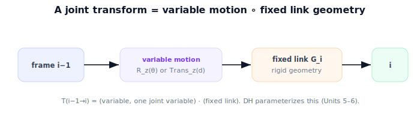

!!! abstract "You are here"
    **Module 4 — Forward Kinematics using Denavit–Hartenberg Parameters**  ·  **Unit 2 — One Joint at a Time**  ·  **Lesson 2.2 — The Joint Transform**

# Lesson 2.2 — The Joint Transform

## 1. Why This Matters

Forward kinematics will be a *product* of one transform per joint. This lesson defines that single factor cleanly: the **joint transform**, a Module 2 $SE(3)$ element that captures both the joint's variable motion and the rigid link attached to it. Once each joint is one transform, chaining them is just matrix multiplication. Getting this one factor right is the key step before generalizing.

## 2. Physical Intuition

A joint does two things in sequence. First, the *variable* part: a revolute joint **rotates** by its angle $\theta$ about its axis; a prismatic joint **slides** by its distance $d$ along its axis. Second, the *fixed* part: the rigid link carries you a set distance and direction to the next joint, regardless of the joint variable. So "go through one joint" means: apply the variable motion, then ride the fixed link to the next frame. Both steps are rigid transforms, and their composition is the joint transform.

## 3. Mathematical Foundations

Write the transform from frame $i-1$ (previous joint) to frame $i$ (this joint's output) as a product of a **variable** motion and the **fixed** link geometry. For a **revolute** joint with angle $\theta_i$, axis along $z$, and a link that offsets the frame by a fixed rigid transform $G_i$:

$$T_{i-1}^{i}(\theta_i) = R_z(\theta_i)\,G_i,$$

where $R_z(\theta_i)$ is the $4\times4$ rotation about $z$ and $G_i$ is the constant link transform (translation along the link, plus any fixed twist). For a **prismatic** joint with displacement $d_i$ along $z$:

$$T_{i-1}^{i}(d_i) = \text{Trans}_z(d_i)\,G_i.$$

The essential point: **each $T_{i-1}^i$ is an $SE(3)$ element that depends on exactly one joint variable**, with everything else fixed by the link's rigid geometry. (Units 5–6 will package $G_i$ and the variable motion into the four DH parameters, so the whole transform comes from a tidy table; here we just establish its form.) In the planar one-joint case of Lesson 2.1, $G_1$ was the translation by $L$ along $x$ and $R_z(\theta)$ the rotation — exactly the $T_0^1(\theta)$ we wrote.

## 4. Visual Explanation

<figure markdown>
  { width="680" }
</figure>

## 5. Engineering Example

For the greenhouse arm, the base swivel's transform is a rotation about the vertical axis times the fixed offset up to the shoulder; the shoulder's transform is a rotation about its axis times the fixed upper-arm link; and so on. Each is one $SE(3)$ factor parameterized by one motor angle. The robot's driver stores the fixed link geometry once and plugs in the live joint angles to form each $T_{i-1}^i$ on the fly.

## 6. Worked Example

Planar revolute joint, link length $L=0.4$, axis out of the plane. Variable part: $R(\theta)$. Fixed part: translate $(L,0)$ along the rotated $x$. At $\theta=60°$: $T_0^1$ has rotation block for $60°$ and translation $(0.4\cos60°, 0.4\sin60°)=(0.2, 0.346)$. If instead it were a prismatic joint extending $d$ along its axis from a base offset, the rotation block would be identity and the translation would grow with $d$. Same template $T=(\text{variable})\,(\text{fixed})$, different variable.

## 7. Interactive Demonstration

<iframe src="../../demos/module04/lesson06_the_joint_transform.html" title="The Joint Transform interactive demo" style="width:100%;height:520px;border:1px solid #e2e8f0;border-radius:12px"></iframe>

[Open this demo in a new tab ↗](../demos/module04/lesson06_the_joint_transform.html)

**Guided prediction.** For the planar revolute joint ($L=0.4$), predict the translation part of $T_0^1$ at $\theta=0°$ and $60°$. Predict how the transform differs if the joint is prismatic (which block changes?). Confirm: revolute changes the rotation block; prismatic changes the translation along the axis.

## 8. Coding Exercise

!!! tip "Run the hands-on notebook"
    `modules/module04/notebooks/M04_U02_L2_2_The_Joint_Transform.ipynb` — open in JupyterLab and run **Kernel → Restart & Run All**.

Implement `joint_transform(kind, q, G)` returning a $4\times4$ (or $3\times3$ planar) matrix as `variable(q) @ G`; build revolute and prismatic cases; verify the worked example and that the planar revolute matches Lesson 2.1's $T_0^1$.

## 9. Knowledge Check

Formative — unlimited attempts, immediate feedback; does not affect your grade.

<iframe src="../../quizzes/module04/lesson06_quiz.html" title="The Joint Transform knowledge check" style="width:100%;height:720px;border:1px solid #e2e8f0;border-radius:12px"></iframe>

[Open this quiz in a new tab ↗](../quizzes/module04/lesson06_quiz.html)

A check that each joint is one $SE(3)$ transform depending on one variable, split into variable motion and fixed link geometry, for revolute and prismatic.

## 10. Challenge Problem

Show that composing the *fixed* parts of two joints with zero joint variables gives the arm's "home" pose. Why is the home pose a useful reference when commissioning a robot?

## 11. Common Mistakes

- Folding the fixed link geometry into the variable motion (keep them separate).
- Using a rotation for a prismatic joint or a translation for a revolute joint's variable.
- Forgetting the transform is an $SE(3)$ element (rotation *and* translation).

## 12. Key Takeaways

- Each joint is **one $SE(3)$ transform** $T_{i-1}^i$, a function of **one** joint variable.
- It splits into **variable motion** ($R_z(\theta)$ or $\text{Trans}_z(d)$) and **fixed link geometry** $G_i$.
- Revolute varies the rotation; prismatic varies the translation.
- DH parameters (Units 5–6) will package this into a four-number recipe.

---

## AI Learning Companion

Copy any prompt below into ChatGPT, Claude, or another AI assistant.

**Tutor prompt** — explain it another way
```
Explain Lesson 2.2 (Module 4) — The Joint Transform — as variable joint motion (R_z(θ) or Trans_z(d)) composed with fixed link geometry G_i, giving one SE(3) factor per joint. Note DH will parameterize it later.
```

**Practice prompt** — generate more exercises
```
Give me 6 exercises writing single-joint SE(3)/SE(2) transforms for revolute and prismatic joints with given link geometry. Include answers.
```

**Explore prompt** — connect it to the real world
```
Show me how a robot driver stores fixed link geometry once and forms each joint transform on the fly from live motor angles.
```

## Global Learning Support

Need this lesson explained in another language? Copy one of the prompts below into an AI assistant. English remains the authoritative source.

**Supported languages (initial):** English · Español · 中文 (Simplified Chinese) · Türkçe

**Español**
```
I just completed Lesson 2.2 (Module 4) — The Joint Transform.
Explain this lesson in Spanish. Keep robotics and mathematical terminology in English when appropriate.
Then provide: a summary, three practice questions, and one challenge problem.
```

**中文 (Simplified Chinese)**
```
I just completed Lesson 2.2 (Module 4) — The Joint Transform.
Explain this lesson in Simplified Chinese. Keep mathematical notation unchanged.
Then provide: a summary, three practice questions, and one challenge problem.
```

**Türkçe**
```
I just completed Lesson 2.2 (Module 4) — The Joint Transform.
Explain this lesson in Turkish. Keep robotics terminology in English where commonly used.
Then provide: a summary, three practice questions, and one challenge problem.
```

---

*Next lesson: 2.3 — Where Is the Tip?*
