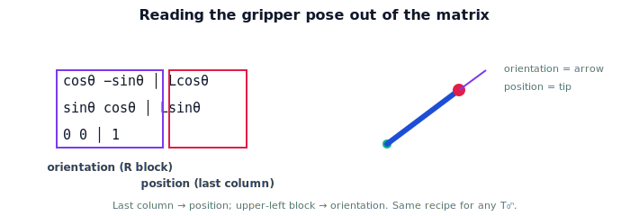

!!! abstract "You are here"
    **Module 4 — Forward Kinematics using Denavit–Hartenberg Parameters**  ·  **Unit 2 — One Joint at a Time**  ·  **Lesson 2.3 — Where Is the Tip?**

# Lesson 2.3 — Where Is the Tip?

## 1. Why This Matters

A pose matrix is only useful if you can read the gripper's **position** and **orientation** out of it. This lesson makes that concrete for the one-joint arm: apply the joint transform, then extract the translation (where the tip is) and the rotation (how it's oriented). The same extraction works for any arm once the full chain is built — so we practice it now where it's easy to check by hand.

## 2. Physical Intuition

The pose matrix is a compact package: tucked inside are the gripper's location and its facing direction. "Where is the tip?" is answered by the translation part; "which way is it pointing?" by the rotation part. For the one-joint arm we can also get the tip by plain trigonometry, so we can confirm the matrix machinery agrees with common sense — building trust before the arms get complicated.

## 3. Mathematical Foundations

Given the pose $T_0^1(\theta)$ (Lesson 2.1–2.2), the gripper **position** is the translation column and the **orientation** is the rotation block:

$$T_0^1 = \begin{bmatrix} R(\theta) & \mathbf{t}(\theta) \\ \mathbf{0} & 1 \end{bmatrix}, \quad \mathbf{t}(\theta) = (L\cos\theta,\ L\sin\theta), \quad R(\theta) = \begin{bmatrix}\cos\theta & -\sin\theta\\ \sin\theta & \cos\theta\end{bmatrix}.$$

Equivalently, the position is the transform applied to the link's **tip point** expressed in the link frame, $\mathbf{p}_{\text{tip}} = (L, 0)$ (homogeneous $(L,0,1)$):

$$\tilde{\mathbf{t}} = T_0^1 \cdot (0,0,1)^\top \ \text{(origin of link frame)}, \quad\text{or}\quad \tilde{\mathbf{t}} = R_z(\theta)\,(L,0,1)^\top.$$

Either way you read the **last column** for position and the **upper-left block** for orientation. This "apply the transform, read the columns" recipe is exactly what generalizes: for an $n$-joint arm the gripper position/orientation are the translation/rotation of the product $T_0^n$.

## 4. Visual Explanation

<figure markdown>
  { width="680" }
</figure>

## 5. Engineering Example

When the greenhouse robot reports "gripper at (x,y,z), oriented this way," it computed the pose matrix and read off these blocks. The grasp planner needs the orientation (to approach the fruit from a good angle), not just the position — which is why we always carry the full pose, not a bare point. Reading both blocks correctly is a routine, load-bearing operation in the control stack.

## 6. Worked Example

$L=0.5$, $\theta=90°$. $T_0^1$ has rotation block $\begin{bmatrix}0&-1\\1&0\end{bmatrix}$ and translation $(0, 0.5)$. So position $=(0,0.5)$, orientation $=90°$. Cross-check by trigonometry: tip at $(0.5\cos90°, 0.5\sin90°)=(0,0.5)$ ✓, link points at $90°$ ✓. At $\theta=210°$: translation $(0.5\cos210°, 0.5\sin210°)=(-0.433,-0.25)$, orientation $210°$. The matrix and the trig always agree.

## 7. Interactive Demonstration

<iframe src="../../demos/module04/lesson07_where_is_the_tip.html" title="Where Is the Tip? interactive demo" style="width:100%;height:520px;border:1px solid #e2e8f0;border-radius:12px"></iframe>

[Open this demo in a new tab ↗](../demos/module04/lesson07_where_is_the_tip.html)

**Guided prediction.** For $L=0.5$, predict the position (translation column) and orientation (rotation block angle) at $\theta=90°$ and $\theta=210°$. Predict which block changes if you only re-orient the gripper without moving it (not possible for a one-joint arm — why?). Confirm by extracting from $T_0^1$.

## 8. Coding Exercise

!!! tip "Run the hands-on notebook"
    `modules/module04/notebooks/M04_U02_L2_3_Where_Is_The_Tip.ipynb` — open in JupyterLab and run **Kernel → Restart & Run All**.

Write `position_of(T)` and `orientation_of(T)` that slice the pose matrix; apply to `pose_one_joint(theta, L)`; verify against direct trig $(L\cos\theta, L\sin\theta)$ and angle $\theta$ for several configurations.

## 9. Knowledge Check

Formative — unlimited attempts, immediate feedback; does not affect your grade.

<iframe src="../../quizzes/module04/lesson07_quiz.html" title="Where Is the Tip? knowledge check" style="width:100%;height:720px;border:1px solid #e2e8f0;border-radius:12px"></iframe>

[Open this quiz in a new tab ↗](../quizzes/module04/lesson07_quiz.html)

A check on extracting position (translation column) and orientation (rotation block) from a pose, and that it matches the one-joint trig.

## 10. Challenge Problem

For the one-joint arm, explain why you cannot change the gripper's orientation without also changing its position. What minimum addition to the arm would let you decouple them?

## 11. Common Mistakes

- Reading the wrong column/block for position vs orientation.
- Reporting position only and dropping orientation.
- Forgetting homogeneous coordinates when applying the transform to a point.

## 12. Key Takeaways

- Gripper **position** = translation column of the pose; **orientation** = rotation block.
- Equivalently, position = transform applied to the link's tip point.
- For the one-joint arm, the matrix result matches direct trigonometry.
- The same "apply, read columns" recipe generalizes to $T_0^n$.

---

## AI Learning Companion

Copy any prompt below into ChatGPT, Claude, or another AI assistant.

**Tutor prompt** — explain it another way
```
Explain Lesson 2.3 (Module 4) — Where Is the Tip? — as reading the translation column (position) and rotation block (orientation) out of the pose matrix T_0^1, and checking it against trig for the one-joint arm.
```

**Practice prompt** — generate more exercises
```
Give me 6 exercises extracting gripper position and orientation from one-joint pose matrices and cross-checking with trigonometry. Include answers.
```

**Explore prompt** — connect it to the real world
```
Show me why a grasp planner needs the gripper's full pose (orientation included), not just its position.
```

## Global Learning Support

Need this lesson explained in another language? Copy one of the prompts below into an AI assistant. English remains the authoritative source.

**Supported languages (initial):** English · Español · 中文 (Simplified Chinese) · Türkçe

**Español**
```
I just completed Lesson 2.3 (Module 4) — Where Is the Tip?
Explain this lesson in Spanish. Keep robotics and mathematical terminology in English when appropriate.
Then provide: a summary, three practice questions, and one challenge problem.
```

**中文 (Simplified Chinese)**
```
I just completed Lesson 2.3 (Module 4) — Where Is the Tip?
Explain this lesson in Simplified Chinese. Keep mathematical notation unchanged.
Then provide: a summary, three practice questions, and one challenge problem.
```

**Türkçe**
```
I just completed Lesson 2.3 (Module 4) — Where Is the Tip?
Explain this lesson in Turkish. Keep robotics terminology in English where commonly used.
Then provide: a summary, three practice questions, and one challenge problem.
```

---

*Next lesson: 2.4 — One Joint at a Time (Unit 2 recap).*
