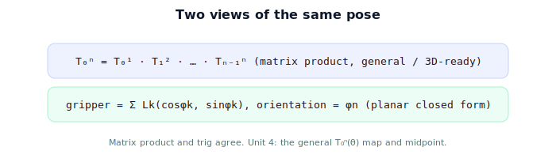

!!! abstract "You are here"
    **Module 4 — Forward Kinematics using Denavit–Hartenberg Parameters**  ·  **Unit 3 — Chaining Transforms (Two and Three Links)**  ·  **Lesson 3.4 — Chaining Transforms (Unit 3 Recap)**

# Lesson 3.4 — Chaining Transforms (Unit 3 Recap)

*A short synthesis — no new mathematics. It ties Unit 3 together and points into the general FK map.*

---

## From one joint to a chain

Unit 3 turned the single-joint atom into a chain:

> **Forward kinematics is the matrix product of per-joint transforms, base→tip: $T_0^n = T_0^1 T_1^2 \cdots T_{n-1}^n$. For a planar arm this equals the sum of link reaches at accumulated angles $\phi_k$, with orientation $\phi_n$.**

## What Unit 3 established

| Lesson | Point |
|---|---|
| 3.1 Adding a Second Joint | Second joint lives in the first's moving frame; gripper uses accumulated angle θ1+θ2. |
| 3.2 Composing the Chain | $T_0^2 = T_0^1 T_1^2$ (Module 2 composition); the product reproduces the trig. |
| 3.3 A Planar 2-/3-Link Arm | Sum of link reaches at accumulated angles $\phi_k$; orientation $\phi_n$; the running example. |

## Why this matters

We can now compute the gripper pose of any planar chain two equivalent ways: the closed-form sum of reaches, or the matrix product. The matrix product is the one that generalizes to 3D and to any number of joints — which is exactly where **Unit 4** goes: the **general forward-kinematics map** $T_0^n(\boldsymbol{\theta})$, reading out full position *and* orientation, implemented in code, with the **midpoint checkpoint**. After that, **Units 5–6** show how the DH convention generates each factor from four numbers, so we never hand-build a transform again.

## Visual Explanation

<figure markdown>
  { width="680" }
</figure>

## Interactive Demonstration

<iframe src="../../demos/module04/lesson12_chaining_transforms_recap.html" title="Chaining Transforms (Unit 3 Recap) interactive demo" style="width:100%;height:520px;border:1px solid #e2e8f0;border-radius:12px"></iframe>

[Open this demo in a new tab ↗](../demos/module04/lesson12_chaining_transforms_recap.html)

Unit 3 in one tool: stack per-joint transforms into one chain — the gripper pose and the summed orientation are forward kinematics.

## Coding Exercise

!!! tip "Run the hands-on notebook"
    `modules/module04/notebooks/M04_U03_L3_4_Chaining_Transforms_Unit_3_Recap.ipynb` — open in JupyterLab and run **Kernel → Restart & Run All**.

A short consolidation: confirm `fk_planar` (sum of reaches) and `fk_chain` (matrix product) agree on the 3-link worked example, for both position and orientation.

## Knowledge Check

Formative — unlimited attempts, immediate feedback; does not affect your grade.

<iframe src="../../quizzes/module04/lesson12_quiz.html" title="Chaining Transforms (Unit 3 Recap) knowledge check" style="width:100%;height:720px;border:1px solid #e2e8f0;border-radius:12px"></iframe>

[Open this quiz in a new tab ↗](../quizzes/module04/lesson12_quiz.html)

A brief consolidation quiz across Unit 3 (formative — unlimited attempts).

## Key Takeaways

- FK for a chain = **product of per-joint transforms**, base→tip.
- Planar closed form = **sum of reaches at accumulated angles**; orientation $\phi_n$.
- Matrix product and trig agree; the product generalizes.
- Next: **Unit 4** — the general $T_0^n(\boldsymbol{\theta})$ map and the midpoint.

---

## AI Learning Companion

Copy any prompt below into ChatGPT, Claude, or another AI assistant.

**Tutor prompt** — explain it another way
```
Summarize Unit 3 of Module 4: forward kinematics is the base→tip product of per-joint transforms (T_0^n = T_0^1...T_{n-1}^n); for a planar arm it equals the sum of link reaches at accumulated angles, with orientation φn.
```

**Practice prompt** — generate more exercises
```
Give me a 10-question review of chaining transforms: accumulated angles, the 2-/3-link position formula, and the matrix product. Include answers.
```

**Explore prompt** — connect it to the real world
```
Show me how a multi-joint arm's gripper pose is computed as a product of matrices in real robot software, and how that matches the planar trig for a simple arm.
```

## Global Learning Support

Need this lesson explained in another language? Copy one of the prompts below into an AI assistant. English remains the authoritative source.

**Supported languages (initial):** English · Español · 中文 (Simplified Chinese) · Türkçe

**Español**
```
I just completed Lesson 3.4 (Module 4) — Chaining Transforms (Unit 3 Recap).
Explain this lesson in Spanish. Keep robotics and mathematical terminology in English when appropriate.
Then provide: a summary, three practice questions, and one challenge problem.
```

**中文 (Simplified Chinese)**
```
I just completed Lesson 3.4 (Module 4) — Chaining Transforms (Unit 3 Recap).
Explain this lesson in Simplified Chinese. Keep mathematical notation unchanged.
Then provide: a summary, three practice questions, and one challenge problem.
```

**Türkçe**
```
I just completed Lesson 3.4 (Module 4) — Chaining Transforms (Unit 3 Recap).
Explain this lesson in Turkish. Keep robotics terminology in English where commonly used.
Then provide: a summary, three practice questions, and one challenge problem.
```

---

*Next: Unit 4 — The Forward Kinematics Map.*
