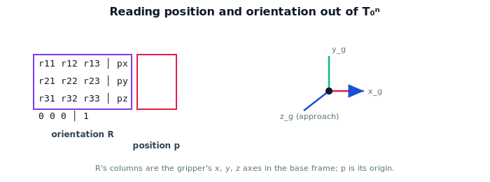

!!! abstract "You are here"
    **Module 4 — Forward Kinematics using Denavit–Hartenberg Parameters**  ·  **Unit 4 — The Forward Kinematics Map**  ·  **Lesson 4.2 — Position and Orientation of the Gripper**

# Lesson 4.2 — Position and Orientation of the Gripper

## 1. Why This Matters

A position alone can't pick a tomato: the gripper has to *approach* from a sensible direction and align its fingers. That's orientation. Forward kinematics gives both at once — they're two parts of the same $T_0^n$. This lesson makes the extraction explicit in 3D and explains how to read the rotation block as the gripper's own axes, which is what a grasp planner actually consumes.

## 2. Physical Intuition

Hold a cup. Your hand has a *place* (where it is) and a *facing* (which way the palm and fingers point). To grab the cup you need both right — same place, wrong facing, and you knock it over. The robot's gripper is identical: $T_0^n$ tells it where the hand is (translation) and how it's turned (rotation). The rotation block is literally three arrows — the gripper's $x$, $y$, $z$ directions expressed in the base frame — telling you exactly how the hand is oriented in space.

## 3. Mathematical Foundations

Write the end-effector pose as

$$T_0^n(\boldsymbol{\theta}) = \begin{bmatrix} R_0^n(\boldsymbol{\theta}) & \mathbf{p}_0^n(\boldsymbol{\theta}) \\ \mathbf{0}^\top & 1 \end{bmatrix}, \qquad R_0^n \in SO(3),\ \ \mathbf{p}_0^n \in \mathbb{R}^3.$$

- **Position:** $\mathbf{p}_0^n$ is the translation column — the gripper's origin in the base frame.
- **Orientation:** $R_0^n$ is the rotation block. Its **columns** are the gripper frame's $x,y,z$ axes expressed in the base frame: $R_0^n = [\,\hat{\mathbf{x}}_g\ \ \hat{\mathbf{y}}_g\ \ \hat{\mathbf{z}}_g\,]$. The approach direction of the gripper is typically one of these axes (e.g. $\hat{\mathbf{z}}_g$, the direction the fingers point).

Both come from the single product $T_0^n=\prod T_{i-1}^i$. To act on a target, the planner compares the *desired* grasp pose (a position and an approach orientation) to what $T_0^n$ can produce. Position and orientation are computed together and carried together — never separate the two.

## 4. Visual Explanation

<figure markdown>
  { width="680" }
</figure>

## 5. Engineering Example

When the greenhouse robot plans a grasp, it wants the gripper *at* the tomato (position) with the fingers pointing along a clear approach path that avoids the stem and neighboring fruit (orientation). The grasp planner reads $\mathbf{p}_0^n$ and the approach axis from $R_0^n$ and checks both against the target. A pipeline that tracked only position would happily drive the hand into the plant sideways.

## 6. Worked Example

3D arm whose $T_0^3$ at some configuration is a rotation about $z$ by $90°$ with translation $(0.446, 0.673, 0)$. Then position $\mathbf{p}=(0.446,0.673,0)$; orientation $R$ has columns $\hat{\mathbf{x}}_g=(0,1,0)$, $\hat{\mathbf{y}}_g=(-1,0,0)$, $\hat{\mathbf{z}}_g=(0,0,1)$. So the gripper sits at $(0.446,0.673,0)$ with its approach axis $\hat{\mathbf{z}}_g$ still pointing along base $+z$ (a pure in-plane reorientation). Reading the columns tells the planner precisely how the hand is turned.

## 7. Interactive Demonstration

<iframe src="../../demos/module04/lesson14_position_orientation_gripper.html" title="Position and Orientation of the Gripper interactive demo" style="width:100%;height:520px;border:1px solid #e2e8f0;border-radius:12px"></iframe>

[Open this demo in a new tab ↗](../demos/module04/lesson14_position_orientation_gripper.html)

**Guided prediction.** Given a $T_0^n$ that is a rotation about $z$ by $90°$ plus a translation, predict the position vector and the three orientation axes (columns of $R$). Predict which base axis the gripper's $\hat{\mathbf{z}}_g$ points along. Confirm by reading the columns.

## 8. Coding Exercise

!!! tip "Run the hands-on notebook"
    `modules/module04/notebooks/M04_U04_L4_2_Position_And_Orientation.ipynb` — open in JupyterLab and run **Kernel → Restart & Run All**.

Write `position(T)` (last column, first three rows) and `orientation(T)` (top-left $3\times3$); apply to a 3D `fk(factors)` result; print the gripper position and the three axis columns; verify the worked example.

## 9. Knowledge Check

Formative — unlimited attempts, immediate feedback; does not affect your grade.

<iframe src="../../quizzes/module04/lesson14_quiz.html" title="Position and Orientation of the Gripper knowledge check" style="width:100%;height:720px;border:1px solid #e2e8f0;border-radius:12px"></iframe>

[Open this quiz in a new tab ↗](../quizzes/module04/lesson14_quiz.html)

A check that position is the translation column, orientation is the rotation block, $R$'s columns are the gripper axes, and grasping needs both.

## 10. Challenge Problem

Two configurations give the same gripper *position* but different *orientations*. Explain how a 6-DOF arm can usually fix position and still rotate the gripper, and why this is essential for approaching fruit among obstacles.

## 11. Common Mistakes

- Reporting position and ignoring orientation (grasping needs both).
- Reading rows instead of columns for the gripper axes.
- Treating orientation as a single angle in 3D (it's a full $3\times3$ rotation).

## 12. Key Takeaways

- $T_0^n$ packs **position** (translation column) and **orientation** (rotation block).
- $R_0^n$'s **columns** are the gripper's $x,y,z$ axes in the base frame; one is the approach direction.
- Both come from the same product and must be carried together.
- Grasp planning consumes position **and** approach orientation.

---

## AI Learning Companion

Copy any prompt below into ChatGPT, Claude, or another AI assistant.

**Tutor prompt** — explain it another way
```
Explain Lesson 4.2 (Module 4) — Position and Orientation of the Gripper — using holding a cup (place + facing). Show position = translation column, orientation = rotation block whose columns are the gripper's x,y,z axes, and why grasping needs both.
```

**Practice prompt** — generate more exercises
```
Give me 6 exercises extracting position and the three orientation axes from 3D end-effector pose matrices. Include answers.
```

**Explore prompt** — connect it to the real world
```
Show me how a grasp planner uses the gripper's approach axis (a column of R) plus its position to pick fruit without hitting the plant.
```

## Global Learning Support

Need this lesson explained in another language? Copy one of the prompts below into an AI assistant. English remains the authoritative source.

**Supported languages (initial):** English · Español · 中文 (Simplified Chinese) · Türkçe

**Español**
```
I just completed Lesson 4.2 (Module 4) — Position and Orientation of the Gripper.
Explain this lesson in Spanish. Keep robotics and mathematical terminology in English when appropriate.
Then provide: a summary, three practice questions, and one challenge problem.
```

**中文 (Simplified Chinese)**
```
I just completed Lesson 4.2 (Module 4) — Position and Orientation of the Gripper.
Explain this lesson in Simplified Chinese. Keep mathematical notation unchanged.
Then provide: a summary, three practice questions, and one challenge problem.
```

**Türkçe**
```
I just completed Lesson 4.2 (Module 4) — Position and Orientation of the Gripper.
Explain this lesson in Turkish. Keep robotics terminology in English where commonly used.
Then provide: a summary, three practice questions, and one challenge problem.
```

---

*Next lesson: 4.3 — Forward Kinematics in Code.*
