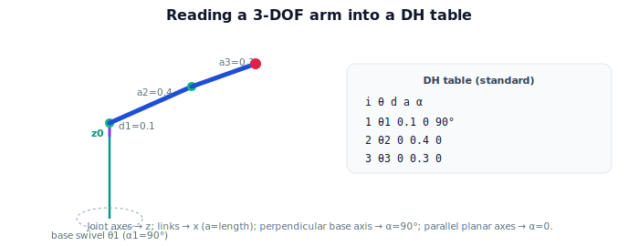

!!! abstract "You are here"
    **Module 4 — Forward Kinematics using Denavit–Hartenberg Parameters**  ·  **Unit 6 — Building and Using a DH Table**  ·  **Lesson 6.2 — Reading a Robot into a Table**

# Lesson 6.2 — Reading a Robot into a Table

## 1. Why This Matters

You have the rules (Unit 5) and the transform formula (6.1); now you put them together into the practical skill: **looking at an arm and writing its DH table**. This is what a robotics engineer does to model any new manipulator. We make it a checklist and practice it on a 3-DOF arm — the model we'll use in the capstone.

## 2. Physical Intuition

It's a guided tour of the arm, joint by joint. Stand at the base, find the first joint's axis (which way does it spin or slide?), that's a $z$. Walk to the next joint, find its axis, that's the next $z$. The link between them — the physical bar connecting the two axes — is your $x$ direction, and its length is $a$. Are the two axes parallel, crossing, or twisted relative to each other? That's $\alpha$. Is the next joint offset *along* the first axis? That's $d$. Do this for every joint and you've read the robot into a table.

## 3. Mathematical Foundations

The procedure (standard DH):

1. **Number the joints** $1\dots n$ from base to tip; identify each joint's axis of motion (its $z$).
2. **Assign $z_i$** along joint $i{+}1$'s axis (Lesson 5.3); $z_0$ along joint 1's axis.
3. **Assign $x_i$** along the common normal from $z_{i-1}$ to $z_i$; set origins.
4. **For each joint, read off** the four parameters:
   - $\theta_i$ (angle $x_{i-1}\to x_i$ about $z_{i-1}$) — the **variable** for a revolute joint;
   - $d_i$ (offset along $z_{i-1}$) — the **variable** for a prismatic joint;
   - $a_i$ (common-normal length);
   - $\alpha_i$ (axis twist about $x_i$).
5. **Tabulate** one row per joint; mark the variable; record constants from the mechanical design.

Common simplifications: **parallel** consecutive axes → $\alpha = 0$; **intersecting** axes → $a = 0$; **perpendicular** axes → $\alpha = \pm 90°$. A well-designed arm yields a table full of $0$s and $\pm 90°$s, which is easy to verify.

## 4. Visual Explanation

<figure markdown>
  { width="680" }
</figure>

## 5. Engineering Example

The greenhouse arm: a base that swivels about vertical (joint 1, $z_0$ vertical), then a shoulder and elbow that bend in the resulting vertical plane (joints 2–3). Joint 1's axis is perpendicular to joints 2–3's axes, so $\alpha_1 = 90°$ (it tips the arm plane up off the base); joints 2–3 are parallel, so $\alpha_2 = \alpha_3 = 0$; the upper-arm and forearm lengths sit in $a_2, a_3$. Reading this off gives a clean three-row table the controller turns into forward kinematics.

## 6. Worked Example

3-DOF arm: base swivel about vertical, then two coplanar revolute joints with link lengths $L_2 = 0.4, L_3 = 0.3$ (and a short vertical riser $d_1 = 0.1$ from base to the shoulder). A DH table (standard convention):

| $i$ | $\theta_i$ | $d_i$ | $a_i$ | $\alpha_i$ |
|---|---|---|---|---|
| 1 | $\theta_1$ (var) | 0.1 | 0 | 90° |
| 2 | $\theta_2$ (var) | 0 | 0.4 | 0 |
| 3 | $\theta_3$ (var) | 0 | 0.3 | 0 |

Row 1: the base swivels ($\theta_1$), rises $0.1$ along its axis ($d_1$), and the $90°$ twist ($\alpha_1$) stands the arm plane up. Rows 2–3: planar links ($a = L$), parallel axes ($\alpha = 0$). This is the capstone arm.

## 7. Interactive Demonstration

<iframe src="../../demos/module04/lesson22_reading_robot_into_table.html" title="Reading a Robot into a Table interactive demo" style="width:100%;height:520px;border:1px solid #e2e8f0;border-radius:12px"></iframe>

[Open this demo in a new tab ↗](../demos/module04/lesson22_reading_robot_into_table.html)

**Guided prediction.** For the 3-DOF arm, predict which row carries the $90°$ twist and why. Predict the $a$ values for rows 2–3. Confirm against the table above.

## 8. Coding Exercise

!!! tip "Run the hands-on notebook"
    `modules/module04/notebooks/M04_U06_L6_2_Reading_A_Robot_Into_A_Table.ipynb` — open in JupyterLab and run **Kernel → Restart & Run All**.

Encode the 3-DOF arm's DH table as a list of rows `{theta,d,a,alpha,kind}` (mark the three revolute variables); write a `fill(config)` that inserts $\theta_1,\theta_2,\theta_3$ and returns the numeric table; sanity-check the constant columns ($d_1=0.1$, $a_2=0.4$, $a_3=0.3$, $\alpha_1=90°$).

## 9. Knowledge Check

Formative — unlimited attempts, immediate feedback; does not affect your grade.

<iframe src="../../quizzes/module04/lesson22_quiz.html" title="Reading a Robot into a Table knowledge check" style="width:100%;height:720px;border:1px solid #e2e8f0;border-radius:12px"></iframe>

[Open this quiz in a new tab ↗](../quizzes/module04/lesson22_quiz.html)

A check on the table-building procedure, the parallel/intersecting/perpendicular simplifications, and reading a 3-DOF arm.

## 10. Challenge Problem

You're handed a DH table with $\alpha_1 = 90°$ but every $a = 0$ and the arm visibly has long links. Explain what's almost certainly wrong (link lengths must appear as nonzero $a$ or $d$ somewhere) and how you'd catch it by comparing the table's predicted reach to the physical arm.

## 11. Common Mistakes

- Putting link length in $d$ instead of $a$ (or vice versa) when axes are offset.
- Missing a $90°$ twist where a joint axis changes direction.
- Not marking which entry is the joint variable.

## 12. Key Takeaways

- Building a DH table is a **procedure**: number joints → assign $z$ → assign $x$ → read $\theta,d,a,\alpha$ → tabulate.
- Parallel axes → $\alpha=0$; intersecting → $a=0$; perpendicular → $\alpha=\pm90°$.
- A clean arm gives a table of mostly $0$s and $\pm90°$s — easy to verify.
- The 3-DOF table here is the capstone arm.

---

## AI Learning Companion

Copy any prompt below into ChatGPT, Claude, or another AI assistant.

**Tutor prompt** — explain it another way
```
Explain Lesson 6.2 (Module 4) — Reading a Robot into a Table — as a joint-by-joint tour: find each joint axis (z), the link between axes (x, length a), the twist (α), the offset (d). Build the 3-DOF arm's table (base swivel α=90°, two planar links).
```

**Practice prompt** — generate more exercises
```
Give me 5 exercises building DH tables for small arms (2–4 DOF), with parallel and perpendicular joints. Include answers.
```

**Explore prompt** — connect it to the real world
```
Walk me through reading a real 6-DOF arm into a DH table and the parallel/perpendicular simplifications that keep it clean.
```

## Global Learning Support

Need this lesson explained in another language? Copy one of the prompts below into an AI assistant. English remains the authoritative source.

**Supported languages (initial):** English · Español · 中文 (Simplified Chinese) · Türkçe

**Español**
```
I just completed Lesson 6.2 (Module 4) — Reading a Robot into a Table.
Explain this lesson in Spanish. Keep robotics and mathematical terminology in English when appropriate.
Then provide: a summary, three practice questions, and one challenge problem.
```

**中文 (Simplified Chinese)**
```
I just completed Lesson 6.2 (Module 4) — Reading a Robot into a Table.
Explain this lesson in Simplified Chinese. Keep mathematical notation unchanged.
Then provide: a summary, three practice questions, and one challenge problem.
```

**Türkçe**
```
I just completed Lesson 6.2 (Module 4) — Reading a Robot into a Table.
Explain this lesson in Turkish. Keep robotics terminology in English where commonly used.
Then provide: a summary, three practice questions, and one challenge problem.
```

---

*Next lesson: 6.3 — DH Forward Kinematics in Code.*
