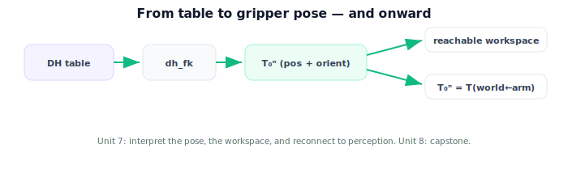

!!! abstract "You are here"
    **Module 4 — Forward Kinematics using Denavit–Hartenberg Parameters**  ·  **Unit 6 — Building and Using a DH Table**  ·  **Lesson 6.4 — Building and Using a DH Table (Unit 6 Recap)**

# Lesson 6.4 — Building and Using a DH Table (Unit 6 Recap)

*A short synthesis — no new mathematics. It ties Unit 6 together and points toward pose, workspace, and perception.*

---

## From table to gripper pose

Unit 6 closed the loop from description to computation:

> **Each DH row becomes a link transform $T_{i-1}^i = \mathrm{Rot}_z(\theta)\,\mathrm{Trans}_z(d)\,\mathrm{Trans}_x(a)\,\mathrm{Rot}_x(\alpha)$; multiply the rows to get $T_0^n(\boldsymbol{\theta})$. One function computes forward kinematics for any arm, verified against the planar closed form and available symbolically via SymPy.**

## What Unit 6 established

| Lesson | Point |
|---|---|
| 6.1 The DH Link Transform | One fixed four-factor formula per joint; reduces to the planar transform when $d=0,\alpha=0$. |
| 6.2 Reading a Robot into a Table | A procedure: number joints → assign frames → read $\theta,d,a,\alpha$; the 3-DOF capstone table. |
| 6.3 DH FK in Code | `dh_fk(table, config)` — build per-row transforms, multiply, extract; verify vs closed form; SymPy symbolic. |

## Why this matters

We can now take any serial arm, write its DH table, and compute the gripper pose. The remaining question is **interpretation and connection**: what does the pose tell us, what set of poses can the arm reach, and how does this plug back into perception? **Unit 7** answers all three — reading the end-effector pose, the reachable **workspace**, and **closing the loop** by identifying $T_0^n = T_{w\leftarrow a}$, the arm pose Module 3 assumed. Then **Unit 8** is the capstone: build the 3-DOF arm's DH model, compute and verify the gripper pose, and place a perceived fruit target in the arm's frame.

## Visual Explanation

<figure markdown>
  { width="680" }
</figure>

## Interactive Demonstration

<iframe src="../../demos/module04/lesson24_building_using_dh_table_recap.html" title="Building and Using a DH Table (Unit 6 Recap) interactive demo" style="width:100%;height:520px;border:1px solid #e2e8f0;border-radius:12px"></iframe>

[Open this demo in a new tab ↗](../demos/module04/lesson24_building_using_dh_table_recap.html)

Unit 6 in one tool: drive the 3-DOF arm and watch the live DH table feed the forward kinematics that places the gripper.

## Coding Exercise

!!! tip "Run the hands-on notebook"
    `modules/module04/notebooks/M04_U06_L6_4_Building_And_Using_A_DH_Table_Unit_6_Recap.ipynb` — open in JupyterLab and run **Kernel → Restart & Run All**.

A short consolidation: given the 3-DOF DH table, compute $T_0^3$ at one configuration with `dh_fk`, extract position and orientation, and confirm the in-plane reach matches `fk_planar`.

## Knowledge Check

Formative — unlimited attempts, immediate feedback; does not affect your grade.

<iframe src="../../quizzes/module04/lesson24_quiz.html" title="Building and Using a DH Table (Unit 6 Recap) knowledge check" style="width:100%;height:720px;border:1px solid #e2e8f0;border-radius:12px"></iframe>

[Open this quiz in a new tab ↗](../quizzes/module04/lesson24_quiz.html)

A brief consolidation quiz across Unit 6 (formative — unlimited attempts).

## Key Takeaways

- A DH row → a **four-factor link transform**; multiply rows → $T_0^n(\boldsymbol{\theta})$.
- **One function** computes FK for any arm; verify against the planar closed form.
- **SymPy** gives the symbolic end-effector pose from a symbolic table.
- Next: **Unit 7** — interpret the pose, the workspace, and reconnect to perception.

---

## AI Learning Companion

Copy any prompt below into ChatGPT, Claude, or another AI assistant.

**Tutor prompt** — explain it another way
```
Summarize Unit 6 of Module 4: each DH row becomes the four-factor link transform; multiply rows to get T_0^n; one dh_fk function works for any arm, verified against the planar closed form and available symbolically via SymPy.
```

**Practice prompt** — generate more exercises
```
Give me a 10-question review of building and using a DH table: the link transform, table-building procedure, and DH FK in code. Include answers.
```

**Explore prompt** — connect it to the real world
```
Show me how going from a robot's DH table to its gripper pose works end to end, and how this becomes the T(world←arm) perception needs.
```

## Global Learning Support

Need this lesson explained in another language? Copy one of the prompts below into an AI assistant. English remains the authoritative source.

**Supported languages (initial):** English · Español · 中文 (Simplified Chinese) · Türkçe

**Español**
```
I just completed Lesson 6.4 (Module 4) — Building and Using a DH Table (Unit 6 Recap).
Explain this lesson in Spanish. Keep robotics and mathematical terminology in English when appropriate.
Then provide: a summary, three practice questions, and one challenge problem.
```

**中文 (Simplified Chinese)**
```
I just completed Lesson 6.4 (Module 4) — Building and Using a DH Table (Unit 6 Recap).
Explain this lesson in Simplified Chinese. Keep mathematical notation unchanged.
Then provide: a summary, three practice questions, and one challenge problem.
```

**Türkçe**
```
I just completed Lesson 6.4 (Module 4) — Building and Using a DH Table (Unit 6 Recap).
Explain this lesson in Turkish. Keep robotics terminology in English where commonly used.
Then provide: a summary, three practice questions, and one challenge problem.
```

---

*Next: Unit 7 — Pose, Workspace, and Back to Perception.*
