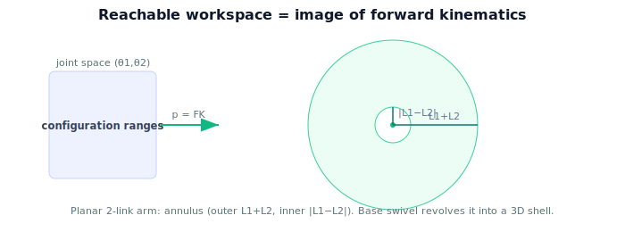

!!! abstract "You are here"
    **Module 4 — Forward Kinematics using Denavit–Hartenberg Parameters**  ·  **Unit 7 — Pose, Workspace, and Back to Perception**  ·  **Lesson 7.2 — The Reachable Workspace**

# Lesson 7.2 — The Reachable Workspace

## 1. Why This Matters

Before you ask an arm to grab a fruit, you should know whether it *can* — is the fruit even within reach? The set of all points the gripper can occupy is the **reachable workspace**. It falls straight out of forward kinematics: sweep the joints through their limits, collect the gripper positions, and you've drawn the region the arm can touch. This tells the system which fruit are reachable and where to position the robot base.

## 2. Physical Intuition

Stand in place and sweep your arm everywhere it can go — every point your fingertips can reach traces out a region around you, roughly a thick shell bounded by your full reach and your folded-in minimum. A robot arm is the same: its workspace is the cloud of all gripper positions over all allowed joint angles. Short links and tight joint limits shrink it; long links and free joints grow it. The shape isn't arbitrary — it's the image of the joint ranges under forward kinematics.

## 3. Mathematical Foundations

The configuration space is the set of allowed joint values, a box $\mathcal{C} = [\theta_1^{\min},\theta_1^{\max}]\times\cdots\times[\theta_n^{\min},\theta_n^{\max}]$. Forward kinematics maps each configuration to a gripper position:

$$\mathbf{p}: \mathcal{C}\to\mathbb{R}^3,\qquad \mathbf{p}(\boldsymbol{\theta}) = \text{translation column of } T_0^n(\boldsymbol{\theta}).$$

The **reachable workspace** is the image of this map:

$$\mathcal{W} = \{\,\mathbf{p}(\boldsymbol{\theta}) : \boldsymbol{\theta}\in\mathcal{C}\,\}.$$

We can't write $\mathcal W$ in closed form for a general arm, so we **sample**: grid or randomly draw many $\boldsymbol{\theta}\in\mathcal{C}$, evaluate $\mathbf p(\boldsymbol\theta)$, and plot the resulting points. For the planar 2-link arm the workspace is an annulus with outer radius $L_1+L_2$ and inner radius $|L_1-L_2|$; adding a base swivel revolves that annulus into a 3D shell. (The full workspace also has an orientation aspect — the *dexterous* workspace, where the gripper can take any orientation, is smaller than the reachable one; we focus on reachable position here.)

## 4. Visual Explanation

<figure markdown>
  { width="680" }
</figure>

## 5. Engineering Example

When the greenhouse robot is installed, engineers compute its reachable workspace to place the base so the target rows of plants fall inside it. At run time, the planner first checks whether a detected fruit lies in $\mathcal{W}$ (and within joint limits); fruit outside the workspace are skipped or the base is repositioned. The workspace is also used to design the robot — choosing link lengths so the canopy is comfortably covered.

## 6. Worked Example

Planar 2-link arm, $L_1=0.4, L_2=0.3$, both joints free ($0$–$360°$). Outer reach $L_1+L_2 = 0.7$; inner reach $|L_1-L_2| = 0.1$. A fruit at distance $0.5$ from the base is reachable ($0.1 \le 0.5 \le 0.7$); one at $0.05$ is *inside* the inner hole (unreachable); one at $0.8$ is beyond the outer radius (unreachable). Sampling $\boldsymbol\theta$ and plotting confirms the annulus between radii $0.1$ and $0.7$.

## 7. Interactive Demonstration

<iframe src="../../demos/module04/lesson26_the_reachable_workspace.html" title="The Reachable Workspace interactive demo" style="width:100%;height:520px;border:1px solid #e2e8f0;border-radius:12px"></iframe>

[Open this demo in a new tab ↗](../demos/module04/lesson26_the_reachable_workspace.html)

**Guided prediction.** For $L_1=0.4,L_2=0.3$, predict the outer and inner radii of the reachable annulus. Predict whether a target at radius $0.65$ is reachable. Confirm: outer $0.7$, inner $0.1$; $0.65$ is reachable.

## 8. Coding Exercise

!!! tip "Run the hands-on notebook"
    `modules/module04/notebooks/M04_U07_L7_2_The_Reachable_Workspace.ipynb` — open in JupyterLab and run **Kernel → Restart & Run All**.

Sample $N$ random configurations of the planar 2-link arm, evaluate `fk` to collect gripper positions, and (a) scatter-plot the workspace, (b) verify all sampled points lie within radii $[|L_1-L_2|, L_1+L_2]$ of the base.

## 9. Knowledge Check

Formative — unlimited attempts, immediate feedback; does not affect your grade.

<iframe src="../../quizzes/module04/lesson26_quiz.html" title="The Reachable Workspace knowledge check" style="width:100%;height:720px;border:1px solid #e2e8f0;border-radius:12px"></iframe>

[Open this quiz in a new tab ↗](../quizzes/module04/lesson26_quiz.html)

A check defining the reachable workspace as the image of FK over joint ranges, and the planar annulus radii.

## 10. Challenge Problem

Joint limits restrict $\theta_2 \in [0°, 150°]$ (the elbow can't fully fold or hyperextend). Describe qualitatively how this carves the full annulus down to a partial region, and why joint limits make the *real* workspace smaller than the idealized annulus.

## 11. Common Mistakes

- Forgetting the inner hole (minimum reach $|L_1-L_2|$).
- Ignoring joint limits, which shrink the true workspace.
- Confusing reachable workspace (any orientation) with dexterous workspace (all orientations).

## 12. Key Takeaways

- The **reachable workspace** is the image of forward kinematics over the joint ranges: $\mathcal W = \{\mathbf p(\boldsymbol\theta)\}$.
- It's found by **sampling** configurations and collecting gripper positions.
- Planar 2-link arm: annulus, outer $L_1+L_2$, inner $|L_1-L_2|$; a base swivel revolves it into a shell.
- Used to place the base, screen targets for reachability, and design link lengths.

---

## AI Learning Companion

Copy any prompt below into ChatGPT, Claude, or another AI assistant.

**Tutor prompt** — explain it another way
```
Explain Lesson 7.2 (Module 4) — The Reachable Workspace — as the set of all gripper positions over the joint ranges (the image of forward kinematics). Use the planar 2-link annulus (outer L1+L2, inner |L1−L2|) and the "sweep your arm everywhere" analogy.
```

**Practice prompt** — generate more exercises
```
Give me 6 exercises computing reachability for planar arms (annulus radii, is a target reachable) and reasoning about joint limits. Include answers.
```

**Explore prompt** — connect it to the real world
```
Show me how a robot's reachable workspace is used to place its base and screen which fruit are reachable.
```

## Global Learning Support

Need this lesson explained in another language? Copy one of the prompts below into an AI assistant. English remains the authoritative source.

**Supported languages (initial):** English · Español · 中文 (Simplified Chinese) · Türkçe

**Español**
```
I just completed Lesson 7.2 (Module 4) — The Reachable Workspace.
Explain this lesson in Spanish. Keep robotics and mathematical terminology in English when appropriate.
Then provide: a summary, three practice questions, and one challenge problem.
```

**中文 (Simplified Chinese)**
```
I just completed Lesson 7.2 (Module 4) — The Reachable Workspace.
Explain this lesson in Simplified Chinese. Keep mathematical notation unchanged.
Then provide: a summary, three practice questions, and one challenge problem.
```

**Türkçe**
```
I just completed Lesson 7.2 (Module 4) — The Reachable Workspace.
Explain this lesson in Turkish. Keep robotics terminology in English where commonly used.
Then provide: a summary, three practice questions, and one challenge problem.
```

---

*Next lesson: 7.3 — Closing the Loop with Perception.*
