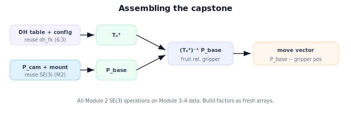

!!! abstract "You are here"
    **Module 4 — Forward Kinematics using Denavit–Hartenberg Parameters**  ·  **Unit 8 — Mini Project: From Joints to the Fruit**  ·  **Lesson 8.2 — Building the Arm's DH Model**

# Lesson 8.2 — Building the Arm's DH Model

## 1. Why This Matters

This is the build step. You encode the 3-DOF arm as a DH table, wire up `dh_fk` to get the gripper pose, and add the frame bridge that brings a perceived fruit into the arm's coordinates. By the end of this lesson the pipeline *runs* — given joint angles and a perceived fruit, it reports the target relative to the gripper. The next lesson verifies it's correct.

## 2. Physical Intuition

You've made every part before; now you connect the pipes. The DH table is the arm's blueprint. `dh_fk` reads the blueprint plus the current joint angles and tells you where the hand is. The frame bridge takes the camera's report and re-expresses it where the arm can use it. Connected, water flows from "camera sees fruit" to "here's where the gripper needs to go," with no gaps.

## 3. Mathematical Foundations

Reusing the verified pieces:
- **DH table** (Lesson 6.2): rows $(\theta_1,0.1,0,90°), (\theta_2,0,0.4,0), (\theta_3,0,0.3,0)$.
- **DH forward kinematics** (Lesson 6.3): `dh_fk(table, config)` → $T_0^3(\boldsymbol\theta)$.
- **Frame bridge** (Lesson 7.3): $\mathbf P_{\text{base}} = T_{\text{base}}^{\text{cam}}\,\mathbf P_{\text{cam}}$; fruit relative to gripper $\mathbf P_{\text{grip}} = (T_0^3)^{-1}\mathbf P_{\text{base}}$ (homogeneous point).

The assembled function takes a configuration and a perceived $\mathbf P_{\text{cam}}$ and returns: the gripper pose $T_0^3$, the fruit in the base frame, the fruit relative to the gripper, and the move vector. All of it is $SE(3)$ products and one inverse — the operations from Module 2, applied to data from Modules 3–4. We build each factor as a fresh array and invert with the standard rigid-transform inverse (or `np.linalg.inv` for clarity here).

## 4. Visual Explanation

<figure markdown>
  { width="680" }
</figure>

## 5. Engineering Example

In the greenhouse stack this is the "target resolver" node: subscribe to perception ($\mathbf P_{\text{cam}}$), read joint states (→ $T_0^3$), publish the fruit pose in the base/gripper frame for the motion layer. Building it here in a notebook makes the data flow explicit; in production it's the same composition wrapped in the robot's messaging.

## 6. Worked Example

Config $(\theta_1,\theta_2,\theta_3) = (0°, 30°, 60°)$. `dh_fk` gives the gripper at base-frame position around $(0.346, 0, 0.6)$ (planar reach $(0.346,0.5)$ raised by the $0.1$ riser and standing up via $\alpha_1=90°$; exact axes per the frame setup). Camera reports $\mathbf P_{\text{cam}}=(0.05,0,0.40)$; with mount translation $(0.1,0,0.5)$, $\mathbf P_{\text{base}}=(0.15,0,0.90)$. Move vector (base frame) = $\mathbf P_{\text{base}} - \mathbf p_{\text{gripper}} \approx (-0.20, 0, 0.30)$ — the gripper must move back and up to reach the fruit. The pipeline produced an actionable vector from a pixel-derived point and joint angles.

## 7. Interactive Demonstration

<iframe src="../../demos/module04/lesson30_building_arm_dh_model.html" title="Building the Arm's DH Model interactive demo" style="width:100%;height:520px;border:1px solid #e2e8f0;border-radius:12px"></iframe>

[Open this demo in a new tab ↗](../demos/module04/lesson30_building_arm_dh_model.html)

**Guided prediction.** Predict the fruit's base-frame position from $\mathbf P_{\text{cam}}$ and the mount. Predict the sign of the vertical move if the fruit is above the gripper. Confirm by running the assembled pipeline.

## 8. Coding Exercise

!!! tip "Run the hands-on notebook"
    `modules/module04/notebooks/M04_U08_L8_2_Building_The_Arms_DH_Model.ipynb` — open in JupyterLab and run **Kernel → Restart & Run All**.

Assemble `capstone(config, P_cam, T_base_cam, table)`: compute $T_0^3$ via `dh_fk`, bridge $\mathbf P_{\text{cam}}\to\mathbf P_{\text{base}}$, compute fruit-relative-to-gripper and the base-frame move vector; run it on the worked example and print all four outputs.

## 9. Knowledge Check

Formative — unlimited attempts, immediate feedback; does not affect your grade.

<iframe src="../../quizzes/module04/lesson30_quiz.html" title="Building the Arm's DH Model knowledge check" style="width:100%;height:720px;border:1px solid #e2e8f0;border-radius:12px"></iframe>

[Open this quiz in a new tab ↗](../quizzes/module04/lesson30_quiz.html)

A check on assembling `dh_fk` + frame bridge, and producing the fruit in the arm's frame and the move vector.

## 10. Challenge Problem

Add a reachability gate: before reporting the move, check the fruit's distance from the base axis against the workspace annulus (Lesson 7.2) and return a clear "unreachable" flag when outside. Why is gating before motion important?

## 11. Common Mistakes

- Forgetting the homogeneous coordinate when transforming the fruit point.
- Using the wrong mount frame for the camera.
- Mutating shared arrays when building DH factors (aliasing).

## 12. Key Takeaways

- The capstone arm is encoded as a **DH table**; `dh_fk` gives $T_0^3$.
- The **frame bridge** places a perceived fruit in the base and gripper frames.
- The assembled pipeline outputs the fruit pose and a **move vector** from joint angles + a perceived point.
- It's all Module 2 $SE(3)$ operations on Module 3–4 data.

---

## AI Learning Companion

Copy any prompt below into ChatGPT, Claude, or another AI assistant.

**Tutor prompt** — explain it another way
```
Explain Lesson 8.2 (Module 4) — Building the Arm's DH Model — as wiring dh_fk (the 3-DOF DH table) with the frame bridge (P_cam → P_base → fruit relative to gripper) to output a move vector. Use the (0°,30°,60°) worked example.
```

**Practice prompt** — generate more exercises
```
Give me 5 coding exercises assembling a DH forward-kinematics + frame-bridge pipeline and computing the move vector to a target. Include solutions.
```

**Explore prompt** — connect it to the real world
```
Show me how a "target resolver" node in a robot stack combines perception output and joint states to publish a fruit pose in the arm's frame.
```

## Global Learning Support

Need this lesson explained in another language? Copy one of the prompts below into an AI assistant. English remains the authoritative source.

**Supported languages (initial):** English · Español · 中文 (Simplified Chinese) · Türkçe

**Español**
```
I just completed Lesson 8.2 (Module 4) — Building the Arm's DH Model.
Explain this lesson in Spanish. Keep robotics and mathematical terminology in English when appropriate.
Then provide: a summary, three practice questions, and one challenge problem.
```

**中文 (Simplified Chinese)**
```
I just completed Lesson 8.2 (Module 4) — Building the Arm's DH Model.
Explain this lesson in Simplified Chinese. Keep mathematical notation unchanged.
Then provide: a summary, three practice questions, and one challenge problem.
```

**Türkçe**
```
I just completed Lesson 8.2 (Module 4) — Building the Arm's DH Model.
Explain this lesson in Turkish. Keep robotics terminology in English where commonly used.
Then provide: a summary, three practice questions, and one challenge problem.
```

---

*Next lesson: 8.3 — Verifying the Forward Kinematics.*
