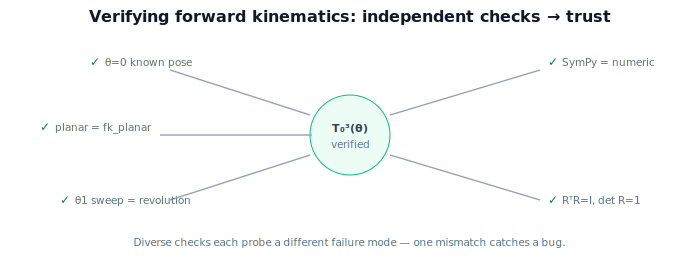

!!! abstract "You are here"
    **Module 4 — Forward Kinematics using Denavit–Hartenberg Parameters**  ·  **Unit 8 — Mini Project: From Joints to the Fruit**  ·  **Lesson 8.3 — Verifying the Forward Kinematics**

# Lesson 8.3 — Verifying the Forward Kinematics

## 1. Why This Matters

A pipeline that runs is not the same as a pipeline that's *right*. Before a robot moves on a forward-kinematics result, the kinematics must be verified. This lesson is about building that trust: checking the capstone's $T_0^3$ against closed forms, known configurations, and a symbolic derivation, so a wrong DH entry or a transposed factor can't silently send the gripper to the wrong place. Verification is the difference between a demo and a system.

## 2. Physical Intuition

Think of checking a map against landmarks you know. If the map says the fountain is here and you walk there and find it, your confidence grows. We do the same with the arm: at configurations where we *know* the answer (all joints zero, a single joint at $90°$, the planar sub-arm), we check that $T_0^3$ lands where it must. When several independent landmarks all line up, the map is trustworthy. One mismatch and you've caught a bug before it became a crushed tomato.

## 3. Mathematical Foundations

Independent verification strategies for $T_0^3(\boldsymbol\theta)$:

1. **Known configuration.** At $\boldsymbol\theta = (0,0,0)$ the arm is in a fully determined pose; the gripper position must equal the hand-computed one (riser $d_1=0.1$ plus the straightened links along the appropriate axis).
2. **Planar sub-arm reduction.** With base swivel $\theta_1=0$, joints 2–3 form the planar 2-link arm; the in-plane reach must match `fk_planar` from Unit 3 exactly (we verified this in Lesson 6.3).
3. **Single-joint sanity.** Move only $\theta_1$; the gripper position must rotate about the base $z$-axis at constant radius and height (a pure revolution).
4. **Symbolic check (SymPy).** Build $T_0^3$ symbolically; substitute numbers and confirm it equals the numeric `dh_fk`; inspect that the symbolic position reduces to the planar formula when $\theta_1=0$.
5. **Determinant / orthonormality.** The rotation block must satisfy $R^\top R = I$ and $\det R = 1$ at every configuration (it's a valid rotation).

Passing all five independent checks makes a silent error very unlikely — each probes a different way the kinematics could be wrong.

## 4. Visual Explanation

<figure markdown>
  { width="680" }
</figure>

## 5. Engineering Example

Production robotics teams keep a kinematics test suite exactly like this: known-pose assertions, reductions to analytic cases, symbolic cross-checks, and rotation-validity tests, run on every change to the DH table or FK code. The greenhouse arm's kinematics ship only after the suite is green. Our capstone verification is a miniature of that practice — the habit that separates reliable systems from fragile ones.

## 6. Worked Example

Run the checks on the capstone arm. (1) $\boldsymbol\theta=(0,0,0)$: gripper at the expected straightened pose (height $0.1$, links extended). (2) $\theta_1=0,(\theta_2,\theta_3)=(30°,60°)$: in-plane reach magnitude equals $\sqrt{0.346^2+0.5^2}\approx 0.609$, matching `fk_planar` — already confirmed in 6.3. (3) Sweeping $\theta_1$ alone keeps the gripper's distance from the base $z$-axis and its height constant — a revolution. (4) SymPy $T_0^3$ substituted at $(0,30°,60°)$ equals the numeric `dh_fk` to machine precision. (5) $\det R = 1$, $R^\top R = I$ throughout. All green → the capstone FK is trustworthy.

## 7. Interactive Demonstration

<iframe src="../../demos/module04/lesson31_verifying_forward_kinematics.html" title="Verifying the Forward Kinematics interactive demo" style="width:100%;height:520px;border:1px solid #e2e8f0;border-radius:12px"></iframe>

[Open this demo in a new tab ↗](../demos/module04/lesson31_verifying_forward_kinematics.html)

**Guided prediction.** Predict the gripper height at $\boldsymbol\theta=(0,0,0)$ (the riser plus straightened reach geometry). Predict whether sweeping $\theta_1$ changes the gripper's height (no — pure revolution about $z$). Confirm by running the checks.

## 8. Coding Exercise

!!! tip "Run the hands-on notebook"
    `modules/module04/notebooks/M04_U08_L8_3_Verifying_The_Forward_Kinematics.ipynb` — open in JupyterLab and run **Kernel → Restart & Run All**.

Write a `verify(table)` that runs all five checks (zero-config assertion, planar reduction vs `fk_planar`, $\theta_1$-revolution invariants, SymPy-vs-numeric, rotation validity) and prints PASS/FAIL for each; confirm all pass for the capstone arm.

## 9. Knowledge Check

Formative — unlimited attempts, immediate feedback; does not affect your grade.

<iframe src="../../quizzes/module04/lesson31_quiz.html" title="Verifying the Forward Kinematics knowledge check" style="width:100%;height:720px;border:1px solid #e2e8f0;border-radius:12px"></iframe>

[Open this quiz in a new tab ↗](../quizzes/module04/lesson31_quiz.html)

A check on the verification strategies and why multiple independent checks build trust.

## 10. Challenge Problem

Deliberately corrupt one DH entry (e.g. set $\alpha_1 = 0$ instead of $90°$) and identify which of the five checks catch it and which don't. What does this say about choosing a *diverse* set of checks?

## 11. Common Mistakes

- Treating "it runs" as "it's correct."
- Using only one check (a single test can pass while the kinematics is subtly wrong).
- Forgetting the rotation-validity check ($R^\top R=I$, $\det R=1$).

## 12. Key Takeaways

- **Verify** forward kinematics before trusting it to move a robot.
- Use **independent** checks: known configs, analytic reductions, single-joint sanity, symbolic, rotation validity.
- Multiple diverse checks make silent errors very unlikely.
- This is the practice that turns a demo into a system.

---

## AI Learning Companion

Copy any prompt below into ChatGPT, Claude, or another AI assistant.

**Tutor prompt** — explain it another way
```
Explain Lesson 8.3 (Module 4) — Verifying the Forward Kinematics — as checking T_0^3 against multiple independent landmarks: zero config, planar reduction (= fk_planar), single-joint revolution, SymPy-vs-numeric, and rotation validity (RᵀR=I, det R=1). Use the "check the map against known landmarks" analogy.
```

**Practice prompt** — generate more exercises
```
Give me 5 verification exercises for a DH forward-kinematics implementation (known configs, reductions, symbolic, rotation validity). Include solutions.
```

**Explore prompt** — connect it to the real world
```
Show me what a production kinematics test suite checks and why teams run it on every change to the DH table or FK code.
```

## Global Learning Support

Need this lesson explained in another language? Copy one of the prompts below into an AI assistant. English remains the authoritative source.

**Supported languages (initial):** English · Español · 中文 (Simplified Chinese) · Türkçe

**Español**
```
I just completed Lesson 8.3 (Module 4) — Verifying the Forward Kinematics.
Explain this lesson in Spanish. Keep robotics and mathematical terminology in English when appropriate.
Then provide: a summary, three practice questions, and one challenge problem.
```

**中文 (Simplified Chinese)**
```
I just completed Lesson 8.3 (Module 4) — Verifying the Forward Kinematics.
Explain this lesson in Simplified Chinese. Keep mathematical notation unchanged.
Then provide: a summary, three practice questions, and one challenge problem.
```

**Türkçe**
```
I just completed Lesson 8.3 (Module 4) — Verifying the Forward Kinematics.
Explain this lesson in Turkish. Keep robotics terminology in English where commonly used.
Then provide: a summary, three practice questions, and one challenge problem.
```

---

*Next lesson: 8.4 — Wrap-Up and the Road to Inverse Kinematics.*
