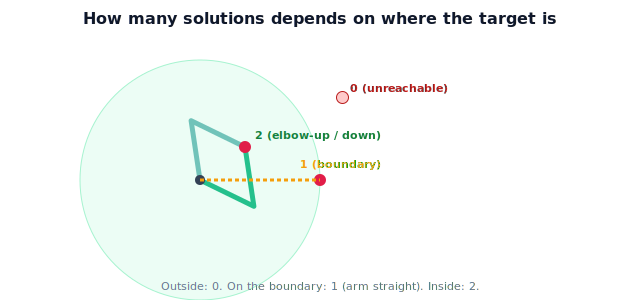

!!! abstract "You are here"
    **Module 5 — Inverse Kinematics**  ·  **Unit 1 — The Inverse Problem**  ·  **Lesson 1.2 — Why It's Hard: Nonlinear, and 0/1/Many Solutions**

# Lesson 1.2 — Why It's Hard: Nonlinear, and 0/1/Many Solutions

> Inverting the forward map is not a matter of algebra alone. This lesson explains the two reasons inverse kinematics is genuinely hard: nonlinearity, and the fact that the answer may not be unique — or may not exist.

---

## 1. Why This Matters

If inverse kinematics were as easy as evaluating a function, we would not spend a module on it. The difficulty is real and it shapes everything that follows — why we sometimes get a clean formula and sometimes must iterate, why a solver must *choose* among answers, and why it must gracefully report "unreachable." Understanding the source of the difficulty now means the later methods will feel like responses to a known problem rather than arbitrary recipes.

## 2. Physical Intuition

Two everyday facts. First, **more than one way**: to touch a point in front of you, you can hold your elbow high or low and still land your fingertip in the same place. Same target, two arm shapes. Second, **out of reach**: a point on the far wall has *no* arm configuration that reaches it — and a point exactly at full arm's length has just *one* (arm dead straight, no elbow freedom left). The number of ways to reach a target depends on *where the target is*. That dependence is the heart of why inverse kinematics resists a single tidy formula.

## 3. Mathematical Foundations

The forward map is **nonlinear** because joint angles enter through sine and cosine. For the planar 2-link arm (link lengths $L_1, L_2$, angles $\theta_1, \theta_2$):

$$x = L_1\cos\theta_1 + L_2\cos(\theta_1+\theta_2), \qquad y = L_1\sin\theta_1 + L_2\sin(\theta_1+\theta_2).$$

Given a target $(x, y)$, solving for $(\theta_1, \theta_2)$ means inverting these coupled trigonometric equations. There is no general linear-algebra move that does it, and the structure of the equations produces three cases:

- **No solution** — the target lies outside the reachable set (here, $r = \sqrt{x^2+y^2} > L_1 + L_2$, or inside the inner hole $r < |L_1 - L_2|$). The equations are inconsistent.
- **Exactly one solution** — the target sits on the workspace **boundary** ($r = L_1 + L_2$, arm fully extended, or $r = |L_1 - L_2|$, fully folded). The two configurations coincide.
- **Many solutions** — the target is strictly inside the reachable annulus. For the 2-link arm there are exactly **two**: the second joint can bend one way or the other (elbow-up / elbow-down), both placing the gripper on the target.

More joints (or a redundant arm with more joints than task dimensions) can give *infinitely many* solutions. The 2-link "two solutions" is the smallest interesting case and our running example.

## 4. Visual Explanation

<figure markdown>
  { width="680" }
</figure>

## 5. Engineering Example

When the greenhouse arm is told to grasp a tomato deep in the canopy, the two solutions are not academic: elbow-up might collide with a support wire while elbow-down clears it. The controller must be *able* to compute both and then pick the feasible one (a job for Unit 6). And when a tomato is simply too far, the system must detect the no-solution case rather than command a meaningless angle — better to reposition the base than to grind a motor against an impossible target.

## 6. Worked Example

Let $L_1 = L_2 = 0.3$, so the reach annulus runs from $r = 0$ (inner radius $|0.3-0.3| = 0$) to $r = 0.6$. Classify three targets by distance $r = \sqrt{x^2+y^2}$:

- $(0.7, 0)$: $r = 0.7 > 0.6$ → **0 solutions** (too far).
- $(0.6, 0)$: $r = 0.6 = L_1+L_2$ → **1 solution** (arm straight along $x$, $\theta_1=0, \theta_2=0$).
- $(0.3, 0.2)$: $r = \sqrt{0.13} \approx 0.36$, between $0$ and $0.6$ → **2 solutions** (elbow-up and elbow-down).

We will compute the actual angles for the two-solution case in Unit 3; here the point is only to read off *how many* from *where*.

## 7. Interactive Demonstration

**Guided prediction.** With $L_1=L_2=0.3$, walk a target from the origin straight out along the $x$-axis to $r = 0.7$. Predict where the solution count changes: it is **2** inside, drops to **1** exactly at $r=0.6$, and becomes **0** beyond. Sketch the elbow-up and elbow-down poses for $r = 0.4$ and notice they merge into a single straight arm as $r \to 0.6$.

## 8. Coding Exercise

!!! tip "Run the hands-on notebook"
    `modules/module05/notebooks/M05_U01_L1_2_Why_Its_Hard.ipynb` — open in JupyterLab and run **Kernel → Restart & Run All**.

Write `count_solutions(x, y, L1, L2)` that returns 0, 1, or 2 by comparing $r = \sqrt{x^2+y^2}$ against $L_1+L_2$ and $|L_1-L_2|$ (use a small tolerance for the boundary). Test it on the three worked-example targets. Do **not** compute the angles yet — just the count.

## 9. Knowledge Check

Formative — unlimited attempts, immediate feedback; does not affect your grade.

<iframe src="../../quizzes/module05/lesson02_quiz.html" title="Why It's Hard: Nonlinear, and 0/1/Many Solutions knowledge check" style="width:100%;height:720px;border:1px solid #e2e8f0;border-radius:12px"></iframe>

[Open this quiz in a new tab ↗](../quizzes/module05/lesson02_quiz.html)

Checks on why the forward map is nonlinear, the three cases and their geometric conditions, and identifying elbow-up/down as the two-solution case.

## 10. Challenge Problem

A target lands exactly on the inner boundary of an annulus with $L_1 = 0.5, L_2 = 0.3$ (inner radius $|0.5-0.3| = 0.2$). How many solutions, and what does the arm look like there? Explain why the *inner* boundary, like the outer, collapses the two solutions into one.

## 11. Common Mistakes

- Believing inverse kinematics always has a unique answer.
- Forgetting the inner hole — an arm with unequal links cannot reach points too close to the base.
- Treating the nonlinearity as a nuisance to "simplify away" rather than the structural reason for multiple solutions.
- Comparing $r$ to only the outer radius and missing the inner-boundary case.

## 12. Key Takeaways

- The forward map is **nonlinear** (angles enter via sine/cosine), so the inverse has no general linear solution.
- A target has **0, 1, or many** solutions depending on where it sits relative to the reachable annulus.
- The 2-link arm's canonical "many" case is **two**: elbow-up and elbow-down.
- Boundaries (outer $L_1+L_2$, inner $|L_1-L_2|$) are exactly where two solutions merge into one.

---

## AI Learning Companion

Copy any prompt below into ChatGPT, Claude, or another AI assistant.

**Tutor prompt** — explain it another way
```
Re-explain Lesson 1.2 (Module 5) — why inverse kinematics has 0, 1, or many solutions — using a 2-link arm and the reachable annulus. Make the elbow-up / elbow-down pair vivid.
```

**Practice prompt** — generate more exercises
```
Give me 6 exercises where I classify a planar 2-link arm target as having 0, 1, or 2 solutions from the link lengths and target distance. Include answers.
```

**Explore prompt** — connect it to the real world
```
Show me situations where a robot must choose between elbow-up and elbow-down solutions, and where detecting an unreachable target matters.
```

## Global Learning Support

Need this lesson explained in another language? Copy one of the prompts below into an AI assistant. English remains the authoritative source.

**Supported languages (initial):** English · Español · 中文 (Simplified Chinese) · Türkçe

**Español**
```
I just completed Lesson 1.2 (Module 5) — Why It's Hard: Nonlinear, and 0/1/Many Solutions.
Explain this lesson in Spanish. Keep robotics and mathematical terminology in English when appropriate.
Then provide: a summary, three practice questions, and one challenge problem.
```

**中文 (Simplified Chinese)**
```
I just completed Lesson 1.2 (Module 5) — Why It's Hard: Nonlinear, and 0/1/Many Solutions.
Explain this lesson in Simplified Chinese. Keep mathematical notation unchanged.
Then provide: a summary, three practice questions, and one challenge problem.
```

**Türkçe**
```
I just completed Lesson 1.2 (Module 5) — Why It's Hard: Nonlinear, and 0/1/Many Solutions.
Explain this lesson in Turkish. Keep robotics terminology in English where commonly used.
Then provide: a summary, three practice questions, and one challenge problem.
```

---

*Next lesson: 1.3 — Reachability and the Workspace.*
