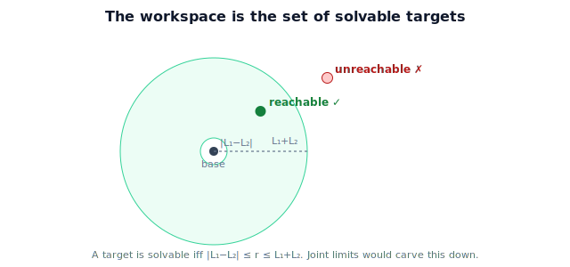

!!! abstract "You are here"
    **Module 5 — Inverse Kinematics**  ·  **Unit 1 — The Inverse Problem**  ·  **Lesson 1.3 — Reachability and the Workspace**

# Lesson 1.3 — Reachability and the Workspace

> Before solving inverse kinematics, ask whether a solution can exist at all. The workspace — first met in Module 4 — is precisely the set of reachable targets, and a quick reachability test makes "unreachable" a clean answer instead of a solver crash.

---

## 1. Why This Matters

A solver that is handed an impossible target should say "unreachable," not spin forever or return nonsense. The cheapest way to guarantee that is to test reachability *first*. The reachable workspace — the set of all poses the arm can produce — is exactly the set of targets for which inverse kinematics has at least one solution. Knowing its shape lets the robot reject bad targets instantly and reposition (drive the base, lift the column) rather than fail.

## 2. Physical Intuition

Sweep your arm through every configuration it allows and watch the volume your fingertip can occupy — a roughly spherical shell with a hollow core near your shoulder. That swept region is your workspace. Anything inside it you can touch (often several ways); anything outside it you simply cannot, no matter how you bend. Inverse kinematics lives entirely inside this region: ask it for a point outside, and there is honestly nothing to find.

## 3. Mathematical Foundations

The **reachable workspace** is the image of the forward map over the allowed joint ranges:

$$\mathcal{W} = \{\, \mathbf p(\boldsymbol\theta) : \boldsymbol\theta \in [\boldsymbol\theta_{\min}, \boldsymbol\theta_{\max}] \,\}.$$

A target $\mathbf p_{\text{desired}}$ has an inverse-kinematics solution **iff** $\mathbf p_{\text{desired}} \in \mathcal{W}$. (For a full-pose target, the orientation must also be achievable there.) For the planar 2-link arm with unrestricted joints, $\mathcal W$ is the **annulus**

$$|L_1 - L_2| \le r \le L_1 + L_2, \qquad r = \sqrt{x^2 + y^2},$$

— exactly the region whose boundaries we read in Lesson 1.2. The outer radius is "arm fully extended," the inner radius is "arm fully folded." Joint limits shrink this ideal annulus to a smaller patch; a base swivel revolves the planar annulus into a 3D shell (Module 4, Unit 7). The reachability **test** is therefore a distance comparison — cheap, and done before any solving.

## 4. Visual Explanation

<figure markdown>
  { width="680" }
</figure>

## 5. Engineering Example

The greenhouse controller checks reachability the instant perception reports a tomato. If the fruit's grasp point is inside the arm's workspace shell, it proceeds to solve inverse kinematics. If not, it does not even try — it commands the mobile base or the vertical column to move the *whole arm* until the fruit falls inside the shell, then solves. Reachability is the gate between "perception found a fruit" and "the arm will attempt a grasp."

## 6. Worked Example

$L_1 = 0.4$, $L_2 = 0.3$ → annulus $0.1 \le r \le 0.7$. Test three targets:

- $(0.5, 0.0)$: $r = 0.5$, within $[0.1, 0.7]$ → **reachable**.
- $(0.05, 0.0)$: $r = 0.05 < 0.1$ → **unreachable** (inside the inner hole).
- $(0.6, 0.4)$: $r = \sqrt{0.36+0.16} = \sqrt{0.52} \approx 0.721 > 0.7$ → **unreachable** (beyond outer reach).

Only the first should be passed to a solver; the other two are rejected at the gate.

## 7. Interactive Demonstration

**Guided prediction.** For $L_1=0.4, L_2=0.3$, decide reachable/unreachable for $(0.7,0)$, $(0.1,0)$, $(0.3,0.3)$, $(0,0.05)$. Then imagine adding a joint limit $\theta_1 \in [0°, 90°]$ — predict which quadrant of the annulus survives and why a target at $(-0.3, 0)$ becomes unreachable even though its distance is fine.

## 8. Coding Exercise

!!! tip "Run the hands-on notebook"
    `modules/module05/notebooks/M05_U01_L1_3_Reachability_And_Workspace.ipynb` — open in JupyterLab and run **Kernel → Restart & Run All**.

Write `is_reachable(x, y, L1, L2, tol=1e-9)` returning `True` when $|L_1-L_2| - \text{tol} \le r \le L_1+L_2 + \text{tol}$. Plot the annulus and scatter a grid of test points colored by reachability. Confirm the three worked-example classifications.

## 9. Knowledge Check

Formative — unlimited attempts, immediate feedback; does not affect your grade.

<iframe src="../../quizzes/module05/lesson03_quiz.html" title="Reachability and the Workspace knowledge check" style="width:100%;height:720px;border:1px solid #e2e8f0;border-radius:12px"></iframe>

[Open this quiz in a new tab ↗](../quizzes/module05/lesson03_quiz.html)

Checks on the workspace definition, the "reachable iff a solution exists" link, and computing the annulus bounds.

## 10. Challenge Problem

An arm has $L_1 = 0.3, L_2 = 0.3$, so the inner radius is $0$ and the workspace is a full disk of radius $0.6$ — no hole. Why does equal link lengths remove the inner hole, and what does the arm look like when it reaches a point very close to the base?

## 11. Common Mistakes

- Attempting to solve before checking reachability, then misreading solver failure as a bug.
- Forgetting the inner hole for unequal links.
- Assuming the ideal annulus ignores joint limits — real workspaces are usually smaller.
- Comparing against $L_1+L_2$ only and missing $|L_1-L_2|$.

## 12. Key Takeaways

- The **workspace** is the image of the forward map; a target is solvable **iff** it lies in the workspace.
- For the planar 2-link arm it is the annulus $|L_1-L_2| \le r \le L_1+L_2$.
- A cheap distance test gates solving and makes "unreachable" a clean, expected answer.
- Joint limits and base motion reshape the workspace; the ideal annulus is the unrestricted case.

---

## AI Learning Companion

Copy any prompt below into ChatGPT, Claude, or another AI assistant.

**Tutor prompt** — explain it another way
```
Re-explain Lesson 1.3 (Module 5) — Reachability and the Workspace — using the swept region your fingertip can occupy. Tie it to "a target is solvable iff it is in the workspace" and the 2-link annulus.
```

**Practice prompt** — generate more exercises
```
Give me 6 exercises that test whether a planar 2-link target is reachable, given link lengths and a target point. Include the annulus reasoning and answers.
```

**Explore prompt** — connect it to the real world
```
Show me how mobile manipulators reposition their base to bring a target into the arm's workspace, and why a reachability check comes before inverse kinematics.
```

## Global Learning Support

Need this lesson explained in another language? Copy one of the prompts below into an AI assistant. English remains the authoritative source.

**Supported languages (initial):** English · Español · 中文 (Simplified Chinese) · Türkçe

**Español**
```
I just completed Lesson 1.3 (Module 5) — Reachability and the Workspace.
Explain this lesson in Spanish. Keep robotics and mathematical terminology in English when appropriate.
Then provide: a summary, three practice questions, and one challenge problem.
```

**中文 (Simplified Chinese)**
```
I just completed Lesson 1.3 (Module 5) — Reachability and the Workspace.
Explain this lesson in Simplified Chinese. Keep mathematical notation unchanged.
Then provide: a summary, three practice questions, and one challenge problem.
```

**Türkçe**
```
I just completed Lesson 1.3 (Module 5) — Reachability and the Workspace.
Explain this lesson in Turkish. Keep robotics terminology in English where commonly used.
Then provide: a summary, three practice questions, and one challenge problem.
```

---

*Next lesson: 1.4 — The Inverse Problem (Unit 1 Recap).*
