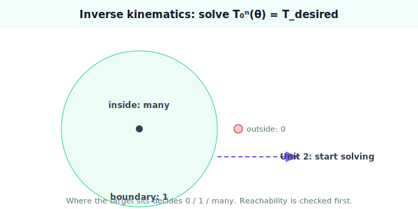

!!! abstract "You are here"
    **Module 5 — Inverse Kinematics**  ·  **Unit 1 — The Inverse Problem**  ·  **Lesson 1.4 — The Inverse Problem (Unit 1 Recap)**

# Lesson 1.4 — The Inverse Problem (Unit 1 Recap)

*A short synthesis — no new mathematics. It consolidates Unit 1 and points to Unit 2, where we begin solving.*

---

## What Unit 1 established

The unit in one line:

> **Inverse kinematics solves $T_0^n(\boldsymbol\theta) = T_{\text{desired}}$ for the joint angles; the equation is nonlinear, has 0, 1, or many solutions, and only for targets inside the reachable workspace.**

## The arc of the unit

| Lesson | Idea |
|---|---|
| 1.1 From Forward to Inverse | FK **evaluates** $T_0^n(\boldsymbol\theta)$; IK **solves** it for $\boldsymbol\theta$. Solving is the harder, robot-critical direction. |
| 1.2 Why It's Hard | The map is nonlinear (angles via sin/cos); a target has **0, 1, or many** solutions; the 2-link "many" case is elbow-up / elbow-down. |
| 1.3 Reachability and the Workspace | The workspace is the image of FK; a target is solvable **iff** it lies inside; for the 2-link arm it is the annulus $|L_1-L_2| \le r \le L_1+L_2$. |

## The one picture to carry forward

A target's fate is decided by *where it is*. Outside the workspace: **no solution** — reject it. On the boundary: **one solution** — the arm is straight or fully folded. Strictly inside: **many** — for the 2-link arm, exactly two, elbow-up and elbow-down. Inverse kinematics is the act of finding those joint angles, and everything in Units 2–8 is a way to find them: by geometry where we can, by iteration where we must, always checking reachability first and verifying the answer afterward.

## Visual Explanation

<figure markdown>
  { width="680" }
</figure>

## Where Unit 2 goes

We stop describing the problem and start solving it — beginning as small as possible. One joint is solvable by inspection (a single `atan2`). The planar two-link arm is the real workhorse: its two solutions are visible, namable (elbow-up / elbow-down), and — in Unit 3 — writable in closed form. From there the difficulty grows on purpose toward arms that need numerical methods (Unit 4 onward).

## Key Takeaways

- IK solves $T_0^n(\boldsymbol\theta) = T_{\text{desired}}$; it is nonlinear with 0/1/many solutions.
- Reachability (workspace membership) decides whether any solution exists — test it first.
- The 2-link annulus and its elbow-up/down pair are the running example for the next units.
- Unit 2 begins solving: one joint by inspection, then the two-link arm.

---

## Coding Exercise

!!! tip "Run the hands-on notebook"
    `modules/module05/notebooks/M05_U01_L1_4_Inverse_Problem_Unit_1_Recap.ipynb` — open in JupyterLab and run **Kernel → Restart & Run All**.

Open the consolidation notebook for Unit 1 and run **Kernel → Restart & Run All**; it re-exercises the unit's key routines end to end and prints `All checks passed.`

## Knowledge Check

Formative — unlimited attempts, immediate feedback; does not affect your grade.

<iframe src="../../quizzes/module05/lesson04_quiz.html" title="The Inverse Problem (Unit 1 Recap) knowledge check" style="width:100%;height:720px;border:1px solid #e2e8f0;border-radius:12px"></iframe>

[Open this quiz in a new tab ↗](../quizzes/module05/lesson04_quiz.html)

A brief consolidation quiz across Unit 1 (formative — unlimited attempts, immediate feedback).

## AI Learning Companion

Copy any prompt below into ChatGPT, Claude, or another AI assistant.

**Tutor prompt** — explain it another way
```
Summarize Unit 1 of Module 5 (Inverse Kinematics): the problem statement T_0^n(θ)=T_desired, nonlinearity, 0/1/many solutions, and the reachable workspace. Use the 2-link annulus as the through-line.
```

**Practice prompt** — generate more exercises
```
Give me 8 mixed questions reviewing forward-vs-inverse, solution counting, and reachability for a planar 2-link arm. Include answers.
```

**Explore prompt** — connect it to the real world
```
Show me how a real robot pipeline uses a reachability gate and a solution-count check before attempting inverse kinematics.
```

## Global Learning Support

Need this lesson explained in another language? Copy one of the prompts below into an AI assistant. English remains the authoritative source.

**Supported languages (initial):** English · Español · 中文 (Simplified Chinese) · Türkçe

**Español**
```
I just completed Lesson 1.4 (Module 5) — The Inverse Problem (Unit 1 Recap).
Explain this unit in Spanish. Keep robotics and mathematical terminology in English when appropriate.
Then provide: a summary, three practice questions, and one challenge problem.
```

**中文 (Simplified Chinese)**
```
I just completed Lesson 1.4 (Module 5) — The Inverse Problem (Unit 1 Recap).
Explain this unit in Simplified Chinese. Keep mathematical notation unchanged.
Then provide: a summary, three practice questions, and one challenge problem.
```

**Türkçe**
```
I just completed Lesson 1.4 (Module 5) — The Inverse Problem (Unit 1 Recap).
Explain this unit in Turkish. Keep robotics terminology in English where commonly used.
Then provide: a summary, three practice questions, and one challenge problem.
```

---

*Next lesson: 2.1 — One Joint: Solve by Inspection.*
