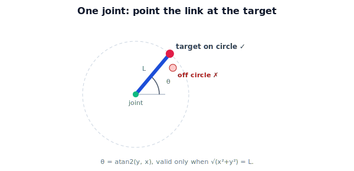

!!! abstract "You are here"
    **Module 5 — Inverse Kinematics**  ·  **Unit 2 — Inverse Kinematics of One and Two Joints**  ·  **Lesson 2.1 — One Joint: Solve by Inspection**

# Lesson 2.1 — One Joint: Solve by Inspection

> We start solving with the smallest arm. One joint's inverse kinematics is a single `atan2` — and it sets up the tools (direction, reachability) we will reuse for the two-link arm.

---

## 1. Why This Matters

The one-joint arm is where inverse kinematics is simple enough to see in full. Solving it introduces `atan2` as the angle-recovery tool, the idea that the joint angle is a *direction*, and the reachability condition in its purest form — all of which carry directly into the harder two-link problem next.

## 2. Physical Intuition

A single pinned link is a clock hand. To put its tip on a target, point the hand *at* the target. There is nothing to choose: the required angle is simply the direction from the pivot to the target. And it only works if the target is exactly a hand's-length away — on the circle the tip sweeps. Too close or too far, and no angle reaches it.

## 3. Mathematical Foundations

Forward (Module 4): the gripper sits at $\mathbf p(\theta) = (L\cos\theta, L\sin\theta)$. Inverse: given target $(x, y)$, find $\theta$. The direction from base to target gives it immediately:

$$\theta = \operatorname{atan2}(y, x).$$

`atan2` returns the angle of the vector $(x, y)$ in the correct quadrant (unlike $\arctan(y/x)$, which loses sign information). This is exact and unique in $[-180°, 180°)$ — **one solution**.

The catch is reachability. The target must lie on the circle of radius $L$:

$$\sqrt{x^2 + y^2} = L.$$

If $\sqrt{x^2+y^2} \neq L$, no joint angle reaches the target — the one-joint workspace is a *curve* (a circle), so almost all targets are unreachable. (A real one-joint arm usually only controls *direction*, not distance; the two-link arm in the next lessons controls both.)

## 4. Visual Explanation

<figure markdown>
  { width="680" }
</figure>

## 5. Engineering Example

The greenhouse arm's base swivel is a one-joint sub-problem: to aim the whole arm toward a fruit's bearing, set the swivel to $\operatorname{atan2}(y, x)$ of the fruit's position in the base plane. The swivel controls *which direction* the arm faces; the remaining joints (next lessons) control *how far out and how high* the gripper reaches. Decomposing a hard arm into a swivel plus a planar arm is a standard real-world tactic (Unit 3 revisits it as decoupling).

## 6. Worked Example

$L = 0.5$. Target $(0, 0.5)$: check $\sqrt{0^2+0.5^2} = 0.5 = L$ ✓ reachable; $\theta = \operatorname{atan2}(0.5, 0) = 90°$. Target $(-0.354, 0.354)$: $\sqrt{0.125+0.125} = 0.5$ ✓; $\theta = \operatorname{atan2}(0.354, -0.354) = 135°$ — note `atan2` gets the second quadrant right, where $\arctan$ would give $-45°$. Target $(0.4, 0.2)$: $\sqrt{0.16+0.04} = \sqrt{0.20} \approx 0.447 \neq 0.5$ ✗ unreachable.

## 7. Interactive Demonstration

<iframe src="../../demos/module05/lesson05_one_joint_by_inspection.html" title="One Joint: Solve by Inspection interactive demo" style="width:100%;height:520px;border:1px solid #e2e8f0;border-radius:12px"></iframe>

[Open this demo in a new tab ↗](../demos/module05/lesson05_one_joint_by_inspection.html)

**Guided prediction.** For $L=0.5$, predict $\theta$ for targets $(0.5,0)$, $(0,0.5)$, $(-0.5,0)$, $(0,-0.5)$ using `atan2`. Then test $(0.3, 0.4)$ — on the circle ($\sqrt{0.25}=0.5$)? — and $(0.3, 0.3)$ — off it? Confirm which are reachable before computing.

## 8. Coding Exercise

!!! tip "Run the hands-on notebook"
    `modules/module05/notebooks/M05_U02_L2_1_One_Joint_By_Inspection.ipynb` — open in JupyterLab and run **Kernel → Restart & Run All**.

Write `ik_one_joint(x, y, L, tol=1e-9)` that returns `atan2(y, x)` if $\sqrt{x^2+y^2}$ is within `tol` of $L$, else `None` (unreachable). Verify against the worked example, and confirm `fk(ik(target)) == target` for reachable targets.

## 9. Knowledge Check

Formative — unlimited attempts, immediate feedback; does not affect your grade.

<iframe src="../../quizzes/module05/lesson05_quiz.html" title="One Joint: Solve by Inspection knowledge check" style="width:100%;height:720px;border:1px solid #e2e8f0;border-radius:12px"></iframe>

[Open this quiz in a new tab ↗](../quizzes/module05/lesson05_quiz.html)

Checks on the `atan2` solution, the on-circle reachability condition, and why `atan2` beats `arctan`.

## 10. Challenge Problem

If the one-joint arm also had a *prismatic* joint that could change $L$ (a telescoping link), how would inverse kinematics change? Show that the target then becomes reachable for any $(x,y)$ (within the link's range) and that you now solve for **two** variables, $\theta$ and $L$.

## 11. Common Mistakes

- Using $\arctan(y/x)$ and getting the quadrant wrong.
- Forgetting the on-circle reachability check and returning an angle for an unreachable target.
- Confusing "one joint controls direction" with "one joint can reach any point."
- Mixing radians and degrees in `atan2`.

## 12. Key Takeaways

- One-joint IK is a single `atan2`: $\theta = \operatorname{atan2}(y, x)$ — one solution.
- It is valid only on the radius-$L$ circle; off-circle targets are unreachable.
- `atan2` recovers the correct quadrant where `arctan` cannot.
- Direction-from-base and reachability are the tools we reuse for the two-link arm.

---

## AI Learning Companion

Copy any prompt below into ChatGPT, Claude, or another AI assistant.

**Tutor prompt** — explain it another way
```
Re-explain Lesson 2.1 (Module 5) — One Joint: Solve by Inspection — using a clock hand pointed at a target. Emphasize θ = atan2(y, x) and the on-circle reachability condition.
```

**Practice prompt** — generate more exercises
```
Give me 6 exercises solving one-joint inverse kinematics with atan2, including reachability checks and at least two second/third-quadrant targets. Include answers.
```

**Explore prompt** — connect it to the real world
```
Show me how a robot's base swivel uses atan2 to aim at a target, and how decomposing into a swivel plus a planar arm simplifies inverse kinematics.
```

## Global Learning Support

Need this lesson explained in another language? Copy one of the prompts below into an AI assistant. English remains the authoritative source.

**Supported languages (initial):** English · Español · 中文 (Simplified Chinese) · Türkçe

**Español**
```
I just completed Lesson 2.1 (Module 5) — One Joint: Solve by Inspection.
Explain this lesson in Spanish. Keep robotics and mathematical terminology in English when appropriate.
Then provide: a summary, three practice questions, and one challenge problem.
```

**中文 (Simplified Chinese)**
```
I just completed Lesson 2.1 (Module 5) — One Joint: Solve by Inspection.
Explain this lesson in Simplified Chinese. Keep mathematical notation unchanged.
Then provide: a summary, three practice questions, and one challenge problem.
```

**Türkçe**
```
I just completed Lesson 2.1 (Module 5) — One Joint: Solve by Inspection.
Explain this lesson in Turkish. Keep robotics terminology in English where commonly used.
Then provide: a summary, three practice questions, and one challenge problem.
```

---

*Next lesson: 2.2 — The Planar Two-Link Arm: Geometry of the Solution.*
