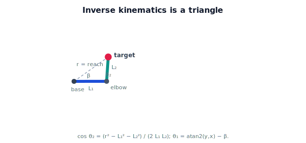

!!! abstract "You are here"
    **Module 5 — Inverse Kinematics**  ·  **Unit 2 — Inverse Kinematics of One and Two Joints**  ·  **Lesson 2.2 — The Planar Two-Link Arm: Geometry of the Solution**

# Lesson 2.2 — The Planar Two-Link Arm: Geometry of the Solution

> The two-link arm is the workhorse of this module. Its inverse kinematics is not algebra-by-grinding — it is a triangle. This lesson builds the geometric picture; Lesson 3.1 turns it into formulas.

---

## 1. Why This Matters

Almost every analytical inverse-kinematics result you will meet rests on seeing the arm as a triangle and applying the law of cosines. The two-link planar arm is the cleanest case: base, elbow, and gripper form a triangle whose sides are the two link lengths and the reach to the target. Get this picture and the closed-form solution (next unit) writes itself.

## 2. Physical Intuition

Hold a two-segment arm — upper arm and forearm — and reach for a point. The shoulder, elbow, and fingertip form a triangle. The two arm segments are fixed in length; only the *reach* (shoulder-to-fingertip distance) changes as you bend. Bend the elbow more and the fingertip pulls in; straighten it and the fingertip pushes out. So the elbow angle is set entirely by *how far away the target is* — a triangle with three known sides has a determined set of corner angles.

## 3. Mathematical Foundations

Links $L_1$ (shoulder→elbow) and $L_2$ (elbow→gripper); target $(x, y)$; reach $r = \sqrt{x^2 + y^2}$. The triangle has sides $L_1, L_2, r$.

**Elbow angle $\theta_2$** (the interior bend) comes from the law of cosines on the side $r$:

$$r^2 = L_1^2 + L_2^2 - 2 L_1 L_2 \cos(180° - \theta_2) = L_1^2 + L_2^2 + 2 L_1 L_2 \cos\theta_2,$$

so

$$\cos\theta_2 = \frac{x^2 + y^2 - L_1^2 - L_2^2}{2 L_1 L_2}.$$

A valid triangle needs $-1 \le \cos\theta_2 \le 1$ — exactly the reachability condition $|L_1-L_2| \le r \le L_1+L_2$ in disguise.

**Shoulder angle $\theta_1$** is the direction to the target, $\operatorname{atan2}(y, x)$, *minus* the angle $\beta$ between the first link and the line to the target (the triangle corner at the base):

$$\theta_1 = \operatorname{atan2}(y, x) - \operatorname{atan2}\big(L_2\sin\theta_2,\; L_1 + L_2\cos\theta_2\big).$$

The two signs available for $\theta_2$ (the elbow bends up or down) give the two solutions — the subject of Lesson 2.3.

## 4. Visual Explanation

<figure markdown>
  { width="680" }
</figure>

## 5. Engineering Example

When the greenhouse arm reaches a tomato, the elbow bend is dictated by the fruit's distance: a fruit at arm's length forces a nearly straight elbow; a close fruit forces a sharp bend. The controller computes $\theta_2$ from the reach via the law of cosines, then orients the whole triangle toward the fruit with $\theta_1$. This split — distance sets the elbow, direction sets the shoulder — is exactly how the closed-form solver is organized.

## 6. Worked Example

$L_1 = 0.4, L_2 = 0.3$, target $(0.5, 0.0)$, so $r = 0.5$. Elbow:

$$\cos\theta_2 = \frac{0.25 - 0.16 - 0.09}{2(0.4)(0.3)} = \frac{0.0}{0.24} = 0,\quad \theta_2 = \pm 90°.$$

A right-angle elbow. Shoulder for $\theta_2 = +90°$:

$$\theta_1 = \operatorname{atan2}(0, 0.5) - \operatorname{atan2}(0.3\cdot 1,\; 0.4 + 0) = 0 - \operatorname{atan2}(0.3, 0.4) = -36.87°.$$

So one solution is $(\theta_1, \theta_2) \approx (-36.87°, 90°)$. The other ($\theta_2 = -90°$) is the mirrored elbow — Lesson 2.3.

## 7. Interactive Demonstration

**Guided prediction.** For $L_1=0.4, L_2=0.3$, predict $\cos\theta_2$ (and thus the bend) for targets at $r = 0.7, 0.5, 0.1$. At $r=0.7$ expect $\cos\theta_2 = 1$ (straight), at $r=0.1$ expect $\cos\theta_2 = -1$ (fully folded), at $r=0.5$ a right angle. Sketch the triangle for each.

## 8. Coding Exercise

!!! tip "Run the hands-on notebook"
    `modules/module05/notebooks/M05_U02_L2_2_Two_Link_Geometry.ipynb` — open in JupyterLab and run **Kernel → Restart & Run All**.

Write `elbow_cosine(x, y, L1, L2)` returning $\cos\theta_2$ from the law of cosines, and flag when it falls outside $[-1, 1]$ (unreachable). Compute it for the three guided-prediction targets and confirm the straight/right-angle/folded readings. Hold off on the full angle extraction — that is Lesson 3.1.

## 9. Knowledge Check

Formative — unlimited attempts, immediate feedback; does not affect your grade.

<iframe src="../../quizzes/module05/lesson06_quiz.html" title="The Planar Two-Link Arm: Geometry of the Solution knowledge check" style="width:100%;height:720px;border:1px solid #e2e8f0;border-radius:12px"></iframe>

[Open this quiz in a new tab ↗](../quizzes/module05/lesson06_quiz.html)

Checks on the triangle picture, the law-of-cosines elbow formula, and the link between $\cos\theta_2 \in [-1,1]$ and reachability.

## 10. Challenge Problem

Show algebraically that $\cos\theta_2 = \dfrac{r^2 - L_1^2 - L_2^2}{2L_1L_2}$ lies in $[-1, 1]$ exactly when $|L_1 - L_2| \le r \le L_1 + L_2$. (Set $\cos\theta_2 = \pm 1$ and solve for $r$.)

## 11. Common Mistakes

- Confusing the elbow's *interior* bend with the *exterior* angle (watch the $180° - \theta_2$ step).
- Forgetting to check $\cos\theta_2 \in [-1, 1]$ before taking an inverse cosine.
- Computing $\theta_1$ as just $\operatorname{atan2}(y,x)$ and forgetting the base-corner correction $\beta$.
- Using $\arctan$ instead of `atan2` for $\theta_1$ or $\beta$.

## 12. Key Takeaways

- The base, elbow, and gripper form a triangle with sides $L_1, L_2, r$.
- The law of cosines gives $\cos\theta_2 = (r^2 - L_1^2 - L_2^2)/(2L_1L_2)$.
- The shoulder angle is the target direction minus the base-corner angle: $\theta_1 = \operatorname{atan2}(y,x) - \beta$.
- $\cos\theta_2 \in [-1,1]$ **is** the reachability condition; the two elbow signs give two solutions.

---

## AI Learning Companion

Copy any prompt below into ChatGPT, Claude, or another AI assistant.

**Tutor prompt** — explain it another way
```
Re-explain Lesson 2.2 (Module 5) — the planar two-link arm — as a triangle (base, elbow, gripper). Derive cos θ2 from the law of cosines and show θ1 = atan2(y,x) − β.
```

**Practice prompt** — generate more exercises
```
Give me 6 exercises computing cos θ2 (law of cosines) for a planar 2-link arm from link lengths and a target, including reachability flags. Include answers.
```

**Explore prompt** — connect it to the real world
```
Show me how the law of cosines underlies analytical inverse kinematics for real 2- and 3-link arms, and why "distance sets the elbow, direction sets the shoulder."
```

## Global Learning Support

Need this lesson explained in another language? Copy one of the prompts below into an AI assistant. English remains the authoritative source.

**Supported languages (initial):** English · Español · 中文 (Simplified Chinese) · Türkçe

**Español**
```
I just completed Lesson 2.2 (Module 5) — The Planar Two-Link Arm: Geometry of the Solution.
Explain this lesson in Spanish. Keep robotics and mathematical terminology in English when appropriate.
Then provide: a summary, three practice questions, and one challenge problem.
```

**中文 (Simplified Chinese)**
```
I just completed Lesson 2.2 (Module 5) — The Planar Two-Link Arm: Geometry of the Solution.
Explain this lesson in Simplified Chinese. Keep mathematical notation unchanged.
Then provide: a summary, three practice questions, and one challenge problem.
```

**Türkçe**
```
I just completed Lesson 2.2 (Module 5) — The Planar Two-Link Arm: Geometry of the Solution.
Explain this lesson in Turkish. Keep robotics terminology in English where commonly used.
Then provide: a summary, three practice questions, and one challenge problem.
```

---

*Next lesson: 2.3 — Elbow-Up and Elbow-Down: the Two Solutions.*
