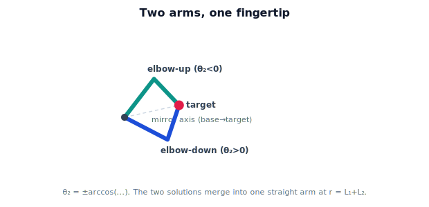

!!! abstract "You are here"
    **Module 5 — Inverse Kinematics**  ·  **Unit 2 — Inverse Kinematics of One and Two Joints**  ·  **Lesson 2.3 — Elbow-Up and Elbow-Down: the Two Solutions**

# Lesson 2.3 — Elbow-Up and Elbow-Down: the Two Solutions

> The two-link arm's signature feature: most reachable targets have exactly two solutions. This lesson makes the pair concrete and shows when the two collapse into one.

---

## 1. Why This Matters

Multiplicity is not a curiosity — it is a decision the robot must make every grasp. Elbow-up and elbow-down place the gripper on the same fruit but with different arm shapes, and only one may clear the surrounding wires and leaves. A solver that finds *both* gives the controller a choice; a solver that finds only one may hand back the colliding pose. So we learn to produce the pair deliberately.

## 2. Physical Intuition

Reach for a point in front of you with your elbow lifted high, then again with your elbow dropped low. Your fingertip lands in the same spot both times; your elbow is in two different places. The forearm and upper arm form a triangle with the target, and that triangle can be flipped across the line from shoulder to target — a mirror image. Both are valid arms reaching the same point. As the target moves to the edge of your reach (arm straight), the two elbow positions slide together until they are the same: one solution.

## 3. Mathematical Foundations

From Lesson 2.2, $\cos\theta_2 = \dfrac{r^2 - L_1^2 - L_2^2}{2L_1L_2}$. Taking the inverse cosine gives **two** elbow angles of opposite sign:

$$\theta_2 = \pm\,\arccos\!\left(\frac{r^2 - L_1^2 - L_2^2}{2L_1L_2}\right).$$

- $\theta_2 > 0$ → **elbow-down** (one bend direction).
- $\theta_2 < 0$ → **elbow-up** (the mirrored bend).

Each elbow sign produces its own shoulder angle through the Lesson 2.2 formula (the base-corner term $\beta$ changes sign with $\theta_2$):

$$\theta_1 = \operatorname{atan2}(y,x) - \operatorname{atan2}\big(L_2\sin\theta_2,\; L_1 + L_2\cos\theta_2\big).$$

At the workspace **boundary** the two merge: at the outer radius $r = L_1+L_2$, $\cos\theta_2 = 1$ so $\theta_2 = 0$ (and $-0$) — a single straight-arm solution; at the inner radius $r = |L_1-L_2|$, $\cos\theta_2 = -1$ so $\theta_2 = 180°$ — a single folded solution. Strictly inside, the $\pm$ are distinct: **two solutions**.

(The labels "up"/"down" follow the bend sign; which one looks visually higher depends on the target's quadrant. The robust statement is "the two solutions are $\theta_2$ and $-\theta_2$.")

## 4. Visual Explanation

<figure markdown>
  { width="680" }
</figure>

## 5. Engineering Example

The greenhouse controller computes both solutions for each fruit and scores them: does this arm shape collide with a trellis wire? does it respect joint limits? is it close to the arm's current pose so the move is short? Elbow-up might thread between two stems where elbow-down would crush a leaf. Having the pair is what makes that choice possible — the selection logic itself is Unit 6.

## 6. Worked Example

$L_1 = 0.4, L_2 = 0.3$, target $(0.5, 0.0)$ (from Lesson 2.2, $\cos\theta_2 = 0$):

- **Elbow-down:** $\theta_2 = +90°$, $\theta_1 = 0 - \operatorname{atan2}(0.3, 0.4) = -36.87°$. Config $(-36.87°, +90°)$.
- **Elbow-up:** $\theta_2 = -90°$, $\theta_1 = 0 - \operatorname{atan2}(-0.3, 0.4) = +36.87°$. Config $(+36.87°, -90°)$.

Both place the gripper at $(0.5, 0)$ — verify by forward kinematics: $0.4\cos\theta_1 + 0.3\cos(\theta_1+\theta_2)$ equals $0.5$ for each. Two arm shapes, one fingertip.

## 7. Interactive Demonstration

<iframe src="../../demos/module05/lesson07_two_solution_explorer.html" title="Elbow-Up and Elbow-Down: the Two Solutions interactive demo" style="width:100%;height:520px;border:1px solid #e2e8f0;border-radius:12px"></iframe>

[Open this demo in a new tab ↗](../demos/module05/lesson07_two_solution_explorer.html)

The embedded **Two-Solution Explorer** lets you drag the target inside the annulus and watch both the elbow-up and elbow-down arms update live. Push the target outward: the two arms swing toward each other and snap into a single straight arm exactly at $r = L_1+L_2$; push past it and both vanish (unreachable). Pull the target inward toward the inner radius to see them merge into the folded configuration. The readout shows $(\theta_1, \theta_2)$ for each solution and the reachability state.

## 8. Coding Exercise

!!! tip "Run the hands-on notebook"
    `modules/module05/notebooks/M05_U02_L2_3_Elbow_Up_Elbow_Down.ipynb` — open in JupyterLab and run **Kernel → Restart & Run All**.

Write `ik_two_link(x, y, L1, L2)` returning **both** solutions as a list of $(\theta_1, \theta_2)$ pairs (empty if unreachable, one entry on the boundary). Use $\theta_2 = \pm\arccos(\cdot)$ and the shoulder formula. Verify each solution with forward kinematics (gripper lands on the target) and confirm the two merge as $r \to L_1+L_2$.

## 9. Knowledge Check

Formative — unlimited attempts, immediate feedback; does not affect your grade.

<iframe src="../../quizzes/module05/lesson07_quiz.html" title="Elbow-Up and Elbow-Down: the Two Solutions knowledge check" style="width:100%;height:720px;border:1px solid #e2e8f0;border-radius:12px"></iframe>

[Open this quiz in a new tab ↗](../quizzes/module05/lesson07_quiz.html)

Checks on why two solutions exist, computing both elbow signs, and the boundary merge.

## 10. Challenge Problem

For a target strictly inside the annulus, the two solutions are distinct. Is there ever a target (other than on the boundary) where elbow-up and elbow-down give the *same* $\theta_1$? Reason about what that would require of $\theta_2$ and why it forces the boundary.

## 11. Common Mistakes

- Returning only one solution (one sign of $\arccos$).
- Reusing the same $\theta_1$ for both elbow signs — $\theta_1$ changes because $\beta$ depends on $\theta_2$.
- Expecting two distinct solutions on the boundary, where they merge.
- Reading "up/down" as absolute screen position rather than the bend sign.

## 12. Key Takeaways

- A reachable interior target has **two** solutions: $\theta_2 = \pm\arccos(\cdot)$ — elbow-up and elbow-down.
- Each elbow sign yields its own shoulder angle; both place the gripper on the target.
- The two solutions **merge into one** at the outer and inner workspace boundaries.
- Producing both is what lets a later stage *choose* the feasible one.

---

## AI Learning Companion

Copy any prompt below into ChatGPT, Claude, or another AI assistant.

**Tutor prompt** — explain it another way
```
Re-explain Lesson 2.3 (Module 5) — elbow-up vs elbow-down — as mirroring the arm triangle across the base-to-target line. Show θ2 = ±arccos(...) and why the two merge at the workspace boundary.
```

**Practice prompt** — generate more exercises
```
Give me 6 exercises computing both two-link solutions (elbow-up and elbow-down) for given link lengths and targets, with forward-kinematics verification. Include answers.
```

**Explore prompt** — connect it to the real world
```
Show me real cases where a robot must pick elbow-up vs elbow-down to avoid collisions or respect joint limits, and what goes wrong if only one solution is computed.
```

## Global Learning Support

Need this lesson explained in another language? Copy one of the prompts below into an AI assistant. English remains the authoritative source.

**Supported languages (initial):** English · Español · 中文 (Simplified Chinese) · Türkçe

**Español**
```
I just completed Lesson 2.3 (Module 5) — Elbow-Up and Elbow-Down: the Two Solutions.
Explain this lesson in Spanish. Keep robotics and mathematical terminology in English when appropriate.
Then provide: a summary, three practice questions, and one challenge problem.
```

**中文 (Simplified Chinese)**
```
I just completed Lesson 2.3 (Module 5) — Elbow-Up and Elbow-Down: the Two Solutions.
Explain this lesson in Simplified Chinese. Keep mathematical notation unchanged.
Then provide: a summary, three practice questions, and one challenge problem.
```

**Türkçe**
```
I just completed Lesson 2.3 (Module 5) — Elbow-Up and Elbow-Down: the Two Solutions.
Explain this lesson in Turkish. Keep robotics terminology in English where commonly used.
Then provide: a summary, three practice questions, and one challenge problem.
```

---

*Next lesson: 2.4 — Inverse Kinematics of One and Two Joints (Unit 2 Recap).*
