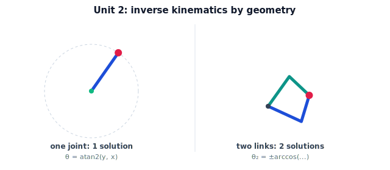

!!! abstract "You are here"
    **Module 5 — Inverse Kinematics**  ·  **Unit 2 — Inverse Kinematics of One and Two Joints**  ·  **Lesson 2.4 — Inverse Kinematics of One and Two Joints (Unit 2 Recap)**

# Lesson 2.4 — Inverse Kinematics of One and Two Joints (Unit 2 Recap)

*A short synthesis — no new mathematics. It consolidates Unit 2 and points to Unit 3, where the geometry becomes closed-form formulas.*

---

## What Unit 2 established

The unit in one line:

> **Inverse kinematics by geometry: one joint is a single `atan2`; the two-link arm is a triangle whose law-of-cosines elbow angle has two signs — elbow-up and elbow-down.**

## The arc of the unit

| Lesson | Idea |
|---|---|
| 2.1 One Joint by Inspection | $\theta = \operatorname{atan2}(y,x)$; valid only on the radius-$L$ circle; one solution. |
| 2.2 Two-Link Geometry | Base–elbow–gripper triangle; $\cos\theta_2 = (r^2 - L_1^2 - L_2^2)/(2L_1L_2)$; $\theta_1 = \operatorname{atan2}(y,x) - \beta$. |
| 2.3 Elbow-Up / Elbow-Down | $\theta_2 = \pm\arccos(\cdot)$ → two solutions; they merge into one at the workspace boundary. |

## The one picture to carry forward

Inverse kinematics, at least for these small arms, is **trigonometry on a triangle**. The reach $r$ to the target sets the elbow bend through the law of cosines; the direction to the target sets the shoulder. The $\pm$ on the elbow angle is the entire source of the two-solution structure — and it dissolves exactly at the workspace boundary, recovering the 0/1/many picture from Unit 1. Everything was geometry; no iteration was needed.

## Visual Explanation

<figure markdown>
  { width="680" }
</figure>

## Where Unit 3 goes

Unit 3 turns this geometry into clean, reusable **closed-form** formulas: the full 2-link solution written out, the discipline of `atan2` for picking the right quadrant every time, and the concept of **decoupling** position from orientation for wrist-partitioned arms — the bridge from "solve a triangle" to "solve a real robot analytically." Then Unit 4 asks what to do when no such clean formula exists.

## Key Takeaways

- One-joint IK is a single `atan2`; two-link IK is a triangle with two solutions.
- The law of cosines gives the elbow; `atan2` gives the shoulder direction.
- The $\pm$ elbow sign is the source of elbow-up/down; it merges at the boundary.
- Unit 3 formalizes this as closed-form formulas and adds orientation decoupling.

---

## Interactive Demonstration

<iframe src="../../demos/module05/lesson08_ik_one_two_joints_recap.html" title="Inverse Kinematics of One and Two Joints (Unit 2 Recap) interactive demo" style="width:100%;height:520px;border:1px solid #e2e8f0;border-radius:12px"></iframe>

[Open this demo in a new tab ↗](../demos/module05/lesson08_ik_one_two_joints_recap.html)

Unit 2 in one tool: move a target and watch the two-step geometric solution — law of cosines for the bend, atan2 for the shoulder.

## Coding Exercise

!!! tip "Run the hands-on notebook"
    `modules/module05/notebooks/M05_U02_L2_4_One_Two_Joint_Unit_2_Recap.ipynb` — open in JupyterLab and run **Kernel → Restart & Run All**.

Open the consolidation notebook for Unit 2 and run **Kernel → Restart & Run All**; it re-exercises the unit's key routines end to end and prints `All checks passed.`

## Knowledge Check

Formative — unlimited attempts, immediate feedback; does not affect your grade.

<iframe src="../../quizzes/module05/lesson08_quiz.html" title="Inverse Kinematics of One and Two Joints (Unit 2 Recap) knowledge check" style="width:100%;height:720px;border:1px solid #e2e8f0;border-radius:12px"></iframe>

[Open this quiz in a new tab ↗](../quizzes/module05/lesson08_quiz.html)

A brief consolidation quiz across Unit 2 (formative — unlimited attempts, immediate feedback).

## AI Learning Companion

Copy any prompt below into ChatGPT, Claude, or another AI assistant.

**Tutor prompt** — explain it another way
```
Summarize Unit 2 of Module 5 (Inverse Kinematics): one-joint atan2, the two-link triangle, law of cosines for the elbow, and the elbow-up/down pair. Tie it back to the Unit 1 0/1/many picture.
```

**Practice prompt** — generate more exercises
```
Give me 8 mixed exercises across one-joint and two-link inverse kinematics: atan2 solutions, law-of-cosines elbow angles, both solutions, and reachability. Include answers.
```

**Explore prompt** — connect it to the real world
```
Show me how analytical 2-link inverse kinematics is used in real planar robots and SCARA-style arms, and where the triangle method stops being enough.
```

## Global Learning Support

Need this lesson explained in another language? Copy one of the prompts below into an AI assistant. English remains the authoritative source.

**Supported languages (initial):** English · Español · 中文 (Simplified Chinese) · Türkçe

**Español**
```
I just completed Lesson 2.4 (Module 5) — Inverse Kinematics of One and Two Joints (Unit 2 Recap).
Explain this unit in Spanish. Keep robotics and mathematical terminology in English when appropriate.
Then provide: a summary, three practice questions, and one challenge problem.
```

**中文 (Simplified Chinese)**
```
I just completed Lesson 2.4 (Module 5) — Inverse Kinematics of One and Two Joints (Unit 2 Recap).
Explain this unit in Simplified Chinese. Keep mathematical notation unchanged.
Then provide: a summary, three practice questions, and one challenge problem.
```

**Türkçe**
```
I just completed Lesson 2.4 (Module 5) — Inverse Kinematics of One and Two Joints (Unit 2 Recap).
Explain this unit in Turkish. Keep robotics terminology in English where commonly used.
Then provide: a summary, three practice questions, and one challenge problem.
```

---

*Next lesson: 3.1 — Closed-Form Solution of the 2-Link Arm.*
