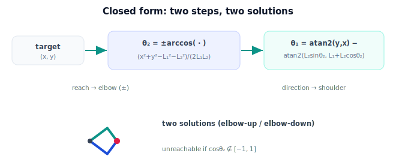

!!! abstract "You are here"
    **Module 5 — Inverse Kinematics**  ·  **Unit 3 — Analytical (Closed-Form) Inverse Kinematics**  ·  **Lesson 3.1 — Closed-Form Solution of the 2-Link Arm**

# Lesson 3.1 — Closed-Form Solution of the 2-Link Arm

> Unit 2 found the solution by reasoning about a triangle. Now we write it down as formulas — an explicit, reusable closed form that returns both solutions directly.

---

## 1. Why This Matters

A closed-form solution is the gold standard of inverse kinematics: given a target, you evaluate a few trig expressions and the joint angles fall out — exactly, instantly, and with *all* solutions enumerated. No guessing, no iteration, no convergence worries. For the planar 2-link arm we can write this form completely, and it becomes the reference every later (numerical) method is checked against.

## 2. Physical Intuition

We already have the picture: distance to the target sets the elbow bend, direction to the target sets the shoulder. Writing the closed form is just committing that picture to two equations — one for $\theta_2$ from the reach, one for $\theta_1$ from the direction — and remembering that the elbow can bend two ways. Nothing new physically; we are turning the geometry into a formula a computer can evaluate.

## 3. Mathematical Foundations

Target $(x, y)$, links $L_1, L_2$, reach $r = \sqrt{x^2+y^2}$.

**Step 1 — elbow angle.** From the law of cosines (Lesson 2.2):

$$\cos\theta_2 = \frac{x^2 + y^2 - L_1^2 - L_2^2}{2 L_1 L_2}, \qquad \theta_2 = \pm\arccos(\cos\theta_2).$$

The two signs are the two solutions. A numerically robust equivalent uses `atan2` with $\sin\theta_2 = \pm\sqrt{1 - \cos^2\theta_2}$:

$$\theta_2 = \operatorname{atan2}\!\big(\pm\sqrt{1-\cos^2\theta_2},\ \cos\theta_2\big).$$

**Step 2 — shoulder angle.** With $\theta_2$ chosen,

$$\theta_1 = \operatorname{atan2}(y, x) - \operatorname{atan2}\big(L_2\sin\theta_2,\ L_1 + L_2\cos\theta_2\big).$$

That is the entire closed form:

$$\boxed{\;\theta_2 = \pm\arccos\!\frac{x^2+y^2-L_1^2-L_2^2}{2L_1L_2}, \qquad \theta_1 = \operatorname{atan2}(y,x) - \operatorname{atan2}(L_2\sin\theta_2,\ L_1+L_2\cos\theta_2)\;}$$

Reachability is built in: if $\cos\theta_2 \notin [-1, 1]$, the target is unreachable and there is no solution. Choosing $+$ gives one elbow configuration, $-$ gives the other; on the boundary they coincide.

## 4. Visual Explanation

<figure markdown>
  { width="680" }
</figure>

## 5. Engineering Example

The greenhouse arm's planar reaching stage uses exactly this closed form: per fruit, it evaluates the two formulas, gets elbow-up and elbow-down in microseconds, and passes both to the selection stage. Because it is closed-form, there is no risk of a solver failing to converge mid-harvest — the only failure mode is genuine unreachability, which the $\cos\theta_2$ range check catches up front.

## 6. Worked Example

$L_1 = 0.4, L_2 = 0.3$, target $(0.6, 0.0)$, $r = 0.6$.

$$\cos\theta_2 = \frac{0.36 - 0.16 - 0.09}{2(0.4)(0.3)} = \frac{0.11}{0.24} = 0.4583,\quad \theta_2 = \pm 62.72°.$$

For $\theta_2 = +62.72°$: $\theta_1 = \operatorname{atan2}(0, 0.6) - \operatorname{atan2}(0.3\sin62.72°,\ 0.4 + 0.3\cos62.72°) = 0 - \operatorname{atan2}(0.2666, 0.5375) = -26.39°$. So $(\theta_1, \theta_2) \approx (-26.39°, 62.72°)$. The elbow-up solution is $(+26.39°, -62.72°)$. Forward kinematics on either returns $(0.6, 0)$ — the formulas are correct.

## 7. Interactive Demonstration

**Guided prediction.** Reuse the Lesson 2.3 Two-Solution Explorer: drag to $(0.6, 0)$ and read off the two $(\theta_1, \theta_2)$ pairs — confirm they match the worked example. Then drag to $(0.7, 0)$ (boundary) and watch the formula's $\pm$ collapse to a single solution as $\cos\theta_2 \to 1$.

## 8. Coding Exercise

!!! tip "Run the hands-on notebook"
    `modules/module05/notebooks/M05_U03_L3_1_Closed_Form_2Link.ipynb` — open in JupyterLab and run **Kernel → Restart & Run All**.

Implement `ik_2link_closed(x, y, L1, L2)` returning a list of $(\theta_1, \theta_2)$ pairs using the boxed formulas: empty if $\cos\theta_2 \notin [-1,1]$, two solutions inside, one on the boundary. Verify each with `fk_two_link` and confirm both worked-example solutions.

## 9. Knowledge Check

Formative — unlimited attempts, immediate feedback; does not affect your grade.

<iframe src="../../quizzes/module05/lesson09_quiz.html" title="Closed-Form Solution of the 2-Link Arm knowledge check" style="width:100%;height:720px;border:1px solid #e2e8f0;border-radius:12px"></iframe>

[Open this quiz in a new tab ↗](../quizzes/module05/lesson09_quiz.html)

Checks on the two-step formula, the role of the $\pm$, and the built-in reachability test.

## 10. Challenge Problem

Rewrite the elbow step using `atan2` with $\sin\theta_2 = \pm\sqrt{1-\cos^2\theta_2}$ instead of $\pm\arccos$. Why is the `atan2` form often preferred numerically near $\cos\theta_2 = \pm 1$ (the boundary), where `arccos` loses precision?

## 11. Common Mistakes

- Returning only the $+$ solution and silently dropping elbow-up.
- Forgetting the $\cos\theta_2 \in [-1,1]$ guard, so `arccos` errors on unreachable targets.
- Computing $\theta_1$ without the $\operatorname{atan2}(L_2\sin\theta_2, L_1+L_2\cos\theta_2)$ correction term.
- Reusing one $\theta_1$ for both elbow signs.

## 12. Key Takeaways

- The planar 2-link arm has an explicit closed-form inverse: $\theta_2$ from the law of cosines ($\pm$), then $\theta_1$ from two `atan2` terms.
- The $\pm$ enumerates both solutions; the $\cos\theta_2$ range is the reachability test.
- Closed form is exact and instantaneous — the reference the numerical methods are checked against.
- Always verify with forward kinematics.

---

## AI Learning Companion

Copy any prompt below into ChatGPT, Claude, or another AI assistant.

**Tutor prompt** — explain it another way
```
Re-explain Lesson 3.1 (Module 5) — the closed-form 2-link inverse kinematics. Walk through θ2 = ±arccos(...) then θ1 = atan2(y,x) − atan2(L2 sinθ2, L1+L2 cosθ2), and show both solutions for a sample target.
```

**Practice prompt** — generate more exercises
```
Give me 6 exercises computing both closed-form 2-link solutions from link lengths and a target, each verified by forward kinematics. Include answers.
```

**Explore prompt** — connect it to the real world
```
Show me where closed-form inverse kinematics is used in real robots (planar arms, SCARA) and why it is preferred over numerical methods when available.
```

## Global Learning Support

Need this lesson explained in another language? Copy one of the prompts below into an AI assistant. English remains the authoritative source.

**Supported languages (initial):** English · Español · 中文 (Simplified Chinese) · Türkçe

**Español**
```
I just completed Lesson 3.1 (Module 5) — Closed-Form Solution of the 2-Link Arm.
Explain this lesson in Spanish. Keep robotics and mathematical terminology in English when appropriate.
Then provide: a summary, three practice questions, and one challenge problem.
```

**中文 (Simplified Chinese)**
```
I just completed Lesson 3.1 (Module 5) — Closed-Form Solution of the 2-Link Arm.
Explain this lesson in Simplified Chinese. Keep mathematical notation unchanged.
Then provide: a summary, three practice questions, and one challenge problem.
```

**Türkçe**
```
I just completed Lesson 3.1 (Module 5) — Closed-Form Solution of the 2-Link Arm.
Explain this lesson in Turkish. Keep robotics terminology in English where commonly used.
Then provide: a summary, three practice questions, and one challenge problem.
```

---

*Next lesson: 3.2 — The atan2 Tool and Choosing the Right Quadrant.*
