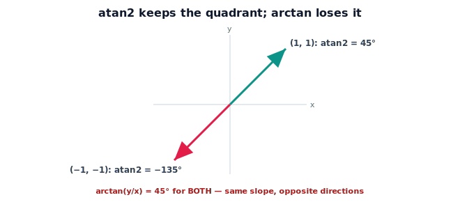

!!! abstract "You are here"
    **Module 5 — Inverse Kinematics**  ·  **Unit 3 — Analytical (Closed-Form) Inverse Kinematics**  ·  **Lesson 3.2 — The atan2 Tool and Choosing the Right Quadrant**

# Lesson 3.2 — The atan2 Tool and Choosing the Right Quadrant

> `atan2` has appeared in every solution so far. This lesson makes it explicit: why it exists, what it fixes, and how to use it so closed-form inverse kinematics is correct in all four quadrants.

---

## 1. Why This Matters

Every analytical inverse-kinematics formula ends in an angle extraction, and almost all of them use `atan2`. The reason is not stylistic: `arctan(y/x)` throws away information that `atan2(y, x)` keeps. Getting this right is the difference between a solver that works everywhere and one that silently flips arms into the wrong half-plane. Since the rest of the module builds on closed-form pieces, mastering `atan2` now prevents a whole class of bugs later.

## 2. Physical Intuition

Point at something and describe the direction by a single number — its angle from "east." A direction needs the *full* turn, $0$ to $360°$ (or $-180°$ to $180°$): "up-left" and "down-right" are opposite, yet their slopes $y/x$ are identical. A tool that sees only the slope cannot tell them apart. `atan2` looks at the *signs* of $x$ and $y$ separately, so it always knows which quadrant you are pointing into — exactly what a robot needs to aim a joint.

## 3. Mathematical Foundations

`arctan(y/x)` returns a value in $(-90°, 90°)$ — only the right half-plane — and divides away the individual signs of $x$ and $y$. So $(x,y) = (1,1)$ and $(-1,-1)$ both give $\arctan(1) = 45°$, though they point $180°$ apart.

`atan2(y, x)` takes the two components separately and returns the angle of the vector $(x, y)$ in the full range $(-180°, 180°]$, using the signs to place the quadrant:

$$\operatorname{atan2}(y, x) = \text{angle of the vector } (x, y), \quad \text{quadrant-correct}.$$

Special cases it handles cleanly: $x = 0$ (straight up/down, where $y/x$ is undefined), and the sign of zero. In inverse kinematics this matters at two spots we have already used:

- **Shoulder direction:** $\operatorname{atan2}(y, x)$ — the bearing to the target, valid in all quadrants.
- **Base-corner term:** $\operatorname{atan2}(L_2\sin\theta_2,\ L_1 + L_2\cos\theta_2)$ — keeps the correct sign as $\theta_2$ flips between elbow-up and elbow-down.

Rule of thumb: whenever you would write $\arctan(\text{something}/\text{something})$ to get an angle from two real quantities, write `atan2(numerator, denominator)` instead and keep them separate.

## 4. Visual Explanation

<figure markdown>
  { width="680" }
</figure>

## 5. Engineering Example

When the greenhouse arm reaches a fruit behind its base (negative $x$), the bearing is in the second or third quadrant. `atan2` returns the true direction so the shoulder swings the right way; `arctan` would point the arm $180°$ wrong, into empty air on the opposite side. Every time the arm services the rear of its workspace, `atan2` is what keeps it aimed correctly.

## 6. Worked Example

Compute the bearing to four targets with `atan2(y, x)`:

- $(0.5, 0.5)$: $45°$.
- $(-0.5, 0.5)$: $135°$ (second quadrant — `arctan` would give $-45°$).
- $(-0.5, -0.5)$: $-135°$ (third quadrant — `arctan` would give $45°$).
- $(0, 0.5)$: $90°$ (straight up — `arctan(0.5/0)` is undefined).

Only the last two would be wrong or undefined with `arctan`; `atan2` handles all four.

## 7. Interactive Demonstration

<iframe src="../../demos/module05/lesson10_atan2_and_quadrant.html" title="The atan2 Tool and Choosing the Right Quadrant interactive demo" style="width:100%;height:520px;border:1px solid #e2e8f0;border-radius:12px"></iframe>

[Open this demo in a new tab ↗](../demos/module05/lesson10_atan2_and_quadrant.html)

**Guided prediction.** For each of the four worked-example targets, predict `atan2(y,x)` and what `arctan(y/x)` would (wrongly) give. Then take the closed-form 2-link solution for a target at $(-0.4, 0.2)$ (behind-and-above the base) and confirm the shoulder angle lands in the correct quadrant only because `atan2` was used.

## 8. Coding Exercise

!!! tip "Run the hands-on notebook"
    `modules/module05/notebooks/M05_U03_L3_2_Atan2_Quadrants.ipynb` — open in JupyterLab and run **Kernel → Restart & Run All**.

Write `bearing(x, y)` two ways — once with `np.arctan` and once with `np.arctan2` — and tabulate both for the four worked-example targets (and a couple behind the base). Show where they disagree, and that the `arctan2` column matches the true direction. Confirm `ik_2link_closed` from Lesson 3.1 returns correct angles for behind-the-base targets.

## 9. Knowledge Check

Formative — unlimited attempts, immediate feedback; does not affect your grade.

<iframe src="../../quizzes/module05/lesson10_quiz.html" title="The atan2 Tool and Choosing the Right Quadrant knowledge check" style="width:100%;height:720px;border:1px solid #e2e8f0;border-radius:12px"></iframe>

[Open this quiz in a new tab ↗](../quizzes/module05/lesson10_quiz.html)

Checks on why `atan2` beats `arctan`, quadrant placement, and the undefined-`arctan` case at $x=0$.

## 10. Challenge Problem

The angle between two vectors $\mathbf a, \mathbf b$ can be found with `acos((a·b)/(|a||b|))` or with `atan2(|a×b|, a·b)`. Explain why the `atan2` version is more accurate for very small and very large angles, connecting it to the precision argument from Lesson 3.1's challenge.

## 11. Common Mistakes

- Writing `atan2(x, y)` instead of `atan2(y, x)` (argument order is y-first).
- Falling back to `arctan(y/x)` and losing the quadrant for behind-the-base targets.
- Dividing first (`atan2(y/x, 1)`) and reintroducing the $x=0$ singularity.
- Mixing degrees and radians around the call.

## 12. Key Takeaways

- `atan2(y, x)` returns a quadrant-correct angle in $(-180°, 180°]$; `arctan(y/x)` only covers the right half-plane and loses signs.
- It is the workhorse of analytical IK: shoulder bearing and the base-corner term both rely on it.
- Replace any "angle from two quantities" with `atan2(numerator, denominator)`, kept separate.
- This is what makes closed-form solutions correct for targets anywhere around the arm.

---

## AI Learning Companion

Copy any prompt below into ChatGPT, Claude, or another AI assistant.

**Tutor prompt** — explain it another way
```
Re-explain Lesson 3.2 (Module 5) — atan2 vs arctan — using the four quadrants and two opposite vectors with the same slope. Show why robotics inverse kinematics always uses atan2(y, x).
```

**Practice prompt** — generate more exercises
```
Give me 8 exercises computing atan2(y, x) for targets in all four quadrants (and on the axes), each contrasted with what arctan(y/x) would give. Include answers.
```

**Explore prompt** — connect it to the real world
```
Show me concrete robotics failures caused by using arctan instead of atan2, and how atan2 fixes behind-the-base reaching.
```

## Global Learning Support

Need this lesson explained in another language? Copy one of the prompts below into an AI assistant. English remains the authoritative source.

**Supported languages (initial):** English · Español · 中文 (Simplified Chinese) · Türkçe

**Español**
```
I just completed Lesson 3.2 (Module 5) — The atan2 Tool and Choosing the Right Quadrant.
Explain this lesson in Spanish. Keep robotics and mathematical terminology in English when appropriate.
Then provide: a summary, three practice questions, and one challenge problem.
```

**中文 (Simplified Chinese)**
```
I just completed Lesson 3.2 (Module 5) — The atan2 Tool and Choosing the Right Quadrant.
Explain this lesson in Simplified Chinese. Keep mathematical notation unchanged.
Then provide: a summary, three practice questions, and one challenge problem.
```

**Türkçe**
```
I just completed Lesson 3.2 (Module 5) — The atan2 Tool and Choosing the Right Quadrant.
Explain this lesson in Turkish. Keep robotics terminology in English where commonly used.
Then provide: a summary, three practice questions, and one challenge problem.
```

---

*Next lesson: 3.3 — Decoupling Position and Orientation (Wrist-Partitioned Arms).*
