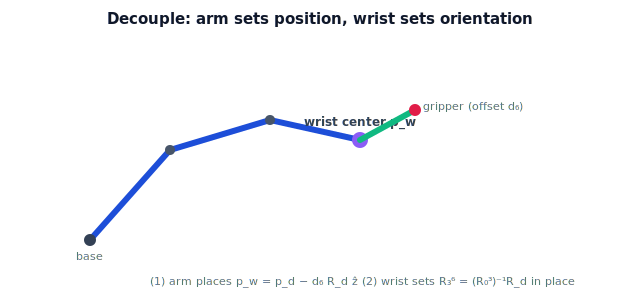

!!! abstract "You are here"
    **Module 5 — Inverse Kinematics**  ·  **Unit 3 — Analytical (Closed-Form) Inverse Kinematics**  ·  **Lesson 3.3 — Decoupling Position and Orientation (Wrist-Partitioned Arms)**

# Lesson 3.3 — Decoupling Position and Orientation (Wrist-Partitioned Arms)

> Real arms have six joints, not two. This lesson shows — at concept level — the trick that keeps them closed-form solvable: split the problem into position (the arm) and orientation (the wrist).

---

## 1. Why This Matters

A general 6-DOF arm has six coupled nonlinear equations, and there is no closed form for an *arbitrary* such arm. Yet most industrial arms *do* have closed-form inverse kinematics. The reason is design: they are built with a **spherical wrist** so the position and orientation problems separate. Understanding this decoupling explains why the 2-link method scales to real robots — and where the boundary to numerical methods (Unit 4) actually lies. We treat this conceptually; the full 6-DOF algebra is beyond Module 5's scope.

## 2. Physical Intuition

Think of your own arm. Your shoulder and elbow mostly decide *where* your wrist is; your wrist then decides *which way* your hand points without moving the wrist's location much. If a robot's last three joint axes all cross at a single point — a spherical wrist — then those three joints rotate the gripper *in place*, changing orientation but not the wrist's position. So you can solve "where must the wrist be?" first using only the arm, then "how must the wrist turn?" using only the wrist. Two small problems instead of one big tangled one.

## 3. Mathematical Foundations

For a full-pose target $T_{\text{desired}} = \begin{bmatrix} R_d & \mathbf p_d \\ \mathbf 0 & 1\end{bmatrix}$ and an arm with a **spherical wrist** (last three axes intersecting at the wrist center $\mathbf p_w$):

**Step 1 — position (the arm).** The wrist center is a fixed offset $d_6$ back from the gripper along the gripper's approach axis:

$$\mathbf p_w = \mathbf p_d - d_6\, R_d\, \hat{\mathbf z}.$$

Because the wrist joints don't move $\mathbf p_w$, the first three joints alone must place the wrist center there — a *position-only* inverse-kinematics problem (the kind we already solve for the 2-link arm, extended to 3D).

**Step 2 — orientation (the wrist).** With the first three joints known, their rotation $R_0^3$ is fixed. The wrist joints must supply the rest of the orientation:

$$R_3^6 = (R_0^3)^{-1} R_d,$$

and the three wrist angles are read out of $R_3^6$ (a rotation-matrix-to-angles step, all `atan2`).

So a 6-DOF problem becomes a 3-DOF position problem **then** a 3-DOF orientation problem — each small enough to solve in closed form. This decoupling is *why* closed-form 6-DOF inverse kinematics exists. Without a spherical wrist (general geometry), it generally does not, and we turn to numerical methods (Unit 4).

## 4. Visual Explanation

<figure markdown>
  { width="680" }
</figure>

## 5. Engineering Example

A greenhouse arm with a 3-DOF positioning section and a wrist can aim the gripper to approach a tomato from the side (to avoid the stem) while the positioning joints place the wrist where the side-approach requires. The controller solves the wrist-center placement with the position method, then sets the wrist angles for the chosen approach orientation — exactly the decoupled pipeline. The capstone arm (Unit 8) keeps this simple by focusing on position, but the decoupling idea is what would extend it to full grasp orientation.

## 6. Worked Example

Suppose a target gripper position is $\mathbf p_d = (0.50, 0.20, 0.30)$ with approach axis $R_d\hat{\mathbf z} = (0, 0, 1)$ (pointing straight up) and wrist offset $d_6 = 0.1$. The wrist center is

$$\mathbf p_w = (0.50, 0.20, 0.30) - 0.1\,(0,0,1) = (0.50, 0.20, 0.20).$$

The arm joints solve to place the wrist at $(0.50, 0.20, 0.20)$ (a position-only problem); then the wrist joints supply whatever rotation makes the final approach axis point up. Position first, orientation second — decoupled.

## 7. Interactive Demonstration

**Guided prediction.** Given a gripper pose and a wrist offset $d_6$, predict the wrist center $\mathbf p_w = \mathbf p_d - d_6 R_d\hat{\mathbf z}$ for approach axes pointing up, forward, and sideways. Notice the wrist center moves with the *approach direction*, not just the position — that coupling is exactly what Step 1 must account for before the arm sub-problem becomes pure position.

## 8. Coding Exercise

!!! tip "Run the hands-on notebook"
    `modules/module05/notebooks/M05_U03_L3_3_Decoupling_Position_Orientation.ipynb` — open in JupyterLab and run **Kernel → Restart & Run All**.

Write `wrist_center(p_d, R_d, d6)` returning $\mathbf p_d - d_6 R_d[:,2]$ (the third column of $R_d$ is the approach axis). Test it on the worked example and on a sideways approach. Then, given a hypothetical $R_0^3$, compute $R_3^6 = (R_0^3)^{-1}R_d$ and confirm it is a valid rotation ($R^\top R = I$). (No full 6-DOF solve — just the decoupling steps.)

## 9. Knowledge Check

Formative — unlimited attempts, immediate feedback; does not affect your grade.

<iframe src="../../quizzes/module05/lesson11_quiz.html" title="Decoupling Position and Orientation (Wrist-Partitioned Arms) knowledge check" style="width:100%;height:720px;border:1px solid #e2e8f0;border-radius:12px"></iframe>

[Open this quiz in a new tab ↗](../quizzes/module05/lesson11_quiz.html)

Checks on the decoupling idea, the spherical-wrist condition, and the wrist-center formula.

## 10. Challenge Problem

If the last three axes do **not** intersect at a point (no spherical wrist), explain why Step 1 fails — i.e., why the wrist joints would then move the wrist center, re-coupling position and orientation. What does this imply about needing numerical methods for such arms?

## 11. Common Mistakes

- Thinking decoupling works for *any* arm — it requires a spherical (or otherwise partitioned) wrist.
- Forgetting that the wrist center depends on the target *orientation* (through $R_d\hat{\mathbf z}$), not position alone.
- Solving orientation before position.
- Treating this lesson as full 6-DOF algebra — it is the concept and the two key formulas only.

## 12. Key Takeaways

- A spherical wrist lets you **decouple**: solve position (wrist center) with the arm, then orientation with the wrist.
- Wrist center: $\mathbf p_w = \mathbf p_d - d_6 R_d\hat{\mathbf z}$; wrist orientation: $R_3^6 = (R_0^3)^{-1}R_d$.
- Decoupling is *why* closed-form 6-DOF inverse kinematics exists; without it, numerical methods (Unit 4) are usually needed.
- We treat this at concept level; the running 2-link/3-DOF examples stay position-focused.

---

## AI Learning Companion

Copy any prompt below into ChatGPT, Claude, or another AI assistant.

**Tutor prompt** — explain it another way
```
Re-explain Lesson 3.3 (Module 5) — decoupling position and orientation — using a spherical wrist and the wrist center. Show pw = pd − d6 Rd ẑ and R3_6 = (R0_3)⁻¹ Rd at concept level.
```

**Practice prompt** — generate more exercises
```
Give me 5 exercises computing the wrist center from a gripper pose and offset d6, for different approach directions. Include answers and a note on why orientation affects the wrist center.
```

**Explore prompt** — connect it to the real world
```
Show me which industrial robot arms use a spherical wrist for closed-form inverse kinematics, and what changes when an arm lacks one.
```

## Global Learning Support

Need this lesson explained in another language? Copy one of the prompts below into an AI assistant. English remains the authoritative source.

**Supported languages (initial):** English · Español · 中文 (Simplified Chinese) · Türkçe

**Español**
```
I just completed Lesson 3.3 (Module 5) — Decoupling Position and Orientation (Wrist-Partitioned Arms).
Explain this lesson in Spanish. Keep robotics and mathematical terminology in English when appropriate.
Then provide: a summary, three practice questions, and one challenge problem.
```

**中文 (Simplified Chinese)**
```
I just completed Lesson 3.3 (Module 5) — Decoupling Position and Orientation (Wrist-Partitioned Arms).
Explain this lesson in Simplified Chinese. Keep mathematical notation unchanged.
Then provide: a summary, three practice questions, and one challenge problem.
```

**Türkçe**
```
I just completed Lesson 3.3 (Module 5) — Decoupling Position and Orientation (Wrist-Partitioned Arms).
Explain this lesson in Turkish. Keep robotics terminology in English where commonly used.
Then provide: a summary, three practice questions, and one challenge problem.
```

---

*Next lesson: 3.4 — Analytical Inverse Kinematics (Unit 3 Recap).*
