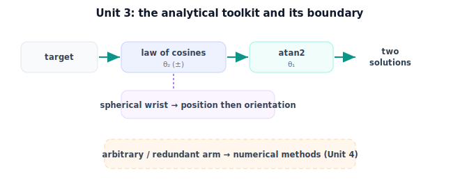

!!! abstract "You are here"
    **Module 5 — Inverse Kinematics**  ·  **Unit 3 — Analytical (Closed-Form) Inverse Kinematics**  ·  **Lesson 3.4 — Analytical Inverse Kinematics (Unit 3 Recap)**

# Lesson 3.4 — Analytical Inverse Kinematics (Unit 3 Recap)

*A short synthesis — no new mathematics. It consolidates Unit 3 and points to Unit 4, where closed form runs out.*

---

## What Unit 3 established

The unit in one line:

> **Analytical inverse kinematics writes the joint angles directly: the 2-link closed form ($\theta_2$ by law of cosines, $\theta_1$ by `atan2`), the `atan2` discipline that makes it quadrant-correct, and the wrist decoupling that extends closed form to real 6-DOF arms.**

## The arc of the unit

| Lesson | Idea |
|---|---|
| 3.1 Closed-Form 2-Link | $\theta_2 = \pm\arccos(\cdot)$, then $\theta_1 = \operatorname{atan2}(y,x) - \operatorname{atan2}(L_2\sin\theta_2, L_1+L_2\cos\theta_2)$ — both solutions, exact. |
| 3.2 atan2 & Quadrants | `atan2(y,x)` keeps the quadrant from the two signs; `arctan(y/x)` loses it. The workhorse of analytical IK. |
| 3.3 Decoupling | A spherical wrist splits the problem: arm sets the wrist center (position), wrist sets orientation — why closed-form 6-DOF exists. |

## The one picture to carry forward

Closed-form inverse kinematics is **possible when the arm's structure lets you separate the problem into pieces small enough to solve with trigonometry** — a planar arm directly, a 6-DOF arm via a spherical wrist that decouples position from orientation. The tools are always the same: the law of cosines to turn a distance into an angle, and `atan2` to turn two components into a quadrant-correct direction. When the structure does *not* allow this separation — arbitrary geometry, redundant joints — there is no closed form, and that is precisely where Unit 4 begins.

## Visual Explanation

<figure markdown>
  { width="680" }
</figure>

## Where Unit 4 goes

Unit 4 — **From Geometry to Numerical IK** (and the module midpoint) — confronts the cases analytical methods cannot reach: general arms with no clean trig, redundant arms with infinitely many solutions. It introduces the **FK Jacobian** strictly as the *local linear map* that tells us how the gripper moves when the joints move a little, and uses it to drive an iterative **guess → measure error → step** loop. (Its velocity meaning, singularity theory, and the rest are Module 6.) The midpoint checkpoint sits right here, confirming the closed-form half before the iterative half.

## Key Takeaways

- The 2-link closed form, `atan2` discipline, and wrist decoupling are the analytical toolkit.
- Closed form is possible when the arm's structure separates into trig-solvable pieces.
- `atan2` and the law of cosines are the two recurring tools.
- Unit 4 starts where closed form ends: numerical methods via the FK Jacobian, plus the midpoint.

---

## Coding Exercise

!!! tip "Run the hands-on notebook"
    `modules/module05/notebooks/M05_U03_L3_4_Analytical_IK_Unit_3_Recap.ipynb` — open in JupyterLab and run **Kernel → Restart & Run All**.

Open the consolidation notebook for Unit 3 and run **Kernel → Restart & Run All**; it re-exercises the unit's key routines end to end and prints `All checks passed.`

## Knowledge Check

Formative — unlimited attempts, immediate feedback; does not affect your grade.

<iframe src="../../quizzes/module05/lesson12_quiz.html" title="Analytical Inverse Kinematics (Unit 3 Recap) knowledge check" style="width:100%;height:720px;border:1px solid #e2e8f0;border-radius:12px"></iframe>

[Open this quiz in a new tab ↗](../quizzes/module05/lesson12_quiz.html)

A brief consolidation quiz across Unit 3 (formative — unlimited attempts, immediate feedback).

## AI Learning Companion

Copy any prompt below into ChatGPT, Claude, or another AI assistant.

**Tutor prompt** — explain it another way
```
Summarize Unit 3 of Module 5 (Inverse Kinematics): the closed-form 2-link formulas, atan2 quadrant discipline, and decoupling via a spherical wrist. Explain when closed form is possible.
```

**Practice prompt** — generate more exercises
```
Give me 8 mixed exercises across closed-form 2-link solutions, atan2 quadrant placement, and wrist-center decoupling. Include answers.
```

**Explore prompt** — connect it to the real world
```
Show me which real robot arms have closed-form inverse kinematics and which require numerical methods, and how a spherical wrist makes the difference.
```

## Global Learning Support

Need this lesson explained in another language? Copy one of the prompts below into an AI assistant. English remains the authoritative source.

**Supported languages (initial):** English · Español · 中文 (Simplified Chinese) · Türkçe

**Español**
```
I just completed Lesson 3.4 (Module 5) — Analytical Inverse Kinematics (Unit 3 Recap).
Explain this unit in Spanish. Keep robotics and mathematical terminology in English when appropriate.
Then provide: a summary, three practice questions, and one challenge problem.
```

**中文 (Simplified Chinese)**
```
I just completed Lesson 3.4 (Module 5) — Analytical Inverse Kinematics (Unit 3 Recap).
Explain this unit in Simplified Chinese. Keep mathematical notation unchanged.
Then provide: a summary, three practice questions, and one challenge problem.
```

**Türkçe**
```
I just completed Lesson 3.4 (Module 5) — Analytical Inverse Kinematics (Unit 3 Recap).
Explain this unit in Turkish. Keep robotics terminology in English where commonly used.
Then provide: a summary, three practice questions, and one challenge problem.
```

---

*Next lesson: 4.1 — When Closed Form Runs Out.*
