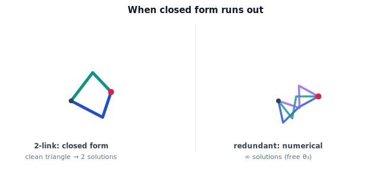

!!! abstract "You are here"
    **Module 5 — Inverse Kinematics**  ·  **Unit 4 — From Geometry to Numerical IK**  ·  **Lesson 4.1 — When Closed Form Runs Out**

# Lesson 4.1 — When Closed Form Runs Out

> The closed-form toolkit is powerful but narrow. This lesson maps its limits — the arms it cannot solve — and motivates the numerical methods that work for any arm.

---

## 1. Why This Matters

Closed-form inverse kinematics is exact and fast, but it only exists for arms built to allow it. The moment an arm has awkward geometry, extra joints, or a coupled wrist, the clean formulas vanish. Real robots — and research arms especially — often fall outside the closed-form club. To solve *any* arm, we need a general method, and that method is numerical. This lesson is the hinge of the module: it justifies leaving geometry behind for iteration.

## 2. Physical Intuition

The 2-link solution worked because the arm folded neatly into a triangle. Now imagine an arm with seven joints reaching a point: you can wiggle the elbow up, down, sideways, twist the base — and infinitely many of those combinations land the gripper on the same spot. There is no single "the angles"; there is a whole continuum. Trigonometry that expects a unique triangle has nothing to grab onto. When the geometry stops being a clean triangle, the formula-writing stops too.

## 3. Mathematical Foundations

Closed form requires the forward-kinematics equations to **decouple** into pieces each solvable by trig (Unit 3). Three things break that:

- **General geometry.** Arbitrary link offsets and twists give forward equations that don't separate; there is no algebraic rearrangement for $\boldsymbol\theta$.
- **Redundancy.** An arm with more joints than task dimensions (e.g. 7 joints for a 6-DOF pose, or 3 joints for a 2-DOF planar position) has a **solution manifold** — infinitely many $\boldsymbol\theta$ for one target. A formula returning "the" answer cannot describe a continuum.
- **Coupled orientation.** Without a spherical wrist, position and orientation stay entangled (Lesson 3.3), so the decoupling trick fails.

What every arm *does* have is a forward map $\mathbf p = f(\boldsymbol\theta)$ we can evaluate (Module 4) and, as the next lesson shows, **differentiate**. That is enough to *search* for a solution numerically: start from a guess, see how wrong it is, and step the joints to reduce the error — repeat. The method makes no assumption about arm structure, so it works where closed form cannot. The trade-offs: it returns *one* solution (the one near the guess), needs a starting point, and can struggle in special configurations (Unit 6) — but it is universal.

## 4. Visual Explanation

<figure markdown>
  { width="680" }
</figure>

## 5. Engineering Example

A greenhouse arm with an extra joint for reaching around foliage is redundant: many joint combinations place the gripper on the same tomato, and the controller *wants* that freedom to dodge obstacles. No closed form can express the whole family of solutions, so the planner uses a numerical solver seeded near the arm's current pose — getting a nearby, obstacle-aware solution rather than an arbitrary one. The redundancy that defeats closed form is exactly the flexibility the robot exploits.

## 6. Worked Example

A planar **3-link** arm ($L_1=L_2=L_3=0.3$) reaching a 2D point has 3 joint angles for 2 constraints — one extra degree of freedom. Pick target $(0.6, 0.0)$. The 2-link method gives a discrete pair; the 3-link arm instead has a *one-parameter family*: fix the third joint to $0°, 30°, -30°, 60°, \dots$ and for each there is a 2-link sub-solution placing the gripper on $(0.6, 0)$. Infinitely many configurations, all valid — no single formula returns them all. This is redundancy made concrete, and it is why we iterate.

## 7. Interactive Demonstration

**Guided prediction.** For the planar 3-link arm at target $(0.6, 0)$, fix the wrist joint $\theta_3$ at several values and predict that each leaves a solvable 2-link sub-problem for the first two joints. Sketch two of the resulting whole-arm poses and confirm both reach the target. Notice you chose $\theta_3$ freely — that free choice is the redundancy a numerical solver must resolve.

## 8. Coding Exercise

!!! tip "Run the hands-on notebook"
    `modules/module05/notebooks/M05_U04_L4_1_When_Closed_Form_Runs_Out.ipynb` — open in JupyterLab and run **Kernel → Restart & Run All**.

For the planar 3-link arm, write `family(x, y, L1, L2, L3, theta3_values)` that, for each fixed $\theta_3$, reduces to a 2-link problem (target shifted back along the third link) and returns the whole-arm configurations reaching $(x,y)$. Plot several poses for $(0.6, 0)$ to visualize the solution family. (No general solver yet — just exhibit the continuum.)

## 9. Knowledge Check

Formative — unlimited attempts, immediate feedback; does not affect your grade.

<iframe src="../../quizzes/module05/lesson13_quiz.html" title="When Closed Form Runs Out knowledge check" style="width:100%;height:720px;border:1px solid #e2e8f0;border-radius:12px"></iframe>

[Open this quiz in a new tab ↗](../quizzes/module05/lesson13_quiz.html)

Checks on what breaks closed form, redundancy as a solution manifold, and why numerical iteration is the general fix.

## 10. Challenge Problem

A 2-link arm ($L_1, L_2$) has two solutions; a 3-link planar arm reaching a 2D point has infinitely many. Generalize: for a planar arm with $n$ links reaching a 2D point, how many "extra" degrees of freedom does it have, and what is the dimension of its solution manifold? Why does that make a closed form impossible for $n \ge 3$ (in general)?

## 11. Common Mistakes

- Believing every arm has a closed-form inverse (only specially-structured ones do).
- Confusing "two solutions" (discrete, 2-link) with "infinitely many" (a redundant arm's manifold).
- Thinking redundancy is a defect — it is exploitable freedom.
- Expecting a numerical solver to return *all* solutions; it returns one near the seed.

## 12. Key Takeaways

- Closed form needs structure that decouples into trig-solvable pieces; general geometry, redundancy, and coupled orientation break it.
- A redundant arm has a continuum of solutions no formula can enumerate.
- Every arm still has an evaluable, differentiable forward map — enough to solve numerically.
- Numerical iteration is universal: one solution near a seed, any arm, at the cost of a guess and possible special-configuration trouble.

---

## AI Learning Companion

Copy any prompt below into ChatGPT, Claude, or another AI assistant.

**Tutor prompt** — explain it another way
```
Re-explain Lesson 4.1 (Module 5) — when closed-form inverse kinematics runs out — using a redundant multi-joint arm with infinitely many solutions. Explain why we switch to numerical iteration.
```

**Practice prompt** — generate more exercises
```
Give me 6 exercises identifying whether an arm has closed-form IK or needs numerical methods, based on its structure (planar 2-link, redundant 3-link, no spherical wrist, etc.). Include answers.
```

**Explore prompt** — connect it to the real world
```
Show me real redundant robot arms (7-DOF) and how their extra degree of freedom is used, and why that redundancy rules out closed-form inverse kinematics.
```

## Global Learning Support

Need this lesson explained in another language? Copy one of the prompts below into an AI assistant. English remains the authoritative source.

**Supported languages (initial):** English · Español · 中文 (Simplified Chinese) · Türkçe

**Español**
```
I just completed Lesson 4.1 (Module 5) — When Closed Form Runs Out.
Explain this lesson in Spanish. Keep robotics and mathematical terminology in English when appropriate.
Then provide: a summary, three practice questions, and one challenge problem.
```

**中文 (Simplified Chinese)**
```
I just completed Lesson 4.1 (Module 5) — When Closed Form Runs Out.
Explain this lesson in Simplified Chinese. Keep mathematical notation unchanged.
Then provide: a summary, three practice questions, and one challenge problem.
```

**Türkçe**
```
I just completed Lesson 4.1 (Module 5) — When Closed Form Runs Out.
Explain this lesson in Turkish. Keep robotics terminology in English where commonly used.
Then provide: a summary, three practice questions, and one challenge problem.
```

---

*Next lesson: 4.2 — The Local Linear Map: the FK Jacobian (for solving).*
