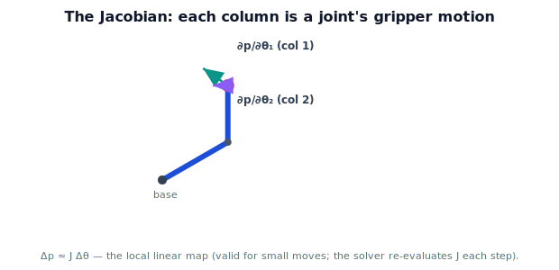

!!! abstract "You are here"
    **Module 5 — Inverse Kinematics**  ·  **Unit 4 — From Geometry to Numerical IK**  ·  **Lesson 4.2 — The Local Linear Map: the FK Jacobian (for Solving)**

# Lesson 4.2 — The Local Linear Map: the FK Jacobian (for Solving)

> To step the joints toward a target, we need to know how a small joint change moves the gripper. That relationship is the Jacobian. Here we use it for exactly one purpose: as the local linear map that drives the numerical solver.

> **Scope note.** In Module 5 the Jacobian is *only* the solver's local linear map. Its meaning as a velocity relationship, differential motion, manipulability, singularity theory, and SVD analysis are the subject of **Module 6** and are deliberately deferred. We use it here as a computational tool, not a topic.

---

## 1. Why This Matters

The numerical solver (next lesson) works by nudging the joints to shrink the gripper's error. To nudge intelligently, it must know which way — and how much — the gripper moves when each joint moves a little. That is precisely the Jacobian. Without it, iteration is blind; with it, each step is an informed move toward the target. It is the one piece of new machinery the numerical method needs.

## 2. Physical Intuition

Stand the arm at some configuration and twitch one joint by a tiny amount. The gripper shifts a little in some direction. Twitch a different joint: the gripper shifts a different way. The Jacobian is just the bookkeeping of all those "if I move this joint a bit, the gripper moves that way" facts, collected into a table. Near the current pose, it predicts the gripper's motion for *any* small combined joint move — it is the arm's local "steering map." Move far and the prediction drifts (the map is only *local*), which is why the solver re-computes it each step.

## 3. Mathematical Foundations

The forward map sends joint angles to gripper position, $\mathbf p = f(\boldsymbol\theta)$. The **Jacobian** $J(\boldsymbol\theta)$ is the matrix of partial derivatives — how each output coordinate changes with each joint:

$$J(\boldsymbol\theta) = \frac{\partial \mathbf p}{\partial \boldsymbol\theta}, \qquad J_{ij} = \frac{\partial p_i}{\partial \theta_j}.$$

It gives the **local linear approximation** of the forward map: for a small joint change $\Delta\boldsymbol\theta$,

$$\Delta \mathbf p \approx J(\boldsymbol\theta)\,\Delta\boldsymbol\theta.$$

That is the whole role it plays here — a linear map from a small joint step to the resulting gripper step, valid near the current configuration.

**Planar 2-link arm.** With $\mathbf p = (x, y)$,
$$x = L_1\cos\theta_1 + L_2\cos(\theta_1+\theta_2), \quad y = L_1\sin\theta_1 + L_2\sin(\theta_1+\theta_2),$$
differentiate to get the $2\times2$ Jacobian:

$$J = \begin{bmatrix} -L_1\sin\theta_1 - L_2\sin(\theta_1+\theta_2) & -L_2\sin(\theta_1+\theta_2) \\ \;\;L_1\cos\theta_1 + L_2\cos(\theta_1+\theta_2) & \;\;L_2\cos(\theta_1+\theta_2)\end{bmatrix}.$$

Each **column** is "how the gripper moves if I move that joint": column 1 for $\theta_1$, column 2 for $\theta_2$. The solver will use this matrix (and its inverse-like operation) to convert a desired gripper correction into a joint correction. (When this matrix is non-invertible, the arm is in a special configuration — *recognized* in Unit 6; its full theory is Module 6.)

## 4. Visual Explanation

<figure markdown>
  { width="680" }
</figure>

## 5. Engineering Example

When the greenhouse arm is slightly off a tomato, the solver asks: "to move the gripper this little vector toward the fruit, how should each joint change?" The Jacobian answers locally — convert the desired gripper correction into a joint correction, apply it, re-evaluate. Used this way, the Jacobian is the steering wheel of the numerical reach: it turns "the gripper needs to go there" into "turn these joints by this much."

## 6. Worked Example

$L_1 = 0.4, L_2 = 0.3$ at $(\theta_1, \theta_2) = (30°, 60°)$. Then $\theta_1+\theta_2 = 90°$:

$$J = \begin{bmatrix} -0.4\sin30° - 0.3\sin90° & -0.3\sin90° \\ 0.4\cos30° + 0.3\cos90° & 0.3\cos90°\end{bmatrix} = \begin{bmatrix} -0.2 - 0.3 & -0.3 \\ 0.3464 + 0 & 0\end{bmatrix} = \begin{bmatrix} -0.5 & -0.3 \\ 0.3464 & 0\end{bmatrix}.$$

Read column 2: moving $\theta_2$ a little moves the gripper in direction $(-0.3, 0)$ — purely $-x$ here, which makes sense, the forearm points straight up so bending the elbow sweeps the tip horizontally. That is the local linear map the solver will use.

## 7. Interactive Demonstration

**Guided prediction.** At $(\theta_1,\theta_2)=(30°,60°)$, predict the gripper's motion for a small $\Delta\theta_1 = +2°$ (use column 1 of $J$, converting degrees to radians) and for $\Delta\theta_2=+2°$ (column 2). Then evaluate forward kinematics before and after the twitch and confirm the actual gripper shift matches $J\,\Delta\boldsymbol\theta$ closely (the small mismatch is the linearization error).

## 8. Coding Exercise

!!! tip "Run the hands-on notebook"
    `modules/module05/notebooks/M05_U04_L4_2_FK_Jacobian.ipynb` — open in JupyterLab and run **Kernel → Restart & Run All**.

Write `jacobian_2link(theta1, theta2, L1, L2)` returning the $2\times2$ matrix above. Verify it against a **finite-difference** check: perturb each joint by $10^{-6}$, recompute `fk_two_link`, and confirm $(f(\theta+\epsilon)-f(\theta))/\epsilon$ matches the analytic column. This finite-difference agreement is the self-check.

## 9. Knowledge Check

Formative — unlimited attempts, immediate feedback; does not affect your grade.

<iframe src="../../quizzes/module05/lesson14_quiz.html" title="The Local Linear Map: the FK Jacobian (for Solving) knowledge check" style="width:100%;height:720px;border:1px solid #e2e8f0;border-radius:12px"></iframe>

[Open this quiz in a new tab ↗](../quizzes/module05/lesson14_quiz.html)

Checks on the Jacobian as partial derivatives, the $\Delta\mathbf p \approx J\Delta\boldsymbol\theta$ local map, and reading its columns.

## 10. Challenge Problem

The relation $\Delta\mathbf p \approx J\Delta\boldsymbol\theta$ is exact only in the limit of small moves. For the worked-example pose, apply a *large* $\Delta\theta_2 = 45°$ and compare the linear prediction $J\Delta\boldsymbol\theta$ to the true forward-kinematics change. Why does the error grow with step size, and how does that explain why the solver takes many small steps rather than one big one?

## 11. Common Mistakes

- Reading rows instead of columns (columns are per-joint gripper motions).
- Forgetting to convert $\Delta\theta$ to radians when applying $J\Delta\boldsymbol\theta$.
- Treating $J$ as a global map — it is only local, valid near the current pose.
- Importing velocity/singularity interpretations from Module 6 — here $J$ is purely the solver's local linear map.

## 12. Key Takeaways

- The Jacobian $J = \partial\mathbf p/\partial\boldsymbol\theta$ is the matrix of partial derivatives of the forward map.
- It is the **local linear map**: $\Delta\mathbf p \approx J\,\Delta\boldsymbol\theta$ for small joint changes.
- Its columns are the gripper motions from twitching each joint; for the 2-link arm it is an explicit $2\times2$ matrix.
- In Module 5 it serves one purpose — powering the numerical solver; its velocity meaning and singularity theory are Module 6.

---

## AI Learning Companion

Copy any prompt below into ChatGPT, Claude, or another AI assistant.

**Tutor prompt** — explain it another way
```
Re-explain Lesson 4.2 (Module 5) — the FK Jacobian as a local linear map Δp ≈ J Δθ — using small joint twitches and the gripper's resulting motion. Keep it to the solver role; don't bring in velocity or singularity theory (that's Module 6).
```

**Practice prompt** — generate more exercises
```
Give me 6 exercises computing the planar 2-link Jacobian at given configurations and interpreting its columns as per-joint gripper motions, with finite-difference checks. Include answers.
```

**Explore prompt** — connect it to the real world
```
Show me how a numerical inverse-kinematics solver uses the Jacobian as a local steering map to convert a desired gripper correction into joint corrections.
```

## Global Learning Support

Need this lesson explained in another language? Copy one of the prompts below into an AI assistant. English remains the authoritative source.

**Supported languages (initial):** English · Español · 中文 (Simplified Chinese) · Türkçe

**Español**
```
I just completed Lesson 4.2 (Module 5) — The Local Linear Map: the FK Jacobian (for Solving).
Explain this lesson in Spanish. Keep robotics and mathematical terminology in English when appropriate.
Then provide: a summary, three practice questions, and one challenge problem.
```

**中文 (Simplified Chinese)**
```
I just completed Lesson 4.2 (Module 5) — The Local Linear Map: the FK Jacobian (for Solving).
Explain this lesson in Simplified Chinese. Keep mathematical notation unchanged.
Then provide: a summary, three practice questions, and one challenge problem.
```

**Türkçe**
```
I just completed Lesson 4.2 (Module 5) — The Local Linear Map: the FK Jacobian (for Solving).
Explain this lesson in Turkish. Keep robotics terminology in English where commonly used.
Then provide: a summary, three practice questions, and one challenge problem.
```

---

*Next lesson: 4.3 — The Iteration Idea: Guess, Measure Error, Step.*
