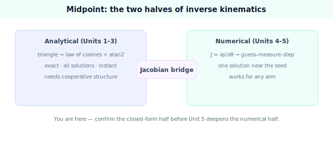

!!! abstract "You are here"
    **Module 5 — Inverse Kinematics**  ·  **Unit 4 — From Geometry to Numerical IK**  ·  **Lesson 4.4 — From Geometry to Numerical IK (Unit 4 Recap · Midpoint)**

# Lesson 4.4 — From Geometry to Numerical IK (Unit 4 Recap · Midpoint)

*A synthesis and the module's midpoint checkpoint — no new mathematics. It consolidates Units 1–4 and points to Unit 5, where the numerical solver is made robust.*

---

## What Unit 4 established

The unit in one line:

> **Closed form runs out for general and redundant arms; every arm still has a differentiable forward map, whose Jacobian is the local linear map $\Delta\mathbf p \approx J\Delta\boldsymbol\theta$ that powers a guess–measure–step iteration solving any arm.**

## The arc of the unit

| Lesson | Idea |
|---|---|
| 4.1 When Closed Form Runs Out | General geometry, redundancy, and coupled orientation break closed form; redundant arms have a continuum of solutions. |
| 4.2 The FK Jacobian | $J = \partial\mathbf p/\partial\boldsymbol\theta$ — the local linear map; columns are per-joint gripper motions (solver tool only). |
| 4.3 The Iteration Idea | Loop: measure $\mathbf e$, solve $\Delta\boldsymbol\theta = J^{+}\mathbf e$, step $\boldsymbol\theta \mathrel{+}= \alpha\Delta\boldsymbol\theta$, stop at tolerance. |

## The one picture to carry forward

Inverse kinematics has **two complementary halves**. The **analytical** half (Units 1–3): when the arm's structure cooperates, write the answer directly with trig — exact, all solutions, instant. The **numerical** half (Units 4–5): when it does not, evaluate and differentiate the forward map and *search* — guess, measure, step — landing one solution near the seed for any arm. The Jacobian is the bridge between them: it is built from the same forward map, and it converts "the gripper needs to move there" into "turn the joints this way." That is the whole of where Module 5 stands at its midpoint.

## Visual Explanation

<figure markdown>
  { width="680" }
</figure>

## Midpoint checkpoint

The full readiness assessment is in `assessments/module05_midpoint_assessment.md`. In brief, a student ready for the numerical half can:

- **State the inverse problem** — solve $T_0^n(\boldsymbol\theta) = T_{\text{desired}}$; reachability; 0/1/many solutions.
- **Solve the planar 2-link arm in closed form** — both elbow solutions via law of cosines + `atan2`, verified by forward kinematics.
- **Explain why a general arm needs a numerical method** — what breaks closed form, and what the FK Jacobian provides (the local linear map for the guess–measure–step loop).

If any of these is shaky, revisit: Unit 1 (problem statement/reachability), Unit 3.1 (closed form), or Units 4.2–4.3 (Jacobian and the loop) before starting Unit 5.

## Where Unit 5 goes

Unit 5 — **Numerical Inverse Kinematics in Practice** — makes the bare loop robust: the Newton step with the pseudoinverse, the Jacobian-transpose and **damped least squares** variants that stay stable in hard configurations, and the practical handling of convergence, step size, and failure. With it, the solver becomes something you could trust on a real arm.

## Key Takeaways

- Closed form (analytical) and iteration (numerical) are the two halves of IK; the Jacobian bridges them.
- The Jacobian is the local linear map; the loop is measure–solve–step–check.
- Midpoint: be able to state the problem, solve the 2-link closed form (both solutions), and explain why/where numerical methods take over.
- Unit 5 hardens the solver for practice.

---

## Coding Exercise

!!! tip "Run the hands-on notebook"
    `modules/module05/notebooks/M05_U04_L4_4_Numerical_IK_Recap_Midpoint.ipynb` — open in JupyterLab and run **Kernel → Restart & Run All**.

Open the consolidation notebook for Unit 4 and run **Kernel → Restart & Run All**; it re-exercises the unit's key routines end to end and prints `All checks passed.`

## Knowledge Check

Formative — unlimited attempts, immediate feedback; does not affect your grade.

<iframe src="../../quizzes/module05/lesson16_quiz.html" title="From Geometry to Numerical IK (Unit 4 Recap · Midpoint) knowledge check" style="width:100%;height:720px;border:1px solid #e2e8f0;border-radius:12px"></iframe>

[Open this quiz in a new tab ↗](../quizzes/module05/lesson16_quiz.html)

A brief consolidation quiz across Unit 4 (formative — unlimited attempts, immediate feedback).

## AI Learning Companion

Copy any prompt below into ChatGPT, Claude, or another AI assistant.

**Tutor prompt** — explain it another way
```
Summarize Units 1–4 of Module 5 (Inverse Kinematics) at the midpoint: the inverse problem and reachability, the closed-form 2-link solution, and the analytical-to-numerical transition (Jacobian as local linear map + guess–measure–step). 
```

**Practice prompt** — generate more exercises
```
Give me a 12-question midpoint review for Module 5: problem statement, reachability, closed-form 2-link (both solutions), and why/where numerical methods take over. Include answers.
```

**Explore prompt** — connect it to the real world
```
Show me how real robot software chooses between an analytical (closed-form) inverse-kinematics solver and a numerical one, and when each is used.
```

## Global Learning Support

Need this lesson explained in another language? Copy one of the prompts below into an AI assistant. English remains the authoritative source.

**Supported languages (initial):** English · Español · 中文 (Simplified Chinese) · Türkçe

**Español**
```
I just completed Lesson 4.4 (Module 5) — From Geometry to Numerical IK (Unit 4 Recap · Midpoint).
Explain this unit in Spanish. Keep robotics and mathematical terminology in English when appropriate.
Then provide: a summary, three practice questions, and one challenge problem.
```

**中文 (Simplified Chinese)**
```
I just completed Lesson 4.4 (Module 5) — From Geometry to Numerical IK (Unit 4 Recap · Midpoint).
Explain this unit in Simplified Chinese. Keep mathematical notation unchanged.
Then provide: a summary, three practice questions, and one challenge problem.
```

**Türkçe**
```
I just completed Lesson 4.4 (Module 5) — From Geometry to Numerical IK (Unit 4 Recap · Midpoint).
Explain this unit in Turkish. Keep robotics terminology in English where commonly used.
Then provide: a summary, three practice questions, and one challenge problem.
```

---

*Next lesson: 5.1 — Newton's Method for Inverse Kinematics (the Pseudoinverse Step).*
