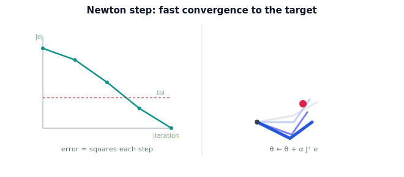

!!! abstract "You are here"
    **Module 5 — Inverse Kinematics**  ·  **Unit 5 — Numerical Inverse Kinematics in Practice**  ·  **Lesson 5.1 — Newton's Method for IK (Jacobian Pseudoinverse)**

# Lesson 5.1 — Newton's Method for IK (Jacobian Pseudoinverse)

> Unit 4 sketched the guess–measure–step loop. Now we make the step precise: the Newton step uses the Jacobian pseudoinverse to turn the gripper error into a joint correction, and converges quickly near a solution.

---

## 1. Why This Matters

The Newton step is the default numerical inverse-kinematics method — the one most solvers start from. It takes the loop you already know and specifies exactly how to compute $\Delta\boldsymbol\theta$: through the Jacobian pseudoinverse. Understanding it gives you a solver that converges in a handful of iterations for well-behaved targets, and a baseline against which the more robust variants (next lesson) are improvements.

## 2. Physical Intuition

You are reaching for a fruit and you are a few centimeters short. You know roughly how each joint moves your hand (the Jacobian). Newton's method asks: "what single combined joint move would, *if the arm were linear*, land my hand exactly on the fruit?" — and takes that move. Because the arm is only *approximately* linear nearby, you do not land perfectly, but you land much closer. Re-measure, re-aim, step again. Each round the remaining error shrinks dramatically — near the target, roughly squaring each time.

## 3. Mathematical Foundations

The loop from Lesson 4.3, with the step made explicit. At configuration $\boldsymbol\theta$ with error $\mathbf e = \mathbf p_{\text{target}} - f(\boldsymbol\theta)$ and Jacobian $J = J(\boldsymbol\theta)$, we want $\Delta\boldsymbol\theta$ such that $J\,\Delta\boldsymbol\theta = \mathbf e$ (the local linear map). Solve it:

- **Square, invertible $J$** (e.g. planar 2-link, 2 joints for 2D): $\Delta\boldsymbol\theta = J^{-1}\mathbf e$.
- **Non-square $J$** (more joints than task dimensions, or fewer): use the **Moore–Penrose pseudoinverse** $J^{+}$:

$$\Delta\boldsymbol\theta = J^{+}\mathbf e, \qquad J^{+} = J^\top(JJ^\top)^{-1}\ \text{(wide $J$, redundant arm)}.$$

The pseudoinverse returns the **least-norm** joint move that achieves the desired gripper change — the "smallest" correction, which for a redundant arm picks one sensible solution out of the manifold. The full Newton step is then

$$\boldsymbol\theta \leftarrow \boldsymbol\theta + \alpha\,J^{+}\mathbf e,$$

with gain $\alpha$ (often $1$ for a true Newton step; smaller for safety). Iterate until $\|\mathbf e\| < \texttt{tol}$. Near a solution where $J$ is well-conditioned, convergence is **quadratic** — the error roughly squares each step, so $10^{-1} \to 10^{-2} \to 10^{-4} \to \dots$ in a few iterations. (Where $J$ is *ill*-conditioned — near a singularity — this step misbehaves; that is Lesson 5.2's problem to fix and Lesson 6.1's to recognize.)

## 4. Visual Explanation

<figure markdown>
  { width="680" }
</figure>

## 5. Engineering Example

The greenhouse arm, seeded at its current pose, runs the Newton step to lock onto a fruit's grasp point: three or four iterations and the gripper error is sub-millimeter. Because the pseudoinverse returns the least-norm move, the arm changes its joints as little as possible per step — a smooth, economical reach. The solver commits once $\|\mathbf e\|$ is within the grasp tolerance.

## 6. Worked Example

Planar 2-link $L_1=0.4, L_2=0.3$, target $(0.5, 0.2)$, seed $(\theta_1,\theta_2)=(10°, 20°)$, $\alpha=1$ (square $J$, so $J^{+}=J^{-1}$):

- Iter 0: $\mathbf p = (0.667, 0.169)$, $\mathbf e=(-0.167, 0.031)$, $\|\mathbf e\|\approx0.170$.
- After step 1: $\|\mathbf e\| \approx 3\times10^{-2}$.
- After step 2: $\|\mathbf e\| \approx 1\times10^{-3}$.
- After step 3: $\|\mathbf e\| \approx 10^{-6}$ — converged.

Three steps from a poor guess to micron-level error: that is Newton's speed near a well-conditioned solution. (The notebook prints the actual error history.)

## 7. Interactive Demonstration

<iframe src="../../demos/module05/lesson17_convergence_stepper.html" title="Newton's Method for IK (Jacobian Pseudoinverse) interactive demo" style="width:100%;height:520px;border:1px solid #e2e8f0;border-radius:12px"></iframe>

[Open this demo in a new tab ↗](../demos/module05/lesson17_convergence_stepper.html)

The embedded **Convergence Stepper** lets you set a target, a seed, and the gain $\alpha$, then advance the Newton iteration one step at a time. Watch the error norm and the arm pose update per click, and the error plot build. Try a good seed (fast convergence), a large $\alpha$ (overshoot/oscillation), and a target near full extension (sluggish, ill-conditioned) to feel where the bare Newton step struggles — motivating the next lesson.

## 8. Coding Exercise

!!! tip "Run the hands-on notebook"
    `modules/module05/notebooks/M05_U05_L5_1_Newton_Pseudoinverse.ipynb` — open in JupyterLab and run **Kernel → Restart & Run All**.

Implement `ik_newton(target, theta0, L1, L2, alpha=1.0, tol=1e-6, max_iter=50)` returning the solution, iteration count, and error history, using `np.linalg.solve` for the square case (or `np.linalg.pinv` generally). Confirm it converges to a true solution (FK-verify), that the error history drops sharply (near-quadratic), and that a different seed reaches the other elbow solution.

## 9. Knowledge Check

Formative — unlimited attempts, immediate feedback; does not affect your grade.

<iframe src="../../quizzes/module05/lesson17_quiz.html" title="Newton's Method for IK (Jacobian Pseudoinverse) knowledge check" style="width:100%;height:720px;border:1px solid #e2e8f0;border-radius:12px"></iframe>

[Open this quiz in a new tab ↗](../quizzes/module05/lesson17_quiz.html)

Checks on the $\Delta\boldsymbol\theta = J^{+}\mathbf e$ step, the least-norm property, and the fast convergence near a solution.

## 10. Challenge Problem

For the planar 2-link arm, $J$ is square, so $J^{+} = J^{-1}$ when $J$ is invertible. Compute $\det J$ for the arm and find the configuration(s) where $\det J = 0$. What is the arm doing there (geometrically), and why would the Newton step blow up? (You are *recognizing* the trouble spot — its full theory is Lesson 6.1 and Module 6.)

## 11. Common Mistakes

- Forgetting to re-evaluate $J$ each iteration.
- Using $J^{-1}$ when $J$ is non-square — use $J^{+}$.
- Setting $\alpha$ too large and losing the fast convergence to oscillation.
- Expecting good behavior near $\det J = 0$ — the bare Newton step is fragile there.

## 12. Key Takeaways

- The Newton step is $\boldsymbol\theta \leftarrow \boldsymbol\theta + \alpha J^{+}\mathbf e$ — the precise form of guess–measure–step.
- The pseudoinverse $J^{+}$ handles non-square Jacobians and returns the least-norm joint move.
- Near a well-conditioned solution, convergence is fast (roughly quadratic).
- It is fragile near $\det J = 0$ (ill-conditioned) — fixed in Lesson 5.2, recognized in Lesson 6.1.

---

## AI Learning Companion

Copy any prompt below into ChatGPT, Claude, or another AI assistant.

**Tutor prompt** — explain it another way
```
Re-explain Lesson 5.1 (Module 5) — Newton's method for inverse kinematics — as the guess–measure–step loop with Δθ = J⁺ e. Explain the pseudoinverse's least-norm property and the fast convergence near a solution. Keep the Jacobian as solver machinery only.
```

**Practice prompt** — generate more exercises
```
Give me 5 exercises tracing the Newton/pseudoinverse IK iteration for a planar 2-link arm: compute the step, show the error shrinking near-quadratically. Include answers.
```

**Explore prompt** — connect it to the real world
```
Show me how real robot IK solvers use the Jacobian pseudoinverse Newton step, how many iterations they typically need, and how they seed it.
```

## Global Learning Support

Need this lesson explained in another language? Copy one of the prompts below into an AI assistant. English remains the authoritative source.

**Supported languages (initial):** English · Español · 中文 (Simplified Chinese) · Türkçe

**Español**
```
I just completed Lesson 5.1 (Module 5) — Newton's Method for IK (Jacobian Pseudoinverse).
Explain this lesson in Spanish. Keep robotics and mathematical terminology in English when appropriate.
Then provide: a summary, three practice questions, and one challenge problem.
```

**中文 (Simplified Chinese)**
```
I just completed Lesson 5.1 (Module 5) — Newton's Method for IK (Jacobian Pseudoinverse).
Explain this lesson in Simplified Chinese. Keep mathematical notation unchanged.
Then provide: a summary, three practice questions, and one challenge problem.
```

**Türkçe**
```
I just completed Lesson 5.1 (Module 5) — Newton's Method for IK (Jacobian Pseudoinverse).
Explain this lesson in Turkish. Keep robotics terminology in English where commonly used.
Then provide: a summary, three practice questions, and one challenge problem.
```

---

*Next lesson: 5.2 — The Jacobian-Transpose and Damped Least Squares.*
