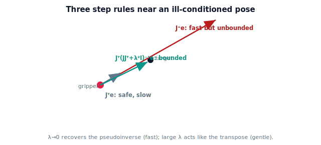

!!! abstract "You are here"
    **Module 5 — Inverse Kinematics**  ·  **Unit 5 — Numerical Inverse Kinematics in Practice**  ·  **Lesson 5.2 — The Jacobian-Transpose and Damped Least Squares**

# Lesson 5.2 — The Jacobian-Transpose and Damped Least Squares

> The bare Newton step is fast but fragile where the Jacobian is ill-conditioned. This lesson adds two robust alternatives: the transpose step and damped least squares — the workhorses of practical numerical IK.

---

## 1. Why This Matters

Real targets sometimes sit near configurations where the pseudoinverse asks for enormous joint moves — the solver lurches or diverges. Production solvers avoid this with two tools: a dead-simple **transpose** step that can never blow up, and **damped least squares**, which keeps the fast behavior of Newton but stays bounded when conditions get bad. These are what make numerical IK trustworthy on a real arm.

## 2. Physical Intuition

Picture reaching toward a spot where your arm is nearly straight. To nudge your fingertip *outward* from there, the math wants a huge joint motion (the arm can barely move further out), so the naive correction overreacts. Damping says: "don't trust the aggressive move; take a gentler, bounded step in the same general direction." The transpose step is even more cautious — it just pushes the joints *along the direction that reduces error*, guaranteed downhill, never exploding, though it can be slow. Both trade a little speed for not falling off a cliff.

## 3. Mathematical Foundations

Error $\mathbf e$, Jacobian $J$.

**Jacobian-transpose step.** Replace the (pseudo)inverse with the transpose:

$$\Delta\boldsymbol\theta = \alpha\,J^\top \mathbf e.$$

This is not the exact linear solve, but $J^\top\mathbf e$ always points in a direction that *reduces* the error (it is the negative gradient of $\tfrac12\|\mathbf e\|^2$). So with a small enough $\alpha$ it can never diverge — it is a gradient-descent step. Cost: no matrix inverse at all (cheap), but convergence is linear (slower), and $\alpha$ needs tuning.

**Damped least squares (Levenberg–Marquardt).** Add a damping term $\lambda^2 I$ inside the inverse:

$$\Delta\boldsymbol\theta = J^\top\big(JJ^\top + \lambda^2 I\big)^{-1}\mathbf e.$$

The $\lambda^2 I$ keeps the matrix invertible and bounds the step even when $JJ^\top$ is nearly singular. The damping factor $\lambda$ interpolates between the two extremes:

- $\lambda \to 0$: recovers the pseudoinverse (fast, Newton-like) — use when well-conditioned.
- $\lambda$ large: behaves like a scaled transpose step (gentle, stable) — use near trouble.

A common practice is to *increase* $\lambda$ when the Jacobian is poorly conditioned and shrink it otherwise, getting Newton speed in the open and transpose-like safety near the edges. Damped least squares is the most widely used practical numerical IK step for exactly this reason.

(Why $JJ^\top$ becomes nearly singular — the geometry of lost directions — is *recognized* in Lesson 6.1; its full theory, including the singular values that $\lambda$ is really regularizing, is Module 6.)

## 4. Visual Explanation

<figure markdown>
  { width="680" }
</figure>

## 5. Engineering Example

When the greenhouse arm reaches a fruit near the edge of its workspace (arm almost straight), the bare pseudoinverse would command a violent joint swing. The controller uses damped least squares with a $\lambda$ that rises as the configuration gets ill-conditioned, so the gripper eases onto the fruit instead of lurching. Away from the edge, $\lambda$ drops and the solver regains Newton speed. One step rule, safe everywhere.

## 6. Worked Example

Planar 2-link near full extension, $J$ nearly singular ($\det J \approx 0$), error $\mathbf e = (0.02, 0)$ outward.

- **Pseudoinverse:** $J^{-1}\mathbf e$ has a huge component (dividing by $\det J \approx 0$) — a wild step.
- **Transpose:** $\alpha J^\top\mathbf e$ is small and points downhill — safe but inches forward.
- **Damped ($\lambda = 0.1$):** $J^\top(JJ^\top + 0.01 I)^{-1}\mathbf e$ — the $0.01 I$ floor keeps the inverse finite, so the step is moderate and aimed at the target.

The damped step is the one a real solver takes here. (The notebook computes all three at a near-singular pose and shows the pseudoinverse magnitude exploding while the damped step stays bounded.)

## 7. Interactive Demonstration

<iframe src="../../demos/module05/lesson18_jacobian_transpose_dls.html" title="The Jacobian-Transpose and Damped Least Squares interactive demo" style="width:100%;height:520px;border:1px solid #e2e8f0;border-radius:12px"></iframe>

[Open this demo in a new tab ↗](../demos/module05/lesson18_jacobian_transpose_dls.html)

**Guided prediction.** Reuse the Lesson 5.1 convergence stepper mentally: pick a target near full extension and predict that the pseudoinverse step's magnitude spikes while a damped step stays moderate. Predict the effect of raising $\lambda$ from $0$ (Newton) to large (transpose-like): faster vs gentler. Confirm the trade-off in the notebook.

## 8. Coding Exercise

!!! tip "Run the hands-on notebook"
    `modules/module05/notebooks/M05_U05_L5_2_Transpose_Damped_Least_Squares.ipynb` — open in JupyterLab and run **Kernel → Restart & Run All**.

Implement `step_transpose(J, e, alpha)`, `step_pinv(J, e)`, and `step_dls(J, e, lam)`. At a near-singular planar pose, compute all three and show $\|\Delta\boldsymbol\theta\|$ for the pseudoinverse blowing up while transpose and damped stay bounded. Then write `ik_dls(target, theta0, L1, L2, lam=0.05, ...)` and confirm it converges where the bare Newton step struggles.

## 9. Knowledge Check

Formative — unlimited attempts, immediate feedback; does not affect your grade.

<iframe src="../../quizzes/module05/lesson18_quiz.html" title="The Jacobian-Transpose and Damped Least Squares knowledge check" style="width:100%;height:720px;border:1px solid #e2e8f0;border-radius:12px"></iframe>

[Open this quiz in a new tab ↗](../quizzes/module05/lesson18_quiz.html)

Checks on the transpose update (downhill, stable), the DLS formula, and the role of $\lambda$.

## 10. Challenge Problem

Show that $J^\top\mathbf e$ is the negative gradient of the cost $C(\boldsymbol\theta) = \tfrac12\|\mathbf p_{\text{target}} - f(\boldsymbol\theta)\|^2$ with respect to $\boldsymbol\theta$. Use this to explain why the transpose step always reduces the error for small enough $\alpha$, and why damped least squares reduces to it as $\lambda \to \infty$ (up to scale).

## 11. Common Mistakes

- Believing the transpose step solves $J\Delta\boldsymbol\theta=\mathbf e$ exactly — it only goes downhill.
- Setting $\lambda$ to zero near a singularity (recovers the unstable pseudoinverse).
- Leaving $\lambda$ large everywhere (always slow); it should adapt.
- Forgetting the transpose step still needs $\alpha$ tuning.

## 12. Key Takeaways

- Jacobian-transpose: $\Delta\boldsymbol\theta = \alpha J^\top\mathbf e$ — gradient descent, always stable, slower.
- Damped least squares: $\Delta\boldsymbol\theta = J^\top(JJ^\top + \lambda^2 I)^{-1}\mathbf e$ — bounded everywhere, tunable via $\lambda$.
- $\lambda \to 0$ recovers the pseudoinverse (fast); large $\lambda$ acts like the transpose (safe).
- DLS is the practical default; it stays well-behaved near ill-conditioned configurations (recognized in Lesson 6.1).

---

## AI Learning Companion

Copy any prompt below into ChatGPT, Claude, or another AI assistant.

**Tutor prompt** — explain it another way
```
Re-explain Lesson 5.2 (Module 5) — the Jacobian-transpose and damped least squares steps — and why they are more robust than the bare pseudoinverse near ill-conditioned configurations. Keep the Jacobian as solver machinery; don't go into singularity theory (Module 6).
```

**Practice prompt** — generate more exercises
```
Give me 5 exercises comparing the pseudoinverse, transpose, and damped-least-squares joint steps for a planar 2-link arm near full extension. Include answers and the effect of λ.
```

**Explore prompt** — connect it to the real world
```
Show me how damped least squares (Levenberg–Marquardt) is used in real robot IK solvers and how the damping factor is adapted in practice.
```

## Global Learning Support

Need this lesson explained in another language? Copy one of the prompts below into an AI assistant. English remains the authoritative source.

**Supported languages (initial):** English · Español · 中文 (Simplified Chinese) · Türkçe

**Español**
```
I just completed Lesson 5.2 (Module 5) — The Jacobian-Transpose and Damped Least Squares.
Explain this lesson in Spanish. Keep robotics and mathematical terminology in English when appropriate.
Then provide: a summary, three practice questions, and one challenge problem.
```

**中文 (Simplified Chinese)**
```
I just completed Lesson 5.2 (Module 5) — The Jacobian-Transpose and Damped Least Squares.
Explain this lesson in Simplified Chinese. Keep mathematical notation unchanged.
Then provide: a summary, three practice questions, and one challenge problem.
```

**Türkçe**
```
I just completed Lesson 5.2 (Module 5) — The Jacobian-Transpose and Damped Least Squares.
Explain this lesson in Turkish. Keep robotics terminology in English where commonly used.
Then provide: a summary, three practice questions, and one challenge problem.
```

---

*Next lesson: 5.3 — Convergence, Step Size, and Failure Modes.*
