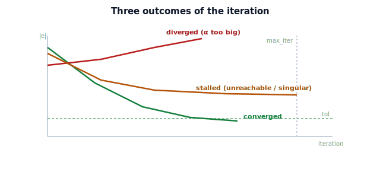

!!! abstract "You are here"
    **Module 5 — Inverse Kinematics**  ·  **Unit 5 — Numerical Inverse Kinematics in Practice**  ·  **Lesson 5.3 — Convergence, Step Size, and Failure Modes**

# Lesson 5.3 — Convergence, Step Size, and Failure Modes

> A solver that usually works is not enough — you must know *when* it works, *when* it stops, and *what it does when it can't*. This lesson covers convergence criteria, step size, and the failure modes a real solver must handle.

---

## 1. Why This Matters

On a real robot, an IK solver runs thousands of times and must behave predictably every time: stop when close enough, give up gracefully when a target is unreachable, and never command a wild move. The difference between a toy loop and a dependable solver is precisely the handling of convergence and failure. This lesson turns the iteration into something you could trust to drive a motor.

## 2. Physical Intuition

Reaching with your eyes closed again: you stop when your hand *feels* close enough (a tolerance), you give up if you have groped around too many times (an iteration cap), you move carefully so you do not knock the target away (step size), and you notice when the thing is simply out of reach (failure). A good solver does all four. Each is a simple rule, and together they make the reach reliable.

## 3. Mathematical Foundations

**Convergence criterion.** Stop when the gripper error is small enough:

$$\|\mathbf e\| = \|\mathbf p_{\text{target}} - f(\boldsymbol\theta)\| < \texttt{tol},$$

with `tol` set to the task's needed accuracy (e.g. $10^{-4}$ m for grasping). Optionally also stop if the *step* $\|\Delta\boldsymbol\theta\|$ becomes negligible (the solver has stopped making progress).

**Iteration cap.** Stop after `max_iter` steps regardless — and report **failure** if `tol` was not met. This prevents infinite loops.

**Step size $\alpha$.** Governs stability vs speed:

- Too large: the linear approximation breaks, the solver **overshoots** and may oscillate or diverge.
- Too small: each step barely moves; **slow** convergence, may hit `max_iter` before reaching `tol`.
- A common safeguard is a **line search** or **backtracking**: try a step, and if the error did not decrease, halve $\alpha$ and retry.

**Failure modes and remedies:**

| Failure | Symptom | Remedy |
|---|---|---|
| Unreachable target | error plateaus well above `tol` | reachability check first (Lesson 1.3); reposition base |
| Divergence | error grows | smaller $\alpha$; damped least squares (5.2) |
| Stall near singularity | tiny steps, no progress | damping (5.2); recognize the configuration (6.1) |
| Wrong solution | converges, but to an undesired pose | better seed; solution selection (6.3) |
| Slow crawl | many iterations, slowly shrinking error | larger $\alpha$ or line search |

A robust solver returns not just the angles but a **status**: converged, max-iterations, or diverged — so the caller can react (re-seed, reposition, or abort).

## 4. Visual Explanation

<figure markdown>
  { width="680" }
</figure>

## 5. Engineering Example

The greenhouse solver returns a status with every solve. "Converged" → command the move. "Max-iterations / stalled" → the fruit may be unreachable from here, so reposition the base and retry. "Diverged" → reduce the gain and retry, or fall back to damped least squares. This status-driven logic is what keeps the harvester from ever committing a nonsensical joint command, even on a hard or impossible target.

## 6. Worked Example

Planar 2-link $L_1=0.4, L_2=0.3$, target $(0.5, 0.2)$:

- $\alpha = 1.0$: converges in ~3 iterations (Newton speed).
- $\alpha = 0.1$: converges, but in ~30 iterations (slow crawl).
- $\alpha = 2.5$: error oscillates/grows — **diverges** (step too large for the local map).
- Target $(0.9, 0)$ (unreachable, $r=0.9>0.7$): error plateaus near $0.2$, never reaching `tol` → returns **max-iterations / failure**, correctly flagged by the up-front reachability check.

The notebook runs each case and prints the status and iteration count.

## 7. Interactive Demonstration

<iframe src="../../demos/module05/lesson19_convergence_step_failure.html" title="Convergence, Step Size, and Failure Modes interactive demo" style="width:100%;height:520px;border:1px solid #e2e8f0;border-radius:12px"></iframe>

[Open this demo in a new tab ↗](../demos/module05/lesson19_convergence_step_failure.html)

**Guided prediction.** For target $(0.5,0.2)$, predict the iteration count and outcome for $\alpha = 0.1, 1.0, 2.5$. For the unreachable $(0.9, 0)$, predict that the error plateaus and the solver reports failure rather than looping forever. Reason about which remedy each failure needs.

## 8. Coding Exercise

!!! tip "Run the hands-on notebook"
    `modules/module05/notebooks/M05_U05_L5_3_Convergence_Failure_Modes.ipynb` — open in JupyterLab and run **Kernel → Restart & Run All**.

Extend the solver to `ik_solve(target, theta0, L1, L2, alpha, tol, max_iter)` returning `(theta, status, iters, history)` where `status ∈ {"converged","max_iter","diverged"}`. Detect divergence (error increased over a step) and stalling (step below a floor with error above `tol`). Test all four worked-example cases and confirm the reported status matches.

## 9. Knowledge Check

Formative — unlimited attempts, immediate feedback; does not affect your grade.

<iframe src="../../quizzes/module05/lesson19_quiz.html" title="Convergence, Step Size, and Failure Modes knowledge check" style="width:100%;height:720px;border:1px solid #e2e8f0;border-radius:12px"></iframe>

[Open this quiz in a new tab ↗](../quizzes/module05/lesson19_quiz.html)

Checks on convergence/iteration criteria, the step-size trade-off, and matching failure modes to remedies.

## 10. Challenge Problem

Design a simple **adaptive** step rule: start with $\alpha = 1$; after each step, if the error decreased, keep $\alpha$; if it increased, halve $\alpha$ and redo the step (backtracking). Explain why this gives Newton speed when possible and safety when not — and how it interacts with damped least squares from Lesson 5.2.

## 11. Common Mistakes

- No iteration cap → infinite loop on unreachable targets.
- Reporting success without checking $\|\mathbf e\| < \texttt{tol}$ at the end.
- Blaming the solver for a target that fails the reachability check.
- Using a single fixed $\alpha$ for all targets instead of adapting or line-searching.

## 12. Key Takeaways

- Stop on $\|\mathbf e\| < \texttt{tol}$ (or negligible step); cap iterations and report failure otherwise.
- Step size trades stability (small) against speed (large); line search/backtracking adapts it.
- Failure modes — unreachable, divergence, singular stall, wrong solution, slow crawl — each have a remedy.
- A dependable solver returns a **status**, so the caller can re-seed, reposition, or abort.

---

## AI Learning Companion

Copy any prompt below into ChatGPT, Claude, or another AI assistant.

**Tutor prompt** — explain it another way
```
Re-explain Lesson 5.3 (Module 5) — convergence, step size, and failure modes of numerical IK — using the eyes-closed reaching analogy. Cover the stopping rule, the step-size trade-off, and the failure table with remedies.
```

**Practice prompt** — generate more exercises
```
Give me 6 exercises diagnosing numerical IK outcomes (converged, diverged, stalled, unreachable) from a description of the target and step size, with the right remedy. Include answers.
```

**Explore prompt** — connect it to the real world
```
Show me how production robot IK solvers set tolerances, cap iterations, adapt step size, and report status, and what they do on failure.
```

## Global Learning Support

Need this lesson explained in another language? Copy one of the prompts below into an AI assistant. English remains the authoritative source.

**Supported languages (initial):** English · Español · 中文 (Simplified Chinese) · Türkçe

**Español**
```
I just completed Lesson 5.3 (Module 5) — Convergence, Step Size, and Failure Modes.
Explain this lesson in Spanish. Keep robotics and mathematical terminology in English when appropriate.
Then provide: a summary, three practice questions, and one challenge problem.
```

**中文 (Simplified Chinese)**
```
I just completed Lesson 5.3 (Module 5) — Convergence, Step Size, and Failure Modes.
Explain this lesson in Simplified Chinese. Keep mathematical notation unchanged.
Then provide: a summary, three practice questions, and one challenge problem.
```

**Türkçe**
```
I just completed Lesson 5.3 (Module 5) — Convergence, Step Size, and Failure Modes.
Explain this lesson in Turkish. Keep robotics terminology in English where commonly used.
Then provide: a summary, three practice questions, and one challenge problem.
```

---

*Next lesson: 5.4 — Numerical Inverse Kinematics in Practice (Unit 5 Recap).*
