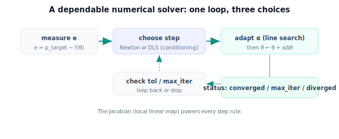

!!! abstract "You are here"
    **Module 5 — Inverse Kinematics**  ·  **Unit 5 — Numerical Inverse Kinematics in Practice**  ·  **Lesson 5.4 — Numerical Inverse Kinematics in Practice (Unit 5 Recap)**

# Lesson 5.4 — Numerical Inverse Kinematics in Practice (Unit 5 Recap)

*A short synthesis — no new mathematics. It consolidates Unit 5 and points to Unit 6.*

---

## What Unit 5 established

The unit in one line:

> **A practical numerical solver: the Newton/pseudoinverse step for fast convergence, the transpose and damped-least-squares steps for stability near ill-conditioned configurations, and convergence/step-size/failure handling so the solver is dependable and status-aware.**

## The arc of the unit

| Lesson | Idea |
|---|---|
| 5.1 Newton / Pseudoinverse | $\boldsymbol\theta \leftarrow \boldsymbol\theta + \alpha J^{+}\mathbf e$; fast (near-quadratic) near a well-conditioned solution; $J^{+}$ gives the least-norm move. |
| 5.2 Transpose & Damped LS | $\alpha J^\top\mathbf e$ (safe, slow) and $J^\top(JJ^\top+\lambda^2 I)^{-1}\mathbf e$ (bounded, tunable); $\lambda$ blends Newton↔transpose. |
| 5.3 Convergence & Failure | stop on $\|\mathbf e\|<$ tol; cap iterations; step size trades speed/stability; failure modes (unreachable/diverge/stall/wrong-solution) each have a remedy; return a status. |

## The one picture to carry forward

A real numerical IK solver is one loop with **three choices baked in**: which step rule (Newton when conditions are good, damped least squares when not), how big a step (adapted by line search), and when to stop or give up (tolerance, iteration cap, status). The Jacobian — used purely as the local linear map — powers all of it. With these in place, the solver converges fast where it can, stays bounded where it cannot, and never lies about success. What it does *not* yet do is recognize *why* certain configurations are hard, or choose *intelligently* among multiple valid solutions — that is Unit 6.

## Visual Explanation

<figure markdown>
  { width="680" }
</figure>

## Where Unit 6 goes

Unit 6 — **Singularities and Solution Selection** — explains *where* the solver degrades and *how to choose well*. Singularities are introduced as **lost directions** — configurations where the arm momentarily cannot move the gripper some way, which is exactly where $J$ became ill-conditioned in Unit 5 (recognition only; the full theory, including the singular values $\lambda$ was really regularizing, is Module 6). Then: respecting joint limits, and choosing among multiple solutions (nearest to current pose, smoothest motion, limit-safe) so the harvester picks a good arm, not just any arm.

## Key Takeaways

- Newton/pseudoinverse for speed; transpose and damped least squares for stability; $\lambda$ blends them.
- Convergence = tolerance + iteration cap; step size adapts; failures map to remedies; return a status.
- The Jacobian (local linear map) powers every step rule.
- Unit 6 adds singularity *recognition* and intelligent solution *selection*.

---

## Interactive Demonstration

<iframe src="../../demos/module05/lesson20_numerical_ik_practice_recap.html" title="Numerical Inverse Kinematics in Practice (Unit 5 Recap) interactive demo" style="width:100%;height:520px;border:1px solid #e2e8f0;border-radius:12px"></iframe>

[Open this demo in a new tab ↗](../demos/module05/lesson20_numerical_ik_practice_recap.html)

Unit 5 in one tool: a damped-least-squares solver that converges on reachable targets, stays stable near singularities, and settles at the closest point for unreachable ones.

## Coding Exercise

!!! tip "Run the hands-on notebook"
    `modules/module05/notebooks/M05_U05_L5_4_Numerical_IK_Unit_5_Recap.ipynb` — open in JupyterLab and run **Kernel → Restart & Run All**.

Open the consolidation notebook for Unit 5 and run **Kernel → Restart & Run All**; it re-exercises the unit's key routines end to end and prints `All checks passed.`

## Knowledge Check

Formative — unlimited attempts, immediate feedback; does not affect your grade.

<iframe src="../../quizzes/module05/lesson20_quiz.html" title="Numerical Inverse Kinematics in Practice (Unit 5 Recap) knowledge check" style="width:100%;height:720px;border:1px solid #e2e8f0;border-radius:12px"></iframe>

[Open this quiz in a new tab ↗](../quizzes/module05/lesson20_quiz.html)

A brief consolidation quiz across Unit 5 (formative — unlimited attempts, immediate feedback).

## AI Learning Companion

Copy any prompt below into ChatGPT, Claude, or another AI assistant.

**Tutor prompt** — explain it another way
```
Summarize Unit 5 of Module 5 (Inverse Kinematics): the Newton/pseudoinverse step, the transpose and damped-least-squares steps, and convergence/step-size/failure handling. Explain when to use each step rule.
```

**Practice prompt** — generate more exercises
```
Give me 8 mixed exercises across the numerical IK step rules (pseudoinverse, transpose, damped least squares), convergence criteria, and failure diagnosis. Include answers.
```

**Explore prompt** — connect it to the real world
```
Show me how a production numerical IK solver combines damped least squares, line search, and status reporting, and how it switches behavior near hard configurations.
```

## Global Learning Support

Need this lesson explained in another language? Copy one of the prompts below into an AI assistant. English remains the authoritative source.

**Supported languages (initial):** English · Español · 中文 (Simplified Chinese) · Türkçe

**Español**
```
I just completed Lesson 5.4 (Module 5) — Numerical Inverse Kinematics in Practice (Unit 5 Recap).
Explain this unit in Spanish. Keep robotics and mathematical terminology in English when appropriate.
Then provide: a summary, three practice questions, and one challenge problem.
```

**中文 (Simplified Chinese)**
```
I just completed Lesson 5.4 (Module 5) — Numerical Inverse Kinematics in Practice (Unit 5 Recap).
Explain this unit in Simplified Chinese. Keep mathematical notation unchanged.
Then provide: a summary, three practice questions, and one challenge problem.
```

**Türkçe**
```
I just completed Lesson 5.4 (Module 5) — Numerical Inverse Kinematics in Practice (Unit 5 Recap).
Explain this unit in Turkish. Keep robotics terminology in English where commonly used.
Then provide: a summary, three practice questions, and one challenge problem.
```

---

*Next lesson: 6.1 — Singularities: Where IK Breaks Down.*
