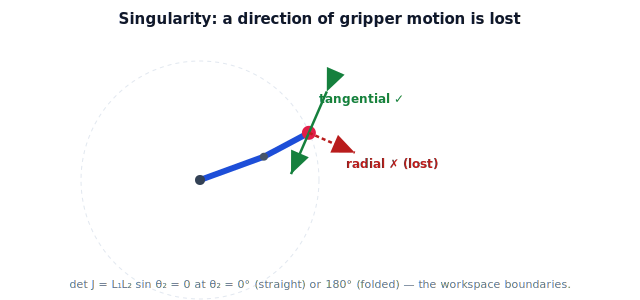

!!! abstract "You are here"
    **Module 5 — Inverse Kinematics**  ·  **Unit 6 — Singularities and Solution Selection**  ·  **Lesson 6.1 — Singularities: Where IK Breaks Down (Recognition)**

# Lesson 6.1 — Singularities: Where IK Breaks Down (Recognition)

> Unit 5 kept hitting "ill-conditioned" configurations. Here we name them: **singularities**, where the arm loses a direction of gripper motion. We learn to *recognize* them — the full theory is Module 6.

> **Scope note.** This lesson is **recognition only**: what a singularity looks like and why the solver struggles there. The deeper analysis — singular values, manipulability, the geometry of the lost subspace, and the velocity interpretation — belongs to **Module 6** and is deferred.

---

## 1. Why This Matters

Singularities are the configurations where every numerical IK method we built degrades: the pseudoinverse explodes, damping is needed, convergence stalls. They are not solver bugs — they are real geometric facts about the arm. Being able to spot them (and the damping fix from Lesson 5.2) is what keeps a harvester from commanding a violent motion when it drifts near one. We need recognition now; the theory can wait for Module 6.

## 2. Physical Intuition

Straighten your arm completely and try to move your fingertip *further out*, directly away from your shoulder. You cannot — you have run out of arm in that direction. You can still move side to side, but the "outward" direction is momentarily **lost**. That is a singularity: a pose where some direction of fingertip motion is temporarily unavailable, no matter how you move the joints. The fully-folded pose (forearm doubled back) is the same story at the inner edge. Near these poses, getting the fingertip to move the lost way demands enormous joint motion — which is exactly why the solver lurches.

## 3. Mathematical Foundations

The Jacobian maps joint moves to gripper moves, $\Delta\mathbf p \approx J\,\Delta\boldsymbol\theta$. At a **singularity**, $J$ **drops rank** — its columns no longer span all gripper directions, so some direction $\Delta\mathbf p$ cannot be produced by *any* $\Delta\boldsymbol\theta$. For a square $J$ this means

$$\det J = 0.$$

**Planar 2-link arm.** Recall

$$J = \begin{bmatrix} -L_1 s_1 - L_2 s_{12} & -L_2 s_{12} \\ L_1 c_1 + L_2 c_{12} & L_2 c_{12}\end{bmatrix}, \qquad \det J = L_1 L_2 \sin\theta_2.$$

So $\det J = 0$ exactly when $\sin\theta_2 = 0$, i.e. $\theta_2 = 0°$ (**arm straight**) or $\theta_2 = 180°$ (**arm fully folded**). These are precisely the **workspace boundaries** from Unit 1 — the outer circle ($\theta_2=0$) and the inner circle ($\theta_2=180°$) — and precisely where the two IK solutions merged. At these poses the gripper can still move *along* the arm's reach circle but **not radially** (in/out): the radial direction is lost.

Near a singularity ($\sin\theta_2$ small), $\det J \approx 0$, so $J^{-1}$ has huge entries — the pseudoinverse step blows up (Lesson 5.1) and damping becomes necessary (Lesson 5.2). **Recognition rule:** for the 2-link arm, you are at/near a singularity when $\theta_2$ is near $0°$ or $180°$, equivalently when the target is near the inner or outer workspace boundary.

(Why exactly one direction is lost, how "how singular" is measured, and the velocity meaning are Module 6.)

## 4. Visual Explanation

<figure markdown>
  { width="680" }
</figure>

## 5. Engineering Example

When the greenhouse arm stretches for a fruit at the very edge of its reach, it approaches the straight-arm singularity: to extend the last millimeter outward, the joints would have to move a lot, and the naive solver would command a jerk. The controller recognizes the near-singular pose (small $\sin\theta_2$ / target near the outer boundary), switches to damped least squares, and either eases in or repositions the base so the fruit is comfortably *inside* the workspace rather than on its singular edge.

## 6. Worked Example

$L_1 = 0.4, L_2 = 0.3$. Compute $\det J = L_1 L_2 \sin\theta_2 = 0.12\sin\theta_2$:

- $\theta_2 = 90°$: $\det J = 0.12$ — well-conditioned, solver happy.
- $\theta_2 = 10°$: $\det J = 0.12\sin10° = 0.0208$ — getting small, near the outer boundary, expect trouble.
- $\theta_2 = 0°$: $\det J = 0$ — **singular** (arm straight, $r = 0.7$); radial motion lost.
- $\theta_2 = 180°$: $\det J = 0$ — **singular** (folded, $r = 0.1$).

The notebook evaluates $\det J$ across $\theta_2$ and flags the near-singular band where damping should kick in.

## 7. Interactive Demonstration

<iframe src="../../demos/module05/lesson21_singularity_visualizer.html" title="Singularities: Where IK Breaks Down (Recognition) interactive demo" style="width:100%;height:520px;border:1px solid #e2e8f0;border-radius:12px"></iframe>

[Open this demo in a new tab ↗](../demos/module05/lesson21_singularity_visualizer.html)

The embedded **Singularity Visualizer** lets you sweep the 2-link arm's $\theta_2$ and watch $\det J$ (and the arm) live. As $\theta_2 \to 0°$ or $180°$, see $\det J \to 0$, the two reachable directions at the gripper collapse toward one (the radial direction is lost), and a "near-singular" warning appear. The readout shows $\det J$ and the lost direction, making concrete why the solver needs damping there.

## 8. Coding Exercise

!!! tip "Run the hands-on notebook"
    `modules/module05/notebooks/M05_U06_L6_1_Singularities_Recognition.ipynb` — open in JupyterLab and run **Kernel → Restart & Run All**.

Write `det_jacobian_2link(theta1, theta2, L1, L2)` (it should equal $L_1 L_2\sin\theta_2$ — verify against `np.linalg.det(jacobian_2link(...))`) and `near_singular(theta2, eps=0.05)` flagging $|\sin\theta_2| < \epsilon$. Sweep $\theta_2$ from $0$ to $180°$, plot $\det J$, and mark the singular angles. Confirm the flagged band matches where the pseudoinverse step magnitude spikes.

## 9. Knowledge Check

Formative — unlimited attempts, immediate feedback; does not affect your grade.

<iframe src="../../quizzes/module05/lesson21_quiz.html" title="Singularities: Where IK Breaks Down (Recognition) knowledge check" style="width:100%;height:720px;border:1px solid #e2e8f0;border-radius:12px"></iframe>

[Open this quiz in a new tab ↗](../quizzes/module05/lesson21_quiz.html)

Checks on the rank-drop/lost-direction idea, $\det J = L_1 L_2\sin\theta_2$, and recognizing the 2-link singular poses.

## 10. Challenge Problem

At the straight-arm singularity ($\theta_2 = 0$), show that both columns of $J$ become parallel (point the same way), so $J$ has rank 1. Which gripper direction can still be produced, and which is lost? Relate this to the two IK solutions merging at the workspace boundary (Lesson 2.3).

## 11. Common Mistakes

- Treating a singularity as a solver bug rather than a geometric property of the arm.
- Forgetting that the 2-link singularities ($\theta_2 = 0°, 180°$) are the workspace boundaries.
- Thinking *all* motion is lost — only a specific direction is; tangential motion remains.
- Importing the full singularity/manifold theory — here it is recognition only (Module 6 for the rest).

## 12. Key Takeaways

- A singularity is a configuration where $J$ drops rank — a direction of gripper motion is lost.
- For the planar 2-link arm, $\det J = L_1 L_2\sin\theta_2 = 0$ at $\theta_2 = 0°$ (straight) and $180°$ (folded) — the workspace boundaries.
- Near singularities the pseudoinverse blows up; damped least squares (5.2) is the fix.
- This lesson is recognition only; the full theory (singular values, manipulability, velocity meaning) is Module 6.

---

## AI Learning Companion

Copy any prompt below into ChatGPT, Claude, or another AI assistant.

**Tutor prompt** — explain it another way
```
Re-explain Lesson 6.1 (Module 5) — singularities as lost directions of gripper motion — using the straight-arm example. Show det J = L1 L2 sin θ2 = 0 at θ2 = 0° and 180°. Recognition only; keep the deeper theory for Module 6.
```

**Practice prompt** — generate more exercises
```
Give me 6 exercises computing det J for a planar 2-link arm and identifying near-singular configurations from θ2. Include answers.
```

**Explore prompt** — connect it to the real world
```
Show me how real robots detect and handle singularities (damping, avoidance, repositioning) without going into the full singular-value theory.
```

## Global Learning Support

Need this lesson explained in another language? Copy one of the prompts below into an AI assistant. English remains the authoritative source.

**Supported languages (initial):** English · Español · 中文 (Simplified Chinese) · Türkçe

**Español**
```
I just completed Lesson 6.1 (Module 5) — Singularities: Where IK Breaks Down (Recognition).
Explain this lesson in Spanish. Keep robotics and mathematical terminology in English when appropriate.
Then provide: a summary, three practice questions, and one challenge problem.
```

**中文 (Simplified Chinese)**
```
I just completed Lesson 6.1 (Module 5) — Singularities: Where IK Breaks Down (Recognition).
Explain this lesson in Simplified Chinese. Keep mathematical notation unchanged.
Then provide: a summary, three practice questions, and one challenge problem.
```

**Türkçe**
```
I just completed Lesson 6.1 (Module 5) — Singularities: Where IK Breaks Down (Recognition).
Explain this lesson in Turkish. Keep robotics terminology in English where commonly used.
Then provide: a summary, three practice questions, and one challenge problem.
```

---

*Next lesson: 6.2 — Joint Limits and Feasible Solutions.*
