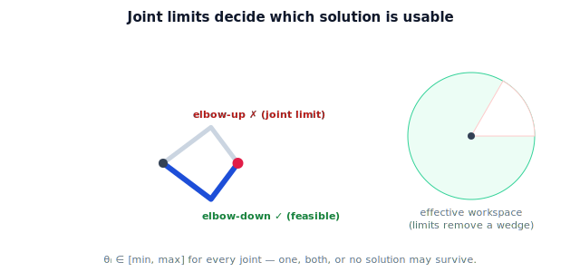

!!! abstract "You are here"
    **Module 5 — Inverse Kinematics**  ·  **Unit 6 — Singularities and Solution Selection**  ·  **Lesson 6.2 — Joint Limits and Feasible Solutions**

# Lesson 6.2 — Joint Limits and Feasible Solutions

> A solution the math accepts may be one the robot cannot strike. This lesson adds joint limits — the constraints that decide which IK solutions are actually feasible.

---

## 1. Why This Matters

Every physical joint has a range: a hinge stops, a motor has end-stops, cables limit twist. An IK solution that asks a joint to exceed its range is useless — worse, commanding it can damage the robot. So the solver must check each solution against the joint limits and keep only the **feasible** ones. This is the bridge between "a valid configuration" and "a configuration this robot can actually adopt."

## 2. Physical Intuition

Your elbow bends one way, not backward. If a reaching task "requires" your elbow to bend backward, that solution is off the table no matter how good it looks on paper — you would use the other way (elbow the other direction) or not reach at all. Robots are the same: the elbow-up solution might violate the elbow's limit while elbow-down respects it, so only elbow-down is usable. Sometimes both fit; sometimes neither, and the target is effectively out of reach for *this* arm even if geometrically inside the workspace.

## 3. Mathematical Foundations

Each joint $i$ has a range $[\theta_i^{\min}, \theta_i^{\max}]$. A configuration $\boldsymbol\theta$ is **feasible** only if every joint is in range:

$$\theta_i^{\min} \le \theta_i \le \theta_i^{\max} \quad\text{for all } i.$$

Given the IK solutions (e.g. the two for the planar 2-link arm), **filter**:

1. Compute all solutions (closed-form or numerical).
2. Discard any with a joint outside its limits.
3. From the survivors, select one (Lesson 6.3).

Consequences:

- **One solution feasible:** the choice is forced.
- **Both feasible:** selection criteria decide (next lesson).
- **None feasible:** the target is unreachable *for this arm's limits*, even though it lies in the unrestricted workspace — the solver reports failure, and the system may reposition.

Joint limits therefore **shrink the effective workspace**: the truly reachable set is not the full annulus but the subset for which *at least one* solution respects all limits. (Angle wrapping matters: compare angles modulo $360°$ to the limit interval, since e.g. $-170°$ and $190°$ are the same pose.)

## 4. Visual Explanation

<figure markdown>
  { width="680" }
</figure>

## 5. Engineering Example

The greenhouse arm's shoulder might be limited to $[-90°, 90°]$ so cables don't tangle. For a fruit low and behind, the elbow-up solution could demand a shoulder angle of $120°$ — out of range — while elbow-down keeps it at $60°$. The solver filters out elbow-up and commits elbow-down. If a fruit forces *both* solutions past a limit, the harvester reports it can't reach from here and the base repositions. Feasibility filtering is a routine, per-fruit step.

## 6. Worked Example

$L_1=0.4, L_2=0.3$, target $(0.5, 0.0)$. The two solutions (Lesson 2.3): elbow-down $(-36.87°, +90°)$ and elbow-up $(+36.87°, -90°)$. Suppose limits $\theta_1 \in [-45°, 45°]$, $\theta_2 \in [0°, 150°]$:

- Elbow-down $(-36.87°, +90°)$: $\theta_1 = -36.87° \in [-45,45]$ ✓; $\theta_2 = 90° \in [0,150]$ ✓ → **feasible**.
- Elbow-up $(+36.87°, -90°)$: $\theta_1 = 36.87°$ ✓; $\theta_2 = -90° \notin [0,150]$ ✗ → **infeasible**.

Only elbow-down survives; the choice is forced. The notebook applies the filter and returns the feasible set.

## 7. Interactive Demonstration

**Guided prediction.** For the worked example, predict which solution survives if $\theta_2$ is limited to $[0°, 150°]$ (elbow-down) versus $[-150°, 0°]$ (elbow-up). Predict a limit pair that makes the target infeasible (both $\theta_2$ signs excluded). Reason about how tightening $\theta_1$'s range carves a wedge out of the reachable annulus.

## 8. Coding Exercise

!!! tip "Run the hands-on notebook"
    `modules/module05/notebooks/M05_U06_L6_2_Joint_Limits.ipynb` — open in JupyterLab and run **Kernel → Restart & Run All**.

Write `feasible_solutions(sols, limits)` where `limits = [(t1min,t1max),(t2min,t2max)]` (degrees), returning only solutions with every joint in range (handle angle wrapping with a normalize-to-(−180,180] helper). Apply it to the two 2-link solutions for several targets and limit sets; confirm the worked-example result and a "none feasible" case.

## 9. Knowledge Check

Formative — unlimited attempts, immediate feedback; does not affect your grade.

<iframe src="../../quizzes/module05/lesson22_quiz.html" title="Joint Limits and Feasible Solutions knowledge check" style="width:100%;height:720px;border:1px solid #e2e8f0;border-radius:12px"></iframe>

[Open this quiz in a new tab ↗](../quizzes/module05/lesson22_quiz.html)

Checks on the feasibility condition, filtering the two solutions, and the effective-workspace shrinkage.

## 10. Challenge Problem

Joint limits can make a target reachable by *one* elbow configuration but not the other. Construct link lengths, a target, and a $\theta_2$ limit so that elbow-up is feasible and elbow-down is not (the reverse of the worked example). What does this say about always defaulting to one elbow preference?

## 11. Common Mistakes

- Returning a mathematically valid solution that violates a joint limit.
- Forgetting angle wrapping when comparing to limits (e.g. $190°$ vs $-170°$).
- Assuming the workspace annulus is fully reachable once limits exist.
- Treating "no feasible solution" as a solver error rather than a real "can't reach from here."

## 12. Key Takeaways

- A solution is **feasible** only if every joint lies within its limits.
- Filter the IK solutions; the result may be one, both, or none feasible.
- "None feasible" means unreachable for this arm's limits — report and (maybe) reposition.
- Joint limits shrink the effective workspace below the ideal annulus.

---

## AI Learning Companion

Copy any prompt below into ChatGPT, Claude, or another AI assistant.

**Tutor prompt** — explain it another way
```
Re-explain Lesson 6.2 (Module 5) — joint limits and feasible solutions — using the elbow-bends-one-way analogy. Show filtering the two 2-link solutions against limits, with one/both/none feasible.
```

**Practice prompt** — generate more exercises
```
Give me 6 exercises filtering planar 2-link IK solutions against joint limits, including angle-wrapping cases and a "none feasible" case. Include answers.
```

**Explore prompt** — connect it to the real world
```
Show me how real robot arms specify joint limits and how IK solvers filter solutions for feasibility before commanding a motion.
```

## Global Learning Support

Need this lesson explained in another language? Copy one of the prompts below into an AI assistant. English remains the authoritative source.

**Supported languages (initial):** English · Español · 中文 (Simplified Chinese) · Türkçe

**Español**
```
I just completed Lesson 6.2 (Module 5) — Joint Limits and Feasible Solutions.
Explain this lesson in Spanish. Keep robotics and mathematical terminology in English when appropriate.
Then provide: a summary, three practice questions, and one challenge problem.
```

**中文 (Simplified Chinese)**
```
I just completed Lesson 6.2 (Module 5) — Joint Limits and Feasible Solutions.
Explain this lesson in Simplified Chinese. Keep mathematical notation unchanged.
Then provide: a summary, three practice questions, and one challenge problem.
```

**Türkçe**
```
I just completed Lesson 6.2 (Module 5) — Joint Limits and Feasible Solutions.
Explain this lesson in Turkish. Keep robotics terminology in English where commonly used.
Then provide: a summary, three practice questions, and one challenge problem.
```

---

*Next lesson: 6.3 — Choosing Among Solutions (Nearest, Smooth, Limit-Safe).*
