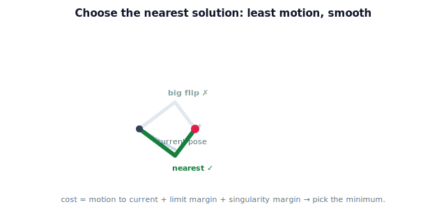

!!! abstract "You are here"
    **Module 5 — Inverse Kinematics**  ·  **Unit 6 — Singularities and Solution Selection**  ·  **Lesson 6.3 — Choosing Among Solutions (Nearest, Smooth, Limit-Safe)**

# Lesson 6.3 — Choosing Among Solutions (Nearest, Smooth, Limit-Safe)

> Reachability and limits may leave more than one valid solution. This lesson is about *choosing well* — picking the configuration that makes for the best, safest motion.

---

## 1. Why This Matters

A harvester that picks an arbitrary feasible solution each time will jerk between wildly different arm shapes, waste motion, and drift toward joint limits or singularities. Choosing the *right* solution — closest to where the arm already is, smooth from fruit to fruit, and clear of limits and singular edges — is what turns a working solver into a graceful, reliable one. This is the last piece before the arm is ready to actually reach.

## 2. Physical Intuition

If you are already reaching out and the next berry is just to the left, you do not yank your whole arm into a totally different shape — you make the *smallest* adjustment that gets your hand there. You also avoid contorting into a pose where your elbow is locked straight (no room to adjust) or jammed against its limit. The robot should reason the same way: prefer the nearby solution, keep motion smooth, and stay in comfortable, flexible configurations.

## 3. Mathematical Foundations

Given the feasible solutions $\{\boldsymbol\theta^{(k)}\}$ (after Lesson 6.2) and the current configuration $\boldsymbol\theta_{\text{cur}}$, score each and pick the lowest cost:

**Nearest (least motion).** Prefer the solution closest to the current pose:

$$d_k = \|\boldsymbol\theta^{(k)} - \boldsymbol\theta_{\text{cur}}\| \quad(\text{angle-wrapped per joint}).$$

This minimizes joint travel and keeps motion **smooth** — consecutive solves stay near each other, so the arm doesn't flip between elbow-up and elbow-down frame to frame.

**Limit-safe (margin).** Penalize solutions whose joints sit near their limits:

$$m_k = \sum_i \text{penalty}\big(\text{distance of } \theta_i^{(k)} \text{ to its nearest limit}\big),$$

larger when a joint is close to a limit.

**Singularity-safe (manipulability proxy).** Penalize near-singular poses; for the 2-link arm, a simple proxy is small $|\det J| = L_1 L_2|\sin\theta_2|$ (Lesson 6.1) — prefer solutions with $\theta_2$ away from $0°/180°$.

**Combined cost.** Weight and sum:

$$C_k = w_d\,d_k + w_m\,m_k + w_s\,\frac{1}{|\det J^{(k)}| + \epsilon}, \qquad \text{pick } \arg\min_k C_k.$$

The weights $w_\bullet$ encode the application's priorities (smoothness vs safety). For the simplest useful policy, **nearest-to-current** alone already gives smooth, sensible motion; the other terms add safety margin. The chosen solution is then sent to the controller.

## 4. Visual Explanation

<figure markdown>
  { width="680" }
</figure>

## 5. Engineering Example

The greenhouse arm harvests a cluster of tomatoes in sequence. For each, several feasible solutions exist, but the controller picks the one nearest the current pose, so the gripper flows smoothly from fruit to fruit instead of flipping elbow-up/down between picks. It also avoids solutions that park a joint against its limit (no room for the next pick) or near the straight-arm singularity (jerky). The result is a steady, efficient harvesting motion.

## 6. Worked Example

$L_1=0.4, L_2=0.3$, target $(0.5, 0.0)$, current pose $\boldsymbol\theta_{\text{cur}} = (-30°, 80°)$ (near the elbow-down solution). Feasible solutions: elbow-down $(-36.87°, +90°)$, elbow-up $(+36.87°, -90°)$.

- $d_{\text{down}} = \|(-36.87,90) - (-30,80)\| = \sqrt{6.87^2 + 10^2} \approx 12.1°$.
- $d_{\text{up}} = \|(36.87,-90) - (-30,80)\| = \sqrt{66.87^2 + 170^2} \approx 182.7°$.

Nearest → **elbow-down** (tiny adjustment) over elbow-up (a huge flip). Both have $|\det J| = 0.12$ (same $|\sin\theta_2|$), so the singularity term doesn't break the tie; nearest decides. The notebook computes the costs and returns elbow-down.

## 7. Interactive Demonstration

**Guided prediction.** For target $(0.5,0)$, predict which solution is chosen when the current pose is near elbow-down vs near elbow-up. Predict how the choice changes if a joint limit makes the nearest solution infeasible (the solver must take the farther one — a flip). Reason about why nearest-to-current avoids elbow flips during a harvest sweep.

## 8. Coding Exercise

!!! tip "Run the hands-on notebook"
    `modules/module05/notebooks/M05_U06_L6_3_Choosing_Among_Solutions.ipynb` — open in JupyterLab and run **Kernel → Restart & Run All**.

Write `choose_solution(sols, theta_cur, limits=None, L1=0.4, L2=0.3, w=(1,0,0))` that filters by limits (6.2), scores survivors by a weighted cost (start with nearest-only `w=(1,0,0)`, then add limit/singularity terms), and returns the best. Verify it picks elbow-down for the worked example, and that forcing the nearest solution infeasible makes it return the other.

## 9. Knowledge Check

Formative — unlimited attempts, immediate feedback; does not affect your grade.

<iframe src="../../quizzes/module05/lesson23_quiz.html" title="Choosing Among Solutions (Nearest, Smooth, Limit-Safe) knowledge check" style="width:100%;height:720px;border:1px solid #e2e8f0;border-radius:12px"></iframe>

[Open this quiz in a new tab ↗](../quizzes/module05/lesson23_quiz.html)

Checks on the selection criteria, computing nearest-to-current, and combining terms into a cost.

## 10. Challenge Problem

"Nearest to current pose" keeps motion smooth but can trap the arm: a sequence of nearest choices might walk a joint steadily toward its limit until the next pick has *no* feasible nearby solution, forcing a big flip anyway. Sketch a scenario where a slightly-farther choice now avoids a costly flip later. What does this suggest about purely greedy selection?

## 11. Common Mistakes

- Picking an arbitrary feasible solution, causing elbow flips between picks.
- Forgetting angle wrapping in the distance $\|\boldsymbol\theta^{(k)} - \boldsymbol\theta_{\text{cur}}\|$.
- Ignoring limit/singularity margin and parking a joint at its edge.
- Assuming greedy nearest is always globally best (it can trap the arm).

## 12. Key Takeaways

- With multiple feasible solutions, choose by **nearest to current** (least motion, smooth), **limit-safe** (margin), and **singularity-safe** ($|\det J|$ proxy).
- A weighted cost ranks solutions; nearest-only already gives smooth motion.
- Selection prevents elbow flips and keeps the arm in flexible, safe poses.
- Greedy nearest can occasionally trap the arm — a hook toward planning (Module 7).

---

## AI Learning Companion

Copy any prompt below into ChatGPT, Claude, or another AI assistant.

**Tutor prompt** — explain it another way
```
Re-explain Lesson 6.3 (Module 5) — choosing among IK solutions — using the nearest-to-current-pose idea plus limit and singularity safety. Show the weighted selection cost.
```

**Practice prompt** — generate more exercises
```
Give me 6 exercises selecting among feasible planar 2-link solutions by nearest-to-current pose (with angle wrapping), including a case where a limit forces the farther solution. Include answers.
```

**Explore prompt** — connect it to the real world
```
Show me how real robot controllers choose among IK solutions to keep motion smooth and avoid joint limits and singularities during repetitive tasks.
```

## Global Learning Support

Need this lesson explained in another language? Copy one of the prompts below into an AI assistant. English remains the authoritative source.

**Supported languages (initial):** English · Español · 中文 (Simplified Chinese) · Türkçe

**Español**
```
I just completed Lesson 6.3 (Module 5) — Choosing Among Solutions (Nearest, Smooth, Limit-Safe).
Explain this lesson in Spanish. Keep robotics and mathematical terminology in English when appropriate.
Then provide: a summary, three practice questions, and one challenge problem.
```

**中文 (Simplified Chinese)**
```
I just completed Lesson 6.3 (Module 5) — Choosing Among Solutions (Nearest, Smooth, Limit-Safe).
Explain this lesson in Simplified Chinese. Keep mathematical notation unchanged.
Then provide: a summary, three practice questions, and one challenge problem.
```

**Türkçe**
```
I just completed Lesson 6.3 (Module 5) — Choosing Among Solutions (Nearest, Smooth, Limit-Safe).
Explain this lesson in Turkish. Keep robotics terminology in English where commonly used.
Then provide: a summary, three practice questions, and one challenge problem.
```

---

*Next lesson: 6.4 — Singularities and Solution Selection (Unit 6 Recap).*
