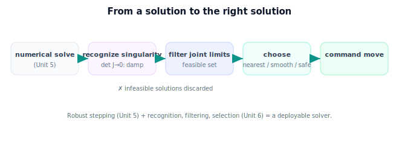

!!! abstract "You are here"
    **Module 5 — Inverse Kinematics**  ·  **Unit 6 — Singularities and Solution Selection**  ·  **Lesson 6.4 — Singularities and Solution Selection (Unit 6 Recap)**

# Lesson 6.4 — Singularities and Solution Selection (Unit 6 Recap)

*A short synthesis — no new mathematics. It consolidates Unit 6 and points to Unit 7.*

---

## What Unit 6 established

The unit in one line:

> **A wise solver: recognize singularities (where $J$ drops rank, $\det J = 0$ — a lost gripper direction), keep only joint-limit-feasible solutions, and choose among them by nearest-to-current, smoothness, and limit/singularity safety.**

## The arc of the unit

| Lesson | Idea |
|---|---|
| 6.1 Singularities (recognition) | $J$ drops rank → a direction of gripper motion is lost; 2-link: $\det J = L_1 L_2\sin\theta_2 = 0$ at $\theta_2 = 0°/180°$ (workspace boundaries). Full theory → Module 6. |
| 6.2 Joint Limits | Keep only solutions with every $\theta_i \in [\theta_i^{\min}, \theta_i^{\max}]$; one/both/none feasible; limits shrink the effective workspace. |
| 6.3 Choosing Among Solutions | Score feasible solutions by nearest-to-current (least motion, smooth), limit margin, and singularity margin; pick the lowest cost. |

## The one picture to carry forward

Numerical IK alone returns *a* solution; Unit 6 makes the system return *the right* one. First, **recognize** the configurations where the math degrades (singularities) and lean on damping there. Then **filter** out everything the physical arm can't strike (joint limits). Then **choose** among what's left for the smoothest, safest motion (nearest to current pose, away from limits and singular edges). Together with Unit 5's robust stepping, this is a solver you could run on a real harvester all day — fast where it can be, safe where it must be, and graceful between picks.

## Visual Explanation

<figure markdown>
  { width="680" }
</figure>

## Where Unit 7 goes

Unit 7 — **Verifying and Connecting to Perception** — closes the loop. Before the arm moves, **verify** the chosen solution by forward kinematics (does it really put the gripper on the target, within tolerance?) and sanity-check reachability/limits. Then reconnect to the start of the pipeline: the *target* came from **perception** (Module 3) placed into the arm's base frame via the **forward-kinematics bridge** (Module 4). Unit 7 makes "perceive a fruit → solve IK → verify → reach" a single trustworthy chain — and sets up the Unit 8 capstone, "Reach the Fruit."

## Key Takeaways

- Recognize singularities ($\det J = 0$, lost direction) and damp there (recognition only; theory in Module 6).
- Filter IK solutions by joint limits; the effective workspace is smaller than the annulus.
- Choose among feasible solutions by nearest-to-current, smoothness, and limit/singularity safety.
- Unit 7 verifies the chosen solution and reconnects IK to perception.

---

## Coding Exercise

!!! tip "Run the hands-on notebook"
    `modules/module05/notebooks/M05_U06_L6_4_Singularities_Selection_Unit_6_Recap.ipynb` — open in JupyterLab and run **Kernel → Restart & Run All**.

Open the consolidation notebook for Unit 6 and run **Kernel → Restart & Run All**; it re-exercises the unit's key routines end to end and prints `All checks passed.`

## Knowledge Check

Formative — unlimited attempts, immediate feedback; does not affect your grade.

<iframe src="../../quizzes/module05/lesson24_quiz.html" title="Singularities and Solution Selection (Unit 6 Recap) knowledge check" style="width:100%;height:720px;border:1px solid #e2e8f0;border-radius:12px"></iframe>

[Open this quiz in a new tab ↗](../quizzes/module05/lesson24_quiz.html)

A brief consolidation quiz across Unit 6 (formative — unlimited attempts, immediate feedback).

## AI Learning Companion

Copy any prompt below into ChatGPT, Claude, or another AI assistant.

**Tutor prompt** — explain it another way
```
Summarize Unit 6 of Module 5 (Inverse Kinematics): singularity recognition (det J = 0, lost direction), joint-limit feasibility filtering, and solution selection (nearest, smooth, safe). Explain how they make the solver deployable.
```

**Practice prompt** — generate more exercises
```
Give me 8 mixed exercises across singularity recognition (det J), joint-limit filtering, and nearest-solution selection for a planar 2-link arm. Include answers.
```

**Explore prompt** — connect it to the real world
```
Show me how real robot controllers combine singularity handling, joint-limit checks, and solution selection into one IK pipeline for repetitive tasks.
```

## Global Learning Support

Need this lesson explained in another language? Copy one of the prompts below into an AI assistant. English remains the authoritative source.

**Supported languages (initial):** English · Español · 中文 (Simplified Chinese) · Türkçe

**Español**
```
I just completed Lesson 6.4 (Module 5) — Singularities and Solution Selection (Unit 6 Recap).
Explain this unit in Spanish. Keep robotics and mathematical terminology in English when appropriate.
Then provide: a summary, three practice questions, and one challenge problem.
```

**中文 (Simplified Chinese)**
```
I just completed Lesson 6.4 (Module 5) — Singularities and Solution Selection (Unit 6 Recap).
Explain this unit in Simplified Chinese. Keep mathematical notation unchanged.
Then provide: a summary, three practice questions, and one challenge problem.
```

**Türkçe**
```
I just completed Lesson 6.4 (Module 5) — Singularities and Solution Selection (Unit 6 Recap).
Explain this unit in Turkish. Keep robotics terminology in English where commonly used.
Then provide: a summary, three practice questions, and one challenge problem.
```

---

*Next lesson: 7.1 — Verifying an IK Solution.*
