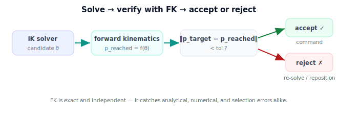

!!! abstract "You are here"
    **Module 5 — Inverse Kinematics**  ·  **Unit 7 — Verifying and Connecting to Perception**  ·  **Lesson 7.1 — Verifying a Solution with Forward Kinematics**

# Lesson 7.1 — Verifying a Solution with Forward Kinematics

> Inverse kinematics produces *candidates*. This lesson adds the rule that makes the solver trustworthy: push every candidate back through forward kinematics and accept it only if the gripper truly lands on the target.

---

## 1. Why This Matters

Every IK method can be wrong: a closed-form quadrant slip, a numerical solver that stalled below tolerance, a selection that picked an infeasible pose. Forward kinematics is the independent check — it is exact and never lies. The discipline **solve → verify with FK → accept or reject** is what separates a solver you hope works from one you *know* works. On a real harvester, this check is the last gate before the arm commits a motion.

## 2. Physical Intuition

Imagine someone hands you a set of joint angles and claims "this reaches the tomato." You wouldn't just believe them — you'd mentally fold the arm to those angles and see where the gripper ends up. If it lands on the tomato, accept; if not, reject and try again. Forward kinematics is exactly that mental check, done precisely: given the angles, it computes where the gripper *actually* goes, so you can compare against where you *wanted* it. The solver proposes; forward kinematics disposes.

## 3. Mathematical Foundations

A candidate configuration $\boldsymbol\theta_c$ from any IK method is **verified** by evaluating the forward map and measuring the residual against the target:

$$\mathbf p_{\text{reached}} = f(\boldsymbol\theta_c), \qquad \text{residual } = \|\mathbf p_{\text{target}} - \mathbf p_{\text{reached}}\|.$$

**Accept** if the residual is within tolerance, else **reject**:

$$\text{accept} \iff \|\mathbf p_{\text{target}} - f(\boldsymbol\theta_c)\| < \texttt{tol}.$$

For a full pose (position *and* orientation), verify both: position residual $\|\mathbf p_{\text{target}} - \mathbf p_{\text{reached}}\|$ and an orientation residual (e.g. the angle of $R_{\text{target}}^\top R_{\text{reached}}$), each within its own tolerance.

This single check catches every failure class:

- **Analytical errors** — a wrong-quadrant `atan2` or dropped solution gives a gripper that misses; FK exposes it.
- **Numerical errors** — a solver that hit `max_iter` short of tolerance leaves a large residual; FK rejects it.
- **Selection/limit errors** — if selection returned a pose that doesn't actually reach (e.g. picked from a stale solution set), FK catches the mismatch.

Verification is cheap (one forward evaluation) and independent of how the candidate was produced — which is exactly why it is trustworthy. The rule: *no configuration is sent to the arm until forward kinematics confirms it.*

## 4. Visual Explanation

<figure markdown>
  { width="680" }
</figure>

## 5. Engineering Example

The greenhouse controller never commands a configuration straight from the solver. It computes the candidate (analytical or numerical), runs forward kinematics, and checks the gripper lands within the grasp tolerance (say 2 mm). Only then does it move. If the residual is too large — a stalled numerical solve, or a fruit that turned out unreachable — it rejects and either re-seeds, switches to damped least squares, or signals the base to reposition. The fruit is never speared because of an unverified solution.

## 6. Worked Example

$L_1=0.4, L_2=0.3$, target $(0.5, 0.2)$, tolerance $10^{-3}$ m.

- **Candidate A** (good): $\boldsymbol\theta_A$ from the closed form. $f(\boldsymbol\theta_A) = (0.5000, 0.2000)$, residual $= 2\times10^{-16}$ → **accept**.
- **Candidate B** (stalled numerical, stopped early): $\boldsymbol\theta_B$ with $f(\boldsymbol\theta_B) = (0.487, 0.206)$, residual $= \sqrt{0.013^2 + 0.006^2} = 0.0143$ m $> 10^{-3}$ → **reject**.
- **Candidate C** (wrong quadrant): $f(\boldsymbol\theta_C) = (0.5, -0.2)$ (reflected), residual $= 0.4$ m → **reject**.

Only A is sent to the arm. The notebook verifies each candidate and prints accept/reject with the residual.

## 7. Interactive Demonstration

<iframe src="../../demos/module05/lesson25_verifying_with_fk.html" title="Verifying a Solution with Forward Kinematics interactive demo" style="width:100%;height:520px;border:1px solid #e2e8f0;border-radius:12px"></iframe>

[Open this demo in a new tab ↗](../demos/module05/lesson25_verifying_with_fk.html)

**Guided prediction.** For the three worked-example candidates, predict accept/reject from the residual before computing. Then take a numerical solve you stop at `max_iter = 3` (deliberately too few) and predict it will be *rejected* by FK because the residual is still large — confirming that "the solver returned something" is not the same as "the something is correct."

## 8. Coding Exercise

!!! tip "Run the hands-on notebook"
    `modules/module05/notebooks/M05_U07_L7_1_Verifying_With_FK.ipynb` — open in JupyterLab and run **Kernel → Restart & Run All**.

Write `verify(theta_c, target, L1, L2, tol=1e-3)` returning `(accepted, residual)` using `fk_two_link`. Run it on: a closed-form solution (accept), a numerical solve capped at 3 iterations (reject, large residual), and a deliberately reflected configuration (reject). Confirm the accept/reject decisions and that only verified candidates would be commanded.

## 9. Knowledge Check

Formative — unlimited attempts, immediate feedback; does not affect your grade.

<iframe src="../../quizzes/module05/lesson25_quiz.html" title="Verifying a Solution with Forward Kinematics knowledge check" style="width:100%;height:720px;border:1px solid #e2e8f0;border-radius:12px"></iframe>

[Open this quiz in a new tab ↗](../quizzes/module05/lesson25_quiz.html)

Checks on the solve-verify-accept/reject rule, the FK residual, and what verification catches.

## 10. Challenge Problem

A numerical solver reports "converged" with its *internal* error below tolerance, yet an independent FK check shows a large residual. Name two bugs that could cause this disagreement (hint: the solver's error might be measured against the wrong target, or the Jacobian/FK used inside the loop might not match the true arm). Why does an *independent* FK verification with the true model catch both?

## 11. Common Mistakes

- Trusting "the solver returned a value" as success without an FK check.
- Verifying with the same (possibly buggy) FK the solver used internally instead of the trusted model.
- Checking position but not orientation for a full-pose target.
- Setting the verification tolerance looser than the task actually allows.

## 12. Key Takeaways

- Discipline: **solve → verify with FK → accept or reject**; no configuration reaches the arm unverified.
- Verify by the residual $\|\mathbf p_{\text{target}} - f(\boldsymbol\theta_c)\| < \texttt{tol}$ (position and, for full pose, orientation).
- FK verification is exact, cheap, and independent — it catches analytical, numerical, and selection errors alike.
- Reject → re-seed, switch step rule, or reposition; never command an unverified pose.

---

## AI Learning Companion

Copy any prompt below into ChatGPT, Claude, or another AI assistant.

**Tutor prompt** — explain it another way
```
Re-explain Lesson 7.1 (Module 5) — verifying an IK solution with forward kinematics — using the solve → verify → accept/reject discipline. Show the residual check and why FK catches analytical, numerical, and selection errors.
```

**Practice prompt** — generate more exercises
```
Give me 6 exercises verifying candidate IK solutions for a planar 2-link arm by forward kinematics, deciding accept/reject from the residual. Include answers.
```

**Explore prompt** — connect it to the real world
```
Show me how real robot software verifies IK solutions before commanding a motion, and what it does when verification fails.
```

## Global Learning Support

Need this lesson explained in another language? Copy one of the prompts below into an AI assistant. English remains the authoritative source.

**Supported languages (initial):** English · Español · 中文 (Simplified Chinese) · Türkçe

**Español**
```
I just completed Lesson 7.1 (Module 5) — Verifying a Solution with Forward Kinematics.
Explain this lesson in Spanish. Keep robotics and mathematical terminology in English when appropriate.
Then provide: a summary, three practice questions, and one challenge problem.
```

**中文 (Simplified Chinese)**
```
I just completed Lesson 7.1 (Module 5) — Verifying a Solution with Forward Kinematics.
Explain this lesson in Simplified Chinese. Keep mathematical notation unchanged.
Then provide: a summary, three practice questions, and one challenge problem.
```

**Türkçe**
```
I just completed Lesson 7.1 (Module 5) — Verifying a Solution with Forward Kinematics.
Explain this lesson in Turkish. Keep robotics terminology in English where commonly used.
Then provide: a summary, three practice questions, and one challenge problem.
```

---

*Next lesson: 7.2 — From a Fruit's Grasp Pose to a Target Configuration.*
