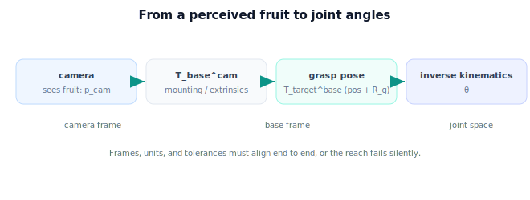

!!! abstract "You are here"
    **Module 5 — Inverse Kinematics**  ·  **Unit 7 — Verifying and Connecting to Perception**  ·  **Lesson 7.2 — From a Fruit's Grasp Pose to a Target Configuration**

# Lesson 7.2 — From a Fruit's Grasp Pose to a Target Configuration

> IK needs a target *in the arm's base frame*. Perception delivers one — but only after a chain of transforms. This lesson connects the perceived fruit to the solver's input.

---

## 1. Why This Matters

The whole point of the arm is to reach things the camera sees. But the camera reports positions in *its* frame, and the solver needs them in the *base* frame. Getting this hand-off right — frames aligned, units consistent, the grasp pose well-defined — is what makes "see a fruit, reach it" actually work. A perfect solver fed a target in the wrong frame reaches confidently into empty air. This lesson is the connective tissue of the capstone.

## 2. Physical Intuition

The camera says "there's a tomato 30 cm ahead and 10 cm to my left." But the arm doesn't think in camera terms — it thinks from its own shoulder. So you translate: "given where the camera is bolted relative to my base, that tomato is *here* in my own coordinates." Once the target is in the arm's own frame, the solver can do its job. It's the same as a passenger giving directions relative to the car ("turn left") versus the map's absolute frame — someone has to convert between them.

## 3. Mathematical Foundations

The chain, reusing earlier modules:

1. **Perception (Module 3)** detects the fruit and, with depth, gives its 3D position in the **camera frame**: $\mathbf p^{\text{cam}}$.
2. **Camera-to-base transform (Modules 2 & 4)** — the camera's pose relative to the arm base, $T_{\text{base}}^{\text{cam}}$ (extrinsics / mounting), maps it into the **base frame**:

$$\mathbf p^{\text{base}} = T_{\text{base}}^{\text{cam}}\,\mathbf p^{\text{cam}} \quad\text{(in homogeneous coordinates)}.$$

3. **Grasp pose** — reaching needs more than a point; a grasp pose $T_{\text{target}}^{\text{base}} = \begin{bmatrix} R_g & \mathbf p^{\text{base}} \\ \mathbf 0 & 1\end{bmatrix}$ adds the desired approach orientation $R_g$ (how the gripper should be oriented to grasp, e.g. approaching the fruit from the side to avoid the stem).
4. **Inverse kinematics** takes that base-frame target and returns joint angles: solve $T_0^n(\boldsymbol\theta) = T_{\text{target}}^{\text{base}}$ (position-focused for the planar/3-DOF running example; full pose where the arm allows).

Three things must line up end to end or the reach fails silently:

- **Frames:** every quantity expressed in, or correctly transformed into, the base frame.
- **Units:** consistent metres throughout (perception, transforms, link lengths).
- **Tolerances:** the perception error + transform error must be smaller than the grasp tolerance, or even a perfect IK solve misses.

For the planar running example we use the position $\mathbf p^{\text{base}}$ (and a planar approach angle) as the IK target; the capstone (Unit 8) runs the full hand-off.

## 4. Visual Explanation

<figure markdown>
  { width="680" }
</figure>

## 5. Engineering Example

The greenhouse camera detects a tomato and, with stereo depth, places it at $\mathbf p^{\text{cam}}$. The known camera mount $T_{\text{base}}^{\text{cam}}$ converts that to $\mathbf p^{\text{base}}$. The planner attaches a side-approach orientation (to slip the gripper past the stem), forming the grasp pose, and hands it to the IK solver. The solver returns joint angles; FK verifies (Lesson 7.1); the arm reaches. Every fruit follows this exact hand-off — perception's frame to the arm's frame to joint space.

## 6. Worked Example

Camera mounted so that $T_{\text{base}}^{\text{cam}}$ is a translation of $(0.1, 0.0)$ m (camera 10 cm in front of the base, axes aligned) for a planar setup. Perception reports the fruit at $\mathbf p^{\text{cam}} = (0.4, 0.2)$ m.

$$\mathbf p^{\text{base}} = \mathbf p^{\text{cam}} + (0.1, 0.0) = (0.5, 0.2)\ \text{m}.$$

That base-frame point becomes the IK target $(0.5, 0.2)$ — exactly the target used throughout Units 5–6. The solver returns the elbow-down/elbow-up angles; FK verifies them on $(0.5, 0.2)$. The notebook runs the transform then the solve.

## 7. Interactive Demonstration

<iframe src="../../demos/module05/lesson26_grasp_pose_to_config.html" title="From a Fruit's Grasp Pose to a Target Configuration interactive demo" style="width:100%;height:520px;border:1px solid #e2e8f0;border-radius:12px"></iframe>

[Open this demo in a new tab ↗](../demos/module05/lesson26_grasp_pose_to_config.html)

**Guided prediction.** Given $T_{\text{base}}^{\text{cam}}$ as a 10 cm forward translation and a fruit at $\mathbf p^{\text{cam}} = (0.4, 0.2)$, predict $\mathbf p^{\text{base}}$ and then the IK target. Predict what happens to the reach if you *forget* the transform and feed $\mathbf p^{\text{cam}}$ directly (the arm aims 10 cm short). Reason about why a frame error produces a confident-but-wrong reach.

## 8. Coding Exercise

!!! tip "Run the hands-on notebook"
    `modules/module05/notebooks/M05_U07_L7_2_Grasp_Pose_To_Target.ipynb` — open in JupyterLab and run **Kernel → Restart & Run All**.

Write `cam_to_base(p_cam, T_base_cam)` (homogeneous transform) and chain it into the solver: `perceive_and_solve(p_cam, T_base_cam, L1, L2)` → returns verified joint solutions for the base-frame target. Test on the worked example (fruit at $(0.4,0.2)$ cam → $(0.5,0.2)$ base → verified angles), and show that skipping the transform gives a wrong (FK-rejected) reach.

## 9. Knowledge Check

Formative — unlimited attempts, immediate feedback; does not affect your grade.

<iframe src="../../quizzes/module05/lesson26_quiz.html" title="From a Fruit's Grasp Pose to a Target Configuration knowledge check" style="width:100%;height:720px;border:1px solid #e2e8f0;border-radius:12px"></iframe>

[Open this quiz in a new tab ↗](../quizzes/module05/lesson26_quiz.html)

Checks on the camera→base transform, the grasp pose, and the frame/unit/tolerance alignment.

## 10. Challenge Problem

Suppose perception has a 3 mm error and the camera-to-base transform has a 2 mm error, and the grasp tolerance is 4 mm. Even a *perfect* IK solve may miss — why? Combine the error sources (roughly, in quadrature) and compare to the tolerance. What does this say about where to spend effort improving the pipeline?

## 11. Common Mistakes

- Feeding the camera-frame position to IK without the camera→base transform.
- Mixing units (cm vs m) between perception, transforms, and link lengths.
- Forgetting the grasp *orientation* and only positioning the gripper.
- Assuming a perfect IK solve guarantees a successful grasp regardless of perception/transform error.

## 12. Key Takeaways

- The IK target must be in the **base frame**; perception delivers it via $\mathbf p^{\text{base}} = T_{\text{base}}^{\text{cam}}\mathbf p^{\text{cam}}$.
- A grasp pose adds the approach orientation $R_g$ to the position.
- Frames, units, and tolerances must align end to end or the reach fails silently.
- This hand-off connects Modules 3 → 4 → 5 and is the spine of the capstone.

---

## AI Learning Companion

Copy any prompt below into ChatGPT, Claude, or another AI assistant.

**Tutor prompt** — explain it another way
```
Re-explain Lesson 7.2 (Module 5) — turning a perceived fruit's grasp pose into an IK target — using the camera→base transform p_base = T_base^cam p_cam and the grasp orientation. Explain why frames, units, and tolerances must line up.
```

**Practice prompt** — generate more exercises
```
Give me 5 exercises transforming a fruit's camera-frame position into the base frame and forming the IK target, including a case where forgetting the transform causes a miss. Include answers.
```

**Explore prompt** — connect it to the real world
```
Show me how a real robot pipeline takes a camera detection, transforms it into the arm's base frame, attaches a grasp pose, and feeds it to inverse kinematics.
```

## Global Learning Support

Need this lesson explained in another language? Copy one of the prompts below into an AI assistant. English remains the authoritative source.

**Supported languages (initial):** English · Español · 中文 (Simplified Chinese) · Türkçe

**Español**
```
I just completed Lesson 7.2 (Module 5) — From a Fruit's Grasp Pose to a Target Configuration.
Explain this lesson in Spanish. Keep robotics and mathematical terminology in English when appropriate.
Then provide: a summary, three practice questions, and one challenge problem.
```

**中文 (Simplified Chinese)**
```
I just completed Lesson 7.2 (Module 5) — From a Fruit's Grasp Pose to a Target Configuration.
Explain this lesson in Simplified Chinese. Keep mathematical notation unchanged.
Then provide: a summary, three practice questions, and one challenge problem.
```

**Türkçe**
```
I just completed Lesson 7.2 (Module 5) — From a Fruit's Grasp Pose to a Target Configuration.
Explain this lesson in Turkish. Keep robotics terminology in English where commonly used.
Then provide: a summary, three practice questions, and one challenge problem.
```

---

*Next lesson: 7.3 — Closing the Loop: Perceive → Place → Solve.*
