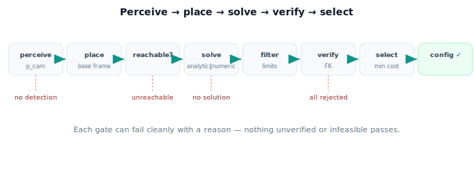

!!! abstract "You are here"
    **Module 5 — Inverse Kinematics**  ·  **Unit 7 — Verifying and Connecting to Perception**  ·  **Lesson 7.3 — Closing the Loop: Perceive → Place → Solve**

# Lesson 7.3 — Closing the Loop: Perceive → Place → Solve

> Each piece now exists — perception, transforms, the solver, verification, selection. This lesson wires them into one pipeline that takes a fruit and returns a configuration the arm can trust.

---

## 1. Why This Matters

A robot is only as good as its weakest link, and the links must connect. This lesson is where the module's parts stop being separate skills and become one workflow: pixels in, verified joint angles out. Assembling it cleanly — with clear accept/reject and no-solution handling — is the difference between a pile of working functions and a system that reaches fruit. It is the dry run for the Unit 8 capstone.

## 2. Physical Intuition

Think of an assembly line. Station 1 spots the fruit. Station 2 expresses where it is in the arm's own terms. Station 3 works out the joint angles. Station 4 double-checks by imagining the arm folded to those angles. Station 5 picks the best feasible option. If any station fails — fruit not found, out of reach, no feasible pose — the line flags it rather than passing a defective part downstream. The pipeline is that disciplined line: each stage hands clean, checked work to the next.

## 3. Mathematical Foundations

The pipeline, as one function `perceive_place_solve(detection) → result`:

1. **Perceive** — from the detection (and depth), get $\mathbf p^{\text{cam}}$ (Module 3). *Fail → "no detection."*
2. **Place** — transform to the base frame, $\mathbf p^{\text{base}} = T_{\text{base}}^{\text{cam}}\mathbf p^{\text{cam}}$, and form the grasp pose $T_{\text{target}}^{\text{base}}$ (Lesson 7.2).
3. **Reachability gate** — is $\mathbf p^{\text{base}}$ in the workspace (Lesson 1.3)? *No → "unreachable."*
4. **Solve** — analytical where available (closed form), numerical otherwise (Newton / damped least squares) → candidate configurations.
5. **Filter** — keep joint-limit-feasible candidates (Lesson 6.2). *None → "no feasible solution."*
6. **Verify** — FK-check each candidate's residual (Lesson 7.1); drop any that miss.
7. **Select** — choose the best verified, feasible candidate (nearest-to-current, safe; Lesson 6.3).
8. **Return** — `(theta_chosen, "ok")`, or the appropriate failure status.

The result is always one of: a **verified, feasible, selected configuration**, or a **clear failure reason** the caller can act on (re-detect, reposition, skip the fruit). Nothing unverified or infeasible ever leaves the pipeline. This is the **solve → verify → accept/reject** discipline of Lesson 7.1 embedded in the full perceive-to-reach flow.

## 4. Visual Explanation

<figure markdown>
  { width="680" }
</figure>

## 5. Engineering Example

The greenhouse harvester runs this pipeline per fruit, continuously. Most fruit sail through: detected, placed, reachable, solved, feasible, verified, selected, reached. Some fail at a gate — a fruit occluded (no detection), behind foliage out of reach (unreachable), or only reachable in a limit-violating pose (no feasible solution) — and the harvester logs the reason and moves on or repositions. Because every success is verified, the arm's motions are reliable; because every failure is explained, the system is debuggable.

## 6. Worked Example

Fruit detected at $\mathbf p^{\text{cam}} = (0.4, 0.2)$; $T_{\text{base}}^{\text{cam}}$ = +10 cm forward; $L_1=0.4, L_2=0.3$; current pose $(-30°, 80°)$; limits $\theta_1\in[-45°,45°], \theta_2\in[0°,150°]$.

1. Place → $\mathbf p^{\text{base}} = (0.5, 0.2)$.
2. Reachable? $r = 0.539 \in [0.1, 0.7]$ → yes.
3. Solve (closed form) → two candidates (elbow-up, elbow-down).
4. Filter limits → elbow-down survives (elbow-up's $\theta_2<0$ violates $[0,150]$).
5. Verify FK → elbow-down residual $\approx 0$ → accept.
6. Select → only one feasible, choose it.
7. Return $(\theta_1,\theta_2)$ for elbow-down, status `"ok"`.

The notebook runs the whole chain and prints each stage's outcome.

## 7. Interactive Demonstration

<iframe src="../../demos/module05/lesson27_perceive_place_solve.html" title="Closing the Loop: Perceive → Place → Solve interactive demo" style="width:100%;height:520px;border:1px solid #e2e8f0;border-radius:12px"></iframe>

[Open this demo in a new tab ↗](../demos/module05/lesson27_perceive_place_solve.html)

**Guided prediction.** Trace the worked example stage by stage, predicting the outcome at each gate. Then perturb it: move the fruit to $\mathbf p^{\text{cam}}=(0.7,0)$ (→ unreachable) and predict which gate fails; tighten $\theta_2$ limits to exclude both elbows (→ no feasible solution) and predict that gate. Confirm the pipeline returns the right failure reason each time.

## 8. Coding Exercise

!!! tip "Run the hands-on notebook"
    `modules/module05/notebooks/M05_U07_L7_3_Closing_The_Loop.ipynb` — open in JupyterLab and run **Kernel → Restart & Run All**.

Assemble `perceive_place_solve(p_cam, T_base_cam, L1, L2, theta_cur, limits)` returning `(theta, status)` with `status ∈ {"ok","unreachable","no_feasible","no_solution"}`, chaining: place → reachability gate → closed-form solve → limit filter → FK verify → nearest-selection. Test the worked example (`"ok"`, elbow-down) and the two perturbations (`"unreachable"`, `"no_feasible"`).

## 9. Knowledge Check

Formative — unlimited attempts, immediate feedback; does not affect your grade.

<iframe src="../../quizzes/module05/lesson27_quiz.html" title="Closing the Loop: Perceive → Place → Solve knowledge check" style="width:100%;height:720px;border:1px solid #e2e8f0;border-radius:12px"></iframe>

[Open this quiz in a new tab ↗](../quizzes/module05/lesson27_quiz.html)

Checks on the pipeline stages, the failure exits, and the guarantee that nothing unverified/infeasible passes.

## 10. Challenge Problem

Order matters: putting the **reachability gate before** the solver saves wasted numerical iterations, and putting **verification after** selection guards the final choice. What goes wrong if you verify *before* filtering by joint limits, or select *before* verifying? Reorder the stages badly and describe the failure each reordering would let through.

## 11. Common Mistakes

- Skipping a gate (e.g. no reachability check) so the solver wastes effort or the arm reaches into empty space.
- Returning the first solution without verifying or filtering.
- Collapsing all failures into one generic "error" instead of an actionable reason.
- Selecting before verifying, so a chosen-but-wrong candidate slips through.

## 12. Key Takeaways

- The pipeline: perceive → place (base frame) → reachability gate → solve → filter limits → verify FK → select → configuration.
- Every output is either a verified, feasible, selected configuration or a clear failure reason.
- Stage order matters: gate early, verify late.
- This is the perceive-to-reach workflow the Unit 8 capstone builds and runs.

---

## AI Learning Companion

Copy any prompt below into ChatGPT, Claude, or another AI assistant.

**Tutor prompt** — explain it another way
```
Re-explain Lesson 7.3 (Module 5) — the perceive → place → solve → verify → select pipeline — as an assembly line with a failure exit at each gate. Explain why nothing unverified or infeasible passes.
```

**Practice prompt** — generate more exercises
```
Give me 5 exercises tracing a fruit through the perceive-to-reach pipeline and naming the outcome (ok / unreachable / no feasible / no solution) at each gate. Include answers.
```

**Explore prompt** — connect it to the real world
```
Show me how a real robot perception-to-reach pipeline is structured, how it gates reachability and feasibility, and how it reports failures.
```

## Global Learning Support

Need this lesson explained in another language? Copy one of the prompts below into an AI assistant. English remains the authoritative source.

**Supported languages (initial):** English · Español · 中文 (Simplified Chinese) · Türkçe

**Español**
```
I just completed Lesson 7.3 (Module 5) — Closing the Loop: Perceive → Place → Solve.
Explain this lesson in Spanish. Keep robotics and mathematical terminology in English when appropriate.
Then provide: a summary, three practice questions, and one challenge problem.
```

**中文 (Simplified Chinese)**
```
I just completed Lesson 7.3 (Module 5) — Closing the Loop: Perceive → Place → Solve.
Explain this lesson in Simplified Chinese. Keep mathematical notation unchanged.
Then provide: a summary, three practice questions, and one challenge problem.
```

**Türkçe**
```
I just completed Lesson 7.3 (Module 5) — Closing the Loop: Perceive → Place → Solve.
Explain this lesson in Turkish. Keep robotics terminology in English where commonly used.
Then provide: a summary, three practice questions, and one challenge problem.
```

---

*Next lesson: 7.4 — Verifying and Connecting to Perception (Unit 7 Recap).*
