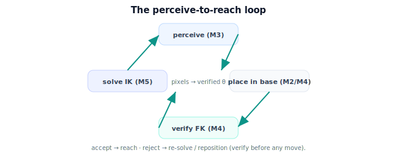

!!! abstract "You are here"
    **Module 5 — Inverse Kinematics**  ·  **Unit 7 — Verifying and Connecting to Perception**  ·  **Lesson 7.4 — Verifying and Connecting to Perception (Unit 7 Recap)**

# Lesson 7.4 — Verifying and Connecting to Perception (Unit 7 Recap)

*A short synthesis — no new mathematics. It consolidates Unit 7 and points to the Unit 8 capstone.*

---

## What Unit 7 established

The unit in one line:

> **Trust nothing unverified: FK-check every candidate (accept/reject), turn a perceived fruit's grasp pose into a base-frame IK target, and assemble perceive → place → solve → verify → select into one pipeline.**

## The arc of the unit

| Lesson | Idea |
|---|---|
| 7.1 Verify with FK | Solve → verify (residual $\|\mathbf p_{\text{target}} - f(\boldsymbol\theta_c)\| < $ tol) → accept/reject; FK catches analytical, numerical, and selection errors. |
| 7.2 Grasp Pose → Target | $\mathbf p^{\text{base}} = T_{\text{base}}^{\text{cam}}\mathbf p^{\text{cam}}$ + approach orientation; frames, units, tolerances must align. |
| 7.3 Closing the Loop | perceive → place → reachability gate → solve → filter limits → verify → select → configuration, with clean failure exits. |

## The one picture to carry forward

Inverse kinematics does not live alone. The **input** comes from perception, transformed into the arm's base frame; the **output** is checked against the forward map before anything moves; and the **whole** is a pipeline where every stage can fail cleanly and nothing unverified passes. This is what turns the module's mathematics into a robot behavior: a fruit's pixels become a verified set of joint angles, or an honest "can't reach, here's why." Everything from Units 1–6 — reachability, closed form, the numerical solver, singularity handling, selection — slots into this flow.

## Visual Explanation

<figure markdown>
  { width="680" }
</figure>

## Where Unit 8 goes

Unit 8 — the **Mini Project: Reach the Fruit** — is the capstone. It runs this pipeline end to end on the running example: a perceived target pose → reachability check → solve (analytical where possible, numerical where needed) → multiplicity handled → joint-limit feasibility → FK verification → solution selection → a chosen, executable configuration, with no-solution cases handled gracefully. It integrates Modules 2 (frames), 3 (perception), 4 (forward kinematics), and 5 (inverse kinematics) into one coherent workflow, with a flagship interactive demo. After Unit 8, Module 5 is complete.

## Key Takeaways

- Verify every candidate by FK (accept/reject); never command an unverified pose.
- Connect perception to IK via the base-frame transform and a grasp pose.
- The perceive-to-reach pipeline gates early and verifies late; failures are explained.
- Unit 8 runs the whole pipeline as the integrating capstone.

---

## Coding Exercise

!!! tip "Run the hands-on notebook"
    `modules/module05/notebooks/M05_U07_L7_4_Verifying_Perception_Unit_7_Recap.ipynb` — open in JupyterLab and run **Kernel → Restart & Run All**.

Open the consolidation notebook for Unit 7 and run **Kernel → Restart & Run All**; it re-exercises the unit's key routines end to end and prints `All checks passed.`

## Knowledge Check

Formative — unlimited attempts, immediate feedback; does not affect your grade.

<iframe src="../../quizzes/module05/lesson28_quiz.html" title="Verifying and Connecting to Perception (Unit 7 Recap) knowledge check" style="width:100%;height:720px;border:1px solid #e2e8f0;border-radius:12px"></iframe>

[Open this quiz in a new tab ↗](../quizzes/module05/lesson28_quiz.html)

A brief consolidation quiz across Unit 7 (formative — unlimited attempts, immediate feedback).

## AI Learning Companion

Copy any prompt below into ChatGPT, Claude, or another AI assistant.

**Tutor prompt** — explain it another way
```
Summarize Unit 7 of Module 5 (Inverse Kinematics): FK verification (accept/reject), turning a perceived grasp pose into a base-frame IK target, and the full perceive → place → solve → verify → select pipeline.
```

**Practice prompt** — generate more exercises
```
Give me 8 mixed exercises across FK verification, the camera→base transform, and tracing a fruit through the perceive-to-reach pipeline. Include answers.
```

**Explore prompt** — connect it to the real world
```
Show me how a real robot integrates perception, transforms, inverse kinematics, and verification into one perceive-to-reach loop.
```

## Global Learning Support

Need this lesson explained in another language? Copy one of the prompts below into an AI assistant. English remains the authoritative source.

**Supported languages (initial):** English · Español · 中文 (Simplified Chinese) · Türkçe

**Español**
```
I just completed Lesson 7.4 (Module 5) — Verifying and Connecting to Perception (Unit 7 Recap).
Explain this unit in Spanish. Keep robotics and mathematical terminology in English when appropriate.
Then provide: a summary, three practice questions, and one challenge problem.
```

**中文 (Simplified Chinese)**
```
I just completed Lesson 7.4 (Module 5) — Verifying and Connecting to Perception (Unit 7 Recap).
Explain this unit in Simplified Chinese. Keep mathematical notation unchanged.
Then provide: a summary, three practice questions, and one challenge problem.
```

**Türkçe**
```
I just completed Lesson 7.4 (Module 5) — Verifying and Connecting to Perception (Unit 7 Recap).
Explain this unit in Turkish. Keep robotics terminology in English where commonly used.
Then provide: a summary, three practice questions, and one challenge problem.
```

---

*Next lesson: 8.1 — The Project: From Target Pose to Joint Angles.*
