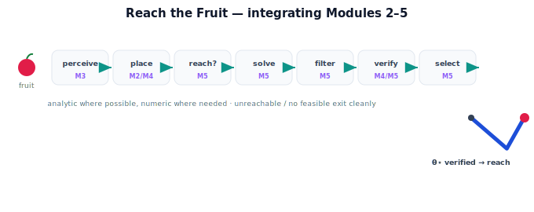

!!! abstract "You are here"
    **Module 5 — Inverse Kinematics**  ·  **Unit 8 — Mini Project: Reach the Fruit**  ·  **Lesson 8.1 — The Project: From Target Pose to Joint Angles**

# Lesson 8.1 — The Project: From Target Pose to Joint Angles

> Everything converges here. This capstone takes a perceived fruit and returns a verified configuration the arm can execute — the whole of Modules 2–5 working as one.

---

## 1. Why This Matters

This is the payoff of the entire arc: perception (Module 3) saw the fruit, frames (Module 2) and forward kinematics (Module 4) place it in the arm's world, and inverse kinematics (Module 5) turns it into joint angles — verified, feasible, chosen. Building this end to end is what a Physical AI engineer actually does. The capstone proves the pieces compose into a robot behavior: see a fruit, reach it, reliably.

## 2. Physical Intuition

A tomato is ripe on the vine. The camera sees it; the system works out where it is from the arm's shoulder; it figures out how to fold the arm so the gripper arrives at the fruit from a sensible angle; it double-checks by imagining the fold; it picks the smoothest safe option; and it reaches. That whole sequence — eyes to hand — is one motion of thought for a person, and the capstone makes it one function for the robot. Reach the fruit.

## 3. Mathematical Foundations

**Problem (Reach the Fruit).** *Given* a perceived fruit's grasp pose in the arm's base frame, $T_{\text{target}}^{\text{base}}$ (position $\mathbf p_{\text{target}}$ and, where applicable, approach orientation), and the arm's model (link lengths / DH parameters, joint limits), *produce* a joint configuration $\boldsymbol\theta^\star$ that (a) places the gripper on the target, (b) respects joint limits, (c) is verified by forward kinematics, and (d) is the best choice among valid options — or report a clear no-solution reason.

**The integrated flow** (each stage from a prior unit/module):

$$\underbrace{\mathbf p^{\text{cam}}}_{\text{M3 perceive}} \xrightarrow{\;T_{\text{base}}^{\text{cam}}\;} \underbrace{T_{\text{target}}^{\text{base}}}_{\text{M2/M4 place}} \xrightarrow{\text{reach?}} \underbrace{\text{solve}}_{\text{M5 U3–U5}} \xrightarrow{\text{limits}} \underbrace{\text{filter}}_{\text{M5 U6}} \xrightarrow{\;f(\boldsymbol\theta)\;} \underbrace{\text{verify}}_{\text{M5 U7}} \xrightarrow{\text{cost}} \underbrace{\boldsymbol\theta^\star}_{\text{select}}$$

- **Solve** uses the **analytical** closed form when the arm allows it (fast, all solutions) and falls back to the **numerical** solver (Newton / damped least squares) otherwise — analytical where possible, numerical where needed.
- **Multiplicity** is handled: enumerate solutions (closed form) or seed the numerical solver to find the relevant ones.
- **Verify** every candidate by FK (Lesson 7.1); **filter** by joint limits (6.2); **select** by nearest-to-current / safety (6.3).
- **No-solution** cases (unreachable, no feasible) return an explicit status, not a guess.

The output $\boldsymbol\theta^\star$ is a configuration the controller can command with confidence. This lesson frames the project and runs it through the flagship demo; Lessons 8.2–8.3 build and harden the solver.

## 4. Visual Explanation

<figure markdown>
  { width="680" }
</figure>

## 5. Engineering Example

This *is* the greenhouse harvester's core loop. For each ripe tomato the camera reports, the system runs exactly this flow and either reaches (verified configuration) or logs why it can't. Over a row of plants it harvests dozens of fruit, each through the same integrated pipeline — the concrete embodiment of everything the curriculum has built toward. The capstone demo lets you drive this loop by hand: place a fruit, watch it become joint angles, see the arm reach.

## 6. Worked Example

Fruit perceived at $\mathbf p^{\text{cam}}=(0.4,0.2)$; $T_{\text{base}}^{\text{cam}}$ = +10 cm forward; arm $L_1=0.4, L_2=0.3$; limits $\theta_1\in[-45°,45°], \theta_2\in[0°,150°]$; current pose $(-30°,80°)$.

1. **Place:** $\mathbf p^{\text{base}}=(0.5,0.2)$.
2. **Reachable:** $r=0.539\in[0.1,0.7]$ ✓.
3. **Solve (analytical):** elbow-down $(-29.7°,79.9°)$ and elbow-up $(50.2°,-79.9°)$ (approx).
4. **Filter limits:** elbow-up's $\theta_1=50.2°>45°$ and $\theta_2<0°$ → infeasible; elbow-down feasible.
5. **Verify FK:** elbow-down → $f(\boldsymbol\theta)=(0.500,0.200)$, residual $\approx0$ → accept.
6. **Select:** one feasible, verified candidate → $\boldsymbol\theta^\star=(-29.7°,79.9°)$.
7. **Result:** reach with $\boldsymbol\theta^\star$, status `"ok"`.

The notebook runs this exact case; the demo shows it interactively.

## 7. Interactive Demonstration

<iframe src="../../demos/module05/lesson29_reach_the_fruit.html" title="The Project: From Target Pose to Joint Angles interactive demo" style="width:100%;height:520px;border:1px solid #e2e8f0;border-radius:12px"></iframe>

[Open this demo in a new tab ↗](../demos/module05/lesson29_reach_the_fruit.html)

The embedded **Reach-the-Fruit** capstone demo lets you place a fruit in the scene (drag it), set the camera offset and joint limits, and watch the full pipeline run live: the fruit's base-frame target, the solved candidate configurations, the joint-limit filtering, the FK verification (residual), the selected configuration, and the arm reaching — or a clear "unreachable / no feasible" message. Drive it to feel how perception, transforms, FK, and IK act as one.

## 8. Coding Exercise

!!! tip "Run the hands-on notebook"
    `modules/module05/notebooks/M05_U08_L8_1_Capstone_Project.ipynb` — open in JupyterLab and run **Kernel → Restart & Run All**.

Stub the capstone entry point `reach_the_fruit(p_cam, T_base_cam, arm, limits, theta_cur) → (theta_star, status)` that calls the pipeline stages (place → reachable → solve → filter → verify → select). For this lesson, wire the stages and run the worked example to `"ok"` with the elbow-down configuration; Lessons 8.2–8.3 flesh out the solver and edge cases. Confirm the integrated call returns a verified, feasible configuration.

## 9. Knowledge Check

Formative — unlimited attempts, immediate feedback; does not affect your grade.

<iframe src="../../quizzes/module05/lesson29_quiz.html" title="The Project: From Target Pose to Joint Angles knowledge check" style="width:100%;height:720px;border:1px solid #e2e8f0;border-radius:12px"></iframe>

[Open this quiz in a new tab ↗](../quizzes/module05/lesson29_quiz.html)

Checks on the Reach-the-Fruit problem statement, which module supplies each stage, and the verified/feasible/selected output guarantee.

## 10. Challenge Problem

The capstone uses **analytical where possible, numerical where needed**. For the planar 2-link arm the closed form always applies — so when would the numerical fallback ever run in this project? Describe a realistic variation (an added joint for obstacle avoidance, a full-pose grasp) that makes the closed form insufficient and the numerical solver necessary, and where in the flow it slots in.

## 11. Common Mistakes

- Treating the capstone as just the IK solve, forgetting the perception/transform/verify stages.
- Skipping verification because "the solver converged."
- Not handling the no-solution outcomes, so the loop stalls on a hard fruit.
- Mixing frames or units across the integrated stages.

## 12. Key Takeaways

- Reach the Fruit: perceived grasp pose → verified, feasible, selected joint configuration (or a clear no-solution reason).
- It integrates Modules 2 (frames), 3 (perception), 4 (forward kinematics), and 5 (inverse kinematics).
- Analytical where possible, numerical where needed; multiplicity handled; every candidate FK-verified.
- This lesson frames and demos the project; 8.2–8.3 build and harden the solver.

---

## AI Learning Companion

Copy any prompt below into ChatGPT, Claude, or another AI assistant.

**Tutor prompt** — explain it another way
```
Re-explain Lesson 8.1 (Module 5) — the Reach-the-Fruit capstone — as one integrated flow from a perceived fruit to verified joint angles, tagging which module supplies each stage (M2 frames, M3 perception, M4 FK, M5 IK).
```

**Practice prompt** — generate more exercises
```
Give me 5 exercises running the Reach-the-Fruit flow on different perceived fruit positions and arm limits, naming the output configuration or the no-solution reason. Include answers.
```

**Explore prompt** — connect it to the real world
```
Show me how a real fruit-harvesting robot integrates perception, coordinate transforms, forward kinematics, and inverse kinematics into one reach pipeline.
```

## Global Learning Support

Need this lesson explained in another language? Copy one of the prompts below into an AI assistant. English remains the authoritative source.

**Supported languages (initial):** English · Español · 中文 (Simplified Chinese) · Türkçe

**Español**
```
I just completed Lesson 8.1 (Module 5) — The Project: From Target Pose to Joint Angles.
Explain this lesson in Spanish. Keep robotics and mathematical terminology in English when appropriate.
Then provide: a summary, three practice questions, and one challenge problem.
```

**中文 (Simplified Chinese)**
```
I just completed Lesson 8.1 (Module 5) — The Project: From Target Pose to Joint Angles.
Explain this lesson in Simplified Chinese. Keep mathematical notation unchanged.
Then provide: a summary, three practice questions, and one challenge problem.
```

**Türkçe**
```
I just completed Lesson 8.1 (Module 5) — The Project: From Target Pose to Joint Angles.
Explain this lesson in Turkish. Keep robotics terminology in English where commonly used.
Then provide: a summary, three practice questions, and one challenge problem.
```

---

*Next lesson: 8.2 — Building the Solver (Analytical + Numerical).*
