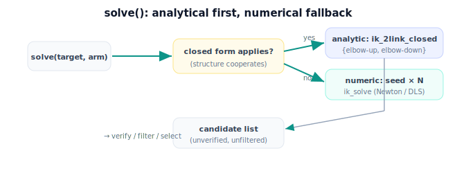

!!! abstract "You are here"
    **Module 5 — Inverse Kinematics**  ·  **Unit 8 — Mini Project: Reach the Fruit**  ·  **Lesson 8.2 — Building the Solver (Analytical + Numerical)**

# Lesson 8.2 — Building the Solver (Analytical + Numerical)

> The heart of the capstone is one `solve()` that does the right thing: closed form when it can, numerical when it must, returning every candidate for the stages downstream to verify and choose.

---

## 1. Why This Matters

The capstone's reliability rests on its solver core. A good `solve()` is fast (uses the closed form when available), complete (returns all relevant solutions, not just one), and general (falls back to numerical for arms the closed form can't handle). Building this cleanly — with a clear contract — is what lets the verify/filter/select stages do their jobs. It is the engine of Reach the Fruit.

## 2. Physical Intuition

A good craftsperson reaches for the right tool. For a simple, familiar shape (the 2-link arm), there's an exact formula — use it, and you get both ways to fold the arm instantly. For an awkward shape (extra joints, full orientation), there's no formula, so you fall back to careful trial-and-adjustment (the numerical solver), nudging until it fits. The solver core is that craftsperson: exact tool first, careful adjustment as backup, always producing every candidate worth considering.

## 3. Mathematical Foundations

The solver core, `solve(target, arm, theta_cur) → [candidates]`:

**1. Analytical branch (preferred).** If the arm has a closed form for this target type (e.g. the planar 2-link position problem), use it:

$$\text{candidates} = \texttt{ik\_2link\_closed}(\mathbf p_{\text{target}}) \quad\Rightarrow\quad \{\text{elbow-up},\ \text{elbow-down}\}\ \text{(0, 1, or 2)}.$$

Fast, exact, and enumerates *all* solutions — ideal.

**2. Numerical branch (fallback).** If no closed form applies (general geometry, redundancy, full pose), run the numerical solver from one or more **seeds** to recover candidates:

$$\boldsymbol\theta^{(k)} = \texttt{ik\_solve}(\mathbf p_{\text{target}},\ \text{seed}_k),\quad \text{seeds chosen to find distinct solutions}.$$

Seeding matters: the numerical solver returns the solution nearest its seed, so to recover both elbow configurations you seed once near each (e.g. $\theta_2>0$ and $\theta_2<0$). Use damped least squares for robustness near singularities (Lesson 5.2).

**3. Contract.** `solve()` returns a (possibly empty) list of candidate configurations — *unverified, unfiltered* — leaving verification (7.1), limit filtering (6.2), and selection (6.3) to the downstream stages. This separation keeps the solver simple and the pipeline composable.

For the planar running example the analytical branch always applies, so `solve()` returns the closed-form candidates; the numerical branch is exercised to show the fallback (and to confirm the two methods agree, as in the midpoint). The capstone wires whichever the arm needs.

## 4. Visual Explanation

<figure markdown>
  { width="680" }
</figure>

## 5. Engineering Example

The greenhouse arm's `solve()` uses the closed form for its planar reaching stage — two candidates per fruit, instantly. When a future version adds a joint to reach around leaves (making it redundant), the same `solve()` switches to the numerical branch, seeding from the current pose to get a nearby solution, with damping for safety. The downstream verify/filter/select stages don't change — they consume the candidate list either way. The solver core absorbs the arm's complexity behind one contract.

## 6. Worked Example

$L_1=0.4, L_2=0.3$, target $(0.5,0.2)$.

- **Analytical:** `ik_2link_closed(0.5,0.2)` → two candidates: $\approx(-29.7°,79.9°)$ and $\approx(50.2°,-79.9°)$.
- **Numerical (fallback check):** seed near each elbow — seed $(10°,20°)$ → converges to $\approx(-29.7°,79.9°)$; seed $(10°,-20°)$ → converges to $\approx(50.2°,-79.9°)$. Same two solutions, confirming the branches agree.

`solve()` returns both candidates (unverified) for the pipeline. The notebook builds `solve()` with both branches and checks they agree.

## 7. Interactive Demonstration

<iframe src="../../demos/module05/lesson30_building_the_solver.html" title="Building the Solver (Analytical + Numerical) interactive demo" style="width:100%;height:520px;border:1px solid #e2e8f0;border-radius:12px"></iframe>

[Open this demo in a new tab ↗](../demos/module05/lesson30_building_the_solver.html)

**Guided prediction.** For target $(0.5,0.2)$, predict the two analytical candidates' elbow signs. Predict which seed recovers which solution in the numerical branch. Then predict what `solve()` returns for an *unreachable* target $(0.9,0)$ (empty list) and confirm the contract holds (no exception, just no candidates).

## 8. Coding Exercise

!!! tip "Run the hands-on notebook"
    `modules/module05/notebooks/M05_U08_L8_2_Building_The_Solver.ipynb` — open in JupyterLab and run **Kernel → Restart & Run All**.

Implement `solve(target, L1, L2, use_numerical=False, seeds=None)`: the analytical branch returns `ik_2link_closed(...)`; the numerical branch runs `ik_solve` from each seed and dedups the results. Confirm: both branches return the same two solutions for $(0.5,0.2)$; an unreachable target returns `[]`; and the numerical branch with two seeds recovers both elbows.

## 9. Knowledge Check

Formative — unlimited attempts, immediate feedback; does not affect your grade.

<iframe src="../../quizzes/module05/lesson30_quiz.html" title="Building the Solver (Analytical + Numerical) knowledge check" style="width:100%;height:720px;border:1px solid #e2e8f0;border-radius:12px"></iframe>

[Open this quiz in a new tab ↗](../quizzes/module05/lesson30_quiz.html)

Checks on the analytical-first/numerical-fallback design, seeding for multiplicity, and the unverified-candidate-list contract.

## 10. Challenge Problem

The numerical branch only finds the solution *nearest each seed*. For an arm with **four** IK solutions (e.g. a 3R arm reaching a pose), how would you choose seeds to recover all four? What goes wrong if you use too few seeds, and how does the closed form (when available) avoid this seeding problem entirely?

## 11. Common Mistakes

- Returning only one solution from the analytical branch (dropping an elbow).
- Using a single seed in the numerical branch and missing the other solution(s).
- Verifying or filtering *inside* `solve()` instead of leaving it to the pipeline (breaks composability).
- Not handling the empty (unreachable) case cleanly.

## 12. Key Takeaways

- `solve()` prefers the **analytical** closed form (fast, all solutions) and falls back to **numerical** (seeded, damped) when needed.
- Seed the numerical solver near each expected solution to recover multiplicity.
- `solve()` returns an unverified, unfiltered candidate list — verification, filtering, and selection are separate stages.
- The two branches agree where both apply; the contract keeps the pipeline composable.

---

## AI Learning Companion

Copy any prompt below into ChatGPT, Claude, or another AI assistant.

**Tutor prompt** — explain it another way
```
Re-explain Lesson 8.2 (Module 5) — building a solver that tries the analytical closed form first and falls back to the numerical solver — including seeding the numerical branch to recover multiple solutions. Explain the unverified-candidate-list contract.
```

**Practice prompt** — generate more exercises
```
Give me 5 exercises designing solve() calls for a planar 2-link arm (analytical) and a redundant arm (numerical with seeds), predicting the returned candidates. Include answers.
```

**Explore prompt** — connect it to the real world
```
Show me how real robot IK libraries combine analytical and numerical solvers and how they seed numerical solves to find multiple solutions.
```

## Global Learning Support

Need this lesson explained in another language? Copy one of the prompts below into an AI assistant. English remains the authoritative source.

**Supported languages (initial):** English · Español · 中文 (Simplified Chinese) · Türkçe

**Español**
```
I just completed Lesson 8.2 (Module 5) — Building the Solver (Analytical + Numerical).
Explain this lesson in Spanish. Keep robotics and mathematical terminology in English when appropriate.
Then provide: a summary, three practice questions, and one challenge problem.
```

**中文 (Simplified Chinese)**
```
I just completed Lesson 8.2 (Module 5) — Building the Solver (Analytical + Numerical).
Explain this lesson in Simplified Chinese. Keep mathematical notation unchanged.
Then provide: a summary, three practice questions, and one challenge problem.
```

**Türkçe**
```
I just completed Lesson 8.2 (Module 5) — Building the Solver (Analytical + Numerical).
Explain this lesson in Turkish. Keep robotics terminology in English where commonly used.
Then provide: a summary, three practice questions, and one challenge problem.
```

---

*Next lesson: 8.3 — Verifying, Selecting, and Handling No-Solution Cases.*
