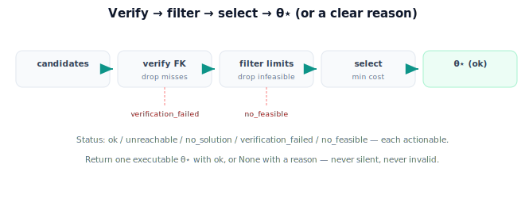

!!! abstract "You are here"
    **Module 5 — Inverse Kinematics**  ·  **Unit 8 — Mini Project: Reach the Fruit**  ·  **Lesson 8.3 — Verifying, Selecting, and Handling No-Solution Cases**

# Lesson 8.3 — Verifying, Selecting, and Handling No-Solution Cases

> `solve()` gives candidates. This lesson finishes the capstone: verify, filter, select — and handle the cases where there is no good answer, so the system never lies and never stalls.

---

## 1. Why This Matters

A deployable harvester must do the right thing on the *hard* fruit too: the one out of reach, the one only graspable in a forbidden pose. Completing the pipeline means not just picking a good solution when one exists, but failing *cleanly* when none does — with a reason the system can act on. This robustness is what separates a demo from a machine you'd trust in a greenhouse all day.

## 2. Physical Intuition

A careful worker, handed candidate ways to reach a fruit, checks each ("does this actually touch it?"), discards the impossible ones ("my arm doesn't bend that way"), picks the easiest good one, and — crucially — says "I can't reach that one" out loud when nothing works, instead of flailing or pretending. The capstone's tail end is that discipline: verify, discard, choose, or honestly decline. No silent failures, no wild motions.

## 3. Mathematical Foundations

Completing `reach_the_fruit`, after `solve()` returns candidates:

**1. Verify (FK).** Keep only candidates whose forward-kinematics residual is within tolerance (Lesson 7.1):

$$\text{verified} = \{\boldsymbol\theta_c : \|\mathbf p_{\text{target}} - f(\boldsymbol\theta_c)\| < \texttt{tol}\}.$$

**2. Filter (limits).** Keep only joint-limit-feasible candidates (Lesson 6.2):

$$\text{feasible} = \{\boldsymbol\theta_c \in \text{verified} : \theta_i \in [\theta_i^{\min}, \theta_i^{\max}]\ \forall i\}.$$

**3. Select.** Among feasible candidates, pick the lowest-cost (nearest-to-current, limit/singularity-safe; Lesson 6.3):

$$\boldsymbol\theta^\star = \arg\min_{\boldsymbol\theta_c \in \text{feasible}} C(\boldsymbol\theta_c).$$

**4. Status logic** — the outcomes, in order:

| Condition | Status | Caller action |
|---|---|---|
| target outside workspace | `"unreachable"` | reposition base / skip |
| `solve()` returned no candidates | `"no_solution"` | re-seed / reposition |
| candidates exist but none verify | `"verification_failed"` | debug model / re-solve |
| verified but none feasible | `"no_feasible"` | reposition / relax task |
| a feasible verified solution exists | `"ok"` + $\boldsymbol\theta^\star$ | command the move |

The function returns `(theta_star, status)` — exactly one executable configuration with `"ok"`, or `theta_star = None` with a reason. The harvester acts on the reason; it never receives a silent or invalid result. This is the **solve → verify → accept/reject** discipline taken to completion across the whole pipeline.

## 4. Visual Explanation

<figure markdown>
  { width="680" }
</figure>

## 5. Engineering Example

Across a plant, the harvester's pipeline returns `"ok"` with a verified configuration for most tomatoes, and clean reasons for the rest: a fruit deep in foliage → `"unreachable"` (the base shifts); a fruit only graspable with the elbow past its stop → `"no_feasible"` (skip or approach from the next row). Because every `"ok"` is FK-verified and every failure is labeled, the operator can see exactly why any fruit was skipped — and the arm never makes an unsafe move toward an impossible target.

## 6. Worked Example

Continuing the capstone target $(0.5,0.2)$, limits $\theta_1\in[-45°,45°], \theta_2\in[0°,150°]$, current $(-30°,80°)$:

1. `solve()` → candidates $(-29.7°,79.9°)$, $(50.2°,-79.9°)$.
2. **Verify:** both FK-verify on $(0.5,0.2)$ (residual $\approx0$).
3. **Filter:** $(50.2°,-79.9°)$ fails ($\theta_1>45°$, $\theta_2<0°$); $(-29.7°,79.9°)$ feasible.
4. **Select:** one feasible → $\boldsymbol\theta^\star=(-29.7°,79.9°)$, nearest to current anyway.
5. **Return:** `((-29.7°,79.9°), "ok")`.

Now move the fruit to $\mathbf p^{\text{base}}=(0.9,0)$: reachability gate fails → `(None, "unreachable")`. Tighten $\theta_2\in[100°,150°]$: both candidates' $\theta_2$ fall outside → `(None, "no_feasible")`. The notebook runs all three.

## 7. Interactive Demonstration

**Guided prediction.** For the capstone target, predict the verified set, the feasible set, and $\boldsymbol\theta^\star$. Then predict the status for the unreachable variant and the tightened-limits variant before running them. Confirm each returns the right `(theta_star, status)` — an executable configuration or an actionable reason.

## 8. Coding Exercise

!!! tip "Run the hands-on notebook"
    `modules/module05/notebooks/M05_U08_L8_3_Verifying_Selecting_No_Solution.ipynb` — open in JupyterLab and run **Kernel → Restart & Run All**.

Complete `reach_the_fruit(p_cam, T_base_cam, L1, L2, limits, theta_cur)` end to end: place → reachability gate → `solve()` → verify (FK) → filter (limits) → select (nearest) → status. Return `(theta_star, status)`. Test: the worked example → `"ok"` with elbow-down; $(0.9,0)$ base → `"unreachable"`; tightened limits → `"no_feasible"`. End the notebook with "All checks passed."

## 9. Knowledge Check

Formative — unlimited attempts, immediate feedback; does not affect your grade.

<iframe src="../../quizzes/module05/lesson31_quiz.html" title="Verifying, Selecting, and Handling No-Solution Cases knowledge check" style="width:100%;height:720px;border:1px solid #e2e8f0;border-radius:12px"></iframe>

[Open this quiz in a new tab ↗](../quizzes/module05/lesson31_quiz.html)

Checks on the verify→filter→select order, the status taxonomy, and the never-silent-never-invalid guarantee.

## 10. Challenge Problem

Two failure statuses can look similar to a caller: `"no_solution"` (the solver found nothing) and `"no_feasible"` (it found solutions, but joint limits ruled them all out). Why is distinguishing them operationally useful — i.e., would the harvester respond differently to each? Give the distinct remedy for each.

## 11. Common Mistakes

- Selecting before verifying/filtering, letting a wrong or infeasible pose through.
- Collapsing distinct failures into one generic error (loses the actionable reason).
- Returning a configuration with `theta_star` set *and* a failure status (ambiguous contract).
- Forgetting the reachability gate, so the solver wastes effort on impossible targets.

## 12. Key Takeaways

- Finish the pipeline: verify (FK) → filter (limits) → select (min cost) → $\boldsymbol\theta^\star$.
- Status taxonomy: `ok`, `unreachable`, `no_solution`, `verification_failed`, `no_feasible` — each actionable.
- Return exactly one executable configuration with `"ok"`, or `None` with a clear reason — never silent, never invalid.
- This completes the Reach-the-Fruit capstone solver.

---

## AI Learning Companion

Copy any prompt below into ChatGPT, Claude, or another AI assistant.

**Tutor prompt** — explain it another way
```
Re-explain Lesson 8.3 (Module 5) — completing the capstone with verify → filter → select and the no-solution status taxonomy (unreachable, no_solution, verification_failed, no_feasible). Explain why failures must be clean and labeled.
```

**Practice prompt** — generate more exercises
```
Give me 6 exercises running the capstone tail (verify, filter, select) on different targets and limits, returning (theta_star, status). Include answers.
```

**Explore prompt** — connect it to the real world
```
Show me how real robot pipelines verify and select IK solutions and how they report and act on no-solution cases.
```

## Global Learning Support

Need this lesson explained in another language? Copy one of the prompts below into an AI assistant. English remains the authoritative source.

**Supported languages (initial):** English · Español · 中文 (Simplified Chinese) · Türkçe

**Español**
```
I just completed Lesson 8.3 (Module 5) — Verifying, Selecting, and Handling No-Solution Cases.
Explain this lesson in Spanish. Keep robotics and mathematical terminology in English when appropriate.
Then provide: a summary, three practice questions, and one challenge problem.
```

**中文 (Simplified Chinese)**
```
I just completed Lesson 8.3 (Module 5) — Verifying, Selecting, and Handling No-Solution Cases.
Explain this lesson in Simplified Chinese. Keep mathematical notation unchanged.
Then provide: a summary, three practice questions, and one challenge problem.
```

**Türkçe**
```
I just completed Lesson 8.3 (Module 5) — Verifying, Selecting, and Handling No-Solution Cases.
Explain this lesson in Turkish. Keep robotics terminology in English where commonly used.
Then provide: a summary, three practice questions, and one challenge problem.
```

---

*Next lesson: 8.4 — Wrap-Up and the Road to Differential Motion.*
