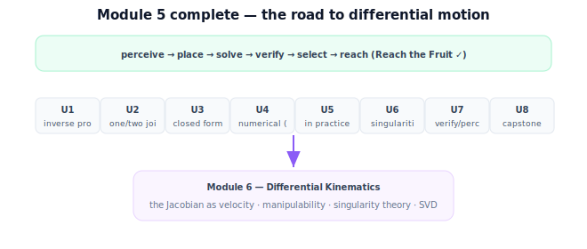

!!! abstract "You are here"
    **Module 5 — Inverse Kinematics**  ·  **Unit 8 — Mini Project: Reach the Fruit**  ·  **Lesson 8.4 — Wrap-Up and the Road to Differential Motion**

# Lesson 8.4 — Wrap-Up and the Road to Differential Motion

*The capstone close and the module wrap-up — no new mathematics. It consolidates Module 5 and opens the door to Module 6.*

---

## What Module 5 built

The module in one line:

> **Inverse kinematics turns a desired gripper pose into joint angles — stated as an equation with 0/1/many solutions, solved in closed form where structure allows and numerically where it doesn't, made robust against singularities and joint limits, verified by forward kinematics, and integrated with perception into one Reach-the-Fruit pipeline.**

## The arc of the module

| Unit | What it added |
|---|---|
| 1 The Inverse Problem | FK vs IK; nonlinearity; reachability; 0/1/many solutions. |
| 2 IK of One and Two Joints | one-joint by inspection; the 2-link triangle; elbow-up/down. |
| 3 Analytical (Closed-Form) IK | the boxed 2-link formulas; `atan2` discipline; wrist decoupling. |
| 4 From Geometry to Numerical IK | where closed form runs out; the FK Jacobian (local linear map); guess–measure–step. **(Midpoint.)** |
| 5 Numerical IK in Practice | Newton/pseudoinverse; transpose & damped least squares; convergence & failure. |
| 6 Singularities & Solution Selection | singularity recognition (det J = 0); joint limits; choosing among solutions. |
| 7 Verifying & Connecting to Perception | FK verification (accept/reject); grasp pose → base-frame target; the pipeline. |
| 8 Mini Project: Reach the Fruit | the integrated capstone: analytical + numerical, verified, selected, robust. |

## The one picture to carry forward

Forward kinematics asks *"given the joints, where is the gripper?"* — Module 4. Inverse kinematics asks the reverse, *"given where I want the gripper, what joints?"* — and that reverse is the hard, rich problem this module solved: many solutions or none, no formula in general, fragile spots, physical limits, and the need to verify and choose. By the capstone, a perceived fruit becomes a verified, feasible, chosen configuration the arm can execute — perception, frames, forward kinematics, and inverse kinematics acting as one. That is a complete *static* reach: the arm knows how to *be* at the target.

What it does **not** yet know is how to *move* — how joint velocities map to gripper velocity, how to follow a path, how fast it can go near a singularity. The Jacobian, which we used here purely as a solver's local linear map, holds the key to all of that, and its fuller meaning is where the next module begins.

## Visual Explanation

<figure markdown>
  { width="680" }
</figure>

## Where Module 6 goes

Module 6 — **Differential Kinematics** — picks up exactly what Module 5 deferred. The same Jacobian $J$ we used to *solve* becomes the map from joint **velocities** to gripper **velocity**, $\dot{\mathbf p} = J\dot{\boldsymbol\theta}$. From there: differential motion and resolved-rate control, **manipulability** (how well the arm can move in each direction), the full **theory of singularities** (not just recognition — the lost directions, the singular values), and the **SVD** that makes all of it precise. The recognition you built in Unit 6 becomes a quantitative theory; the local linear map becomes a velocity relationship. After that, Module 7 turns single configurations into **trajectories** (planning and motion), and Module 8 adds **control**.

## Key Takeaways

- Module 5 turns desired poses into verified joint configurations — the inverse of Module 4.
- The arc: the inverse problem → closed form → numerical solver → singularities/selection → verification → integrated capstone.
- The capstone integrates Modules 2–5 into one perceive-to-reach workflow: Reach the Fruit.
- Module 6 reopens the Jacobian as velocity — differential motion, manipulability, singularity theory, SVD.

---

## Interactive Demonstration

<iframe src="../../demos/module05/lesson32_wrap_up_differential_motion.html" title="Wrap-Up and the Road to Differential Motion interactive demo" style="width:100%;height:520px;border:1px solid #e2e8f0;border-radius:12px"></iframe>

[Open this demo in a new tab ↗](../demos/module05/lesson32_wrap_up_differential_motion.html)

Inverse kinematics in one view: drag a target and the solver finds the joint angles — the map the next module extends to velocities via the Jacobian.

## Coding Exercise

!!! tip "Run the hands-on notebook"
    `modules/module05/notebooks/M05_U08_L8_4_Wrapup_Road_To_Differential.ipynb` — open in JupyterLab and run **Kernel → Restart & Run All**.

Open the consolidation notebook for Module 5 and run **Kernel → Restart & Run All**; it re-exercises the unit's key routines end to end and prints `All checks passed.`

## Knowledge Check

Formative — unlimited attempts, immediate feedback; does not affect your grade.

<iframe src="../../quizzes/module05/lesson32_quiz.html" title="Wrap-Up and the Road to Differential Motion knowledge check" style="width:100%;height:720px;border:1px solid #e2e8f0;border-radius:12px"></iframe>

[Open this quiz in a new tab ↗](../quizzes/module05/lesson32_quiz.html)

A brief consolidation quiz across the module (formative — unlimited attempts, immediate feedback).

## AI Learning Companion

Copy any prompt below into ChatGPT, Claude, or another AI assistant.

**Tutor prompt** — explain it another way
```
Summarize all of Module 5 (Inverse Kinematics): the inverse problem, closed-form and numerical solvers, singularities and selection, FK verification, and the Reach-the-Fruit capstone. Then preview how Module 6 reopens the Jacobian as a velocity relationship.
```

**Practice prompt** — generate more exercises
```
Give me a 12-question end-of-module review for Module 5 spanning reachability, closed form, the numerical solver, singularity recognition, selection, verification, and the integrated pipeline. Include answers.
```

**Explore prompt** — connect it to the real world
```
Show me how static inverse kinematics (Module 5) connects to differential kinematics and velocity control (Module 6) in real robot arms.
```

## Global Learning Support

Need this lesson explained in another language? Copy one of the prompts below into an AI assistant. English remains the authoritative source.

**Supported languages (initial):** English · Español · 中文 (Simplified Chinese) · Türkçe

**Español**
```
I just completed Lesson 8.4 (Module 5) — Wrap-Up and the Road to Differential Motion.
Explain this module wrap-up in Spanish. Keep robotics and mathematical terminology in English when appropriate.
Then provide: a summary, three practice questions, and one challenge problem.
```

**中文 (Simplified Chinese)**
```
I just completed Lesson 8.4 (Module 5) — Wrap-Up and the Road to Differential Motion.
Explain this module wrap-up in Simplified Chinese. Keep mathematical notation unchanged.
Then provide: a summary, three practice questions, and one challenge problem.
```

**Türkçe**
```
I just completed Lesson 8.4 (Module 5) — Wrap-Up and the Road to Differential Motion.
Explain this module wrap-up in Turkish. Keep robotics terminology in English where commonly used.
Then provide: a summary, three practice questions, and one challenge problem.
```

---

*End of Module 5 — Inverse Kinematics. Next: Module 6 — Differential Kinematics.*
