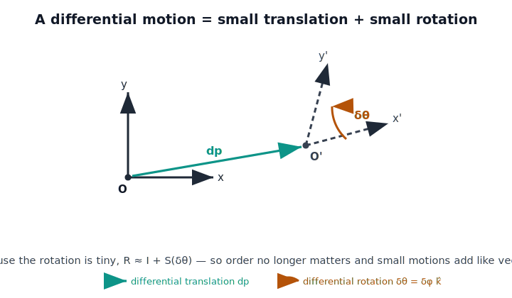

!!! abstract "You are here"
    **Module 6 — Jacobians and Differential Motion**  ·  **Unit 1 — Differential Motion & Twists**  ·  **Lesson 1.1 — From Finite to Infinitesimal: Differential Translation and Rotation**

# Lesson 1.1 — From Finite to Infinitesimal: Differential Translation and Rotation

## 1. Why This Matters
In Module 5 the inverse-kinematics solver leaned on a single approximation,
written in Lesson 4.2 as

$$\Delta \mathbf{p} \approx J\,\Delta\boldsymbol{\theta}.$$

We treated $J$ there as solver machinery — the local linear map that turned a
joint nudge into an end-effector nudge so Newton's method could iterate. We never
asked what that "$\approx$" and that "$\Delta$" *mean*.

This lesson answers that. The "$\Delta$" is **differential motion**: a motion so
small that the geometry becomes linear. Once motion is linear, the Jacobian is
not a trick — it is the natural object that relates *a little bit of joint motion*
to *a little bit of end-effector motion*. Everything in Module 6 (velocity
kinematics, manipulability, singularities, the SVD, resolved-rate motion) is
built on the foundation we lay here. **The Jacobian we used inside the M5 solver
is now the subject.**

## 2. Physical Intuition
Picture the gripper frame at the end of an arm. Now nudge it by a *tiny* amount.
Any such nudge is two things at once:

- a small straight shift — a **differential translation** $d\mathbf{p}$, and
- a small twist about some axis — a **differential rotation** $\delta\boldsymbol{\theta}$.

Here is the key intuition that separates "small" from "large": **for tiny
rotations, order does not matter.** Rotate a book 1° about its long edge, then 1°
about its short edge — then do the same two rotations in the opposite order. The
final poses are indistinguishable. Now repeat with 90° rotations: the two final
poses are wildly different. Finite rotations care about order; differential
rotations do not. That single fact is what lets us add up small motions like
vectors — and is why the Jacobian can be a plain matrix.

## 3. Mathematical Foundations
**Differential translation** is just a small vector:

$$d\mathbf{p} = \begin{bmatrix} dx \\ dy \\ dz \end{bmatrix}.$$

**Differential rotation** is a rotation by a small angle $\delta\phi$ about a unit
axis $\hat{\mathbf{k}}$. Collect them into the **differential rotation vector**

$$\delta\boldsymbol{\theta} = \delta\phi\,\hat{\mathbf{k}}.$$

A finite rotation about $\hat{\mathbf{k}}$ by angle $\phi$ is given by Rodrigues'
formula, $R = I + \sin\phi\,S(\hat{\mathbf{k}}) + (1-\cos\phi)\,S(\hat{\mathbf{k}})^2$,
where $S(\cdot)$ is the **skew-symmetric operator**

$$S(\mathbf{v}) = \begin{bmatrix} 0 & -v_z & v_y \\ v_z & 0 & -v_x \\ -v_y & v_x & 0 \end{bmatrix},
\qquad S(\mathbf{v})\,\mathbf{u} = \mathbf{v}\times\mathbf{u}.$$

Now let $\phi \to \delta\phi$ be small. Using $\sin\delta\phi \approx \delta\phi$
and $1-\cos\delta\phi \approx 0$ (second order), the finite formula collapses to

$$\boxed{\,R \approx I + S(\delta\boldsymbol{\theta})\,}.$$

A differential rotation is **the identity plus a skew matrix**. Two consequences
follow immediately, to first order:

1. **They commute.** $(I+S_a)(I+S_b) = I + S_a + S_b + S_aS_b$, and the product
   $S_aS_b$ is second-order, so it drops. Both orders give $I + S_a + S_b$.
2. **They add like vectors.** Composing $\delta\boldsymbol{\theta}_1$ then
   $\delta\boldsymbol{\theta}_2$ gives $I + S(\delta\boldsymbol{\theta}_1 +
   \delta\boldsymbol{\theta}_2)$ — the rotation vectors simply sum.

This is exactly why a differential motion can be packaged as one tidy linear
object — and in the next lessons, why $J$ is a matrix.

## 4. Visual Explanation

<figure markdown>
  { width="680" }
</figure>

## 5. Engineering Example
Recall the *last* few iterations of the M5 numerical IK solver as it homed in on a
target. Each correction the solver applied was minute — a fraction of a degree per
joint, a millimeter at the tool. Those final corrections are textbook differential
motions: the pose error $\Delta\mathbf{p}$ and the joint update
$\Delta\boldsymbol{\theta}$ were small enough that $\Delta\mathbf{p} \approx
J\,\Delta\boldsymbol{\theta}$ held to high accuracy, which is precisely why the
solver converged quadratically near the solution. The approximation that *looked*
like solver bookkeeping in M5 is the physical statement we are now formalizing.

## 6. Worked Example
Take a small rotation of $\delta\phi = 0.5^\circ$ about $z$, so
$\delta\boldsymbol{\theta} = (0,0,\,0.00873)$ rad.

Exact (Rodrigues):

$$R_{\text{exact}} = \begin{bmatrix} \cos\delta\phi & -\sin\delta\phi & 0 \\ \sin\delta\phi & \cos\delta\phi & 0 \\ 0 & 0 & 1\end{bmatrix}
= \begin{bmatrix} 0.99996 & -0.00873 & 0 \\ 0.00873 & 0.99996 & 0 \\ 0 & 0 & 1\end{bmatrix}.$$

Differential approximation:

$$R_{\text{approx}} = I + S(\delta\boldsymbol{\theta}) = \begin{bmatrix} 1 & -0.00873 & 0 \\ 0.00873 & 1 & 0 \\ 0 & 0 & 1\end{bmatrix}.$$

The only disagreement is the diagonal $1$ vs $0.99996$, an error of $4\times10^{-5}$
— and that error scales as $\delta\phi^2$. Halve the angle and the error quarters.
This quadratic shrink is the mathematical face of "small enough to be linear."

## 7. Interactive Demonstration

<iframe src="../../demos/module06/lesson01_finite_to_infinitesimal.html" title="From Finite to Infinitesimal: Differential Translation and Rotation interactive demo" style="width:100%;height:520px;border:1px solid #e2e8f0;border-radius:12px"></iframe>

[Open this demo in a new tab ↗](../demos/module06/lesson01_finite_to_infinitesimal.html)

*(No embedded applet in this lesson — the Installment A interactive demo is the
Jacobian Column Explorer in Lesson 2.3. Use this guided prediction instead.)*

**Predict, then check.** You will rotate a frame by two small rotations in both
orders.

1. **Predict:** Rotate $1^\circ$ about $x$, then $1^\circ$ about $y$. Separately,
   rotate $1^\circ$ about $y$, then $1^\circ$ about $x$. Will the final
   orientations match? By roughly how much could they differ?
2. **Predict again** for $90^\circ$ rotations instead of $1^\circ$.
3. **Check** in the notebook for this lesson: compute the difference matrix for
   each case. You should find the $1^\circ$ case agrees to about $3\times10^{-4}$
   (second-order in the angle), while the $90^\circ$ case is completely different.

The lesson: *commutativity is a privilege of the infinitesimal.*

## 8. Coding Exercise

!!! tip "Run the hands-on notebook"
    `modules/module06/notebooks/lesson01_differential_motion.ipynb` — open in JupyterLab and run **Kernel → Restart & Run All**.

In the companion notebook, implement and verify:

1. A `skew(v)` function returning $S(\mathbf{v})$, checked against
   $S(\mathbf{v})\mathbf{u} = \mathbf{v}\times\mathbf{u}$ for random vectors.
2. A differential-rotation builder `R_diff(dtheta) = I + skew(dtheta)` and an exact
   `R_exact(k, angle)` (Rodrigues). Sweep the angle over
   $\{10^{-1},10^{-2},10^{-3},10^{-4}\}$ rad and plot
   $\lVert R_{\text{exact}} - R_{\text{diff}}\rVert$ on log–log axes. Confirm the
   slope is $\approx 2$ (second-order error).
3. A first-order commutativity check: show the linear parts of two differential
   rotations are order-independent and that the full finite commutator is
   $O(\delta\alpha\,\delta\beta)$.

The notebook ends by printing `All checks passed.` once every assertion holds.

## 9. Knowledge Check

Formative — unlimited attempts, immediate feedback; does not affect your grade.

<iframe src="../../quizzes/module06/lesson01_quiz.html" title="From Finite to Infinitesimal: Differential Translation and Rotation knowledge check" style="width:100%;height:720px;border:1px solid #e2e8f0;border-radius:12px"></iframe>

[Open this quiz in a new tab ↗](../quizzes/module06/lesson01_quiz.html)

1. Write the differential approximation of a rotation by $\delta\boldsymbol{\theta}$
   in terms of the skew operator.
2. True or false: two finite rotations about different axes always commute. Explain.
3. As the rotation angle is halved, by what factor does the error in
   $R \approx I + S(\delta\boldsymbol{\theta})$ change, and why?
4. In your own words, why does differential motion let us treat $J$ as a single
   linear map?

## 10. Challenge Problem
Show analytically that for small angles $\delta\alpha, \delta\beta$,

$$R_x(\delta\alpha)\,R_y(\delta\beta) - R_y(\delta\beta)\,R_x(\delta\alpha)
= S(\hat{\mathbf{x}})S(\hat{\mathbf{y}})\,\delta\alpha\,\delta\beta - S(\hat{\mathbf{y}})S(\hat{\mathbf{x}})\,\delta\beta\,\delta\alpha + \mathcal{O}(\delta^3),$$

and conclude that the commutator is **second order**. Then identify the vector
$\mathbf{w}$ such that the leading term equals $S(\mathbf{w})\,\delta\alpha\,\delta\beta$,
and interpret $\mathbf{w}$ geometrically. *(Hint: $S(\mathbf{a})S(\mathbf{b}) -
S(\mathbf{b})S(\mathbf{a}) = S(\mathbf{a}\times\mathbf{b})$.)*

## 11. Common Mistakes
- **Treating $\delta\boldsymbol{\theta}$ as Euler angles.** The differential
  rotation vector is an axis-times-angle; it is *not* a stack of roll/pitch/yaw
  angles. (We separate these carefully in Lesson 3.4.)
- **Assuming finite rotations commute** because the differential ones do.
  Commutativity is a first-order property only.
- **Forgetting the approximation is local.** $R \approx I + S(\delta\boldsymbol{\theta})$
  is valid near the identity; it is not a general rotation.
- **Reading $S(\boldsymbol{\omega})$ as a generic matrix.** It is skew-symmetric
  by construction ($S^\top = -S$); that structure carries physical meaning we use
  throughout the module.

## 12. Key Takeaways
- A small rigid-body motion = differential translation $d\mathbf{p}$ + differential
  rotation $\delta\boldsymbol{\theta}$.
- A differential rotation is $R \approx I + S(\delta\boldsymbol{\theta})$.
- To first order, differential rotations **commute** and **add like vectors** —
  finite rotations do neither.
- This linearization is the foundation of the Jacobian: M5's $\Delta\mathbf{p}
  \approx J\,\Delta\boldsymbol{\theta}$ is a statement about differential motion,
  and Module 6 promotes that statement to the subject of study.

---

### AI Learning Companion

Copy any prompt below into your AI tutor.

- **Tutor (re-explain):** "I'm working through differential motion. Re-explain why
  differential rotations commute to first order but finite rotations don't, using
  the $R \approx I + S(\delta\boldsymbol{\theta})$ form. Then quiz me with two
  short conceptual questions."
- **Practice (generate exercises):** "Generate three practice problems on
  differential rotations and the skew operator at increasing difficulty, including
  one numerical error-scaling problem. Withhold solutions until I answer."
- **Explore (connect to the real world):** "Connect differential motion to how a
  robot makes fine corrections near a target, and to how the M5 numerical IK
  solver converges. Where else in robotics does the 'small enough to be linear'
  idea show up?"

### Global Learning Support

Per-language explanation prompts — use the one you think best in.

- **English (authoritative):** "Explain differential translation and differential
  rotation, the skew operator $S(\cdot)$, and why $R \approx I +
  S(\delta\boldsymbol{\theta})$, at the level of a robotics course."
- **Español:** "Explica la traslación y la rotación diferencial, el operador
  antisimétrico $S(\cdot)$, y por qué $R \approx I + S(\delta\boldsymbol{\theta})$,
  a nivel de un curso de robótica."
- **中文（简体）：** "用机器人学课程的水平，解释微分平移与微分旋转、反对称算子
  $S(\cdot)$，以及为什么 $R \approx I + S(\delta\boldsymbol{\theta})$。"
- **Türkçe:** "Diferansiyel öteleme ve diferansiyel dönmeyi, çarpık-simetrik
  operatör $S(\cdot)$'yi ve neden $R \approx I + S(\delta\boldsymbol{\theta})$
  olduğunu bir robotik dersi seviyesinde açıkla."

---

*Next lesson: 1.2 — Angular Velocity and the Skew Operator.*
