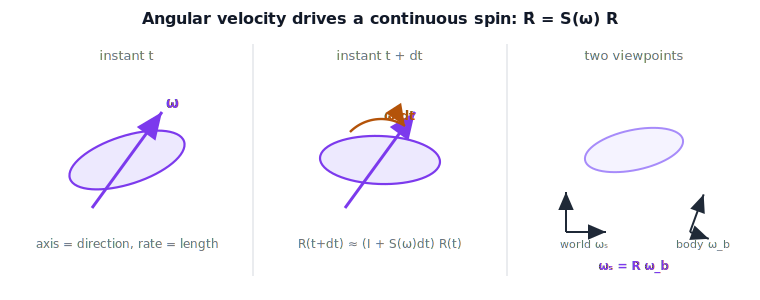

!!! abstract "You are here"
    **Module 6 — Jacobians and Differential Motion**  ·  **Unit 1 — Differential Motion & Twists**  ·  **Lesson 1.2 — Angular Velocity and the Skew Operator**

# Lesson 1.2 — Angular Velocity and the Skew Operator

## 1. Why This Matters
A robot wrist does not rotate in one-shot nudges — it *spins*, continuously, while a
gyroscope reports how fast. In Lesson 1.1 a differential rotation was a single small
step, $R \approx I + S(\delta\boldsymbol{\theta})$. Let that step accrue over an
instant of time and you get a *rate* of turning: **angular velocity**
$\boldsymbol{\omega}$. This lesson turns the still frame into a movie. The reward is a
single law of motion, $\dot R = S(\boldsymbol{\omega})R$, that every inertial
measurement unit on every drone and arm integrates thousands of times per second to
know which way it is pointing.

## 2. Physical Intuition
Spin a top, or twist your wrist. At any instant the motion has just two ingredients
you can feel: an **axis** it is turning about, and a **rate** it is turning at. Bundle
them into one arrow $\boldsymbol{\omega}$ — point it along the axis, make its length
the rate. That arrow *is* angular velocity.

Now watch the same spinning wrist from two viewpoints. Standing in the room, you
describe the axis in **world** coordinates ($\boldsymbol{\omega}_s$). Riding on the
wrist itself, you describe the very same spin in **body** coordinates
($\boldsymbol{\omega}_b$). One physical motion, two descriptions — exactly like
narrating a turn from the sidewalk versus from the driver's seat. The figure below
shows the spin as it advances, and then the two viewpoints side by side.

## 3. Mathematical Foundations
*In words first:* the body is turning, so its orientation $R(t)$ is changing; angular
velocity is the rate of that change, and the skew operator from Lesson 1.1 is what
converts "axis-and-rate" into "rate of change of $R$."

A rotation matrix always satisfies $R R^\top = I$. Differentiate in time:

$$\dot R R^\top + R \dot R^\top = 0 \;\Rightarrow\; \dot R R^\top = -(\dot R R^\top)^\top,$$

so $\dot R R^\top$ is **skew-symmetric** — it equals $S(\boldsymbol{\omega}_s)$ for a
unique vector $\boldsymbol{\omega}_s$. That gives the law of motion:

$$\boxed{\dot R = S(\boldsymbol{\omega}_s)\,R.}$$

Read it as motion: at each instant the frame is nudged by the differential rotation
$\boldsymbol{\omega}_s\,dt$, accumulating into the continuous spin you see. Grouping
the other way names the body view, $R^\top\dot R = S(\boldsymbol{\omega}_b)$, and the
two viewpoints are one rotation apart:

$$\boldsymbol{\omega}_s = R\,\boldsymbol{\omega}_b.$$

To go from a measured $\dot R$ back to the axis-and-rate arrow, pull the vector out of
the skew matrix with the inverse "vee" operator: $\big(S(\boldsymbol{\omega})\big)^\vee
= \boldsymbol{\omega}$. *Back to motion:* $\boldsymbol{\omega}$ is the arrow; $\dot R =
S(\boldsymbol{\omega})R$ is how that arrow drives the turning.

## 4. Visual Explanation

<figure markdown>
  { width="680" }
</figure>

## 5. Engineering Example
This is not abstract: it is how a robot knows its own orientation. A strapdown IMU
measures body angular velocity $\boldsymbol{\omega}_b$ with its gyroscope at, say,
1 kHz. To track orientation it integrates the body form $\dot R = R\,
S(\boldsymbol{\omega}_b)$ forward in time — literally stepping $R$ with each gyro
sample. Drones, legged robots, and arm wrists all run this loop. Notably they do *not*
integrate Euler-angle rates, because those blow up near certain attitudes (gimbal
lock, Lesson 3.4); the skew-operator form has no such singularity, which is exactly
why it is the workhorse.

## 6. Worked Example
A wrist spins about the world $z$-axis at $\boldsymbol{\omega}_s = (0,0,2)$ rad/s.
Then $S(\boldsymbol{\omega}_s) = \begin{bmatrix}0&-2&0\\2&0&0\\0&0&0\end{bmatrix}$, and
with $R(0)=I$,

$$\dot R(0) = S(\boldsymbol{\omega}_s)\,I = \begin{bmatrix}0&-2&0\\2&0&0\\0&0&0\end{bmatrix}.$$

Integrating, $R(t)$ is a rotation about $z$ by angle $2t$ — the steady spin we started
with. Reading backward from the motion: $\big(\dot R(0)R(0)^\top\big)^\vee = (0,0,2)$
recovers the axis-and-rate arrow. The math simply re-describes what the wrist is
visibly doing.

## 7. Interactive Demonstration

<iframe src="../../demos/module06/lesson02_angular_velocity_skew.html" title="Angular Velocity and the Skew Operator interactive demo" style="width:100%;height:520px;border:1px solid #e2e8f0;border-radius:12px"></iframe>

[Open this demo in a new tab ↗](../demos/module06/lesson02_angular_velocity_skew.html)

*(No embedded applet here — the Installment A demo is the Jacobian Column Explorer in
Lesson 2.3. Use this guided prediction.)*

**Predict, then check.** A body has constant $\boldsymbol{\omega}_s = (0,0,1)$.

1. **Predict** whether integrating $\dot R = S(\boldsymbol{\omega}_s)R$ for one second
   keeps $R$ a valid rotation (orthonormal, $\det = 1$).
2. **Predict** the recovered $\boldsymbol{\omega}_s$ from $(\dot R R^\top)^\vee$ partway
   through.
3. **Check** in the notebook: integrate numerically (like an IMU does) and confirm
   orthonormality holds and the axis-rate is recovered.

## 8. Coding Exercise

!!! tip "Run the hands-on notebook"
    `modules/module06/notebooks/lesson02_angular_velocity.ipynb` — open in JupyterLab and run **Kernel → Restart & Run All**.

In the companion notebook:

1. Implement `vee(S)` (inverse of `skew`) and verify `vee(skew(w)) == w`.
2. Integrate $\dot R = S(\boldsymbol{\omega}_s)R$ over $[0,1]$ s — a miniature strapdown
   loop — with re-orthonormalization, and check the result matches the closed-form
   spin about the axis.
3. Confirm $\boldsymbol{\omega}_s = R\,\boldsymbol{\omega}_b$ on a random $R$.

Prints `All checks passed.`

## 9. Knowledge Check

Formative — unlimited attempts, immediate feedback; does not affect your grade.

<iframe src="../../quizzes/module06/lesson02_quiz.html" title="Angular Velocity and the Skew Operator knowledge check" style="width:100%;height:720px;border:1px solid #e2e8f0;border-radius:12px"></iframe>

[Open this quiz in a new tab ↗](../quizzes/module06/lesson02_quiz.html)

1. In one sentence, what does the arrow $\boldsymbol{\omega}$ encode physically?
2. State the motion law for $R$ in terms of spatial angular velocity.
3. How are body and spatial angular velocity related, and which one does a gyro report?
4. Why does an IMU integrate $\dot R = S(\omega)R$ rather than Euler-angle rates?

## 10. Challenge Problem
Show that $\boldsymbol{\omega}_s(t) = R(t)\,\boldsymbol{\omega}_b(t)$ holds at every
instant, and that the two coincide iff the instantaneous axis is fixed in both frames
(e.g. a constant-axis spin). Give a physical example where $\boldsymbol{\omega}_s \neq
\boldsymbol{\omega}_b$ (hint: a body whose spin axis is itself tumbling).

## 11. Common Mistakes
- **Confusing $\boldsymbol{\omega}$ with Euler-angle rates $\dot{\boldsymbol{\phi}}$.**
  Different objects, related by a representation map (Lesson 3.2).
- **Dropping the side of multiplication.** $\dot R = S(\boldsymbol{\omega}_s)R$ (world,
  left) vs $\dot R = R\,S(\boldsymbol{\omega}_b)$ (body, right) — the side names the
  frame.
- **Forgetting $R$ drifts under naive integration.** Re-orthonormalize, exactly as a
  real attitude filter does.

## 12. Key Takeaways
- Angular velocity $\boldsymbol{\omega}$ = instantaneous axis (direction) + rate
  (length) of turning.
- $\dot R = S(\boldsymbol{\omega}_s)R$ is the law of motion; the skew operator from
  Lesson 1.1 drives the spin.
- World vs body view: $\boldsymbol{\omega}_s = R\,\boldsymbol{\omega}_b$ — one motion,
  two frames.
- This is the relation every IMU integrates; it feeds the rotational rows of the
  Jacobian in Unit 2.

---

### AI Learning Companion

- **Tutor (re-explain):** "Re-explain angular velocity as an axis-and-rate arrow and
  why $\dot R = S(\omega)R$ describes a continuous spin, then quiz me on world vs body
  angular velocity."
- **Practice (generate exercises):** "Give me three problems on angular velocity and
  the vee operator, including one where I integrate $\dot R = S(\omega)R$ like an IMU.
  Hold the answers until I respond."
- **Explore (connect to the real world):** "Walk me through how a drone's IMU uses
  $\dot R = S(\omega)R$ to track attitude, and why Euler-angle integration fails."

### Global Learning Support

- **English (authoritative):** "Explain angular velocity as an axis-and-rate arrow,
  the motion law $\dot R = S(\omega)R$, and world vs body angular velocity, at
  robotics-course level."
- **Español:** "Explica la velocidad angular como un vector eje-y-tasa, la ley de
  movimiento $\dot R = S(\omega)R$, y la diferencia entre velocidad angular espacial y
  del cuerpo, a nivel de robótica."
- **中文（简体）：** "用机器人学课程的水平，把角速度解释为'轴-速率'箭头，讲解运动律
  $\dot R = S(\omega)R$，以及空间角速度与机体角速度的区别。"
- **Türkçe:** "Açısal hızı bir eksen-ve-oran oku olarak, $\dot R = S(\omega)R$ hareket
  yasasını ve uzaysal/gövde açısal hız ayrımını robotik ders düzeyinde açıkla."

---

*Next lesson: 1.3 — The Twist: Linear and Angular Velocity Together.*
