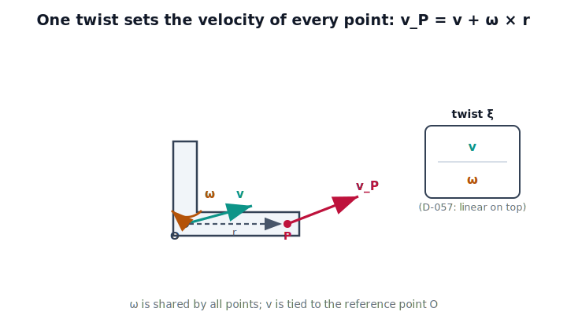

!!! abstract "You are here"
    **Module 6 — Jacobians and Differential Motion**  ·  **Unit 1 — Differential Motion & Twists**  ·  **Lesson 1.3 — The Twist: Linear and Angular Velocity Together**

# Lesson 1.3 — The Twist: Linear and Angular Velocity Together

## 1. Why This Matters
We now have the two ingredients of instantaneous motion: linear velocity
$\mathbf{v}$ (from differential translation) and angular velocity
$\boldsymbol{\omega}$ (from Lesson 1.2). A rigid body has both at once. Packaging
them into a single object — the **twist** — is what lets the Jacobian output a
*single* end-effector velocity in Unit 2. Per the locked convention **D-057**, the
twist is ordered linear-on-top:

$$\boldsymbol{\xi} = \begin{bmatrix} \mathbf{v} \\ \boldsymbol{\omega} \end{bmatrix} \in \mathbb{R}^6.$$

This ordering is the continuous-time sibling of M5's differential pair
$(\Delta\mathbf{p}, \delta\boldsymbol{\theta})$ — translation first, rotation
second.

## 2. Physical Intuition
Hold a phone and move it freely for one second. Its motion is completely captured
by two facts: how fast a chosen point (say its center) is sliding through space
($\mathbf{v}$), and how fast and about what axis the whole phone is turning
($\boldsymbol{\omega}$). Six numbers. Every other point of the phone — a corner, a
camera lens — has a velocity you can compute from those six, because the body is
rigid: distant points share the turn but pick up extra speed from the lever arm.

## 3. Mathematical Foundations
Let a rigid body have angular velocity $\boldsymbol{\omega}$ and let a reference
point $O$ on it move with linear velocity $\mathbf{v} = \mathbf{v}_O$. For any
other point $P$ fixed in the body, with $\mathbf{r} = \mathbf{p}_P - \mathbf{p}_O$,

$$\boxed{\;\mathbf{v}_P = \mathbf{v}_O + \boldsymbol{\omega} \times \mathbf{r}\;}
= \mathbf{v}_O + S(\boldsymbol{\omega})\,\mathbf{r}.$$

This is the **rigid-body velocity field**. The angular part $\boldsymbol{\omega}$
is shared by every point; the linear part depends on which reference point you
name. Change the reference point from $O$ to $O'$ and the linear velocity shifts:

$$\mathbf{v}_{O'} = \mathbf{v}_O + \boldsymbol{\omega} \times (\mathbf{p}_{O'} - \mathbf{p}_O),$$

while $\boldsymbol{\omega}$ is unchanged. So a twist is always reported *about a
reference point* — a subtlety we exploit when we transform twists in Lesson 1.4
and when we choose the Jacobian's reference point in Lesson 2.4.

Why exactly six numbers? Rigidity removes all but six degrees of freedom from a
body's motion: three translational, three rotational. The twist is the velocity-space
expression of that fact.

## 4. Visual Explanation

<figure markdown>
  { width="680" }
</figure>

## 5. Engineering Example
A mobile manipulator's gripper is the reference point we command, but the part we
actually care about is the fingertip, offset by $\mathbf{r}$ from the gripper
frame. Given the gripper twist $\boldsymbol{\xi} = [\mathbf{v};\boldsymbol{\omega}]$,
the fingertip's linear velocity is $\mathbf{v} + \boldsymbol{\omega}\times\mathbf{r}$.
Forgetting the $\boldsymbol{\omega}\times\mathbf{r}$ term is a classic cause of
"the tool tip drifts even though the wrist looks still" — it's the lever-arm
velocity of a rotating frame.

## 6. Worked Example
A body has $\mathbf{v}_O = (1,0,0)$ m/s and $\boldsymbol{\omega} = (0,0,2)$ rad/s
(spinning about $z$). A point at $\mathbf{r} = (0,0.5,0)$ m has velocity

$$\mathbf{v}_P = (1,0,0) + (0,0,2)\times(0,0.5,0) = (1,0,0) + (-1,0,0) = (0,0,0).$$

That point is instantaneously stationary — the translation and the rotational
lever-arm term cancel. (This is the instantaneous center of rotation, a recurring
theme once we discuss singular and degenerate motions.)

## 7. Interactive Demonstration
*(Embedded demo arrives in Lesson 2.3. Guided prediction here.)*

**Predict, then check.** Body with $\mathbf{v}_O=(1,0,0)$, $\boldsymbol{\omega}=(0,0,2)$.

1. **Predict** which point along the $+y$ axis is instantaneously at rest.
2. **Predict** the velocity of the point at $\mathbf{r}=(0,1,0)$.
3. **Check** in the notebook by evaluating $\mathbf{v}+\boldsymbol{\omega}\times\mathbf{r}$
   over a grid of points and confirming the rigid-body constraint (relative speed
   along $\mathbf{r}$ is zero).

## 8. Coding Exercise

!!! tip "Run the hands-on notebook"
    `modules/module06/notebooks/lesson03_the_twist.ipynb` — open in JupyterLab and run **Kernel → Restart & Run All**.

In the companion notebook:

1. Build a twist $\boldsymbol{\xi}=[\mathbf{v};\boldsymbol{\omega}]$ and a function
   `point_velocity(xi, r)` returning $\mathbf{v}+\boldsymbol{\omega}\times\mathbf{r}$.
2. Verify the **rigid-body constraint**: for any two body points, the component of
   their relative velocity along the line joining them is zero.
3. Verify **reference-point change**: recompute $\mathbf{v}$ about a new origin and
   confirm the velocity field is unchanged.

Prints `All checks passed.` on success.

## 9. Knowledge Check

Formative — unlimited attempts, immediate feedback; does not affect your grade.

<iframe src="../../quizzes/module06/lesson03_quiz.html" title="The Twist: Linear and Angular Velocity Together knowledge check" style="width:100%;height:720px;border:1px solid #e2e8f0;border-radius:12px"></iframe>

[Open this quiz in a new tab ↗](../quizzes/module06/lesson03_quiz.html)

1. Write the twist in the D-057 ordering and identify each block.
2. State the rigid-body velocity field equation.
3. If you move the reference point, which part of the twist changes and which stays
   fixed?
4. Why do exactly six numbers suffice to describe instantaneous rigid-body motion?

## 10. Challenge Problem
Prove the rigid-body constraint directly: for two body-fixed points $P,Q$, show
$(\mathbf{v}_P-\mathbf{v}_Q)\cdot(\mathbf{p}_P-\mathbf{p}_Q)=0$ using
$\mathbf{v}_P=\mathbf{v}+\boldsymbol{\omega}\times\mathbf{r}_P$. Interpret the
result: rigid bodies cannot stretch.

## 11. Common Mistakes
- **Reporting a twist without a reference point.** The linear part is meaningless
  until you say "velocity *of which point*."
- **Wrong stack order.** D-057 fixes $[\mathbf{v};\boldsymbol{\omega}]$ (linear
  top). The opposite order $[\boldsymbol{\omega};\mathbf{v}]$ appears in other texts
  — do not mix conventions inside this curriculum.
- **Dropping $\boldsymbol{\omega}\times\mathbf{r}$** when transferring velocity to
  an offset point.

## 12. Key Takeaways
- The twist $\boldsymbol{\xi}=[\mathbf{v};\boldsymbol{\omega}]\in\mathbb{R}^6$
  (D-057 ordering) captures complete instantaneous rigid-body motion.
- The rigid-body velocity field is $\mathbf{v}_P=\mathbf{v}+\boldsymbol{\omega}\times\mathbf{r}$.
- $\boldsymbol{\omega}$ is shared by all points; $\mathbf{v}$ is tied to a chosen
  reference point.
- This 6-vector is precisely what the Jacobian will produce from joint rates in
  Unit 2.

---

### AI Learning Companion

- **Tutor (re-explain):** "Explain the twist $[\mathbf{v};\boldsymbol{\omega}]$ and
  the field $\mathbf{v}_P=\mathbf{v}+\boldsymbol{\omega}\times\mathbf{r}$, then quiz
  me on why the reference point matters."
- **Practice (generate exercises):** "Generate three problems computing point
  velocities of a rigid body and finding instantaneously stationary points. Hold
  solutions until I answer."
- **Explore (connect to the real world):** "How does the twist concept apply to a
  spacecraft, a car wheel's contact point, and a robot gripper with an offset
  tool?"

### Global Learning Support

- **English (authoritative):** "Explain the twist as $[\mathbf{v};\boldsymbol{\omega}]$
  and the rigid-body velocity field at robotics-course level."
- **Español:** "Explica el twist como $[\mathbf{v};\boldsymbol{\omega}]$ y el campo
  de velocidades del cuerpo rígido a nivel de robótica."
- **中文（简体）：** "用机器人学课程的水平，解释旋量（twist）
  $[\mathbf{v};\boldsymbol{\omega}]$ 以及刚体速度场。"
- **Türkçe:** "Twist'i $[\mathbf{v};\boldsymbol{\omega}]$ olarak ve katı-cisim hız
  alanını robotik ders düzeyinde açıkla."

---

*Next lesson: 1.4 — Transforming Twists Between Frames.*
