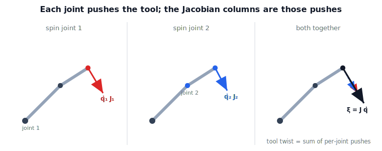

!!! abstract "You are here"
    **Module 6 — Jacobians and Differential Motion**  ·  **Unit 2 — Geometric Jacobian & Forward Velocity Kinematics**  ·  **Lesson 2.1 — Forward Velocity Kinematics: Defining the Jacobian**

# Lesson 2.1 — Forward Velocity Kinematics: Defining the Jacobian

## 1. Why This Matters
Drive the joints of an arm and watch the tool sweep through space. Forward kinematics
(M2) told you *where* the tool is; now we ask *how fast it moves* when the joints turn
at given rates. The object that connects "joint rates in" to "tool twist out" is the
**Jacobian**, and the whole relationship is one line:

$$\boldsymbol{\xi} = J(\mathbf{q})\,\dot{\mathbf{q}}.$$

This is the moment the Jacobian stops being solver bookkeeping and becomes the moving
arm's velocity map. In M5 we wrote $\Delta\mathbf{p} \approx J\,\Delta\boldsymbol{\theta}$
and used $J$ only to take Newton steps toward a target. The same matrix, read while the
arm is in motion, *is* the velocity relationship. **The Jacobian we used inside the
numerical IK solver is now the subject.**

## 2. Physical Intuition
Picture jogging an arm one joint at a time. Spin joint 1 only: the tool swings along an
arc, picking up some velocity. Stop, and spin joint 2 only: the tool moves a different
direction. Now turn *both* at once — the tool's velocity is simply the **sum** of the
two individual contributions. Every joint pushes the tool a little; the total tool
twist is all those pushes added up, each scaled by how fast that joint is turning.

The Jacobian is the ledger of those pushes: one column per joint, each column saying
"if this joint turns at unit rate, here is the tool twist it produces." Add the
columns, weighted by the joint rates, and you get the tool's motion. Crucially, the
size and direction of each push depends on the arm's current pose — fold the arm and
the pushes change — which is why the ledger $J$ is rewritten at every configuration.
The figure shows joint 1's push, joint 2's push, and their sum.

## 3. Mathematical Foundations
*In words first:* stack each joint's unit-rate tool-twist as a column; the tool twist
is the rate-weighted sum of those columns.

With joint variables $\mathbf{q}\in\mathbb{R}^n$ and tool twist
$\boldsymbol{\xi}=[\mathbf{v};\boldsymbol{\omega}]\in\mathbb{R}^6$ (D-057 order, base
frame):

$$\boldsymbol{\xi} = J(\mathbf{q})\,\dot{\mathbf{q}}
= \dot q_1\,\underbrace{J_1(\mathbf{q})}_{\text{joint 1's push}} + \cdots + \dot q_n\,\underbrace{J_n(\mathbf{q})}_{\text{joint n's push}},
\qquad J\in\mathbb{R}^{6\times n}.$$

So $\boldsymbol{\xi}=J\dot{\mathbf{q}}$ is literally "sum the per-joint pushes." The
matrix splits into a linear block (top three rows) and angular block (bottom three):
$\mathbf{v}=J_v\dot{\mathbf{q}}$, $\boldsymbol{\omega}=J_\omega\dot{\mathbf{q}}$. Two
properties define it:

- **Linear in $\dot{\mathbf{q}}$:** at a fixed pose, turn every joint twice as fast and
  the tool moves twice as fast — a plain matrix multiply.
- **Nonlinear in $\mathbf{q}$:** the columns themselves depend on the pose (through the
  geometry of the arm), so $J$ is re-evaluated as the arm moves.

*Back to motion:* each column is a tool velocity; the next two lessons read those
columns straight off the arm's geometry instead of differentiating formulas.

## 4. Visual Explanation

<figure markdown>
  { width="680" }
</figure>

**Diagram Specification (multi-panel)**

- **Panel 1 — "spin joint 1":** the arm with only joint 1 turning; draw the resulting
  tool velocity arrow (this is $\dot q_1 J_1$).
- **Panel 2 — "spin joint 2":** same arm, only joint 2 turning; draw its tool velocity
  arrow ($\dot q_2 J_2$).
- **Panel 3 — "both together":** both joints turning; draw the two contribution arrows
  and their vector sum as the total tool twist $\boldsymbol{\xi}=J\dot{\mathbf{q}}$.
- Annotate: "each joint pushes the tool; the Jacobian columns are those pushes."
- Caption: "Forward velocity kinematics: the tool twist is the rate-weighted sum of
  per-joint pushes — that sum is $J(\mathbf{q})\dot{\mathbf{q}}$."

## 5. Engineering Example
When an operator jogs a robot with a teach pendant — "move the tool +X at 50 mm/s,
hold orientation" — the controller is living in this equation. The desired tool twist
$\boldsymbol{\xi}$ is specified; the joint rates that produce it come from inverting
this same relation, $\dot{\mathbf{q}}=J^{-1}\boldsymbol{\xi}$ (Unit 7). Conveyor
tracking, hand-guiding, and resolved-rate control all begin here, with the forward map
that turns joint motion into tool motion.

## 6. Worked Example
For the planar 2R arm (links $L_1,L_2$, revolute about $z$), the tool position is
$\mathbf{p}=(L_1c_1+L_2c_{12},\,L_1s_1+L_2s_{12})$. Its linear-velocity Jacobian — the
two per-joint pushes side by side — is

$$J_v = \begin{bmatrix} -L_1 s_1 - L_2 s_{12} & -L_2 s_{12} \\ L_1 c_1 + L_2 c_{12} & L_2 c_{12} \end{bmatrix},$$

with $c_1=\cos\theta_1$, $s_{12}=\sin(\theta_1+\theta_2)$. Column 1 is the tool velocity
when only joint 1 turns; column 2 when only joint 2 turns; and
$\dot{\mathbf{p}}=J_v\dot{\boldsymbol{\theta}}$ adds them. This is exactly the matrix M5
fed to Newton's method — there a step generator, here the statement of how the tool
moves.

## 7. Interactive Demonstration
*(The Installment A interactive demo — the **Jacobian Column Explorer**, Lesson 2.3 —
lets you drag this arm and watch each column-push redraw live. Guided prediction for
now.)*

**Predict, then check.** 2R arm, $L_1=L_2=1$, at $\boldsymbol{\theta}=(0,\pi/2)$.

1. **Predict** the tool velocity if only joint 1 turns at $1$ rad/s.
2. **Predict** the tool velocity if only joint 2 turns at $1$ rad/s.
3. **Check** in the notebook by forming $J_v$ and reading its columns — then confirm
   both-joints equals the sum.

## 8. Coding Exercise

!!! tip "Run the hands-on notebook"
    `modules/module06/notebooks/lesson05_forward_velocity_kinematics.ipynb` — open in JupyterLab and run **Kernel → Restart & Run All**.

In the companion notebook:

1. Implement `fk(theta)` and `jacobian_v(theta)` for the planar 2R arm.
2. Confirm the **sum-of-pushes** picture: tool velocity with both joints moving equals
   column 1·$\dot\theta_1$ + column 2·$\dot\theta_2$.
3. Confirm pose-dependence: evaluate $J_v$ at two poses and show the columns (the
   pushes) differ.

Prints `All checks passed.`

## 9. Knowledge Check

Formative — unlimited attempts, immediate feedback; does not affect your grade.

<iframe src="../../quizzes/module06/lesson05_quiz.html" title="Forward Velocity Kinematics: Defining the Jacobian knowledge check" style="width:100%;height:720px;border:1px solid #e2e8f0;border-radius:12px"></iframe>

[Open this quiz in a new tab ↗](../quizzes/module06/lesson05_quiz.html)

1. In one sentence, what does each column of $J$ represent on the moving arm?
2. Write forward velocity kinematics and name every symbol.
3. Why does $J$ change with pose while the map stays linear in $\dot{\mathbf{q}}$?
4. Relate this $J$ to the one the M5 IK solver used.

## 10. Challenge Problem
Show that the $i$-th column of $J$ equals the tool twist produced by moving joint $i$
at unit rate with all others fixed — i.e., the "push" picture is exact, not a
metaphor. (This column-as-unit-motion fact is the entire basis of the geometric
construction in Lesson 2.2.)

## 11. Common Mistakes
- **Thinking $J$ is constant.** The pushes change as the arm moves; $J$ is re-evaluated
  every pose.
- **Mixing the blocks.** Top three rows = linear velocity, bottom three = angular
  (D-057). Don't stack them the other way.
- **Confusing $\dot{\mathbf{q}}$ with $\boldsymbol{\xi}$.** Joint rates ($n$ numbers) in,
  tool twist ($6$ numbers) out — different spaces.

## 12. Key Takeaways
- Forward velocity kinematics: $\boldsymbol{\xi}=J(\mathbf{q})\dot{\mathbf{q}}$ — the
  rate-weighted sum of per-joint pushes.
- $J$ is $6\times n$: linear block $J_v$ on top, angular block $J_\omega$ below.
- Linear in $\dot{\mathbf{q}}$, nonlinear in $\mathbf{q}$ — rewritten as the arm moves.
- This is M5's solver Jacobian, promoted to the moving arm's velocity map and the
  subject of Module 6.

---

### AI Learning Companion

- **Tutor (re-explain):** "Explain $\boldsymbol{\xi}=J(\mathbf{q})\dot{\mathbf{q}}$ as a
  sum of per-joint pushes on a moving arm, and why $J$ changes with pose. Then quiz me."
- **Practice (generate exercises):** "Give me three problems forming and applying a
  planar-arm Jacobian as column-pushes, including one with both joints moving. Hold
  solutions."
- **Explore (connect to the real world):** "How does jogging a robot with a teach
  pendant use forward velocity kinematics, and how does it lead into resolved-rate
  control?"

### Global Learning Support

- **English (authoritative):** "Define forward velocity kinematics as 'joint rates in,
  tool twist out' with $\boldsymbol{\xi}=J(\mathbf{q})\dot{\mathbf{q}}$, at
  robotics-course level."
- **Español:** "Define la cinemática diferencial directa como 'velocidades de
  articulación a la entrada, twist de la herramienta a la salida' con
  $\boldsymbol{\xi}=J(\mathbf{q})\dot{\mathbf{q}}$, a nivel de robótica."
- **中文（简体）：** "用机器人学课程的水平，把正向速度运动学解释为'关节速率输入、工具旋量
  输出'，即 $\boldsymbol{\xi}=J(\mathbf{q})\dot{\mathbf{q}}$。"
- **Türkçe:** "İleri hız kinematiğini 'eklem hızları girer, takım twist'i çıkar' olarak
  $\boldsymbol{\xi}=J(\mathbf{q})\dot{\mathbf{q}}$ ile robotik ders düzeyinde tanımla."

---

*Next lesson: 2.2 — The Geometric Jacobian by Column Construction.*
