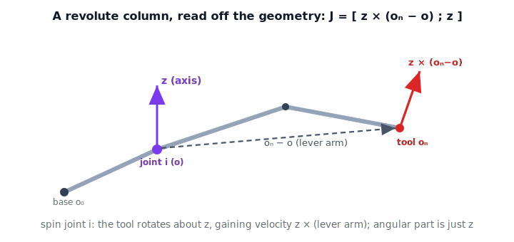

!!! abstract "You are here"
    **Module 6 — Jacobians and Differential Motion**  ·  **Unit 2 — Geometric Jacobian & Forward Velocity Kinematics**  ·  **Lesson 2.2 — The Geometric Jacobian by Column Construction: Revolute Joints**

# Lesson 2.2 — The Geometric Jacobian by Column Construction: Revolute Joints

## 1. Why This Matters
Lesson 2.1 defined $J$ abstractly and noted its $i$-th column is the twist from
moving joint $i$ alone at unit rate. That observation is a *recipe*: we can write
each column directly from the geometry of the arm — axis and position of each
joint — without differentiating a single trigonometric expression. This **geometric
construction** is how Jacobians are built in practice, it generalizes cleanly to
any chain, and it keeps the picture (per D-057 and the architect's emphasis)
geometric before it is algebraic. This lesson does revolute joints; Lesson 2.3 adds
prismatic and mixed chains.

## 2. Physical Intuition
Spin one revolute joint and freeze the rest. The whole outboard arm — including the
end-effector — rotates rigidly about that joint's axis. From Lesson 1.3 we already
know the velocity of a point on a body rotating about an axis: the end-effector's
linear velocity is $\boldsymbol{\omega}\times\mathbf{r}$, where the axis sets
$\boldsymbol{\omega}$ and $\mathbf{r}$ is the lever arm from the joint to the tool.
Its angular velocity is simply that axis. That is the column — read straight off the
geometry.

## 3. Mathematical Foundations
Number frames $0$ (base) through $n$ (end-effector). From the forward-kinematics
transforms $T_0^i$, extract, **in the base frame**:

- $\mathbf{z}_{i-1}$ — the axis of joint $i$ (the third column of the rotation part
  of $T_0^{i-1}$);
- $\mathbf{o}_{i-1}$ — the origin of frame $i-1$ (the translation of $T_0^{i-1}$);
- $\mathbf{o}_n$ — the end-effector origin.

For a **revolute** joint $i$ turning at unit rate, the end-effector angular velocity
is $\mathbf{z}_{i-1}$ and its linear velocity is $\mathbf{z}_{i-1}\times(\mathbf{o}_n-\mathbf{o}_{i-1})$.
Stacking in D-057 order gives the column

$$\boxed{\;J_i^{\text{(rev)}} = \begin{bmatrix} \mathbf{z}_{i-1}\times(\mathbf{o}_n - \mathbf{o}_{i-1}) \\ \mathbf{z}_{i-1} \end{bmatrix} \in \mathbb{R}^6.\;}$$

The full geometric Jacobian is these columns side by side:

$$J(\mathbf{q}) = \big[\,J_1\;\;J_2\;\;\cdots\;\;J_n\,\big] \in \mathbb{R}^{6\times n}.$$

Everything is expressed in the base/world frame, consistent with the D-057 lock; the
tool-frame Jacobian follows by the twist transform of Lesson 1.4 (formalized in
Lesson 2.4).

## 4. Visual Explanation

<figure markdown>
  { width="680" }
</figure>

## 5. Engineering Example
Consider the first joint of an arm whose axis is vertical ($\mathbf{z}_0 = \hat{z}$)
and whose tool sits at horizontal reach $\mathbf{o}_n-\mathbf{o}_0 = (r,0,0)$.
Spinning joint 1 sweeps the tool tangentially: $\mathbf{z}_0\times(r,0,0) = (0,r,0)$
— a $+y$ velocity proportional to reach. This is why a base joint contributes more
tool speed when the arm is extended than when it is folded: the lever arm is longer.
The Jacobian column encodes that automatically.

## 6. Worked Example
Planar 2R arm, $L_1=L_2=1$, both axes along $\mathbf{z}=(0,0,1)$. At
$\boldsymbol{\theta}=(0,\pi/2)$: $\mathbf{o}_0=(0,0,0)$, $\mathbf{o}_1=(1,0,0)$,
$\mathbf{o}_2=\mathbf{o}_n=(1,1,0)$.

- Column 1: $\mathbf{z}_0\times(\mathbf{o}_n-\mathbf{o}_0)=(0,0,1)\times(1,1,0)=(-1,1,0)$.
- Column 2: $\mathbf{z}_1\times(\mathbf{o}_n-\mathbf{o}_1)=(0,0,1)\times(0,1,0)=(-1,0,0)$.

So the linear-velocity block is $J_v=\begin{bmatrix}-1&-1\\1&0\\0&0\end{bmatrix}$,
matching the symbolic $J_v$ from Lesson 2.1 evaluated at this pose. Same matrix, built
from geometry instead of derivatives.

## 7. Interactive Demonstration
*(The Jacobian Column Explorer in Lesson 2.3 lets you drag the arm and watch these
columns redraw live. Guided prediction here.)*

**Predict, then check.** Same 2R arm at $\boldsymbol{\theta}=(0,\pi/2)$.

1. **Predict** column 1's linear part if the arm is instead fully extended
   ($\boldsymbol{\theta}=(0,0)$, tool at $(2,0,0)$).
2. **Predict** how column 2 changes when only joint 2's reach matters.
3. **Check** in the notebook by computing $\mathbf{z}\times(\mathbf{o}_n-\mathbf{o})$
   for each joint.

## 8. Coding Exercise

!!! tip "Run the hands-on notebook"
    `modules/module06/notebooks/lesson06_geometric_jacobian_revolute.ipynb` — open in JupyterLab and run **Kernel → Restart & Run All**.

In the companion notebook:

1. Build base-frame transforms $T_0^i$ for an all-revolute chain and extract
   $\mathbf{z}_{i-1}$, $\mathbf{o}_{i-1}$, $\mathbf{o}_n$.
2. Implement `geometric_jacobian(q)` assembling the revolute columns
   $[\mathbf{z}\times(\mathbf{o}_n-\mathbf{o});\,\mathbf{z}]$.
3. Confirm the planar 2R linear block equals the symbolic $J_v$ from Lesson 2.1 at
   several poses.

Prints `All checks passed.`

## 9. Knowledge Check

Formative — unlimited attempts, immediate feedback; does not affect your grade.

<iframe src="../../quizzes/module06/lesson06_quiz.html" title="The Geometric Jacobian by Column Construction: Revolute Joints knowledge check" style="width:100%;height:720px;border:1px solid #e2e8f0;border-radius:12px"></iframe>

[Open this quiz in a new tab ↗](../quizzes/module06/lesson06_quiz.html)

1. What does column $i$ of the geometric Jacobian represent physically?
2. Write the revolute-joint column and label its two blocks.
3. Where do $\mathbf{z}_{i-1}$ and $\mathbf{o}_{i-1}$ come from?
4. Why does a base joint contribute more tool speed when the arm is extended?

## 10. Challenge Problem
Derive the revolute column from first principles: starting from the rigid-body
velocity field $\mathbf{v}=\boldsymbol{\omega}\times\mathbf{r}$ with
$\boldsymbol{\omega}=\dot{q}_i\,\mathbf{z}_{i-1}$ and
$\mathbf{r}=\mathbf{o}_n-\mathbf{o}_{i-1}$, show the unit-rate column is exactly
$[\mathbf{z}_{i-1}\times(\mathbf{o}_n-\mathbf{o}_{i-1});\,\mathbf{z}_{i-1}]$. Explain
why only the *outboard* links matter.

## 11. Common Mistakes
- **Using the wrong frame's axis.** Joint $i$'s axis is $\mathbf{z}_{i-1}$ (frame
  $i-1$), not $\mathbf{z}_i$. Off-by-one here corrupts the whole Jacobian.
- **Lever arm to the wrong point.** The vector is to the *end-effector* origin
  $\mathbf{o}_n$, not the next joint.
- **Expressing axes in local frames.** All quantities must be in the base frame for
  the base-frame Jacobian (D-057).

## 12. Key Takeaways
- A Jacobian column is the unit-rate twist of one joint.
- Revolute column: $[\mathbf{z}_{i-1}\times(\mathbf{o}_n-\mathbf{o}_{i-1});\,\mathbf{z}_{i-1}]$.
- Built from base-frame axes and origins read off $T_0^i$ — geometry, not symbolic
  differentiation.
- Assembling the columns gives the full $6\times n$ geometric Jacobian.

---

### AI Learning Companion

- **Tutor (re-explain):** "Explain why the revolute column is
  $[\mathbf{z}\times(\mathbf{o}_n-\mathbf{o});\mathbf{z}]$ from the rigid-body
  velocity field, then quiz me on the off-by-one axis pitfall."
- **Practice (generate exercises):** "Generate three problems building revolute
  Jacobian columns for 2- and 3-link arms. Hold solutions until I answer."
- **Explore (connect to the real world):** "Why do base joints dominate tool speed
  on extended arms? Connect the lever-arm term to real manipulator behavior."

### Global Learning Support

- **English (authoritative):** "Explain the geometric Jacobian's revolute column
  $[\mathbf{z}\times(\mathbf{o}_n-\mathbf{o});\mathbf{z}]$ at robotics-course level."
- **Español:** "Explica la columna revoluta del jacobiano geométrico
  $[\mathbf{z}\times(\mathbf{o}_n-\mathbf{o});\mathbf{z}]$ a nivel de robótica."
- **中文（简体）：** "用机器人学课程的水平，解释几何雅可比的转动关节列
  $[\mathbf{z}\times(\mathbf{o}_n-\mathbf{o});\mathbf{z}]$。"
- **Türkçe:** "Geometrik Jacobian'ın döner-eklem sütununu
  $[\mathbf{z}\times(\mathbf{o}_n-\mathbf{o});\mathbf{z}]$ robotik ders düzeyinde açıkla."

---

*Next lesson: 2.3 — Prismatic Joints, Mixed Chains, and the Full 6×n Jacobian.*
