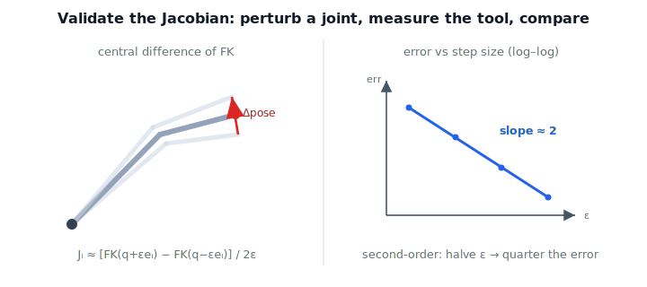

!!! abstract "You are here"
    **Module 6 — Jacobians and Differential Motion**  ·  **Unit 2 — Geometric Jacobian & Forward Velocity Kinematics**  ·  **Lesson 2.4 — Numerical Validation: Geometric J vs Finite Differences**

# Lesson 2.4 — Numerical Validation: Geometric J vs Finite Differences

## 1. Why This Matters
We now have a recipe that builds a Jacobian from an arm's geometry — but a recipe is
only as good as its proof. A single sign slip in a column (we hit one in Lesson 1.4)
silently corrupts every velocity, every singularity test, every resolved-rate command
downstream. So this lesson installs the habit that anchors the rest of Module 6:
**never trust a Jacobian you have not checked against motion you can measure.** The
check is simple and physical — wiggle a joint, see where the tool goes — and it is the
same discipline that will keep Units 5–8 honest.

## 2. Physical Intuition
Forget formulas for a moment. You want to know how much the tool moves when joint $i$
turns. So *turn it* — a tiny amount $+\varepsilon$, note the tool's new pose; turn it
$-\varepsilon$, note that pose; the difference, divided by $2\varepsilon$, is the
tool's velocity per unit of joint motion. That is column $i$ of the Jacobian,
discovered by experiment rather than derivation. If the experiment and the analytic
column disagree, the analytic one is wrong. The figure shows the three poses
($q-\varepsilon$, $q$, $q+\varepsilon$) and the measured tool displacement that becomes
the column.

## 3. Visual Explanation

<figure markdown>
  { width="680" }
</figure>

## 4. Mathematical Foundations
*In words first:* perturb a joint both ways, measure the change in tool pose, divide by
the total nudge. The linear part is an ordinary central difference; the angular part
needs the rotation trick from Lesson 1.2.

For joint $i$, with unit vector $\mathbf{e}_i$ and small step $\varepsilon$:

$$J_v^{(i)} \approx \frac{\mathbf{p}(\mathbf{q}+\varepsilon\mathbf{e}_i) - \mathbf{p}(\mathbf{q}-\varepsilon\mathbf{e}_i)}{2\varepsilon}.$$

The angular part cannot be obtained by subtracting rotation matrices and dividing.
Instead, form the *relative* rotation and read its axis-rate with the vee operator
(Lesson 1.2): with $M = R(\mathbf{q}+\varepsilon\mathbf{e}_i)\,R(\mathbf{q}-\varepsilon\mathbf{e}_i)^\top
\approx I + S(2\varepsilon\,\boldsymbol{\omega})$,

$$J_\omega^{(i)} \approx \frac{1}{2\varepsilon}\,\Big(\tfrac{M - M^\top}{2}\Big)^{\!\vee}.$$

Because both are central differences, the error scales as $\varepsilon^2$: halve the
step, quarter the error. *Back to motion:* the finite-difference column is literally
"how the tool moved, per unit joint motion," so agreement with the geometric column
confirms our geometry was read correctly.

## 5. Engineering Example
Every serious robotics codebase ships a Jacobian unit test exactly like this one.
When a new manipulator model is added — new DH parameters, a new joint type — the
finite-difference check runs across a sweep of random configurations and asserts
agreement to tolerance before the model is allowed near a controller. It is cheap,
model-agnostic, and catches the off-by-one axis and sign errors that are otherwise
invisible until the robot moves the wrong way. This lesson's notebook is that test, in
miniature.

## 6. Worked Example
For the spatial 3R arm at $\mathbf{q}=(0.2, 0.5, -0.3)$, computing the finite-difference
Jacobian at $\varepsilon=10^{-6}$ and comparing to the analytic geometric Jacobian
gives $\lVert J_{\text{geo}} - J_{\text{fd}}\rVert \approx 10^{-9}$ — agreement to nearly
machine precision. Sweeping $\varepsilon \in \{10^{-2},10^{-3},10^{-4},10^{-5}\}$ and
plotting the error produces a line of slope $\approx 2$ on log–log axes, the signature
of a correct central difference. (Too small an $\varepsilon$ eventually loses accuracy
to floating-point round-off — a practical floor worth knowing.)

## 7. Interactive Demonstration
*(The Installment A interactive demo is the Jacobian Column Explorer, Lesson 2.3.
Guided prediction here.)*

**Predict, then check.**

1. **Predict** how $\lVert J_{\text{geo}} - J_{\text{fd}}\rVert$ changes when you go from
   $\varepsilon=10^{-3}$ to $10^{-4}$.
2. **Predict** what the angular finite-difference returns for a *prismatic* joint.
3. **Check** in the notebook across revolute, prismatic-mixed, and spatial chains, and
   confirm the slope-2 convergence.

## 8. Coding Exercise

!!! tip "Run the hands-on notebook"
    `modules/module06/notebooks/lesson08_numerical_validation.ipynb` — open in JupyterLab and run **Kernel → Restart & Run All**.

In the companion notebook:

1. Implement `fd_jacobian(...)`: central difference for the linear block; rotation
   difference + vee for the angular block.
2. Confirm $\lVert J_{\text{geo}} - J_{\text{fd}}\rVert < 10^{-5}$ for a 2R, a spatial 3R,
   and a mixed R–P–R chain.
3. Sweep $\varepsilon$ and fit the log–log slope; confirm it is $\approx 2$.

Prints `All checks passed.`

## 9. Knowledge Check

Formative — unlimited attempts, immediate feedback; does not affect your grade.

<iframe src="../../quizzes/module06/lesson08_quiz.html" title="Numerical Validation: Geometric J vs Finite Differences knowledge check" style="width:100%;height:720px;border:1px solid #e2e8f0;border-radius:12px"></iframe>

[Open this quiz in a new tab ↗](../quizzes/module06/lesson08_quiz.html)

1. Describe, without formulas, how to find a Jacobian column by experiment.
2. Why can't the angular part be computed by subtracting rotation matrices?
3. What convergence rate do central differences give, and what does halving
   $\varepsilon$ do to the error?
4. Why is a finite-difference check a good gate before trusting a new robot model?

## 10. Challenge Problem
Show that the central-difference linear column has error $\mathcal{O}(\varepsilon^2)$ by
Taylor-expanding $\mathbf{p}(\mathbf{q}\pm\varepsilon\mathbf{e}_i)$, and explain why the
forward difference $[\mathbf{p}(\mathbf{q}+\varepsilon\mathbf{e}_i)-\mathbf{p}(\mathbf{q})]/\varepsilon$
is only first-order. Then explain the eventual round-off floor as $\varepsilon\to 0$.

## 11. Common Mistakes
- **Subtracting rotation matrices directly.** Use $R(+)R(-)^\top$ and the vee operator;
  raw matrix subtraction is not an angular velocity.
- **Forward instead of central differences** when you want second-order accuracy.
- **Driving $\varepsilon$ too small.** Below the round-off floor the error *grows*
  again; $10^{-6}$ is a sound default for these chains.
- **Validating at one pose.** Sweep configurations — errors often hide near specific
  geometries.

## 12. Key Takeaways
- Validate by motion: perturb each joint, measure the tool, divide — that is a Jacobian
  column.
- Linear part = central difference; angular part = rotation difference + vee.
- Central differences converge at second order ($\varepsilon^2$), with a round-off floor.
- This check is the verification habit that keeps Units 5–8 trustworthy — and it closes
  Unit 2: we can now build *and prove* the Jacobian for any serial arm.

---

### AI Learning Companion

- **Tutor (re-explain):** "Explain how to validate a Jacobian by perturbing joints, why
  the angular part needs the vee trick, and why central differences are second-order.
  Then quiz me."
- **Practice (generate exercises):** "Give me three problems on finite-difference
  Jacobians, including one on the angular block and one on convergence order. Hold
  solutions."
- **Explore (connect to the real world):** "Why does every robotics codebase ship a
  finite-difference Jacobian test? What bugs does it catch before a robot moves?"

### Global Learning Support

- **English (authoritative):** "Explain validating a geometric Jacobian against finite
  differences, including the angular-part vee trick and second-order convergence."
- **Español:** "Explica la validación de un jacobiano geométrico con diferencias
  finitas, incluyendo el truco vee para la parte angular y la convergencia de segundo
  orden."
- **中文（简体）：** "用机器人学课程的水平，解释如何用有限差分验证几何雅可比，包括角速度部分
  的 vee 技巧与二阶收敛。"
- **Türkçe:** "Geometrik Jacobian'ı sonlu farklarla doğrulamayı, açısal kısım için vee
  hilesini ve ikinci-derece yakınsamayı robotik ders düzeyinde açıkla."

---

*Next lesson: 3.1 — The Analytic Jacobian: Differentiating Forward Kinematics. (Installment B)*
