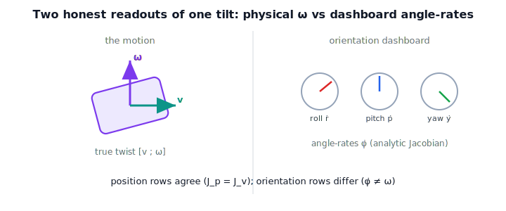

!!! abstract "You are here"
    **Module 6 — Jacobians and Differential Motion**  ·  **Unit 3 — Analytic Jacobian, Frames & Representations**  ·  **Lesson 3.1 — The Analytic Jacobian: Differentiating Forward Kinematics**

# Lesson 3.1 — The Analytic Jacobian: Differentiating Forward Kinematics

> Convention note (pending M2 reconciliation): worked examples use **ZYX
> roll-pitch-yaw**. The lesson teaches the representation-independent principle, so
> the canonical angle set can be swapped to match M2 with no conceptual change.

## 1. Why This Matters
The geometric Jacobian gives the tool's *true* twist $\boldsymbol{\xi}=[\mathbf{v};
\boldsymbol{\omega}]$ — honest physical velocity. But a great deal of robot software
does not speak in $\boldsymbol{\omega}$. It tracks orientation as three numbers —
roll, pitch, yaw — and a controller asks "how fast are those numbers changing?" That
rate is a *different* object: the **analytic Jacobian**. Knowing when you need one
versus the other (and why they disagree on orientation) prevents a whole class of
control bugs.

## 2. Physical Intuition
Picture the tool tilting. Two honest people describe the tilt rate differently. One
watches the *body* and reports its angular velocity $\boldsymbol{\omega}$ — an axis
and a rate, the physical thing. The other watches the *dashboard* showing roll, pitch,
yaw and reports how fast those three dials are spinning, $\dot{\boldsymbol{\phi}}$.
For translation they agree completely — position is position. For orientation they
generally do **not** agree, because the dials are a bookkeeping choice layered on top
of the real motion. The analytic Jacobian is the second person's answer.

## 3. Visual Explanation

<figure markdown>
  { width="680" }
</figure>

## 4. Mathematical Foundations
*In words first:* stack the tool's position and its orientation angles into one pose
vector, then differentiate that whole vector with respect to the joints.

Let the pose be $\mathbf{x} = [\mathbf{p};\,\boldsymbol{\phi}]$, where $\mathbf{p}$ is
position and $\boldsymbol{\phi}=(\text{roll},\text{pitch},\text{yaw})$ is the chosen
orientation representation. The **analytic Jacobian** is

$$\dot{\mathbf{x}} = J_a(\mathbf{q})\,\dot{\mathbf{q}},\qquad
J_a = \frac{\partial \mathbf{x}}{\partial \mathbf{q}} = \begin{bmatrix} J_p \\ J_\phi \end{bmatrix}.$$

Two facts tie it to the geometric Jacobian $J = [J_v; J_\omega]$:

- **Position rows are identical:** $J_p = J_v$ (the top three rows). Position velocity
  is position velocity, no matter how orientation is described.
- **Orientation rows differ:** $J_\phi$ produces $\dot{\boldsymbol{\phi}}$ (angle
  rates), while $J_\omega$ produces $\boldsymbol{\omega}$ (angular velocity). These are
  related by a representation map $B(\boldsymbol{\phi})$ — the entire subject of Lesson
  3.2 — via $\boldsymbol{\omega}=B(\boldsymbol{\phi})\dot{\boldsymbol{\phi}}$.

*Back to motion:* the analytic Jacobian is the right tool when your command or error is
expressed in angle coordinates; the geometric Jacobian is right when you reason about
physical twist. They share the linear half and diverge on the angular half.

## 5. Engineering Example
A teleoperation interface lets an operator command tool orientation with three sliders:
roll, pitch, yaw. The controller's error signal is in those angle coordinates, so it
maps desired *angle rates* to joint rates using the **analytic** Jacobian. If the same
code mistakenly used the geometric Jacobian's angular rows (treating $\boldsymbol{\omega}$
as if it were $\dot{\boldsymbol{\phi}}$), the tool would rotate at the wrong rates and
drift — most visibly near steep pitch angles, foreshadowing the representation
singularities of Lesson 3.4.

## 6. Worked Example
For a spatial arm at some configuration, compute both Jacobians numerically (finite
differences). You will find the top three rows agree to machine precision — $J_p=J_v$ —
while the bottom three differ: $J_\phi$'s entries are roll/pitch/yaw rates per joint
rate, $J_\omega$'s are angular-velocity components per joint rate. The notebook confirms
$J_v=J_p$ and sets up the $B(\boldsymbol{\phi})$ bridge that reconciles the orientation
rows in Lesson 3.2.

## 7. Interactive Demonstration
*(The flagship Installment B/C demos are the manipulability-ellipsoid and SVD demos at
L17/L21. Guided prediction here.)*

**Predict, then check.**

1. **Predict** whether the *position* rows of the analytic and geometric Jacobians
   match.
2. **Predict** whether the *orientation* rows match.
3. **Check** in the notebook by computing both for a spatial 3R arm.

## 8. Coding Exercise

!!! tip "Run the hands-on notebook"
    `modules/module06/notebooks/lesson09_analytic_jacobian.ipynb` — open in JupyterLab and run **Kernel → Restart & Run All**.

In the companion notebook:

1. Implement `rpy_from_R` (ZYX) and `analytic_jacobian(q)` by finite-differencing
   $\mathbf{x}=[\mathbf{p};\boldsymbol{\phi}]$.
2. Confirm $J_p = J_v$ (position rows identical to the geometric Jacobian).
3. Observe that the orientation rows differ — and note that Lesson 3.2 supplies the map
   that reconciles them.

Prints `All checks passed.`

## 9. Knowledge Check

Formative — unlimited attempts, immediate feedback; does not affect your grade.

<iframe src="../../quizzes/module06/lesson09_quiz.html" title="The Analytic Jacobian: Differentiating Forward Kinematics knowledge check" style="width:100%;height:720px;border:1px solid #e2e8f0;border-radius:12px"></iframe>

[Open this quiz in a new tab ↗](../quizzes/module06/lesson09_quiz.html)

1. What does the analytic Jacobian report that the geometric one does not?
2. Which rows of the two Jacobians are identical, and why?
3. Write the analytic Jacobian as a derivative of a pose vector.
4. Name a situation where you specifically need the analytic Jacobian.

## 10. Challenge Problem
Argue that the choice of orientation representation changes $J_\phi$ but never $J_p$,
and that any two analytic Jacobians (for different angle conventions) share the same
top three rows and the same underlying $J_\omega$ once mapped through their respective
$B(\boldsymbol{\phi})$. What does this say about which parts of "the Jacobian" are
physical versus bookkeeping?

## 11. Common Mistakes
- **Feeding $\boldsymbol{\omega}$ into an angle-rate controller** (or vice versa). They
  are different objects on the orientation rows.
- **Assuming a single canonical Jacobian.** The geometric one is representation-free;
  the analytic one depends on the angle convention.
- **Forgetting the convention.** Roll-pitch-yaw vs ZYZ give different $J_\phi$; keep one
  convention (here ZYX, pending M2 confirmation).

## 12. Key Takeaways
- The analytic Jacobian maps joint rates to rates of a pose representation:
  $\dot{\mathbf{x}}=J_a\dot{\mathbf{q}}$, $\mathbf{x}=[\mathbf{p};\boldsymbol{\phi}]$.
- Its position rows equal the geometric linear rows; its orientation rows are angle
  rates, not angular velocity.
- The two orientation halves are reconciled by the map $B(\boldsymbol{\phi})$ (Lesson
  3.2).
- Use the analytic Jacobian when commands/errors live in angle coordinates; use the
  geometric one for physical twist.

---

### AI Learning Companion

- **Tutor (re-explain):** "Explain the difference between the analytic and geometric
  Jacobians using the 'physical ω vs dashboard angle-rates' picture, then quiz me."
- **Practice (generate exercises):** "Give me three problems comparing analytic and
  geometric Jacobians, including one on why position rows match. Hold solutions."
- **Explore (connect to the real world):** "When does robot control software use angle
  rates vs angular velocity? What bugs arise from confusing them?"

### Global Learning Support

- **English (authoritative):** "Explain the analytic Jacobian as the derivative of pose
  $[\,\mathbf p;\boldsymbol\phi\,]$ and how it differs from the geometric Jacobian."
- **Español:** "Explica el jacobiano analítico como la derivada de la pose
  $[\,\mathbf p;\boldsymbol\phi\,]$ y su diferencia con el jacobiano geométrico."
- **中文（简体）：** "用机器人学课程的水平，解释解析雅可比是位姿 $[\,\mathbf p;\boldsymbol\phi\,]$
  的导数，以及它与几何雅可比的区别。"
- **Türkçe:** "Analitik Jacobian'ı poz $[\,\mathbf p;\boldsymbol\phi\,]$'nin türevi
  olarak ve geometrik Jacobian'dan farkını robotik ders düzeyinde açıkla."

---

*Next lesson: 3.2 — The Representation Map B(φ): Linking ω to Angle Rates.*
